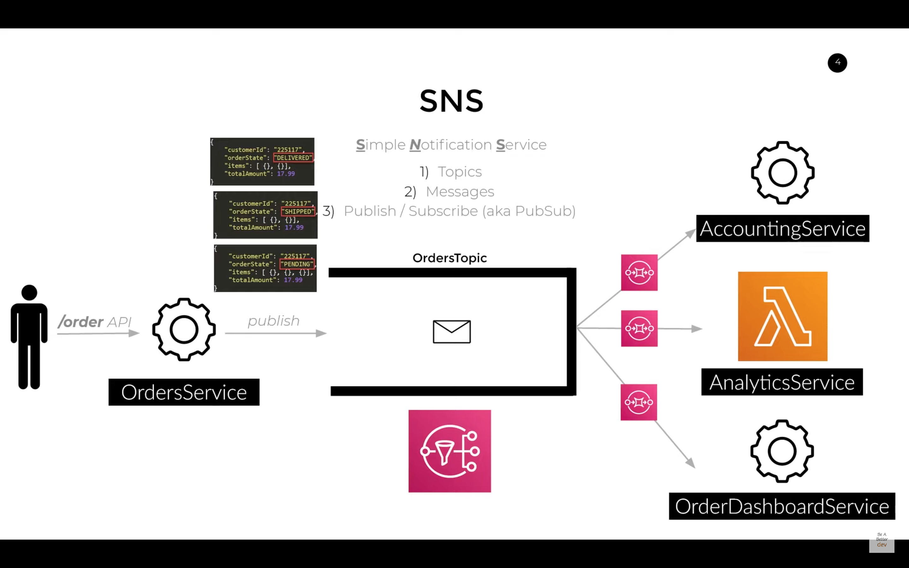
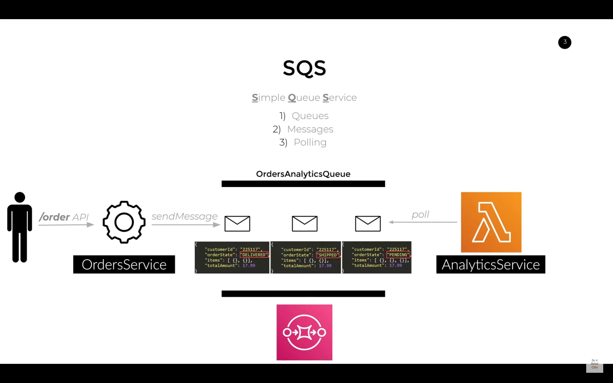
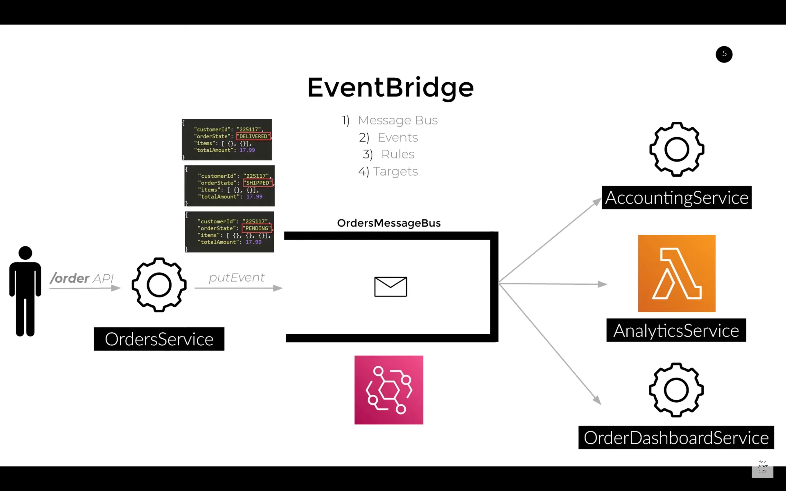

-   <details><summary style="font-size:25px;color:Orange">S3</summary>

    Amazon S3 (Simple Storage Service) is a highly scalable, durable, and secure object storage service provided by Amazon Web Services (AWS). It is designed to store and retrieve any amount of data from anywhere on the web, making it a fundamental building block for many cloud-based applications. S3 is widely used for data storage, backup and restore, content distribution, big data analytics, archiving, and much more.

    -   `Bucket`: A bucket is a container for storing objects in Amazon S3. All objects are stored in buckets, and each bucket has a globally unique name that must adhere to specific naming rules. Buckets act as the top-level namespace in S3.
    -   `Object`: An object is the basic unit of data in Amazon S3. It can be any file, data, or media, including text files, images, videos, and more. Objects consist of the actual data, a key (or identifier), and metadata (optional attributes). All keys are objects.
    -   `Prefix`: A prefix is the beginning part of the object key used to group objects. It acts like a virtual folder path, but S3 is flat (not hierarchical).
    -   `Key`: The key is the unique identifier for an object within a bucket. It is similar to a file path and is used to retrieve objects from S3. For example, if an object is stored at the path "my-folder/image.jpg", the key would be "my-folder/image.jpg"
    -   `Region`: A region is a geographical area where S3 stores data. Each bucket is associated with a specific AWS region, and the data within that bucket is physically stored in data centers located in that region.
    -   `Access Control List (ACL)`: An ACL is a set of permissions attached to each object and bucket, defining who can access the objects and what actions they can perform (e.g., read, write, delete). While still supported, IAM policies are now generally recommended for controlling access to S3 resources.
    -   `Object Versioning`: S3 supports versioning, which allows you to keep multiple versions of an object in the same bucket. It helps protect against accidental deletions or overwrites, and you can easily restore previous versions of objects.
    -   `Server-Side Encryption`: S3 provides server-side encryption to protect data at rest. You can choose to have S3 automatically encrypt your objects using AWS Key Management Service (KMS) keys or Amazon S3 managed keys.
    -   `Lifecycle Policies`: Lifecycle policies allow you to automatically transition objects between different storage classes or delete objects after a specific period. This helps optimize storage costs and manage data lifecycle.
    -   `Cross-Region Replication (CRR)`: CRR is a feature that allows you to replicate objects from one S3 bucket to another bucket in a different AWS region. It provides data redundancy and disaster recovery capabilities.
    -   `Event Notifications`: S3 allows you to set up event notifications to trigger actions (e.g., invoking an AWS Lambda function) when specific events occur, such as object creation or deletion.
    -   `Access Logs`: You can enable access logging for S3 buckets to track all requests made to the bucket. Access logs are stored in a separate bucket and can help with auditing and monitoring.

    Amazon Simple Storage Service (**S3**) is a highly scalable, durable, and secure **Object Storage** service. It is designed to store and retrieve any amount of data from anywhere on the web, offering **11 nines (99.999999999%) of durability**.

    S3 is foundational to the AWS ecosystem and is used for everything from serving static website assets and hosting data lakes to providing critical backup and archiving.

    ##### Core Terms & Components

    -   **Object Storage**: Unlike **Block Storage** (like Amazon EBS, which is used for operating systems) or **File Storage** (like Amazon EFS, which uses folders and protocols), S3 is an object store.

    -   **Object:** The fundamental entity stored in S3. An object is a file (data) combined with its **metadata** (information about the object).
    -   **Bucket:** The logical container for objects. Think of a bucket as the top-level folder where you organize your data.
        -   **Global Uniqueness:** Every bucket name must be **globally unique** across all of AWS, regardless of the AWS Region or account.
        -   **Region:** A bucket is created in a specific AWS Region and cannot be moved. Objects stored in that bucket will never leave that region unless explicitly replicated.
    -   **Key:** The unique identifier for an object within a bucket. The Key is essentially the full path and name of the file (e.g., `images/puppy.jpg`). S3 uses a **flat namespace**, and the appearance of folders is created using **prefixes** (the parts of the Key separated by a `/`).

    ##### Key Features: Security and Compliance

    S3 provides robust security tools, ensuring data is protected both in transit and at rest.

    -   **Access Control:** S3 uses multiple policy types for granular permissions:

        -   **IAM Policies:** Define _who_ (users/roles) can access S3 resources.
        -   **Bucket Policies:** Define _what_ (actions) can be done on a specific bucket and its objects, often used for cross-account access or public access control.
        -   **Access Control Lists (ACLs):** A legacy permission model that is simple and object-specific, but generally superseded by IAM/Bucket Policies.
        -   **S3 Block Public Access:** A vital account-level security feature that **overrides** all other permissions to block public read/write access to S3 buckets. It is **enabled by default** for all new buckets.

    -   **Versioning:** When enabled on a bucket, S3 retains multiple versions of an object (including deleted ones). This allows you to easily **recover from accidental deletions or overwrites**.

    ##### Key Features: Performance and Data Management

    | Feature                            | Purpose                                                                                                                                                                                                         |
    | :--------------------------------- | :-------------------------------------------------------------------------------------------------------------------------------------------------------------------------------------------------------------- |
    | **S3 Lifecycle Management**        | Automatically **transitions** objects between different **Storage Classes** (to save cost) or **expires** (permanently deletes) objects after a specified period of time.                                       |
    | **S3 Transfer Acceleration**       | Uses Amazon CloudFront's globally distributed **Edge Locations** to speed up data transfers (uploads and downloads) to and from an S3 bucket over long distances.                                               |
    | **S3 Object Lock**                 | Provides **WORM (Write Once, Read Many)** protection for objects. This helps meet regulatory requirements by preventing an object from being deleted or overwritten for a fixed amount of time or indefinitely. |
    | **Cross-Region Replication (CRR)** | Automatically and asynchronously copies objects across buckets in **different AWS Regions** for disaster recovery and compliance.                                                                               |
    | **Same-Region Replication (SRR)**  | Automatically copies objects across buckets in the **same AWS Region**, often used to aggregate logs or meet compliance requirements.                                                                           |
    | **Event Notifications**            | Allows S3 to publish notifications (e.g., to an AWS Lambda function, SQS queue, or SNS topic) when an object is created, deleted, or restored. This enables **event-driven architectures**.                     |

    ##### Storage Classes (The Cost/Performance Trade-Off)

    S3 offers various storage classes, which differ primarily in their **Cost**, **Durability/Availability**, and **Access Speed** (Latency). You choose the class based on how frequently you need to access the data.

    | Storage Class                          | Description                                                                                                                              | Durability & Availability                                                   | Retrieval Time & Cost                                                                              |
    | :------------------------------------- | :--------------------------------------------------------------------------------------------------------------------------------------- | :-------------------------------------------------------------------------- | :------------------------------------------------------------------------------------------------- |
    | **S3 Standard**                        | General-purpose, frequently accessed data ("Hot Data").                                                                                  | $\text{99.999999999\%}$ Durability (3+ AZs), $\text{99.99\%}$ Availability. | **Millisecond** access. Highest storage cost.                                                      |
    | **S3 Intelligent-Tiering**             | **Automatically moves data** between frequent and infrequent tiers based on access patterns, optimizing cost without performance impact. | $\text{99.999999999\%}$ Durability (3+ AZs).                                | **Millisecond** access. Ideal for unknown access patterns.                                         |
    | **S3 Standard-IA** (Infrequent Access) | Long-lived, infrequently accessed data ("Cool Data") that requires **rapid access** when needed.                                         | $\text{99.999999999\%}$ Durability (3+ AZs).                                | **Millisecond** access. Lower storage cost, higher retrieval cost.                                 |
    | **S3 One Zone-IA**                     | Same as Standard-IA, but data is stored in **a single Availability Zone (AZ)**.                                                          | $\text{99.5\%}$ Availability (lower).                                       | **Millisecond** access. Lowest cost _per GB_ outside of Glacier, but data is lost if the AZ fails. |
    | **S3 Glacier Flexible Retrieval**      | Archival data that rarely needs to be accessed.                                                                                          | $\text{99.999999999\%}$ Durability (3+ AZs).                                | **Minutes to Hours** retrieval time (configurable speed/cost).                                     |
    | **S3 Glacier Deep Archive**            | Long-term data retention (7-10 years) for regulatory compliance; the **lowest-cost** storage class.                                      | $\text{99.999999999\%}$ Durability (3+ AZs).                                | **12 hours** retrieval time.                                                                       |
    | **S3 Express One Zone**                | High-performance, single-AZ storage for extremely **latency-sensitive applications** (e.g., databases, machine learning training).       | Single AZ.                                                                  | **Single-digit millisecond** access.                                                               |

    -   <details><summary style="font-size:20px;color:Magenta">S3 API Action keywords</summary>

        The AWS S3 API Action keywords, often referred to as **IAM Actions**, are the specific permissions you use in IAM policies to grant or deny access to S3 operations. They follow the format **`s3:ActionName`**.

        The list below is categorized by the resource they primarily act upon (**Buckets** or **Objects**) and their general access level (**List, Read, Write, Permissions Management**).

        -   **Bucket-Level Actions (Permissions on the Container)**: These actions generally target the S3 **bucket ARN** (e.g., `arn:aws:s3:::my-bucket`).

            | Access Level               | Key Action Keywords             | Description                                            |
            | :------------------------- | :------------------------------ | :----------------------------------------------------- |
            | **List**                   | `s3:ListAllMyBuckets`           | Allows listing all buckets in the account. (Global)    |
            |                            | `s3:ListBucket`                 | Allows listing the objects in a specific bucket.       |
            |                            | `s3:GetBucketLocation`          | Allows retrieving the AWS Region of a bucket.          |
            | **Read**                   | `s3:GetBucketAcl`               | Allows reading the Bucket's Access Control List (ACL). |
            |                            | `s3:GetBucketPolicy`            | Allows reading the Bucket Policy.                      |
            |                            | `s3:GetBucketTagging`           | Allows reading the tags assigned to the bucket.        |
            |                            | `s3:GetEncryptionConfiguration` | Allows reading the default encryption settings.        |
            |                            | `s3:GetLifecycleConfiguration`  | Allows reading the lifecycle rules.                    |
            | **Write**                  | `s3:CreateBucket`               | Allows creating a new bucket.                          |
            |                            | `s3:DeleteBucket`               | Allows deleting an empty bucket.                       |
            | **Permissions Management** | `s3:PutBucketPolicy`            | Allows setting or replacing the Bucket Policy.         |
            |                            | `s3:DeleteBucketPolicy`         | Allows deleting the Bucket Policy.                     |
            |                            | `s3:PutBucketPublicAccessBlock` | Allows setting the Block Public Access configuration.  |
            |                            | `s3:PutLifecycleConfiguration`  | Allows setting or replacing lifecycle rules.           |

        -   **Object-Level Actions (Permissions on Files)**: These actions generally target the S3 **object ARN** (e.g., `arn:aws:s3:::my-bucket/my-file.txt`).

            | Access Level         | Key Action Keywords           | Description                                                                   |
            | :------------------- | :---------------------------- | :---------------------------------------------------------------------------- |
            | **Read**             | `s3:GetObject`                | The most common read action. Allows downloading the object data.              |
            |                      | `s3:GetObjectAcl`             | Allows reading the object's ACL.                                              |
            |                      | `s3:GetObjectTagging`         | Allows reading the object's tags.                                             |
            |                      | `s3:GetObjectRetention`       | Allows retrieving the Object Lock retention settings.                         |
            |                      | `s3:GetObjectVersion`         | Allows retrieving a specific version of an object (if versioning is enabled). |
            | **Write**            | `s3:PutObject`                | The most common write action. Allows uploading a new object.                  |
            |                      | `s3:DeleteObject`             | Allows deleting an object (removes the latest version).                       |
            |                      | `s3:DeleteObjectVersion`      | Allows deleting a specific version of an object.                              |
            |                      | `s3:PutObjectTagging`         | Allows setting or replacing the object's tags.                                |
            |                      | `s3:PutObjectRetention`       | Allows setting or replacing the Object Lock retention settings.               |
            | **Multipart Upload** | `s3:AbortMultipartUpload`     | Allows stopping an ongoing multipart upload.                                  |
            |                      | `s3:ListMultipartUploadParts` | Allows listing the parts of an ongoing multipart upload.                      |
            | **Copy**             | `s3:GetObject` (Source)       | Required on the source object for any copy operation.                         |
            |                      | `s3:PutObject` (Destination)  | Required on the destination object for any copy operation.                    |

        </details>

    -   <details><summary style="font-size:20px;color:Magenta">S3 Encryption</summary>

        AWS S3 encryption is a multi-layered security framework designed to protect data both **at rest** (stored on disks) and **in transit** (moving between your client and S3).

        Since January 5, 2023, Amazon S3 automatically applies a base level of encryption (**SSE-S3**) to all new objects at no additional cost. However, for higher compliance and control, several other methods are available.

        1. **Server-Side Encryption (SSE)**: In SSE, AWS handles the encryption process as the object is written to the data center and decrypts it when you access it.

            | Type         | Key Management        | Use Case                                                                   | Header Requirement                                        |
            | ------------ | --------------------- | -------------------------------------------------------------------------- | --------------------------------------------------------- |
            | **SSE-S3**   | Fully managed by S3   | Baseline security; simple compliance.                                      | `x-amz-server-side-encryption: AES256`                    |
            | **SSE-KMS**  | Managed via AWS KMS   | Detailed audit logs (CloudTrail); separate permissions for key and object. | `x-amz-server-side-encryption: aws:kms`                   |
            | **DSSE-KMS** | Dual-layer (KMS + S3) | High-security compliance (e.g., CNSA, FIPS). Encrypts data twice.          | `x-amz-server-side-encryption: aws:kms:dsse`              |
            | **SSE-C**    | Managed by Customer   | You provide the key; S3 never stores it. AWS only does the crypto.         | `x-amz-server-side-encryption-customer-algorithm: AES256` |

            - **SSE-KMS & DSSE-KMS:** These allow you to use **Customer Managed Keys (CMKs)**. This is powerful because you can rotate the keys, disable them to "digitally shred" data, and see exactly who used the key in CloudTrail.
            - **SSE-C:** You must provide the exact 256-bit, base64-encoded encryption key in every single request. If you lose the key, the data is **permanently unrecoverable** because AWS does not keep a backup.

        2. **Client-Side Encryption (CSE)**: With CSE, you encrypt the data **before** it ever leaves your local environment. AWS only sees an opaque blob of encrypted bits.

            - **Envelope Encryption:** The client generates a unique **Data Key** for each object, encrypts the object with it, and then encrypts that Data Key with a **Master Key** (which can be stored in AWS KMS or locally).
            - **Tools:** Usually implemented using the **Amazon S3 Encryption Client**.
            - **Best For:** Zero-trust architectures where even AWS administrators must not have the ability to decrypt your data.

        3. **Encryption in Transit**: Encryption in transit ensures that your data cannot be intercepted while moving over the internet.

            - **HTTPS (TLS):** All S3 API endpoints support TLS. As of 2024, AWS requires a minimum of **TLS 1.2**.
            - **Enforcement:** You can enforce transit encryption by adding a "Deny" statement to your Bucket Policy for any request where `"aws:SecureTransport": "false"`.

        4. **Cost Optimization**:
            - Using SSE-KMS at scale can become expensive due to the high volume of API calls to AWS KMS (which charges per request).
            - **S3 Bucket Keys** reduce these costs by up to **99%**. Instead of S3 calling KMS for every single object, it requests a "bucket-level" key from KMS, which it then uses to derive unique data keys for objects locally within S3 for a limited time.

        -   **Comparison Summary**

            | Feature                  | SSE-S3 | SSE-KMS       | SSE-C | Client-Side |
            | ------------------------ | ------ | ------------- | ----- | ----------- |
            | **Who manages keys?**    | AWS    | AWS/You (KMS) | You   | You         |
            | **Who does encryption?** | AWS    | AWS           | AWS   | Your Client |
            | **Audit logs for keys?** | No     | Yes           | No    | Your choice |
            | **Cost?**                | Free   | KMS Costs     | Free  | Free        |

        </details>

    -   <details><summary style="font-size:20px;color:Magenta">Replication</summary>

        Amazon S3 replication provides automatic, asynchronous copying of objects across buckets. As of 2026, it remains a cornerstone for disaster recovery, compliance, and latency optimization.

        1.  **Core Facts & Types**: AWS offers three primary ways to replicate data, each serving different architectural needs:

            -   **Cross-Region Replication (CRR):** Replicates data between buckets in different AWS Regions. Ideal for compliance and minimizing latency for global users.
            -   **Same-Region Replication (SRR):** Replicates data between buckets in the same Region. Used for log aggregation or syncing production and test environments while maintaining data sovereignty.
            -   **S3 Batch Replication:** A managed way to replicate **existing objects**, objects that previously failed to replicate, or objects that were created before a replication rule was in place.
            -   **Prerequisites**:

                -   **Versioning:** Must be enabled on **both** source and destination buckets.
                -   **IAM Role:** S3 requires an IAM role with permissions to read from the source and write to the destination.
                -   **Permissions:** If the buckets are in different accounts, the destination bucket owner must grant the source account permission to replicate objects via a bucket policy.

        2.  **Technical Limitations (What is NOT Replicated)**: Understanding what S3 **cannot** or **will not** replicate is critical for data integrity:

            -   **Transitive Replication:** S3 does **not** support "chained" replication. If Bucket A replicates to Bucket B, and Bucket B has a rule to replicate to Bucket C, objects arriving in B from A will **not** be sent to C.
            -   **Existing Objects:** Standard replication rules only apply to objects created _after_ the rule is enabled. (Use **S3 Batch Replication** for existing data).
            -   **SSE-C Encrypted Objects:** Objects encrypted using Customer-Provided Keys (SSE-C) are **not** supported for replication.
            -   **Archived Objects:** You cannot replicate objects stored in S3 Glacier or S3 Glacier Deep Archive until they have been restored to a readable tier.
            -   **Delete Operations:** \* **Delete Markers:** Not replicated by default (must be explicitly enabled in the rule).
            -   **Permanent Deletes:** If you delete a specific version ID in the source, S3 does **not** replicate that deletion to the destination to prevent accidental data loss.

            -   **Directory Buckets (S3 Express One Zone):** These do not support standard S3 replication rules. Instead, they use a specialized **"Import"** feature or Batch Operations to move data in or out.

        3.  **Advanced Features & Notes**

            -   **Encryption Handling**:

                | Encryption Type | Replicable? | Note                                                                                                        |
                | --------------- | ----------- | ----------------------------------------------------------------------------------------------------------- |
                | **SSE-S3**      | Yes         | Supported by default.                                                                                       |
                | **SSE-KMS**     | Yes         | Must be explicitly enabled in the replication configuration; requires KMS key permissions for the IAM role. |
                | **DSSE-KMS**    | Yes         | Dual-layer server-side encryption is supported.                                                             |
                | **SSE-C**       | **No**      | Requires manual copying.                                                                                    |

            -   **Replication Time Control (RTC)**:For mission-critical workloads, S3 RTC provides a Service Level Agreement (SLA).

                -   **The Guarantee:** 99.99% of objects will be replicated within **15 minutes**.
                -   **Monitoring:** Provides real-time metrics in CloudWatch (e.g., `BytesPendingReplication`, `ReplicationLatency`).
                -   **Limit:** Has a default 1 Gbps data transfer limit, which can be increased via a service quota request.

            -   **Metadata & Two-Way Sync**:

                -   **Replica Modification Sync:** You can enable this to sync metadata changes (like tags or ACL updates) bi-directionally between buckets.
                -   **Ownership Overwrite:** In cross-account replication, you can configure S3 to change object ownership to the destination bucket owner, ensuring they have full control over the replicas.

        4.  **Cost Considerations**: Replication is not free; you are charged for:

            1. **Storage:** You pay for storage in both the source and destination buckets.
            2. **Replication PUT Requests:** Standard S3 request charges apply at the destination.
            3. **Data Transfer (Inter-Region):** For CRR, you pay standard AWS data transfer out rates from the source region.
            4. **RTC Fee:** If S3 RTC is enabled, there is an additional "Replication Time Control" fee and a per-GB data transfer charge.

        </details>

    </details>

---

-   <details><summary style="font-size:25px;color:Orange">Various Types of Storage Services</summary>

    AWS offers a comprehensive suite of storage services categorized primarily into **Object, Block, and File Storage**, along with specialized services for **Archiving, Data Transfer,** and **Hybrid** environments.

    -   **Object Storage**: Object storage is designed for massive scale, durability, and cost-effectiveness. It is ideal for unstructured data, backups, and media content.

        -   **Amazon Simple Storage Service (S3):** The flagship object storage service. It stores data in "buckets" and offers various **Storage Classes** to manage cost based on access frequency (e.g., S3 Standard, S3 Intelligent-Tiering, S3 Standard-IA).
        -   **Amazon S3 Glacier:** A family of extremely low-cost storage classes within S3 designed for data **archiving** and long-term backup, with configurable retrieval times (e.g., S3 Glacier Instant Retrieval, S3 Glacier Flexible Retrieval, S3 Glacier Deep Archive).

    -   **Block Storage**: Block storage provides volumes that function like a local hard drive, offering high-performance, low-latency access for a single compute instance. It is the preferred choice for transactional workloads like databases and virtual machine boot volumes.

        -   **Amazon Elastic Block Store (EBS):** Provides persistent block storage volumes that are attached to **Amazon EC2** instances. It offers various volume types (SSD-backed for performance, HDD-backed for throughput/cost).
        -   **Amazon EC2 Instance Store:** Provides **temporary** block-level storage physically attached to the host computer of an EC2 instance. Data is lost when the instance is stopped or terminated (often called "ephemeral" storage).

    -   **File Storage**: File storage allows multiple compute instances to share the same storage volume simultaneously using standard file-level protocols (like NFS or SMB).

        -   **Amazon Elastic File System (EFS):** A fully managed, scalable file storage service for **Linux** workloads, providing shared access via the NFS protocol. It automatically scales capacity and performance.
        -   **Amazon FSx Family:** A group of fully managed services that let you choose from four widely-used commercial and open-source file systems:
            -   **Amazon FSx for Windows File Server** (SMB protocol)
            -   **Amazon FSx for Lustre** (for high-performance computing/analytics)
            -   **Amazon FSx for NetApp ONTAP**
            -   **Amazon FSx for OpenZFS**
        -   **Amazon File Cache:** A high-speed cache that speeds up processing of file data stored in disparate locations, including S3 and on-premises file systems.

    -   **Hybrid, Data Transfer & Supporting Services**: These services bridge the gap between your on-premises data centers and the AWS cloud, or offer centralized data protection.

        -   **AWS Storage Gateway:** A hybrid cloud storage service that provides on-premises applications with low-latency access to virtually unlimited cloud storage in AWS. It includes File Gateway, Volume Gateway, and Tape Gateway.
        -   **AWS Snow Family:** Physical devices used to transfer **large amounts of data** into and out of AWS (petabyte-scale) when internet transfer is impractical or too slow. Includes **AWS Snowball Edge** and **AWS Snowmobile** (exabyte-scale).
        -   **AWS Backup:** A centralized, managed service to automate and govern backup across AWS services (EBS volumes, RDS databases, EFS file systems, etc.).

    </details>

---

-   <details><summary style="font-size:25px;color:Orange">EC2</summary>

    -   [DigitalCloud: EC2](https://www.youtube.com/watch?v=8bIW7qlldLg&t=108s)

    Amazon Elastic Compute Cloud (Amazon EC2) is a web service provided by Amazon Web Services (AWS) that allows users to rent virtual servers on which they can run their applications. Below are some key terms and concepts associated with AWS EC2:

    Amazon EC2 (Elastic Compute Cloud) is a central service in AWS that provides scalable computing capacity in the cloud. It allows users to launch virtual servers (instances) with flexible configurations. Below is an explanation of all the components and concepts associated with AWS EC2:

    -   **EC2 Instance**: An instance is a virtual server in the cloud. It represents the computing resources (CPU, memory, storage, etc.) that you can rent from AWS. Instances are the fundamental building blocks of EC2.

        -   **Definition**: A virtual server that runs on the AWS cloud infrastructure. You can choose the hardware specifications, OS, and applications.
        -   **Purpose**: EC2 instances provide compute resources for running applications, processing data, or hosting services.
        -   **Key Attributes**:
            -   **vCPU**: Virtual CPU capacity.
            -   **RAM**: Memory for applications.
            -   **Network**: Networking performance (low, medium, or high bandwidth).

    -   **Amazon Machine Image (AMI)**: An AMI is a pre-configured template used to create instances. It contains the necessary information to launch an instance, including the operating system, application server, and applications.

        -   **Definition**: A pre-configured template containing the operating system, application server, and applications for launching EC2 instances.
        -   **Purpose**: AMIs allow you to create consistent EC2 instances based on a saved image.
        -   **Types**:
            -   **AWS-provided**: Amazon offers base AMIs (e.g., Amazon Linux, Ubuntu).
            -   **Custom**: Users can create custom AMIs with specific software configurations.
            -   **Marketplace AMIs**: Third-party vendors offer AMIs with specific software solutions.

    -   **Instance Types**

        -   **Definition**: Pre-defined combinations of CPU, memory, storage, and network performance. Different instance types suit different workloads.
        -   **Purpose**: Helps users choose the right compute power based on their application needs.
        -   **Categories**:
            -   **General Purpose (e.g., t2.micro, m5.large)**: Balanced compute, memory, and networking resources.
            -   **Compute Optimized (e.g., c5.large)**: Designed for compute-intensive tasks.
            -   **Memory Optimized (e.g., r5.xlarge)**: Ideal for memory-intensive applications.
            -   **Storage Optimized (e.g., i3.xlarge)**: High-performance for applications needing fast local storage.
            -   **Accelerated Computing (e.g., p3.xlarge)**: Instances with GPUs for machine learning and graphic-intensive tasks.

    -   **Elastic Block Store (EBS)**: EBS provides block-level storage volumes that you can attach to EC2 instances. It is used for data that requires persistent storage. EBS volumes can be used as the root file system or attached to an instance as additional storage.

        -   **Definition**: A block-level storage service used to attach persistent storage to EC2 instances.
        -   **Purpose**: Provides scalable, durable storage volumes that can be attached to instances. These volumes persist independently of the instance lifecycle.
        -   **Types**:
            -   **General Purpose SSD (gp2/gp3)**: Balanced performance and cost.
            -   **Provisioned IOPS SSD (io1/io2)**: High performance for I/O-intensive workloads.
            -   **Magnetic (st1/sc1)**: Cost-effective for sequential access workloads like logging or backup.

    -   **Elastic IP Address (EIP)**

        -   **Definition**: A static, public IPv4 address that you can allocate and associate with your EC2 instance.
        -   **Purpose**: Ensures your instance retains a consistent public IP address even if the instance is stopped and restarted.

    -   **Security Groups**: Security groups act as virtual firewalls for instances. They control inbound and outbound traffic based on rules that you define. Each instance can be associated with one or more security groups.

        -   **Definition**: Virtual firewalls that control inbound and outbound traffic to EC2 instances.
        -   **Purpose**: Security groups allow or block traffic based on rules defined by IP address, protocol, and port.
        -   **Stateful**: Security groups remember allowed traffic for responses without needing separate rules.

    -   **Key Pairs**: A key pair consists of a public key and a private key. It is used for securely connecting to an EC2 instance. The public key is placed on the instance, and the private key is kept secure.

        -   **Definition**: A public-private key pair used for SSH access to EC2 instances.
        -   **Purpose**: The public key is stored on the instance, and the private key is used by the user to securely connect to the instance.

    -   **Elastic Load Balancing (ELB)**: ELB automatically distributes incoming application traffic across multiple EC2 instances. It enhances the availability and fault tolerance of your application.

        -   **Definition**: A service that automatically distributes incoming traffic across multiple EC2 instances.
        -   **Purpose**: Ensures high availability and reliability by distributing incoming requests to healthy instances.
        -   **Types**:
            -   **Application Load Balancer**: Layer 7 load balancing (for HTTP/HTTPS traffic).
            -   **Network Load Balancer**: Layer 4 load balancing (for TCP/UDP traffic).
            -   **Gateway Load Balancer**: Enables third-party virtual appliances.

    -   **Placement Groups**

        -   **Definition**: Logical grouping of instances to influence how EC2 instances are placed on the underlying hardware.
        -   **Purpose**: Enhances performance for specific workloads.
        -   **Types**:
            -   **Cluster Placement Group**: Instances are grouped closely in a single Availability Zone for low-latency, high-throughput networking.
            -   **Spread Placement Group**: Instances are distributed across underlying hardware to reduce simultaneous failures.
            -   **Partition Placement Group**: Divides instances into partitions where they are placed on distinct sets of racks to minimize correlated failures.

    -   **Launch Template**

        -   **Definition**: A configuration template that defines how to launch EC2 instances.
        -   **Purpose**: Standardizes the instance creation process by including configurations like instance types, AMIs, key pairs, and security groups.

    -   **Elastic Network Interface (ENI)**

        -   **Definition**: A network interface that can be attached to an EC2 instance to manage multiple IP addresses.
        -   **Purpose**: Allows instances to have multiple private and public IP addresses, multiple security groups, and can be detached/reattached across instances.

    -   **Network Address Translation (NAT) Gateway**

        -   **Definition**: A managed gateway that allows instances in private subnets to connect to the internet while preventing incoming traffic from reaching them.
        -   **Purpose**: Enables private EC2 instances to download updates or access public internet resources securely.

    -   **Elastic GPUs**

        -   **Definition**: A feature that allows you to attach GPU resources to existing EC2 instances.
        -   **Purpose**: Adds GPU capability to instances for tasks like graphics rendering, machine learning, and other GPU-intensive operations.

    -   **IPv4 and IPv6 Addresses**

        -   **Definition**: Public and private IP addresses assigned to EC2 instances for communication.
        -   **Purpose**: IP addresses allow EC2 instances to communicate with other instances, on-premises networks, or the internet.

    -   **Region**: AWS divides the world into geographic areas called regions. Each region contains multiple Availability Zones. Examples of regions include us-east-1 (North Virginia), eu-west-1 (Ireland), and ap-southeast-2 (Sydney).
    -   **Availability Zone (AZ)**: An Availability Zone is a data center or a collection of data centers within a region. Each Availability Zone is isolated but connected to the others. Deploying instances across multiple Availability Zones increases fault tolerance.
    -   **Auto Scaling**: Auto Scaling allows you to automatically adjust the number of EC2 instances in a group based on demand. It helps maintain application availability and ensures that the desired number of instances are running.
    -   **Placement Groups**: Placement groups are logical groupings of instances within a single Availability Zone. They are used to influence the placement of instances to achieve low-latency communication.
    -   **Spot Instances**: Spot Instances are spare EC2 capacity that is available at a lower price. You can bid for this capacity, and if your bid is higher than the current spot price, your instances will run. However, they can be terminated if the spot price exceeds your bid.
    -   **On-Demand Instances**: On-Demand Instances allow you to pay for compute capacity by the hour or second with no upfront costs. This is a flexible and scalable pricing model suitable for variable workloads.
    -   **Reserved Instances**: Reserved Instances offer significant savings over On-Demand pricing in exchange for a commitment to a one- or three-year term. They provide a capacity reservation, ensuring availability.

    -   <details><summary style="font-size:20px;color:Magenta">EC2 Resources</summary>

        The AWS Elastic Compute Cloud (EC2) service is built upon a variety of core resources and features that enable you to run virtual servers in the cloud.

        ## 💻 Core Compute Resources

        These are the fundamental building blocks for running a virtual machine:

        -   **EC2 Instances**: The **virtual servers** themselves. You choose the operating system, the hardware profile, and the location (VPC, Subnet, Availability Zone).
        -   **Amazon Machine Images (AMIs)**: Templates that contain a **software configuration** (operating system, application server, applications). You use an AMI to launch an instance.
        -   **Instance Types**: Defines the hardware profile of your virtual server, including the **CPU, memory, storage, and networking capacity**. They are grouped into families like General Purpose (M), Compute Optimized (C), Memory Optimized (R), etc.
        -   **Key Pairs**: A set of security credentials, consisting of a **public key** (stored by AWS) and a **private key** (stored by you), used to securely connect to your Linux instances.
        -   **Launch Templates/Configurations**: Used to **define the parameters** for launching an EC2 instance or an entire Auto Scaling Group (e.g., AMI, instance type, key pair, security groups).

        ## 💾 Storage Resources

        These resources provide persistent and temporary storage for your EC2 instances:

        -   **Amazon Elastic Block Store (EBS) Volumes**: **Durable, block-level storage** volumes that can be attached to a running EC2 instance. They persist independently of the life of the instance.
            -   **EBS Snapshots**: Point-in-time backups of EBS volumes, stored in Amazon S3.
        -   **Instance Store**: **Temporary block-level storage** physically located on the host machine of the EC2 instance. The data is lost if the instance is stopped or terminated.
        -   **Amazon Elastic File System (EFS)**: A **scalable, elastic file storage** service for EC2 instances. It provides a shared file system that multiple EC2 instances can access concurrently. _While not exclusively EC2, it's a common resource used with it._

        ***

        ## 🔒 Networking and Security Resources

        These resources control the connectivity and security boundaries for your EC2 environment:

        -   **Virtual Private Cloud (VPC)**: The **isolated virtual network** where your EC2 instances are launched.
        -   **Subnets**: A range of IP addresses in your VPC, placed within a single Availability Zone.
        -   **Security Groups**: **Virtual firewalls** that control inbound and outbound traffic for one or more EC2 instances.
        -   **Elastic Network Interfaces (ENIs)**: Virtual network cards that can be attached to an instance, providing a consistent network address.
        -   **Elastic IP Addresses (EIPs)**: **Static public IPv4 addresses** designed for dynamic cloud computing. They are associated with your AWS account, not a specific instance, allowing you to quickly remap the address to another instance.

        ***

        ## 📈 Scaling and Management Resources

        These resources help manage and scale your fleet of instances:

        -   **EC2 Auto Scaling**: Automatically adjusts the number of EC2 instances in a group based on demand, using **Launch Configurations** or **Launch Templates**.
        -   **Elastic Load Balancing (ELB)**: Distributes incoming application traffic across multiple EC2 instances to increase application availability and fault tolerance.
        -   **Capacity Reservations**: Allows you to reserve compute capacity for your EC2 instances in a specific Availability Zone for any duration.
        -   **EC2 Fleet/Spot Fleet**: Allows you to request and manage a large number of EC2 instances across different instance types, Availability Zones, and purchasing options.

        ***

        ## 💵 Purchasing Options (Pricing Models)

        The way you pay for the compute capacity is also considered a resource type in managing your EC2 usage:

        -   **On-Demand Instances**: Pay for compute capacity by the hour or second, with no long-term commitment.
        -   **Reserved Instances (RIs)**: Commitment to a specific instance configuration for a 1- or 3-year term in exchange for a significant discount.
        -   **Spot Instances**: Request spare AWS compute capacity for up to a 90% discount off the On-Demand price. Instances can be interrupted with a two-minute warning.
        -   **Dedicated Hosts**: Physical servers dedicated for your use, which can help with licensing requirements.
        -   **Dedicated Instances**: EC2 instances that run on hardware dedicated to a single customer.

        An **AWS EC2 Instance Profile** is a container for an **AWS Identity and Access Management (IAM) role** that you can use to pass the role information to an Amazon Elastic Compute Cloud (EC2) instance when the instance starts.

        Its core purpose is to allow applications running on your EC2 instance to **securely access other AWS services** (like S3, DynamoDB, or CloudWatch) without needing to store long-term security credentials (like access keys and secret keys) directly on the instance.

        The EC2 instance uses the credentials provided by the instance profile, which are **temporary security credentials** that AWS automatically generates and rotates. The instance retrieves these credentials via the Instance Metadata Service (IMDS).

        ***

        ## 🏗️ How it Works

        1.  You create an **IAM Role** with the necessary permissions (e.g., read-only access to an S3 bucket).
        2.  An **Instance Profile** is created (often automatically by the AWS Console when creating the role for an EC2 service) and associated with that IAM role.
        3.  You attach the **Instance Profile** to your EC2 instance during launch or modification.
        4.  Applications/AWS SDKs on the EC2 instance can then query the IMDS for the temporary credentials associated with the attached role, allowing them to make API calls to the permitted AWS services.

        ***

        ## 🗺️ Scenarios Where Instance Profiles are Used

        Instance Profiles are considered an AWS security best practice and are primarily used in scenarios where an EC2 instance needs secure, managed access to other AWS resources.

        | Scenario                       | Use Case                                                                                                                                                                                                                               | Security Benefit                                                                                                                           |
        | :----------------------------- | :------------------------------------------------------------------------------------------------------------------------------------------------------------------------------------------------------------------------------------- | :----------------------------------------------------------------------------------------------------------------------------------------- |
        | **Data Access**                | An application on an EC2 instance needs to **read or write data** to an **Amazon S3 bucket** (e.g., storing user uploads, fetching configuration files).                                                                               | The instance only has temporary, limited access based on the IAM role, avoiding hardcoded, permanent S3 keys.                              |
        | **Logging & Monitoring**       | The EC2 instance needs to **send logs** to **Amazon CloudWatch** or **Amazon Kinesis**.                                                                                                                                                | Ensures the logging agent has _only_ the permission to write logs to the specified resource, adhering to the principle of least privilege. |
        | **Configuration Management**   | The instance needs to retrieve configuration parameters or secrets from **AWS Systems Manager Parameter Store** or **AWS Secrets Manager**.                                                                                            | Securely fetches sensitive information at runtime without the secrets ever residing on the instance's file system.                         |
        | **Automation & Orchestration** | An instance is part of an **Auto Scaling Group** or a deployment service like **AWS CodeDeploy/Elastic Beanstalk**, and it needs to make calls to other AWS services (e.g., updating a DynamoDB table, interacting with an SQS queue). | Grants the required service-specific permissions for automated workflows to function correctly.                                            |
        | **Database Connectivity**      | The EC2 instance needs to retrieve an **IAM authentication token** to connect to an **Amazon RDS** or **Amazon Aurora** database instance that uses IAM database authentication.                                                       | Provides a secure, short-lived token for database access, instead of managing long-lived database passwords.                               |

        The compute resources of an **AWS EC2 instance** are the fundamental components that define its processing power, memory, storage, and networking capacity. These resources are configured in different combinations to create the wide selection of EC2 **Instance Types** (like `t3.micro` or `c5.xlarge`).

        The core compute resources are:

        ***

        ## 💻 1. Central Processing Unit (CPU)

        The CPU provides the processing power for the instance.

        -   **vCPUs (Virtual CPUs):** Each EC2 instance is allocated a specific number of vCPUs. A vCPU is an abstraction of the underlying physical CPU core, usually represented as a thread.
        -   **Processor Type:** Instances use different processors, including:
            -   **Intel Xeon** and **AMD EPYC** processors (x86 architecture).
            -   **AWS Graviton** processors (Arm architecture), which are custom-designed by AWS and often offer better price/performance for certain workloads.
        -   **CPU Credit System (Burstable Instances):** Burstable performance instances (like the **T-family**) use a CPU credit mechanism. They provide a **baseline CPU performance** with the ability to **burst** to higher CPU usage when needed, using accumulated credits.

        ***

        ## 🧠 2. Memory (RAM)

        This is the volatile, high-speed working memory available to the instance's operating system and applications.

        -   **RAM Capacity:** Instances are provisioned with a fixed amount of GiB (Gigabytes) of RAM, which is one of the primary differentiators between instance types (e.g., Memory Optimized instances have a very high RAM-to-vCPU ratio).

        ***

        ## 💾 3. Storage

        EC2 instances use two main types of storage resources.

        -   **Amazon Elastic Block Store (EBS):** This is **persistent** block storage that you attach to the instance. The EBS volume exists independently of the instance's lifecycle (data remains even if the instance is stopped). EBS performance is measured in IOPS (Input/Output Operations Per Second) and throughput.
        -   **Instance Store (Ephemeral Storage):** This provides **temporary** block storage from disks physically attached to the host machine. Data in the Instance Store is **lost** when the instance is stopped, terminated, or fails. It's ideal for temporary scratch space, buffer/cache, or data replicated across a cluster.

        ***

        ## 🌐 4. Networking

        This resource determines the instance's connectivity and bandwidth capabilities.

        -   **Network Performance:** Instances are classified by their network performance, ranging from "Low" (e.g., older T2 instances) to dedicated bandwidth tiers (e.g., 25, 50, or 100 Gbps for high-end instances).
        -   **Elastic Network Adapter (ENA):** ENA is a network interface that supports high-performance networking capabilities, offering high throughput and low-latency networking.
        -   **Elastic Fabric Adapter (EFA):** A network device that you can attach to an EC2 instance to accelerate High-Performance Computing (HPC) and machine learning applications.

        ***

        The way these resources are packaged and prioritized leads to the different **Instance Families**:

        | Instance Family                     | Resource Focus                              | Example Use Cases                                                                 |
        | :---------------------------------- | :------------------------------------------ | :-------------------------------------------------------------------------------- |
        | **General Purpose (M, T)**          | Balance of all resources                    | Web servers, small/medium databases, development/test environments.               |
        | **Compute Optimized (C)**           | High-performance CPU                        | Batch processing, media transcoding, scientific modeling, dedicated game servers. |
        | **Memory Optimized (R, X)**         | High RAM capacity                           | High-performance databases (in-memory), distributed web-scale caches.             |
        | **Storage Optimized (I, D)**        | High sequential I/O and large local storage | Data warehousing, transactional databases, big data processing.                   |
        | **Accelerated Computing (P, G, F)** | Hardware accelerators (GPUs/FPGAs)          | Machine learning training/inference, graphics-intensive applications.             |

        The **Virtual CPU (vCPU)** is the fundamental unit of compute power provisioned to an AWS EC2 instance. It represents a share of the underlying physical CPU resources on the host server.

        Understanding vCPUs requires knowing its components, its relationship to physical hardware, and how it is managed by AWS.

        ***

        ## ⚙️ Core Components and Architecture

        The vCPU is not a one-to-one mapping with a physical core but is an abstraction managed by AWS's virtualization technology.

        ### 1. The Physical Processor (Host CPU)

        -   **Physical Cores:** The underlying host server is equipped with high-core-count physical CPUs (like Intel Xeon, AMD EPYC, or AWS Graviton).
        -   **Threads (Hyper-Threading/SMT):** Modern Intel/AMD x86 processors often use Simultaneous Multi-Threading (SMT), known by Intel as Hyper-Threading. This technology allows a single physical core to execute **two threads** concurrently, improving overall throughput.
        -   **AWS Graviton Difference:** AWS Graviton processors (based on Arm architecture) are typically designed to be single-threaded per core. For these instances, **1 vCPU maps to 1 physical core**.

        ### 2. The vCPU Definition (Abstraction Layer)

        -   **x86 Architecture (Intel/AMD):** For most instances using Intel or AMD processors, **1 vCPU is defined as one thread** of an x86-based processor core.
            -   This means an instance with **2 vCPUs** generally corresponds to **1 physical core** with SMT/Hyper-Threading enabled.
        -   **Arm Architecture (Graviton):** For instances using AWS Graviton processors, **1 vCPU is defined as one physical core**. This means an instance with **2 vCPUs** corresponds to **2 physical cores**.

        ### 3. The AWS Nitro System

        The **AWS Nitro System** is the dedicated hardware and software that powers the virtualization of modern EC2 instances. It is a critical component for managing vCPUs and their resources:

        -   **Hypervisor:** The Nitro Hypervisor is lightweight and isolates the guest OS (your EC2 instance) from the host hardware, allocating CPU, memory, and networking resources efficiently and securely.
        -   **Resource Allocation:** By offloading many virtualization functions to dedicated hardware, the Nitro system ensures that nearly **all the host's compute and memory resources** are available to the customer's instance.

        ***

        ## 📊 Resources and Configuration Options

        The resources associated with vCPUs are defined by the EC2 instance type and can sometimes be customized.

        ### 1. Dedicated vs. Shared vCPUs

        -   **Dedicated (Most Instance Types):** For most instance families (C, R, M, P, etc.), the vCPUs you select are **dedicated** to your instance on the host machine. You get the guaranteed performance of that vCPU allocation.
        -   **Shared/Burstable (T-Family):** For **T-family (Burstable)** instances, vCPUs are shared among multiple tenants on the host. These instances have a **baseline level of CPU performance** and use a **CPU Credit** system.
            -   They **accrue credits** when under the baseline usage.
            -   They **spend credits** to **burst** to a higher vCPU utilization when needed.

        ### 2. Customizing CPU Options

        For newer EC2 instance types, you can customize the vCPU allocation to manage software licensing costs or optimize performance for specific workloads:

        -   **Core Count:** You can specify the total number of **CPU Cores** for your instance.
        -   **Threads per Core:** You can specify the number of **threads per core** (usually 1 or 2). Setting this to **1** effectively **disables SMT/Hyper-Threading**, which can be necessary for certain security- or performance-critical high-performance computing (HPC) workloads.

        </details>

    -   <details><summary style="font-size:20px;color:Magenta">Auto Scaling Groups</summary>

        -   **Auto Scaling Group**: AWS **Auto Scaling Groups (ASG)** is a key component of AWS Auto Scaling that ensures the right number of Amazon EC2 instances are running to handle application load efficiently. ASG helps maintain availability, improve performance, and optimize costs by automatically scaling instances based on demand.

            -   Manages the group of EC2 instances based on policies.
            -   Key properties:
                -   **Minimum Capacity:** Minimum number of instances that must run.
                -   **Desired Capacity:** The ideal number of instances at a given time.
                -   **Maximum Capacity:** The upper limit of instances that can be launched.

        #### Components of ASGs

        1. **Launch Template or Launch Configuration**

            - Defines the settings for EC2 instances within the Auto Scaling Group.
            - Includes:
                - **AMI (Amazon Machine Image):** The base image for instances.
                - **Instance Type:** The hardware specifications (CPU, RAM, etc.).
                - **Key Pair:** SSH key for remote access.
                - **Security Groups:** Controls inbound/outbound traffic.
                - **IAM Role:** Grants permissions to instances.
                - **User Data Script:** Custom startup commands.

        2. **Scaling Policies**

            - Determines when and how ASG should scale in or out.
            - Types of Auto Scaling Policies:
                - **Dynamic Scaling**: Adjusts instances based on real-time metrics.
                    - **Target Tracking Scaling**: Maintains a CloudWatch target metric (e.g., CPU usage at 50%).
                    - **Step Scaling**: Scales in increments (e.g., add 2 instances if CPU > 70%) and out decrement.
                    - **Simple Scaling**: Adds/removes a fixed number of instances based on a single alarm.
                - **Predictive Scaling**: Uses machine learning to anticipate scaling needs.
                - **Scheduled Scaling**:

        3. **Health Checks**

            - Ensures that unhealthy instances are terminated and replaced.
            - Types:
                - **EC2 Health Check:** Checks if instance responds to system status checks.
                - **ELB Health Check:** Checks if the instance is responsive to an Elastic Load Balancer.
            - **Health Check Grace Period**:

        4. **Load Balancer Integration**

            - **Elastic Load Balancer (ELB)** ensures traffic is distributed among instances.
            - Auto Scaling Group automatically registers/deregisters instances.

        5. **Termination Policies**

            - Determines which instance is terminated first during scale-in.
            - Options include:
                - **Default (Oldest Launch Template First):** Terminates instances from the oldest launch template.
                - **Oldest Instance:** Terminates the longest-running instance first.
                - **Newest Instance:** Terminates the most recently launched instance.
                - **Closest to Billing Hour:** Optimizes cost by terminating instances nearing their next billing hour.
            - Termination Protection

        6. **Lifecycle Hooks**

            - Allows custom actions before an instance is launched or terminated.
            - Common use cases:
                - Pre-installing software before making the instance active.
                - Sending logs before terminating an instance.

        7. **Warm Pools**

            - Keeps pre-initialized instances on standby to speed up scaling.
            - Reduces boot time by allowing instances to be launched partially configured.

        #### Key Concepts of AWS Auto Scaling Groups

        8. **Cooldowns**:
        9. **Standby State**:
        10. **Lifecycle Hooks**:

        11. **Elasticity**

            - Automatically adjusts capacity to meet traffic demands.
            - Ensures availability during peak times and cost savings during low traffic.

        12. **High Availability**

            - Auto Scaling Group distributes instances across multiple **Availability Zones (AZs)**.
            - Prevents application downtime due to hardware failure.

        13. **Cost Optimization**

            - Ensures that only the necessary number of instances are running.
            - Uses **Spot Instances** for cost savings when appropriate.

        14. **Fault Tolerance**

            - Automatically replaces failed instances to maintain application health.

        15. **Region and Availability Zone Awareness**

            - ASG can span multiple **Availability Zones (AZs)** but remains within a single **AWS Region**.

            - **Web Applications:** Scale based on incoming HTTP traffic.
            - **Batch Processing:** Scale based on queued jobs.
            - **Big Data Analytics:** Scale based on compute needs.
            - **Microservices:** Adjusts instances for each service independently.

        Auto Scaling in the context of AWS EC2 is a robust, fully managed service that automatically adjusts the number of Amazon EC2 instances in your application to meet demand fluctuations, ensuring optimal performance, availability, and cost efficiency. It primarily performs **horizontal scaling** (adding or removing instances).

        Here is a vivid and detailed explanation of how it works and its core components:

        ***

        ### The Core Components

        EC2 Auto Scaling is centered around three primary components working in tandem:

        #### 1. Auto Scaling Group (ASG)

        The ASG is the **logical grouping** of EC2 instances that are treated as a single unit for scaling and management. It is the central configuration for your fleet of servers.

        -   **Min/Max/Desired Capacity:**

            -   **Minimum Capacity:** The lowest number of instances the group will _ever_ scale down to. This maintains essential application availability.
            -   **Maximum Capacity:** The highest number of instances the group will _ever_ scale out to. This acts as a protective cap against runaway costs or resource limits.
            -   **Desired Capacity:** The number of instances the ASG attempts to maintain under normal conditions.

        -   **Health Checks and Maintenance:** The ASG continuously monitors the health of its instances using EC2 status checks or Elastic Load Balancer (ELB) health checks. If an instance fails a health check, the ASG automatically **terminates the unhealthy instance** and launches a replacement to maintain the **Desired Capacity**. This provides self-healing and fault tolerance.

        #### 2. Launch Template (or Launch Configuration)

        This component acts as the **blueprint** for creating new EC2 instances. When the ASG needs to launch a new instance (a "scale-out" event), it uses this template.

        The Launch Template defines:

        -   **AMI (Amazon Machine Image):** The operating system and pre-installed software for the instance.
        -   **Instance Type:** The hardware configuration (e.g., $t2.micro$, $m5.large$).
        -   **Key Pair:** For secure login.
        -   **Security Groups:** Firewall rules controlling access.
        -   **User Data:** A script to run upon launch for bootstrapping the application (e.g., installing software, pulling code).

        #### 3. Scaling Policies

        These are the **rules** that dictate _when_ and _how_ the ASG should increase or decrease the number of instances. They translate application demand into capacity adjustments. Scaling policies rely on **Amazon CloudWatch alarms** to monitor metrics (like CPU utilization, network traffic, or custom metrics).

        ***

        ### Types of Scaling Policies

        AWS EC2 Auto Scaling offers several sophisticated methods to handle different demand patterns:

        #### A. Dynamic Scaling (Reactive)

        This is the most common type, reacting to real-time changes in load.

        1.  **Target Tracking Scaling:**

            -   **How it works:** You define a target value for a specific metric (e.g., "Maintain average CPU utilization at 50%").
            -   **Analogy:** Like a home thermostat. The policy calculates the necessary capacity change to keep the metric as close to the target value as possible. This is the simplest and often most effective method.

        2.  **Step Scaling:**

            -   **How it works:** You define a series of scaling adjustments (steps) that are triggered when a metric crosses various thresholds.
            -   **Example:**
                -   If CPU $> 70\%$: Add 1 instance.
                -   If CPU $> 90\%$: Add 3 instances.
            -   This provides a nuanced, graduated response to rapidly increasing or decreasing load.

        3.  **Simple Scaling (Legacy):**
            -   **How it works:** Similar to Step Scaling but with a single, fixed scaling adjustment for a single threshold breach. It is generally recommended to use Target Tracking or Step Scaling instead.

        #### B. Scheduled Scaling (Predictive)

        This is ideal for **predictable load changes** (e.g., a massive traffic spike every Monday at 9 AM).

        -   **How it works:** You define a date, time, and new Min/Max/Desired capacity for the group. The scaling action executes at the scheduled time.
        -   **Benefit:** Allows the application to scale **proactively** before the spike hits, avoiding performance degradation that reactive dynamic scaling might experience while new instances boot up.

        #### C. Predictive Scaling (Advanced)

        This uses machine learning to **forecast future load** based on up to two weeks of historical metrics.

        -   **How it works:** It generates a forecast of future demand and schedules scaling actions in advance to ensure capacity is available _before_ the traffic arrives.
        -   **Benefit:** Combines the proactive scaling of Scheduled Scaling with the precision of Dynamic Scaling, great for applications with recurring but complex traffic patterns.

        ***

        ### The Auto Scaling Process in Action

        1.  **Initial Launch:** The ASG launches the **Desired Capacity** of instances using the **Launch Template**.
        2.  **Load Increase (Scale-Out):**
            -   Application load increases (e.g., web traffic spikes).
            -   **CloudWatch** detects the defined metric (e.g., CPU utilization) has breached the threshold specified in a **Scaling Policy** (e.g., Target Tracking).
            -   The Scaling Policy instructs the **ASG** to increase the **Desired Capacity** by a calculated amount (but not above **Maximum Capacity**).
            -   The ASG uses the **Launch Template** to provision and launch new EC2 instances.
        3.  **Load Decrease (Scale-In):**
            -   Application load drops (e.g., the workday ends).
            -   CloudWatch detects the metric has dropped below the lower threshold (e.g., CPU $< 30\%$).
            -   The Scaling Policy instructs the ASG to decrease the **Desired Capacity** (but not below **Minimum Capacity**).
            -   The ASG terminates one or more instances, preferentially choosing the ones with the least connections or based on a defined **Termination Policy**.

        AWS EC2 Auto Scaling uses **Cooldowns**, the **Standby State**, and **Lifecycle Hooks** to provide control and stability over the automatic scaling of your EC2 instances.

        ***

        ## Cooldowns

        A **Cooldown** is a configurable waiting period after a scaling activity (either launching or terminating instances) completes, during which the Auto Scaling group suspends any subsequent scaling activities that are triggered by **simple scaling policies** or **manual scaling**.

        -   **Purpose:** To prevent rapid, unnecessary, or runaway scaling actions that could result in over- or under-provisioning. It gives the newly launched instances time to warm up, complete essential configuration tasks, start processing traffic, and for the related CloudWatch metrics to stabilize and reflect the current load.
        -   **Mechanism:** Once a scaling action finishes, the Auto Scaling group enters the cooldown period. During this time, it ignores other scaling triggers from simple scaling policies.
        -   **Note:** Cooldowns primarily apply to **simple scaling policies**. **Target tracking** and **step scaling policies** use a similar concept called **Instance Warmup** to manage scaling frequency based on when new instances are ready to handle traffic.

        ***

        ## Standby State

        The **Standby State** is a feature that allows you to temporarily remove an instance from the active service set of your Auto Scaling group for maintenance or troubleshooting, without the Auto Scaling group terminating the instance or attempting to replace it.

        -   **Purpose:** To allow a user to perform updates, patching, or debugging on an instance while keeping it within the Auto Scaling group's management, but preventing it from being served traffic (if integrated with a Load Balancer) or being terminated during a scale-in event.
        -   **Mechanism:**
            1.  You move a running instance from the **`InService`** state to the **`Standby`** state.
            2.  If the Auto Scaling group is attached to a load balancer, the instance is **deregistered** and stops receiving traffic.
            3.  You can choose to **decrement the desired capacity** of the group (no replacement instance is launched) or **not to decrement it** (a replacement instance is launched to maintain the original capacity).
            4.  The instance is still counted against the group's `MinSize` and `MaxSize` limits.
            5.  When finished, you manually move the instance back to the **`InService`** state, and it is re-registered with any attached load balancers.

        ***

        ## Lifecycle Hooks

        **Lifecycle Hooks** give you the ability to pause an instance as it launches or terminates, allowing you to perform custom actions before the instance is fully put into service or completely terminated.

        -   **Purpose:** To inject custom logic into the instance lifecycle, ensuring your instances are fully configured before handling traffic (on launch) or that all necessary cleanup is performed (on termination).
        -   **Mechanism:**
            -   **Instance Launching:** A new instance launches and enters a **`Pending:Wait`** state instead of going straight to `InService`. This pause allows a custom script, AWS Lambda function, or other process (often triggered by an Amazon Simple Notification Service (SNS) or Amazon EventBridge event) to perform final configuration like software installation, data synchronization, or registration with third-party services. Once the action is complete, the process sends a signal (`CompleteLifecycleAction`) to the Auto Scaling group to move the instance to `InService`.
            -   **Instance Terminating:** An instance targeted for termination enters a **`Terminating:Wait`** state. This pause allows for actions like draining connections, saving application logs, or deregistering from a custom service discovery system. A signal is then sent to complete the termination.
        -   **Configuration:** You define a heartbeat timeout (up to 7200 seconds or 2 hours) which specifies how long the instance can remain in the `*Wait` state. If the custom action does not send a `CompleteLifecycleAction` signal before the timeout, the Auto Scaling group proceeds based on a configured `DefaultResult` (either `CONTINUE` or `ABANDON`).

        </details>

    </details>

---

-   <details><summary style="font-size:25px;color:Orange">VPC (Virtual Private Cloud)</summary>

    -   [Linux Academy: AWS Essentials: Project Omega!](https://www.youtube.com/watch?v=CGFrYNDpzUM&list=PLv2a_5pNAko0Mijc6mnv04xeOut443Wnk)
    -   [DogitalCloud: AWS VPC Beginner to Pro - Virtual Private Cloud Tutorial](https://www.youtube.com/watch?v=g2JOHLHh4rI&t=2769s)
    -   [VPC Assignments](https://www.youtube.com/playlist?list=PLIUhw5xEbE-UzGtDn5yBfXBTkJR6QgWIi)
    -   [3.Terraform : Provision VPC using Terraform | Terraform Manifest file to Create VPC and EC2 Instance](https://www.youtube.com/watch?v=wx7L6snkrTU)

    > Amazon VPC (Virtual Private Cloud) is a service that enables you to launch Amazon Web Services (AWS) resources into a virtual network that you define. Here are some common terms and concepts related to AWS VPC:

    -   **VPC**: AWS VPC (Amazon Virtual Private Cloud) is a service provided by Amazon Web Services (AWS) that allows you to create a virtual network in the AWS cloud. It enables you to define a logically isolated section of the AWS cloud where you can launch AWS resources such as EC2 instances, RDS databases, and more. Here are some key aspects and features of AWS VPC:

        -   `Isolation`: A VPC provides network isolation, allowing you to create a virtual network environment that is logically isolated from other networks in the AWS cloud. This isolation helps enhance security and control over your resources.
        -   `Customization`: You have full control over the IP address range, subnets, route tables, and network gateways within your VPC. This allows you to design and configure the network according to your specific requirements.
        -   `Subnets`: Within a VPC, you can create multiple subnets, each associated with a specific availability zone (AZ) within an AWS region. Subnets help organize and segment your resources and allow you to control network traffic between them.
        -   `Internet Connectivity`: By default, instances launched within a VPC do not have direct access to the internet. To enable internet connectivity, you can configure an internet gateway (IGW) and route internet-bound traffic through it.
        -   `Security`: VPC provides several features to enhance network security, including security groups and network access control lists (ACLs). Security groups act as virtual firewalls, controlling inbound and outbound traffic at the instance level, while network ACLs provide subnet-level security by controlling traffic flow.
        -   `Peering and VPN Connections`: VPC allows you to establish peering connections between VPCs within the same AWS region, enabling inter-VPC communication. Additionally, you can establish VPN (Virtual Private Network) connections between your on-premises network and your VPC, extending your network securely into the AWS cloud.
        -   `VPC Endpoints`: VPC endpoints enable private connectivity to AWS services without requiring internet gateway or NAT gateway. This enhances security and can reduce data transfer costs.
        -   `VPC Flow Logs`: VPC Flow Logs capture information about the IP traffic flowing in and out of network interfaces in your VPC. This data can be used for security analysis, troubleshooting, and compliance auditing.

    -   **Subnet**: In AWS, a subnet (short for sub-network) is a segmented portion of an Amazon VPC. Subnets allow you to divide a VPC's IP address range into smaller segments, which can be associated with specific availability zones (AZs) within an AWS region. Here are some key points to understand about AWS subnets:

        -   `Public and Private Subnets`: Subnets can be categorized as public or private based on their routing configuration:
            -   `Public Subnets`: Public subnets have routes to an internet gateway, allowing instances within the subnet to communicate directly with the internet. They are typically used for resources that require public accessibility, such as web servers.
            -   `Private Subnets`: Private subnets do not have direct internet access. Instances in private subnets can communicate with the internet or other AWS services through a NAT gateway, VPC endpoint, or VPN connection. Private subnets are commonly used for backend services or databases that should not be directly exposed to the internet.
        -   `Segmentation`: Subnets enable you to logically segment your VPC's IP address space. Each subnet is associated with a specific CIDR (Classless Inter-Domain Routing) block, which defines the range of IP addresses available for use within that subnet.
        -   `Routing`: Each subnet has its own route table, which defines how traffic is routed within the subnet and to other subnets or external networks. You can customize route tables to control traffic flow, including specifying routes to internet gateways, virtual private gateways, NAT gateways, and VPC peering connections.
        -   `Availability Zones`: Subnets are tied to specific availability zones within an AWS region. Each subnet exists in exactly one availability zone, and you can create subnets in multiple AZs within the same region to achieve high availability and fault tolerance for your applications.
        -   `Traffic Isolation`: Instances launched in different subnets within the same VPC are isolated from each other at the network level. By controlling the routing and network access policies within subnets, you can control the flow of traffic between resources.
        -   `Associated Resources`: Subnets can be associated with various AWS resources, including EC2 instances, RDS databases, Lambda functions, and more. When launching resources, you can specify the subnet in which the resource should reside.

    -   **CIDR (Classless Inter-Domain Routing)**: `CIDR` is a notation for representing a range/block of IP addresses with their associated `Network Prefix`. It allows for a more flexible allocation of IP addresses than the older class-based system (Class A, B, and C networks). `CIDR` notation includes both the IP address and the length of the network prefix, separated by a slash (`/`). For example, `10.0.0.0/16` indicates a network with a 16-bit prefix and represents a `CIDR` block with a range of IP addresses from `10.0.0.0` to `10.0.255.255`. The size of a `CIDR` block is $2^{32 − Prefix Length} = 2^{32 − 16} = 2^16$

        -   In AWS, when you create a VPC, you define its IP address range using `CIDR` notation. `CIDR` notation is a compact representation of an IP address range, expressed as a base address followed by a forward slash and a numerical value representing the prefix length. For example, `10.0.0.0/16` indicates a network with a 16-bit network-prefix and represents a `CIDR` block with a range of IP addresses from 10.0.0.0 to 10.0.255.255.

        -   `Network Prefix`: A network prefix refers to the part of an IP address that identifies the network or subnet itself. It is specified by a `CIDR` (Classless Inter-Domain Routing) notation, which consists of an IP address followed by a slash (`/`) and a number (the prefix length). The prefix length defines how many bits of the IP address are dedicated to identifying the network. For example, in the `CIDR` block `192.168.1.0/24`, the `/24` is the network prefix length, meaning the first 24 bits (or the first three octets) of the IP address represent the network itself, and the remaining bits are available for host addresses within that network. The first 24 bits (or the first three octets) are reffered as the `Network Prefix`.

    -   <details><summary style="font-size:20px;color:Magenta">Route Table</summary>

        A Route Table in AWS VPC is a set of rules that controls how network traffic is directed within the VPC. It determines where traffic from your subnets is routed, such as to the internet, other VPCs, or within the same VPC. **Each subnet in a VPC must be associated with a route table**, and the table specifies the paths traffic can take, like sending internet-bound traffic through an internet gateway or directing traffic to other private resources.

        -   `Main Route Table`: The default route table that is automatically created when a VPC is set up. All subnets not explicitly associated with a custom route table use this table.

            -   Acts as the fallback route table for all subnets in the VPC unless overridden by custom route tables.

        -   `Route`: A Route Table contains a set of rules, known as routes, that determine the path of network traffic. Each route specifies a destination `CIDR` (Classless Inter-Domain Routing) block and a target, indicating where traffic destined for that `CIDR` block should be forwarded.

            -   `Default Route`: Every Route Table includes a default route, which typically directs traffic with an unspecified destination (`0.0.0.0/0`) to a target, such as an internet gateway (`IGW`) or a virtual private gateway (VGW). This default route allows instances within the VPC to communicate with resources outside the VPC, such as the internet or other VPCs.
            -   `Custom Routes`: In addition to the default route, you can add custom routes to a Route Table to define specific paths for traffic destined for particular CIDR blocks. For example, you can create custom routes to route traffic to a VPN connection, Direct Connect gateway, or VPC peering connection.
            -   `Example Route Table Entries`:

                | Destination      | Target           | Purpose                                                    |
                | ---------------- | ---------------- | ---------------------------------------------------------- |
                | `0.0.0.0/0`      | Internet Gateway | Route internet-bound traffic from public subnets.          |
                | `10.0.0.0/16`    | local            | Default route for intra-VPC communication.                 |
                | `10.0.1.0/24`    | VPC Endpoint     | Direct traffic to AWS services like S3 using VPC Endpoint. |
                | `0.0.0.0/0`      | NAT Gateway      | Route internet-bound traffic from private subnets.         |
                | `192.168.1.0/24` | VPC Peering      | Route traffic to a peered VPC.                             |

        -   `Associations`: Each subnet in a VPC is associated with one Route Table for inbound traffic and one Route Table for outbound traffic. This association determines how traffic is routed to and from instances within the subnet. By associating subnets with different Route Tables, you can control the flow of traffic and implement network segmentation.
        -   `Propagation`: Route Tables can be associated with **Virtual Private Gateways** (`VGW`) for **VPN connections** or **Transit Gateways** for inter-VPC communication. In such cases, routes learned from these gateways are automatically propagated to the associated Route Table.
        -   `Prioritization`: Routes in a Route Table are evaluated in priority order, with more specific routes taking precedence over less specific routes. If multiple routes match a destination CIDR block, the most specific route (i.e., the route with the longest prefix length) is chosen.
        -   `Multi-Subnet Routing`: In a multi-subnet VPC architecture, different subnets can be associated with different Route Tables, allowing you to implement distinct routing policies based on subnet requirements. This enables you to enforce security policies, direct traffic to specific gateways, or implement advanced networking configurations.

        </details>

    -   **Internet Gateway**: An AWS Internet Gateway (IGW) is a horizontally scaled, redundant, and highly available VPC component that allows communication between instances within your VPC and the internet. It serves as a gateway to facilitate inbound and outbound internet traffic for resources within your VPC. Here are the key points to understand about AWS Internet Gateways:

        -   `Public Subnets`: Internet Gateways are typically associated with public subnets within your VPC. Public subnets have routes to the Internet Gateway in their route tables, enabling instances within those subnets to communicate directly with the internet.
        -   `Routing`: To enable internet access for instances within your VPC, you need to add a route to the internet gateway in the route table associated with the subnet. This route directs traffic destined for the internet to the Internet Gateway.
        -   `High Availability`: Internet Gateways are designed to be highly available and redundant. They are automatically replicated across multiple Availability Zones within the same AWS region to ensure resilience and fault tolerance.
        -   `Stateful`: Internet Gateways are stateful devices, meaning they keep track of the state of connections and allow return traffic for outbound connections initiated by instances within the VPC. This enables bidirectional communication between instances and external hosts on the internet.
        -   `Security`: Internet Gateways do not perform any security functions on their own. Security is primarily managed using AWS security groups and network access control lists (NACLs) associated with the instances and subnets within the VPC.
        -   `Billing`: While there is no charge for creating an Internet Gateway, you are billed for data transfer out of your VPC to the internet based on the volume of data transferred.

    -   **NAT Gateway**: An AWS NAT (Network Address Translation) Gateway Gateway is a managed AWS service that enables instances within private subnets of a VPC to initiate outbound traffic to the internet while preventing inbound traffic from reaching those instances. Here are the key aspects of AWS NAT Gateway:

        -   `Outbound Internet Access`: NAT Gateway allows instances in private subnets to access the internet for software updates, patching, or downloading dependencies. It achieves this by performing network address translation (NAT), replacing the private IP addresses of the instances with its own public IP address when communicating with external hosts on the internet.
        -   `Private Subnets`: NAT Gateway is typically deployed in a public subnet within the VPC, allowing instances in private subnets to route their outbound traffic through it. Private subnets do not have direct internet connectivity and rely on NAT Gateway to access the internet.
        -   `Security`: Since NAT Gateway resides in a public subnet, it is exposed to the internet. However, it does not allow inbound traffic initiated from external sources to reach instances in private subnets. This enhances security by preventing direct access to instances from the internet.
        -   `High Availability`: NAT Gateway is a managed service provided by AWS and is designed for high availability and fault tolerance. It automatically scales to handle increased traffic volumes and is replicated across multiple Availability Zones within the same AWS region to ensure resilience.
        -   `Elastic IP Address`: Each NAT Gateway is associated with an Elastic IP (EIP) address, which provides a static, public IP address for outbound traffic. The EIP remains associated with the NAT Gateway even if it is replaced due to scaling or maintenance activities.
        -   `Usage Costs`: While there is no charge for creating a NAT Gateway, you are billed for the data processing and data transfer fees associated with outbound traffic routed through the NAT Gateway. Pricing is based on the volume of data processed and the AWS region where the NAT Gateway is deployed.
        -   `Automatic Failover`: AWS NAT Gateway automatically detects failures and redirects traffic to healthy instances. This ensures continuous availability and minimizes disruption to outbound internet connectivity.

    -   <details><summary style="font-size:20px;color:Magenta">Network Access Control List (NACL)</summary>

        > AWS Network Access Control Lists (NACLs) are stateless, optional security layers that control inbound and outbound traffic at the subnet level in an Amazon VPC. They act as a firewall for controlling traffic entering and leaving one or more subnets within a VPC. Here's an explanation of the key aspects of AWS NACLs:

        -   `Subnet-Level Security`: NACLs are associated with individual subnets within a VPC. Each subnet can have its own NACL, which allows you to customize the network security policies for different parts of your VPC.
        -   `Stateless Inspection`: Unlike security groups, which are stateful, NACLs are stateless. This means that they evaluate each network packet independently, without considering the state of previous packets. As a result, you must explicitly configure rules for both inbound and outbound traffic in both directions.
        -   `Rules`: NACL rules consist of a rule number, direction (inbound or outbound), protocol (TCP, UDP, ICMP, etc.), port range, source or destination IP address range, and action (allow or deny). You can create rules to permit or deny specific types of traffic based on criteria such as IP addresses, ports, and protocols.
        -   `Rule Evaluation`: NACLs are evaluated in a numbered order, starting with the lowest numbered rule and proceeding sequentially. When a network packet matches a rule, the corresponding action (allow or deny) is applied, and rule evaluation stops. If no rule matches, the default action (allow or deny) specified for the NACL is applied. A table of Two Inbound Rules are shown and explained below.

            | Rule # | Type        | Protocol | Port Range | Source    | Allow/Deny |
            | ------ | ----------- | -------- | ---------- | --------- | ---------- |
            | 100    | All traffic | All      | All        | 0.0.0.0/0 | **Allow**  |
            | \*     | All traffic | All      | All        | 0.0.0.0/0 | **Deny**   |

            -   ✅ **Rule 100 (Explicit Allow)**

                -   **Allows** _all inbound traffic_ (all protocols, all ports, from anywhere — `0.0.0.0/0`).
                -   Being assigned **Rule #100**, it has **higher precedence** than the default rule.
                -   This means **any inbound traffic** will be allowed **first**, before lower-numbered rules (if any).

            -   ❌ **Rule \* (Implicit Deny)**

                -   This is the **default rule** in every NACL — effectively "deny everything else."
                -   It applies **only if no previous rule matched**.
                -   Since Rule 100 allows everything, **this rule never gets applied** unless Rule 100 is removed or changed.

        -   `Ordering`: The order of rules in an NACL is crucial because rule evaluation stops after the first matching rule is found. Therefore, it's essential to organize rules effectively to ensure that traffic is permitted or denied according to your security requirements.
        -   `Default Rules`: By default, every newly created NACL allows all inbound and outbound traffic. You can modify the default rules to restrict or permit traffic as needed. It's important to understand the default rules when configuring custom rules to avoid unintended consequences.
        -   `Association`: Each subnet in a VPC must be associated with one NACL for inbound traffic and one NACL for outbound traffic. If no custom NACLs are explicitly associated with a subnet, the default NACL is applied automatically.
        -   `Logging`: You can enable logging for a NACL to capture information about the traffic that matches the rules. This can be helpful for troubleshooting network connectivity issues, monitoring traffic patterns, and auditing security configurations.

        </details>

    -   **Network Interface**: An AWS network interface is a virtual network interface that represents a network interface card (NIC) in a traditional server and can be attached to an EC2 instance in a VPC. It acts as a network interface for an EC2 instance, providing connectivity to the network and allowing the instance to communicate with other resources within the VPC and the internet. Here are some key points about AWS network interfaces:

        -   `Flexible Attachment`: Network interfaces can be attached to or detached from EC2 instances as needed. This allows for flexibility in networking configurations, such as adding additional network interfaces for specific purposes like high availability or security.
        -   `Multiple Network Interfaces`: An EC2 instance can have multiple network interfaces attached to it. Each network interface operates independently, with its own private IP address, MAC address, and security groups.
        -   `Private IP Address`: Each network interface is assigned a private IP address from the subnet to which it is attached. This IP address allows the instance to communicate with other resources within the same VPC.
        -   `Public IP Address`: A network interface can also be associated with a public IP address or an Elastic IP address (EIP), allowing the instance to communicate with the internet.
        -   `Security Groups`: Network interfaces can be associated with one or more security groups, which act as virtual firewalls, controlling the traffic allowed to and from the instance.
        -   `Traffic Monitoring and Control`: AWS provides tools for monitoring and controlling traffic through network interfaces, such as VPC Flow Logs, which capture information about the IP traffic going to and from network interfaces.


    -   <details><summary style="font-size:20px;color:Magenta">VPC Endpoint</summary>

        - An `VPC Endpoint` allows you to privately connect your VPC to supported AWS services and VPC endpoint services powered by **AWS PrivateLink**, without using an internet gateway, NAT device, VPN connection, or AWS Direct Connect. These endpoints provide secure access to services by keeping traffic within the AWS network, avoiding exposure to the public internet.
        - **Types of Endpoints**: AWS classifies VPC endpoints into three distinct categories based on how they connect and which services they support.

            | Type                    | Technology      | Supported Services                                 | Connectivity Method                             | Cost                                 |
            | ----------------------- | --------------- | -------------------------------------------------- | ----------------------------------------------- | ------------------------------------ |
            | **Interface Endpoint**  | AWS PrivateLink | Most AWS services (SQS, SNS, Kinesis, etc.) & SaaS | Elastic Network Interface (ENI) with private IP | Hourly charge + Data processing fees |
            | **Gateway Endpoint**    | Routing Rules   | **Amazon S3** and **DynamoDB** only                | Prefix List entry in a Route Table              | **Free**                             |
            | **Gateway LB Endpoint** | GWLB            | Virtual appliances (Firewalls, IDS/IPS)            | Target of a route table entry                   | Hourly charge + Data processing fees |

            1. **Interface Endpoints**: Elastic Network Interfaces (ENI) with private IP addresses that act as entry points to services such as S3, DynamoDB, SNS, or your own AWS-hosted services.
                - `Purpose`: Provides private connectivity between your VPC and AWS services through the private IPs of the endpoints.
                - `Example Use Case`: Accessing Amazon S3 or Amazon DynamoDB from within your VPC without exposing traffic to the internet.
                - `Cost`: There's a cost for creating and using interface endpoints because they rely on AWS PrivateLink.

            2. **Gateway Endpoints**: A gateway that you specify in your route table to route traffic privately to Amazon S3 or DynamoDB It does not use PrivateLink.
                - `Purpose`: Provides a direct route from your VPC to these services without an intermediate NAT or VPN.
                - `Supported Services`: Currently, only Amazon S3 and DynamoDB are supported.
                - `Cost`: Free to use, but only available for a limited set of services.

            3. **Gateway Load Balancer Endpoints**:

        - **Core Components**: To function, a VPC Endpoint relies on several network and identity components:
            - **Elastic Network Interface (ENI) - _Interface Endpoints Only_**: When you create an interface endpoint, AWS creates an ENI in your chosen subnets. This ENI is assigned a **private IP address** from your VPC range, serving as the entry point for the service.

            - **Route Table & Prefix Lists - _Gateway Endpoints Only_**: Gateway endpoints do not use ENIs. Instead, they use a **Prefix List** (a range of public IP addresses for the service) which is added as a target in your VPC Route Table.
                - **Target:** `vpce-xxxxxxxx`
                - **Destination:** `pl-xxxxxxxx` (e.g., `com.amazonaws.us-east-1.s3`)

            - **Private DNS**: Interface endpoints support **Private DNS**. When enabled, the standard public service URL (e.g., `sqs.us-east-1.amazonaws.com`) automatically resolves to the private IP of your endpoint's ENI within the VPC.

            - **Endpoint Policy**: A JSON resource-based policy attached to the endpoint itself. It functions like an IAM policy to control which principals (users/roles) can access which resources through that specific endpoint.

        - **Key Features**:
            - **Private Connectivity:** Traffic stays entirely within the AWS backbone. This reduces exposure to common internet threats like brute force attacks or DDoS.
            - **Security Groups & Network ACLs:**
                - **Interface Endpoints:** You can associate Security Groups with the endpoint's ENI to restrict inbound traffic from specific instances or subnets.
                - **Gateway Endpoints:** Controlled primarily through Endpoint Policies and the Security Groups/ACLs of the source instances.

            - **Cross-Region & On-Premises Access:**
                - **Interface Endpoints** can be accessed from on-premises via Direct Connect or VPN, and from other regions via VPC Peering.
                - **Gateway Endpoints** are typically restricted to the VPC and region where they are created.

            - **Granular Access Control:** Through **Endpoint Policies**, you can define "Data Perimeter" rules—for example, allowing access to only your company's S3 buckets and denying access to all other external buckets, even if the user has broad IAM permissions.

        </details>

    -   <details><summary style="font-size:20px;color:Magenta">PrivateLink</summary>

        AWS PrivateLink is a networking service that enables secure, **private connectivity** between Virtual Private Clouds (VPCs), AWS services, and on-premises networks without exposing traffic to the public internet. It simplifies network architecture by allowing **direct communication** between services while maintaining security and reducing the need for complex VPC peering or NAT gateways.

        -   **How AWS PrivateLink Works**:

            1. `Service Provider and Consumer Model`:

                - A **Service Provider** (AWS services or a custom application in a VPC) **creates a PrivateLink service** (also called a VPC endpoint service).
                - A **Service Consumer** (another VPC, on-premises network, or AWS account) **connects to the PrivateLink service** via an **interface VPC endpoint**.
                - The communication remains within AWS's private network, avoiding the **public internet**.

            2. `Uses Elastic Network Interfaces (ENIs)`:
                - PrivateLink **creates ENIs in the consumer VPC**, acting as an access point to the provider service.
                - These ENIs have **private IP addresses**, ensuring all communication stays within AWS.

        -   **Components of AWS PrivateLink**:

                1. `Interface VPC Endpoints`: Allows private connectivity to AWS services or PrivateLink-enabled services from a VPC.

                    - Creates an **ENI** in the VPC consumer subnet.
                    - The ENI gets a **private IP address** and serves as the entry point to the service.
                    - The endpoint is reachable **only within the consumer's VPC**.
                    - Connecting to AWS services like **S3, DynamoDB, SNS, SQS, Lambda, KMS, and API Gateway** privately.
                    - Accessing **third-party SaaS applications** privately via AWS Marketplace.

                2. `VPC Endpoint Services (PrivateLink Services)`: Enables a VPC to **offer services privately** to other VPCs using PrivateLink.

                    - The **service provider** creates a **VPC endpoint service**.
                    - The **service consumer** requests a connection to that service.
                    - Once accepted, the consumer can access the service **via a private endpoint**.
                    - Private access to **AWS services like Amazon RDS, Amazon S3, or custom applications**.
                    - Secure connectivity between **multi-account AWS environments**.

                3. `NLB (Network Load Balancer) Integration`:

                    - PrivateLink services **must be exposed via a Network Load Balancer (NLB)**.
                    - The NLB forwards traffic from the service consumer’s VPC to the **backend instances, containers, or Lambda functions**.

                4. `AWS PrivateLink for On-Premises`:

                    - **Direct Connect or VPN** can be used to route **on-premises traffic to AWS PrivateLink** services.
                    - Allows **hybrid cloud** architectures with **secure, low-latency** connectivity.

        </details>

    -   <details><summary style="font-size:20px;color:Magenta">Peering</summary>

        VPC Peering is a network connection between two VPCs that enables you to route traffic privately between them using private IP addresses.

        -   Works within a region or across regions (inter-region peering).
        -   Traffic stays within AWS's backbone network — no public internet involved.
        -   You can peer across accounts, organizations, or within the same account.

        -   Both VPCs can send/receive traffic once routes are set.
        -   You can’t use VPC A as a bridge to reach VPC C from VPC B.
        -   You can peer VPCs in us-east-1 and us-west-2, etc.
        -   Uses AWS's internal backbone network, not internet.
        -   Peered VPCs must have non-overlapping IP ranges.
        -   **No transitive peering:** You can’t chain peering connections. Use **Transit Gateway** if needed.
        -   **Security Groups** must explicitly allow traffic from the peer CIDR.
        -   **NACLs** must also allow cross-VPC traffic if used.

        -   How VPC Peering Works (High-Level Flow)

            -   `Create Peering Connection`: One VPC owner initiates the request.

            -   `Accept Peering Request`: The other VPC owner accepts it (same or different AWS account).

            -   `Update Route Tables`: Add routes in both VPCs to enable communication.

            -   `Adjust Security Groups/NACLs`: Allow traffic between the CIDR blocks of the VPCs.

        -   Peering vs Transit Gateway vs VPN

            | Feature                | VPC Peering         | Transit Gateway    | VPN/Direct Connect    |
            | ---------------------- | ------------------- | ------------------ | --------------------- |
            | **Type**               | Point-to-point      | Hub-and-spoke      | External connectivity |
            | **Transitive Routing** | ❌ No                | ✅ Yes              | N/A                   |
            | **Scale**              | 1:1 connections     | 1000s of VPCs      | Limited               |
            | **Use Case**           | Small-medium setups | Large/multi-region | Hybrid cloud          |

        </details>

    -   <details><summary style="font-size:20px;color:Magenta">VPN</summary>

        A Virtual Private Network (VPN) on Amazon Web Services (AWS) is a service that provides a secure, encrypted connection for transmitting data over the public internet. This allows you to securely connect your on-premises networks or remote users to your Amazon Virtual Private Cloud (Amazon VPC) resources, creating a **hybrid cloud architecture**. AWS offers two primary VPN solutions: **AWS Site-to-Site VPN** and **AWS Client VPN**.

        -   **AWS Site-to-Site VPN**: AWS Site-to-Site VPN is designed to create a secure connection between your entire **on-premises network (a "site")** and your **Amazon VPC**. It's primarily used for connecting corporate data centers, branch offices, or other remote network locations to your cloud resources.

            -   **Key Components**:

                -   **Virtual Private Gateway (VGW):** This is the **AWS side** of the VPN connection. It's a logically redundant component attached to your Amazon VPC or an AWS Transit Gateway. It's the termination point for the VPN tunnels on the AWS side.
                -   **Customer Gateway (CGW):** This is the **customer side** resource in AWS that represents your physical or software VPN appliance (e.g., a firewall or router) in your on-premises data center. When you configure the CGW, you provide AWS with the internet-routable IP address of your appliance.
                -   **VPN Connection:** This is the AWS resource that establishes the secure link between the Virtual Private Gateway (VGW) and the Customer Gateway (CGW).
                    -   **High Availability:** Each VPN Connection automatically provisions **two separate IPSec VPN tunnels** running concurrently. This provides redundancy and high availability. If one tunnel fails, network traffic automatically routes to the second tunnel, ensuring continuous connectivity.
                    -   **IPSec Tunnels:** The tunnels use the **IP Security (IPSec)** protocol suite to provide encryption, confidentiality, and integrity for the data in transit over the public internet.

            -   **Routing Options**:

                -   **Static Routing:** You manually specify the IP address prefixes (CIDR blocks) for your on-premises network and for the VPC/Transit Gateway on both the Customer Gateway and the AWS side.
                -   **Dynamic Routing (BGP):** This uses the **Border Gateway Protocol (BGP)** to automatically exchange route information between the Customer Gateway and the Virtual Private Gateway/Transit Gateway. This is generally preferred as it simplifies network management and provides quicker adaptation to network changes.

            -   **Use Cases**:

                -   **Hybrid Cloud:** Integrating your existing on-premises infrastructure with AWS cloud services.
                -   **Disaster Recovery:** Setting up replication and failover between your data center and a recovery VPC on AWS.
                -   **AWS Direct Connect Backup:** Using the Site-to-Site VPN as a lower-cost, redundant backup path for your dedicated AWS Direct Connect link.

        -   **AWS Client VPN**: AWS Client VPN is a managed, client-based VPN service that enables **individual remote users** (like employees working from home or traveling) to securely access your AWS resources and any connected on-premises networks. It is a modern replacement for traditional self-managed remote access VPN solutions.

            -   **Key Components**:

                -   **Client VPN Endpoint:** This is the regional AWS resource that you create and configure. It is the termination point for all client VPN sessions, handling authentication, encryption, and session management.
                -   **Target Network Association:** You associate one or more subnets in your VPC with the Client VPN Endpoint. This allows the VPN to inject traffic directly into the VPC.
                -   **VPN Client:** Users connect to the endpoint using an **OpenVPN-based software client** (including the AWS provided desktop client) installed on their laptop or mobile device.
                -   **Client CIDR Range:** An IP address range (e.g., $10.10.0.0/16$) that is separate from your VPC CIDR, from which the Client VPN Endpoint assigns a unique, temporary IP address to each connected user.

            -   **Authentication and Authorization**: Client VPN is more focused on user identity management and supports several authentication methods:

                -   **Active Directory:** Integrate with AWS Directory Service to authenticate users against your corporate AD.
                -   **Mutual Authentication:** Uses both a server certificate (uploaded to AWS) and a client certificate (installed on the user's device) for verification.
                -   **Federated Authentication (SAML 2.0):** Use an identity provider (IdP) for single sign-on.
                -   **Authorization Rules:** After successful authentication, you configure rules that specify which users (or Active Directory groups) are allowed to access which target networks (e.g., VPC CIDRs).

            -   **Use Cases**:

                -   **Remote Work Access:** Allowing employees secure access to internal applications and resources hosted in AWS.
                -   **Administrative Access:** Providing secure access for administrators and developers to manage AWS instances in a private subnet.

        -   **Site-to-Site vs. Client VPN Summary**:

            | Feature                | AWS Site-to-Site VPN                                     | AWS Client VPN                                            |
            | :--------------------- | :------------------------------------------------------- | :-------------------------------------------------------- |
            | **Primary Use**        | Network-to-Network connection (e.g., Data Center to VPC) | User-to-Network connection (e.g., Remote Employee to VPC) |
            | **Connectivity Model** | Always-on, fixed link                                    | On-demand, user-initiated session                         |
            | **Protocols**          | IPSec                                                    | OpenVPN-based (TLS)                                       |
            | **User Management**    | None (It connects _networks_)                            | Centralized access control (AD, SAML, Certificates)       |
            | **AWS Endpoint**       | Virtual Private Gateway (VGW) or Transit Gateway         | Client VPN Endpoint                                       |

        </details>

    -   <details><summary style="font-size:20px;color:Magenta">AWS Transit Gateway: The Central Hub</summary>

        Absolutely! The **AWS Transit Gateway (TGW)** is a powerful networking service that dramatically improves how you handle connectivity, especially when integrating multiple Virtual Private Clouds (VPCs) and Site-to-Site VPN connections.

        The Transit Gateway acts as a highly scalable **cloud router** that functions as a central hub in a **hub-and-spoke** network model. Instead of having many individual point-to-point connections (like a mesh of VPC peering links), all your network connections (VPCs, VPNs, and Direct Connect) attach to the single TGW hub.

        -   **How TGW Enhances VPN Architecture**: When using AWS Site-to-Site VPN, you can choose the Transit Gateway instead of a Virtual Private Gateway (VGW) as the AWS-side endpoint.

            1.  **Centralized Connectivity:** With a VGW, your VPN connection is tied to **one single VPC**. If you have 10 VPCs that need access to your on-premises data center, you would need to either set up 10 separate VGW/VPN connections, or use complex VPC peering with the single VPC attached to the VGW.

                -   **TGW Solution:** You create **one Site-to-Site VPN connection** and attach it to the Transit Gateway. Then, you attach all your VPCs to the same Transit Gateway. Traffic can now be routed from your on-premises network, through the single VPN connection, to _any_ attached VPC.

            2.  **Simplified Routing (Hub-and-Spoke):**

                -   The TGW manages routing between all its attachments. You define **Transit Gateway Route Tables** to control which spoke (VPC, VPN, etc.) can talk to which other spoke.
                -   This eliminates the complex, transitive routing problems that arise from a VPC peering mesh.

            3.  **Scalability:** TGW supports thousands of VPCs and up to 5000 attachments per gateway, allowing your hybrid cloud architecture to scale seamlessly as your organization grows and adds new AWS accounts or regions.

            4.  **High-Performance VPN (ECMP and High Bandwidth):**

                -   **Equal-Cost Multi-Path (ECMP):** With a Transit Gateway, you can terminate **multiple Site-to-Site VPN connections** (e.g., from different Customer Gateways) and enable ECMP routing. If all connections advertise the same routes with the same cost, the TGW can use all tunnels concurrently to **load balance** traffic across the multiple VPN connections, effectively increasing the total bandwidth available for your on-premises connection.
                -   **High Bandwidth Tunnels:** TGW supports higher-bandwidth VPN tunnels (up to $5 \text{ Gbps}$ per tunnel), which are not available on a standard VGW connection. Combining multiple of these high-bandwidth tunnels with ECMP allows for a very robust and high-throughput connection.

            5.  **Inter-Region Communication:** TGWs can be peered together across different AWS regions. This means a single VPN connection terminated in one region's TGW can be used to route traffic to resources in a different region, leveraging the secure and high-speed **AWS Global Network** backbone.

        -   **Key Transit Gateway Components for VPN**

            | Component           | Description                                                                                                                                                                  |
            | :------------------ | :--------------------------------------------------------------------------------------------------------------------------------------------------------------------------- |
            | **TGW Attachment**  | The connection point on the Transit Gateway. This is where you link your VPCs, your Site-to-Site VPN, or your Direct Connect Gateway.                                        |
            | **TGW Route Table** | A table of rules that determines the next hop for a network packet, based on its destination IP address. You can have multiple tables for fine-grained network segmentation. |
            | **Association**     | Links an attachment (VPC, VPN) to a specific TGW Route Table, determining _how_ incoming traffic from that attachment is routed.                                             |
            | **Propagation**     | Automatically adds the routes for a connected resource (like a VPC CIDR or on-premises routes learned over VPN) into a TGW Route Table.                                      |

        </details>

    -   **Elastic IP Address**: In AWS, a Elastic IP (EIP) usually refers to an Static IP address is a public, static IPv4 address that you can allocate and associate with AWS resources, most commonly EC2 instances or Network Interfaces.

        -   A Static IP is an IP address that does not change over time. It's ideal for services where DNS caching or firewall whitelisting is required (e.g., APIs, external integrations, webhooks, etc.).
        -   Web servers that need a stable IP for DNS A-records.
        -   Whitelisting in external firewalls, partners, or SaaS integrations.
        -   Failover/HA designs where you want to move the IP between instances.
        -   Outbound NAT gateways using Elastic IPs for fixed egress traffic.
        -   VPNs, APIs, or reverse proxies with static IP requirements.
        -   Elastic IPs are region-specific.
        -   Only 5 EIPs per region by default (can request more).
        -   Idle EIPs cost money. (When not attached to a running resource.)

    -   **VPN**: Virtual Private Network, a connection between your on-premises network and your VPC that enables secure communication.
    -   **AWS Direct Connect**: A dedicated network connection between your on-premises data center and your VPC.
    -   **VPC Flow Logs**: A feature that enables you to capture information about the IP traffic going to and from network interfaces in your VPC.

    -   **Egress-only Internet Gatway**:
    -   **NAT Instanc**:
    -   **Virtual Private Gateway**:
    -   **Customer Gateway**:

    -   <details><summary style="font-size:20px;color:Magenta">Availability Zone</summary>

        An **Availability Zone (AZ)** in Amazon Web Services (AWS) is a distinct, isolated location within an AWS Region. Each AZ is a fully independent data center (or a cluster of data centers) with its own power, cooling, and networking infrastructure. However, Availability Zones within a region are connected to each other through low-latency, high-speed private networking.

        -   **Key Features of Availability Zones**

            1. `Isolation`: Each AZ is physically separated from others in the same region, reducing the likelihood of a single point of failure affecting multiple AZs.
            2. `Low Latency`: The network connections between AZs within a region are designed to have very low latency, making it possible to build high-availability applications across multiple AZs.
            3. `Redundancy`: By using multiple AZs, you can design fault-tolerant applications. If one AZ goes down, your application can continue running from another AZ.
            4. `Proximity`: AZs are located close enough to ensure fast data transfer between them but far enough to avoid being impacted by the same physical disasters.

        -   **Use Cases of Availability Zones**

            1. `High Availability`: Deploy resources (like EC2 instances, RDS databases, etc.) in multiple AZs to ensure high availability and disaster recovery.
            2. `Scalability`: Distribute workloads across multiple AZs to scale applications and balance traffic.
            3. `Disaster Recovery`: In case of an AZ failure, applications can fail over to another AZ in the same region.
            4. `Fault Tolerance`: Applications designed with redundancy across AZs can remain operational even if one AZ experiences issues.

        -   **Availability Zones vs. Regions**

            | **Feature**    | **Region**                            | **Availability Zone (AZ)**               |
            | -------------- | ------------------------------------- | ---------------------------------------- |
            | **Definition** | Geographical location (e.g., US East) | Isolated data center(s) within a region  |
            | **Scope**      | Contains multiple AZs                 | Subset of a region                       |
            | **Redundancy** | Achieved across AZs within the region | Achieved across resources in the same AZ |
            | **Examples**   | `us-east-1`, `ap-south-1`             | `us-east-1a`, `ap-south-1b`              |

        -   **Why Use Multiple AZs?**

            -   `Fault tolerance`: Your app can survive an AZ failure.
            -   `Improved latency`: Load balancers can distribute traffic across AZs.
            -   `Better disaster recovery`: Resources in one AZ can back up those in another.

        </details>

    </details>

---

-   <details><summary style="font-size:25px;color:Orange">IAM (Identity and Access Management)</summary>

    -   [AWS IAM Core Concepts You NEED to Know](https://www.youtube.com/watch?v=_ZCTvmaPgao)
    -   [AWS IAM Guides](https://www.youtube.com/playlist?list=PL9nWRykSBSFjJK9mFrIP_BPWaC0hAL9dZ)

    > **AWS IAM** is a service that enables you to manage access to AWS resources securely. IAM allows you to create and manage users, groups, roles, and permissions that define what actions are allowed or denied for AWS resources. Here are the key components of AWS IAM:

    -   `Entities`: In AWS, an entity refers to any object or resource that can be managed by AWS services. Entities can include a wide variety of resources, including IAM users, EC2 instances, S3 buckets, RDS databases, Lambda functions, and more. AWS entities can be created, configured, and managed using AWS management tools such as the AWS Management Console, AWS CLI, and AWS SDKs. Depending on the type of entity, different AWS services may be used to manage it.
    -   `Identity`: In the context of AWS (Amazon Web Services), "identity" refers to the concept of uniquely identifying and authenticating users or entities within the AWS ecosystem.
    -   `Users`: IAM users are entities that you create to represent people, applications, or services that need access to AWS resources. Each user has a unique name and credentials.
    -   `Groups`: IAM groups are collections of users. You can apply policies to groups to grant or deny access to AWS resources. Instead of assigning permissions directly to individual users, you can assign permissions to groups. This simplifies access management, as you can grant and revoke permissions for multiple users by managing group memberships.
    -   `Roles`: IAM roles are similar to users but are intended for use by AWS services, applications, or other AWS accounts. Roles allow you to grant temporary access to resources across different accounts and services without having to create long-term credentials like access keys. IAM roles are a way to delegate permissions to entities that you trust. A role does not have any credentials, but instead, it is assumed by an entity that has credentials. This entity could be an AWS service, an EC2 instance, or an IAM user in another account. IAM roles can be used for a variety of purposes, such as granting permissions to AWS services or resources, allowing cross-account access, or providing permissions to an external identity provider (IdP).
    -   `Permissions`: Permissions are the actions that users, groups, and roles are allowed or denied to perform on AWS resources. They are defined by IAM policies.

    -   <details><summary style="font-size:20px;color:#C71585">IAM Policies</summary>

        > **IAM policies** are documents that define permissions. They are attached to users, groups, and roles to determine what actions they can perform on AWS resources. A policy is a set of permissions that can be attached to an identity to define its overall access to AWS resources. A policy can include one or more permissions and can be attached to multiple identities. For example, a policy might allow all members of a certain group to access a specific set of EC2 instances.

        > The file `policy` is a JSON document in the current folder that grants read only access to the shared folder in an Amazon S3 bucket named my-bucket:

        ```json
        {
            "Version": "2012-10-17",
            "Id": "default",
            "Statement": [
                {
                    "Sid": "lambda-a75c4b44-4416-4229-91af-350e53bb044c",
                    "Effect": "Allow",
                    "Principal": {
                        "Service": "events.amazonaws.com"
                    },
                    "Action": "lambda:InvokeFunction",
                    "Resource": "arn:aws:lambda:us-east-1:554116157557:function:lambda_canary",
                    "Condition": {
                        "ArnLike": {
                            "AWS:SourceArn": "arn:aws:events:us-east-1:554116157557:rule/canary"
                        }
                    }
                }
            ]
        }
        ```

        -   **Common Attributes of AWS Policy Documents**:

            -   `Version`: The "Version" field specifies the version of the AWS policy language being used. It is required and indicates the syntax and structure of the policy. The version is typically specified as a date, such as "2012-10-17" or "2016-10-17."
            -   `Id`: The optional "Id" field is used to give a unique identifier to the policy. It is often used for managing and organizing policies in the AWS Management Console.
            -   `Statement`: The "Statement" field is the most important part of an AWS policy document. It contains an array of individual statements, each of which defines a permission or access control rule. A policy can have multiple statements.
            -   `Sid`: The optional "Sid" (Statement ID) field is used to provide a unique identifier for each statement within a policy. It is helpful for referencing or managing specific statements within the policy.
            -   `Effect`: The "Effect" field specifies whether the statement grants ("Allow") or denies ("Deny") permissions. It is a required field in each statement.
            -   `Principal`: The "Principal" field identifies the AWS identity (user, group, role, or AWS service) to which the permissions are granted or denied. It can also specify the **\*** wildcard to apply the permission to all identities.
            -   `Action`: The "Action" field defines the AWS service actions that are allowed or denied by the statement. It can specify a single action or a list of actions. AWS actions are typically named using a combination of the service name and the action name (e.g., "s3:GetObject," "ec2:CreateInstance").
            -   `Resource`: The "Resource" field specifies the AWS resources to which the actions are applied. It defines the scope of the permissions and can use Amazon Resource Names (ARNs) to identify specific resources.
            -   `Condition`: The optional "Condition" field allows you to define additional conditions that must be met for the permission to take effect. You can use various condition operators to check attributes like time, IP address, encryption status, and more.
            -   `NotAction, NotResource, NotPrincipal`: These fields are used to specify exceptions or negations in the policy. For example, "NotAction" can be used to allow all actions except the ones listed.
            -   `Resources and Actions ARN Format`: When specifying resources or actions in a policy, Amazon Resource Names (ARNs) are used. ARNs uniquely identify AWS resources and follow a specific format.
            -   `IAM Policies and Resource Policies`: AWS policy documents can be attached to IAM users, groups, and roles to manage access control. They can also be used as resource policies to manage permissions on individual AWS resources (e.g., S3 bucket policy).

        -   **Managed Policy**: A managed policy in AWS is a standalone policy that you can attach to multiple IAM users, groups, or roles. Managed policies allow you to create and maintain a single policy that you can reuse across different entities, simplifying policy management and ensuring consistency in permissions across your AWS environment.

            -   `AWS Managed Policies`: Created and maintained by AWS, these policies are designed to provide permissions for common use cases, such as full access to a specific AWS service or read-only access to certain resources.
            -   `Customer Managed Policies`: Created and maintained by the user, these policies provide custom permissions tailored to specific organizational needs.

        -   **Inline Policy**: An inline policy in AWS is a policy that's embedded directly within a single IAM user, group, or role. Unlike managed policies, which can be attached to multiple entities and reused, an inline policy is specific to the entity to which it is attached.

            ```json
            {
                "Version": "2012-10-17",
                "Statement": [
                    {
                        "Effect": "Allow",
                        "Action": ["s3:GetObject", "s3:ListBucket"],
                        "Resource": [
                            "arn:aws:s3:::example-bucket",
                            "arn:aws:s3:::example-bucket/*"
                        ]
                    }
                ]
            }
            ```

        -   **Trust Policy** (**Assume-Role Policy**): A trust policy in AWS is a JSON document that specifies which principals (users, accounts, services, etc.) are allowed to assume a specific role. It defines the conditions under which a role can be assumed and the actions that are allowed as a result.

            ```json
            {
                "Version": "2012-10-17",
                "Statement": [
                    {
                        "Effect": "Allow",
                        "Principal": { "Service": "lambda.amazonaws.com" },
                        "Action": "sts:AssumeRole"
                    }
                ]
            }
            ```

        -   **Principle-Based Policy**: A principal-based policy is a policy that is designed to allow or restrict actions based on the **principal** (i.e., the AWS account, user, role, or service) that is making the request. These policies specify what actions a specific principal can perform on a resource. Principals are at the center of AWS Identity and Access Management (IAM) policies, defining "who" has permission to do "what" on "which" resources. Following are key types of principal-based policies:

            1. `Identity-Based Policies`:

                - `Attached to Users, Groups, or Roles`: Identity-based policies are created to allow or deny access to AWS resources by attaching them directly to an IAM user, group, or role.
                - `Defines Permissions of the Principal`: These policies specify which actions and resources the principal (user, group, or role) can interact with.
                - `Flexible Scope`: You can make identity-based policies broad (like granting S3 access to a role) or specific (like restricting certain S3 actions).

            2. `Resource-Based Policies`:
                - `Attached Directly to AWS Resources`: Some resources (like S3 buckets, Lambda functions, etc.) allow policies to be attached directly to them, defining who can access them. These policies also define the allowed actions on the resource.
                - `Granting Cross-Account Access`: Resource-based policies are often used to grant cross-account access, specifying who (in another account) can access a resource.

            3. `Service-Control Policies (SCPs)`:

                - `Applied at the Organization Level`: In AWS Organizations, SCPs set boundaries for accounts within the organization or organizational units (OUs), limiting or allowing actions for all IAM users, groups, and roles within those accounts.
                - `Permissions Boundary`: SCPs act as a boundary layer, meaning even if a user has broader permissions in their IAM policy, SCPs can restrict certain actions, effectively setting the upper limit of permissions.

        </details>

    -   <details><summary style="font-size:20px;color:#C71585">Role</summary>

        > An AWS IAM Role is a set of permissions that define what actions are allowed (or denied) in AWS. It is not associated with a specific user or group, but instead, it can be assumed by any trusted entity (like an AWS service, user, or application).

        > In simple terms, an IAM role allows you to grant temporary access to AWS resources to other services or users without sharing long-term credentials like access keys. The role specifies:

        -   Who can assume the role (the trusted entity).
        -   What permissions are granted to that entity while they use the role.

        -   A role is an IAM identity that you can create in your account that has specific permissions. An IAM role has some similarities to an IAM user. Roles and users are both AWS identities with permissions policies that determine what the identity can and cannot do in AWS. However, instead of being uniquely associated with one person, a role can be assumed by anyone who needs it. A role does not have standard long-term credentials such as a password or access keys associated with it. Instead, when you assume a role, it provides you with temporary security credentials for your role session. You can use roles to delegate access to users, applications, or services that don't normally have access to your AWS resources.

        -   **service role**: A **Service Role** in AWS Identity and Access Management (IAM) is an IAM role that an **AWS service assumes** to perform actions on your behalf. This mechanism is crucial for the security and functionality of numerous AWS services, as it allows them to interact with other AWS resources without using your permanent user credentials.

            -   **Core Concepts of an IAM Role**: An IAM role, in general, is an AWS identity with permission policies, similar to an IAM user. However, a role is designed to be **assumed** by a trusted entity rather than being permanently associated with a single person. The two essential components of any IAM role, including a Service Role, are:

                -   **Trust Policy:** This policy defines **which entities** (principals) are allowed to assume the role. For a Service Role, the trust policy is configured to trust a specific AWS service principal (e.g., `lambda.amazonaws.com` for AWS Lambda or `ec2.amazonaws.com` for Amazon EC2).
                -   **Permissions Policy:** This policy specifies **what actions** the entity can perform on **which AWS resources** once the role is assumed. This is where you define the permissions needed for the service to carry out its function (e.g., allow `s3:GetObject` on a specific S3 bucket).

            -   **How a Service Role Works**

                1.  **Creation:** An administrator creates the IAM Service Role, attaching the necessary permissions policies and defining the trust policy to allow a specific AWS service (the **principal**) to assume it.
                2.  **Assumption:** When the AWS service needs to perform an action on a resource (like an EC2 instance needing to read data from S3, or a Lambda function needing to write logs to CloudWatch), the service automatically _assumes_ the Service Role.
                3.  **Temporary Credentials:** When the service assumes the role, it receives **temporary security credentials**. These credentials are automatically managed, rotated, and have a defined expiration time, adhering to the principle of least privilege and enhancing security.
                4.  **Action:** The service uses these temporary credentials to execute the allowed actions on your behalf (e.g., creating a network interface, launching an EC2 instance, or writing logs).

            -   **Types of Service Roles**: There are two main categories of service roles you will encounter:

                | Type of Role            | Description                                                                                                                                                                                                  | Management                                                                                                                                                   | Example Use Case                                                                                  |
                | :---------------------- | :----------------------------------------------------------------------------------------------------------------------------------------------------------------------------------------------------------- | :----------------------------------------------------------------------------------------------------------------------------------------------------------- | :------------------------------------------------------------------------------------------------ |
                | **Service Role**        | A custom role created by an administrator to grant specific, scoped permissions for an AWS service (like Lambda or EC2) to access resources in your account.                                                 | **Customer-Managed**. You define and control both the trust and permissions policies.                                                                        | An **AWS Lambda function** needs to read data from a DynamoDB table and write logs to CloudWatch. |
                | **Service-Linked Role** | A unique type of IAM role that is **directly linked** to an AWS service. These roles are pre-defined by the service and automatically contain all permissions required for the service to operate correctly. | **AWS-Managed**. The service automatically creates and updates the role, and you typically cannot modify its permissions or trust policy (only view/delete). | An **Auto Scaling Group** needs to manage EC2 instances or Elastic Load Balancers on your behalf. |

        -   **Service-Linked Role**:

        -   **Assumed Role**:

        -   **Pass Role**:

        -   **assume-role-policy-document**: An assume-role-policy-document is a policy attached to an IAM role that defines who (which entities) can assume the role. This policy, also known as a trust policy, specifies the conditions under which the role can be assumed and the permissions granted to those entities.

            ```json
            {
                "Version": "2012-10-17",
                "Statement": [
                    {
                        "Effect": "Allow",
                        "Principal": {
                            "Service": "ec2.amazonaws.com"
                        },
                        "Action": "sts:AssumeRole"
                    }
                ]
            }
            ```

            -   `Version`: Specifies the version of the policy language.
            -   `Statement`: Contains one or more statements that define the principals and the actions allowed.
            -   `Effect`: Specifies whether the statement allows or denies access (usually "Allow").
            -   `Principal`: Specifies the AWS account, user, role, or service that can assume the role.
            -   `Action`: Specifies the action that is allowed (usually "sts ").
            -   `Condition`: (Optional) Specifies conditions under which the role can be assumed.

        -   **Example**:

            -   Let's say we have an ec2 instance (which is a service as opposed to a user) where softwares are running and that softwares nees to access information that is in an s3 bucket. So we have one AWS service trying to communicate and talk with another AWS service. You may just think, well, let's just assign the s3 policy and that will grant access to the s3 bucket. But with AWS services you can't directly assign policies to other AWS services.
            -   First you need to attach a role to a service and then to the role you could attach policies. What the role does in essence is give permissions to another AWS service to almost act as a user. So we can assign a role to an EC2 instance that has the s3 full access policy attached to it, thus granting the ec2 instance access to s3. So you can almost think of roles as a group but for other AWS services as opposed to AWS users.

            -   Create Role:

                ```bash
                aws iam create-role
                --role-name Test-Role
                --assume-role-policy-document file://Test-Role-Trust-Policy.json
                ```

        </details>

    -   <details><summary style="font-size:20px;color:#C71585">Security Group</summary>

        > In Amazon Web Services (AWS), a security group is a virtual firewall that controls the inbound and outbound traffic for one or more instances. A security group acts as a set of firewall rules for your instances, controlling the traffic that is allowed to reach them. When you create an instance in AWS, you can assign it to one or more security groups. The following are some key terms and concepts related to AWS Security Groups:

        -   `Inbound rules`: Inbound rules are used to control incoming traffic to an EC2 instance. Each rule specifies the source IP address, protocol (TCP/UDP/ICMP), port range, and action (allow/deny) for incoming traffic.
        -   `Outbound rules`: Outbound rules are used to control outgoing traffic from an EC2 instance. Each rule specifies the destination IP address, protocol (TCP/UDP/ICMP), port range, and action (allow/deny) for outgoing traffic.
        -   `IP address`: An IP address is a unique identifier assigned to devices on a network. In the context of AWS Security Groups, IP addresses can be used to specify the source or destination of traffic in inbound and outbound rules.
        -   `CIDR block`: A Classless Inter-Domain Routing (`CIDR`) block is a range of IP addresses. It is used to specify a range of IP addresses in an inbound or outbound rule.
        -   `Security Group ID`: A Security Group ID is a unique identifier assigned to an AWS Security Group. It is used to reference the Security Group in other AWS resources, such as EC2 instances.
        -   `Stateful`: AWS Security Groups are stateful, which means that any traffic that is allowed in is automatically allowed out, and any traffic that is denied in is automatically denied out.
        -   `Default Security Group`: Every VPC comes with a default security group. This security group is applied to all instances that are launched in the VPC if no other security group is specified.
        -   `Port`: A port is a communication endpoint in an operating system. In the context of AWS Security Groups, it is used to specify the network port number for incoming or outgoing traffic.
        -   `Protocol`: Protocol is a set of rules that govern how data is transmitted over a network. In the context of AWS Security Groups, it is used to specify the transport protocol (TCP/UDP/ICMP) for incoming or outgoing traffic.
        -   `Network ACLs`: Network Access Control Lists (ACLs) are another layer of security at a VPC subnet level that can be used to control inbound and outbound traffic to the subnet. Unlike Security Groups, Network ACLs are stateless and can be used to filter traffic based on source/destination IP addresses, protocol, and port number.

        -   **Security Groups**:
            -   `Ingress`: Security groups define inbound rules to control incoming traffic to your instances.
            -   `Egress`: Security groups also define outbound rules to control outgoing traffic from your instances.

        -   **Network Access Control Lists (NACLs)**:
            -   `Ingress and Egress`: NACLs operate at the subnet level and provide additional control over inbound and outbound traffic. They are stateless, meaning rules for ingress and egress must be defined separately.

        -   **Application Load Balancers (ALB) and Network Load Balancers (NLB)**:
            -   `Ingress`: Load balancers handle incoming traffic and distribute it across multiple instances. ALBs are used for routing HTTP/HTTPS traffic, while NLBs handle TCP/UDP traffic.
            -   `Egress`: Load balancers themselves don't generate egress traffic, but instances behind load balancers might generate egress traffic.

        -   **Amazon VPC**:
            -   `Ingress and Egress`: VPCs allow you to define routing tables, which control the flow of traffic within and outside the VPC. Ingress and egress routes can be specified to direct traffic to specific destinations.

        ```ini
        resource "aws_security_group" "alb_sg" {
            name_prefix = "${var.project_name}-alb-"
            description = "Security group for Application Load Balancer"
            vpc_id      = var.vpc_id

            ingress {
                description = "HTTP"
                from_port   = 80
                to_port     = 80
                protocol    = "tcp"
                cidr_blocks = ["0.0.0.0/0"]
            }

            egress {
                from_port   = 0
                to_port     = 0
                protocol    = "-1"
                cidr_blocks = ["0.0.0.0/0"]
            }
        }

        resource "aws_security_group" "ecs_sg" {
            name_prefix = "${var.project_name}-ecs-"
            description = "Security group for ECS tasks"
            vpc_id      = var.vpc_id

            ingress {
                description     = "HTTP from ALB"
                from_port       = 8000
                to_port         = 8000
                protocol        = "tcp"
                security_groups = [aws_security_group.alb_sg.id]
            }

            ingress {
                description = "HTTP from ALB"
                from_port   = 22
                to_port     = 22
                protocol    = "tcp"
                cidr_blocks = var.vpc_cidr_block != null ? [var.vpc_cidr_block] : []
            }
        }

        resource "aws_security_group_rule" "allow_http_inbound" {
            type              = "ingress"
            security_group_id = aws_security_group.instances.id

            from_port   = 8080
            to_port     = 8080
            protocol    = "tcp"
            cidr_blocks = ["0.0.0.0/0"]
        }

        # Allow Lambda -> EFS (outbound NFS)
        resource "aws_security_group_rule" "lambda_to_efs" {
            type                     = "egress"
            from_port                = 2049
            to_port                  = 2049
            protocol                 = "tcp"
            source_security_group_id = aws_security_group.efs_sg.id
            security_group_id        = aws_security_group.lambda_analysis_sg.id
        }

        # Allow EFS <- Lambda (inbound NFS)
        resource "aws_security_group_rule" "efs_from_lambda" {
            type                     = "ingress"
            from_port                = 2049
            to_port                  = 2049
            protocol                 = "tcp"
            source_security_group_id = aws_security_group.lambda_analysis_sg.id
            security_group_id        = aws_security_group.efs_sg.id
        }
        ```

        </details>

    -   <details><summary style="font-size:20px;color:#C71585">Security Token Service (STS)</summary>

        > AWS Security Token Service (STS) is a web service that enables you to request temporary, limited-privilege credentials for AWS Identity and Access Management (IAM) users or for users that you authenticate (federated users). These temporary security credentials work almost identically to long-term access key credentials, with the following differences:

        -   **Temporary**: Temporary security credentials are short-lived. You configure expiration from a few minutes to several hours. After the credentials expire, AWS no longer recognizes them or allows any kind of access from API requests made with them.

        -   **Dynamic**: These credentials are dynamically generated and can be used to provide access to AWS resources for a limited amount of time, making them a secure way to grant access to resources.

        -   **Key Use Cases for STS**:

            1. `Identity Federation`: Allows users to access AWS resources using credentials from an external identity provider (IdP), such as Microsoft Active Directory, Facebook, or any other supported IdP.
            2. `Cross-Account Access`: Enables users to access resources in a different AWS account without having to create additional user identities.
            3. `IAM Roles for EC2 Instances`: Grants EC2 instances temporary security credentials to access AWS resources.
            4. `Temporary Elevated Access`: Allows you to provide users with temporary elevated access to resources without having to modify their long-term credentials.

        -   **Main STS API Operations**

            -   `AssumeRole`: Requests temporary security credentials and associates them with a specified IAM role.
            -   `AssumeRoleWithSAML`: Returns temporary security credentials for users who have been authenticated via a SAML authentication response.
            -   `AssumeRoleWithWebIdentity`: Returns temporary security credentials for users authenticated via a web identity provider, such as Login with Amazon, Facebook, Google, or any OpenID Connect-compatible provider.
            -   `GetFederationToken`: Returns temporary security credentials for a federated user.
            -   `GetSessionToken`: Returns temporary security credentials for an AWS account or IAM user.

        > There are two main ways for an **IAM User** to request an AWS STS token, which grants **temporary, limited-privilege credentials**:

        1.  **Requesting a Token with `GetSessionToken` (Same Permissions)**: The `GetSessionToken` API call generates temporary credentials that are based on the calling IAM user's long-term credentials and have the exact same permissions. This is primarily used to provide temporary, MFA-protected credentials.

            -   **Prerequisites**:

                -   The IAM user must have long-term access keys configured.
                -   (Optional but recommended) The IAM user must have an MFA device configured, and the policy controlling access must require MFA.

            -   **AWS CLI Example (with MFA)**: Use the `aws sts get-session-token` command, providing the MFA details:

                ```bash
                aws sts get-session-token \
                    --duration-seconds 3600 \
                    --serial-number arn:aws:iam::123456789012:mfa/user-name \
                    --token-code 123456
                ```

                -   `--duration-seconds`: The duration for the temporary credentials (e.g., 3600 seconds = 1 hour). Max is 36 hours for IAM users.
                -   `--serial-number`: The ARN of the IAM user's MFA device.
                -   `--token-code`: The current 6-digit code from the MFA device.

                **Output:** The command returns a `Credentials` object containing the `AccessKeyId`, `SecretAccessKey`, and `SessionToken`.

        2.  **Requesting a Token with `AssumeRole` (Delegated Permissions)**: The `AssumeRole` API call allows an IAM user to temporarily take on the permissions defined in an **IAM Role**. This is the standard method for delegating permissions within the same account or across accounts.

            -   **Prerequisites**:

                1.  **IAM Role:** An IAM Role must exist with the desired permissions (via a permissions policy).
                2.  **Role Trust Policy:** The Role's **Trust Policy** must explicitly allow the IAM User to assume it. This is done by specifying the IAM User's ARN in the `Principal` element of the trust policy, allowing the `sts:AssumeRole` action.
                    ```json
                    {
                        "Version": "2012-10-17",
                        "Statement": [
                            {
                                "Effect": "Allow",
                                "Principal": {
                                    "AWS": "arn:aws:iam::123456789012:user/target-user"
                                },
                                "Action": "sts:AssumeRole"
                            }
                        ]
                    }
                    ```
                3.  **IAM User Permissions:** The IAM User must have an **identity-based policy** that grants them the `sts:AssumeRole` permission on the specific Role ARN.

            -   **AWS CLI Example**: The IAM User uses their own long-term credentials to call the `assume-role` command, specifying the Role they want to assume:

                ```bash
                aws sts assume-role \
                    --role-arn arn:aws:iam::123456789012:role/TargetRoleName \
                    --role-session-name AWSCLI-Session
                ```

                -   `--role-arn`: The Amazon Resource Name (ARN) of the Role you want to assume.
                -   `--role-session-name`: A unique identifier for the session (visible in CloudTrail logs).

                **Output:** The command returns an `AssumedRoleUser` object and a `Credentials` object containing the temporary `AccessKeyId`, `SecretAccessKey`, and `SessionToken`.

            -   **Next Step**: Once you receive the temporary credentials (Access Key ID, Secret Access Key, and Session Token), you must set them as environment variables or configure them in your AWS CLI/SDK profile to use them for subsequent AWS API calls.

        </details>

    -   <details><summary style="font-size:20px;color:#C71585">Instance Profile</summary>

        > An instance profile is an AWS Identity and Access Management (IAM) entity that allows EC2 instances to obtain temporary AWS credentials and interact with other AWS services. It acts as a bridge between an IAM role and an EC2 instance, facilitating secure access to AWS resources.
        > An instance profile is a container for an IAM role that you can use to pass role information to an EC2 instance when it is launched.
        > An instance profile is associated with only one IAM role, and it allows EC2 instances to assume the role and obtain temporary credentials.

        -   **Create an Instance Profile**:

            -   An instance profile is created in IAM and is associated with the IAM role.
            -   You can create an instance profile using the AWS Management Console, AWS CLI, or AWS SDKs.

        -   **Associate the Instance Profile with an EC2 Instance**:

            -   When launching an EC2 instance, specify the instance profile.
            -   The instance profile enables the EC2 instance to assume the IAM role and obtain temporary credentials from the AWS Security Token Service (STS).

        -   **Access AWS Services**:

            -   Once the EC2 instance has assumed the role through the instance profile, it can use the temporary credentials to access AWS services based on the permissions defined in the role's policies.

        </details>


    -   **IAM Users**: An **IAM user** is an identity with specific permissions within an AWS account. IAM users are used to represent individuals or services that need to interact with AWS resources.

        -   **Attributes**:
            -   **Login credentials**: Users can have a username and password for the AWS Management Console and access keys for API access.
            -   **Permissions**: Users can be assigned policies that define what actions they are allowed to perform.
            -   **Best practice**: For individuals, create IAM users instead of sharing the root account credentials.
        -   **Federated Users**: Federated users are users that are authenticated by an external identity provider (IdP). AWS supports various IdPs, such as Active Directory, Google, or Facebook to grant temporary access to AWS resources. This allows you to integrate existing authentication systems with AWS, reducing the need to create separate IAM users for each individual. Federated users can be granted access to AWS resources using IAM roles.

    -   **IAM Groups**: An **IAM group** is a collection of IAM users. You can attach policies to groups to apply common permissions to multiple users at once. Users in a group inherit the permissions assigned to the group.

        -   **Attributes**:
            -   Simplifies the management of permissions.
            -   Commonly used to assign permissions based on job functions (e.g., Admins, Developers, and Read-Only Users).

    -   **IAM Access Keys**: **Access keys** are credentials that IAM users or roles use to make programmatic requests to AWS APIs. These consist of:
        Access keys consist of an access key ID and a secret access key. They are used to authenticate an AWS API request made by an IAM user, an AWS service, or an application.

        -   **Access Key ID**: A unique identifier.
        -   **Secret Access Key**: A secret key that is used with the access key ID to sign requests securely.

        -   **Attributes**:
            -   **Best practice**: Rotate keys regularly, and avoid embedding them directly into code (use tools like AWS Secrets Manager).
            -   **Usage**: Typically used for CLI or API access to AWS services.

    -   **IAM Identity Providers**: **IAM identity providers** allow users from an external identity system (such as corporate directories or web identity providers) to access AWS resources without creating an IAM user for each one.

        -   **Types of Identity Providers**:
            -   **SAML 2.0**: Integrates with corporate directories like Microsoft Active Directory for single sign-on (SSO).
            -   **Web Identity Federation**: Supports providers like Google, Facebook, and Amazon for web identity-based authentication.
            -   **OIDC (OpenID Connect)**: Allows external identity providers that support the OIDC standard to be used for access to AWS.

    -   **IAM Permissions Boundaries**: A **permissions boundary** is a feature that allows you to define the maximum permissions an IAM role or user can have. Even if the user or role has broader permissions in their assigned policies, they cannot exceed the permissions set in the boundary.

        -   **Attributes**:
            -   Useful for limiting permissions that roles or users can grant to themselves or others.
            -   Helps prevent privilege escalation attacks.

    -   **Multi-Factor Authentication (MFA)**: MFA adds an extra layer of security by requiring users to enter a second form of authentication (e.g., one-time passcode) in addition to their credentials.

        Multi-Factor Authentication (MFA) adds an extra layer of security to your AWS account. It requires users to provide a second form of authentication, such as a one-time password generated by a hardware or software token.

        -   **Attributes**:
            -   **Virtual MFA devices**: Can be implemented using applications like Google Authenticator.
            -   **Hardware MFA devices**: AWS supports physical MFA devices like hardware tokens.

    -   **Best Practices for AWS IAM**:

        -   Use **IAM roles** instead of IAM users for accessing AWS resources when possible.
        -   Implement **Multi-Factor Authentication (MFA)** for all privileged accounts.
        -   Follow the **principle of least privilege**: Assign only the permissions necessary for the task.
        -   Regularly rotate **access keys** and monitor usage with IAM credential reports.
        -   Use **permissions boundaries** to limit the scope of permissions assigned to roles and users.

    </details>

---

-   <details><summary style="font-size:25px;color:Orange">CloudWatch</summary>

    -   [Be a Better Dev: AWS Cloudwatch Guides - Learn AWS Monitoring Techniques](https://www.youtube.com/playlist?list=PL9nWRykSBSFir2FLla2thQkEwmLpxPega)
    -   [What is AWS CloudWatch? Metric | Alarms | Logs Custom Metric](https://www.youtube.com/watch?v=G4_ay2_h9GI)

    > Amazon CloudWatch is a monitoring service provided by Amazon Web Services (AWS) that allows you to monitor and collect metrics, collect and monitor log files, and set alarms. Here are some important terms and concepts related to AWS CloudWatch:

    -   `Metrics`: A metric is a variable that you want to monitor, such as CPU usage, disk space usage, or network traffic. CloudWatch provides a set of predefined metrics for AWS resources, and you can also create your own custom metrics.
    -   `Events`: CloudWatch Events is a service that allows you to monitor and respond to changes in your AWS resources. You can create rules that trigger automated actions when certain events occur, such as launching an EC2 instance or creating a new S3 bucket.
        -   `Event Sources`: an "event source" refers to the entity or service that generates events that CloudWatch Events can capture and process. An event source is the origin or producer of events that you want to monitor and respond to within the AWS ecosystem. CloudWatch Events can capture events from various AWS services and custom applications, and each of these sources is considered an event source.
    -   `Alarms`: An alarm is a notification that is triggered when a metric breaches a specified threshold. You can configure CloudWatch to send notifications to various destinations, such as email, SMS, or other AWS services.
    -   `Rules`: A rule matches incoming events and routes them to targets for processing. A single rule can route to multiple targets, all of which are processed in parallel. Rules are not processed in a particular order. A rule can customize the JSON sent to the target, by passing only certain parts or by overwriting it with a constant.
    -   `Target`: A target processes events. Targets can include Amazon EC2 instances, AWS Lambda functions, Kinesis streams, Amazon ECS tasks, Step Functions state machines, Amazon SNS topics, Amazon SQS queues, and built-in targets. A target receives events in JSON format.
    -   `Dashboards`: A dashboard is a customizable view of metrics and alarms that you can create to monitor the health and performance of your AWS resources. You can add multiple metrics and alarms to a single dashboard, and you can create multiple dashboards to monitor different aspects of your infrastructure.
    -   `Logs`: CloudWatch Logs is a service that allows you to collect, monitor, and store log files generated by your applications and AWS resources. You can also use CloudWatch Logs to search and analyze log data.
        -   `Log Groups`: Log groups are containers for log streams.
        -   `Log Streams`: Log streams represent the sequence of log events coming from a specific source, such as an EC2 instance or Lambda function.
    -   `Retention periods`: CloudWatch allows you to specify how long you want to retain your metric data and log data. By default, CloudWatch retains` metric data for 15 months` and `log data for 30 days`, but you can customize these retention periods to suit your needs.
    -   `Namespaces`: A namespace is a container for CloudWatch metrics. AWS resources are organized into namespaces, and you can create custom namespaces for your own metrics.
    -   `Dimensions`: A dimension is a name-value pair that helps you to uniquely identify a metric. For example, a dimension for an EC2 instance might include the instance ID and the region where the instance is running.
    -   `CloudWatch Agent`: The CloudWatch agent is a software component that you can install on your EC2 instances to collect and send system-level metrics and logs to CloudWatch. The agent supports both Windows and Linux operating systems.

    #### CloudWatch Events vs EventBridge

    Amazon Web Services (AWS) provides two services for managing events and automating responses: Amazon CloudWatch Events and Amazon EventBridge. While both services are designed for event-driven architectures, they have some key differences in terms of functionality and use cases.

    -   `AWS CloudWatch Events`:

        -   `Use Case`: CloudWatch Events primarily focuses on events related to AWS resources. It is designed for monitoring and reacting to events from AWS services, such as EC2, Lambda, S3, and more.
        -   `Event Sources`: It integrates with AWS services and can capture events from those services. These events are typically related to resource changes, operational activities, and management.
        -   `Targets`: CloudWatch Events can route events to targets such as AWS Lambda functions, Amazon SNS topics, Kinesis streams, and more.
        -   `Event Rules`: You can create event rules that define which events to capture and how to respond to them. These rules are based on events from AWS services.
        -   `Retention`: CloudWatch Events retains events for a maximum of 1 or 2 weeks, depending on the event source.

    -   `AWS EventBridge`:

        -   `Use Case`: EventBridge, previously known as CloudWatch Events bus, is an advanced event bus service. It is designed for a broader range of event sources and use cases, including AWS services and custom applications.
        -   `Event Sources`: EventBridge can capture events from both AWS services and custom applications, making it suitable for hybrid and multi-cloud environments.
        -   `Schema Registry`: It includes a schema registry that allows you to define the structure of events, making it easier to work with event data.
        -   `Event Buses`: EventBridge supports multiple event buses that allow you to segment and manage events effectively. Each bus can have its own permissions and event sources.
        -   `Targets`: Similar to CloudWatch Events, EventBridge can route events to AWS Lambda functions, SNS topics, Kinesis streams, and more.
        -   `Archiving`: EventBridge offers event archiving, which allows you to retain events for a longer duration than CloudWatch Events.
        -   `Rules and EventBridge API`: EventBridge introduces more advanced rules and support for the EventBridge API, providing finer-grained control over event routing and transformation.

    -   `Key Considerations`:

        -   If you primarily need to handle AWS service events, CloudWatch Events may suffice.
        -   If you need to manage events from custom applications, multiple AWS accounts, or other AWS services in a more structured and scalable way, EventBridge is a better choice.
        -   EventBridge is often the preferred service for building event-driven architectures for microservices, serverless applications, and complex integrations.

    In summary, AWS CloudWatch Events is a specialized service for AWS resource events, while AWS EventBridge is a more versatile event bus service designed for a broader range of event sources and use cases, including custom applications and multi-cloud environments. Your choice depends on your specific use case and requirements.

    </details>

---

-   <details><summary style="font-size:25px;color:Orange">SNS</summary>

    Amazon Simple Notification Service (SNS) is a messaging service provided by Amazon Web Services (AWS) that enables the publishing and delivery of messages to multiple subscribers or endpoints. Here are some important terms and concepts related to AWS SNS:

    

    -   `Topic`: A topic is a communication channel in SNS. Publishers send messages to a topic, and subscribers receive messages from a topic. A topic can have one or more subscribers.

        ```python
        sns = boto3.client('sns')
        sns.publish(
            TopicArn='ARN_OF_EC2StateChangeTopic',
            Message=message,
            Subject='EC2 State Change Notification'
        )
        ```

    -   `Subscription`: A subscription is a request to receive messages from a topic. Subscribers can receive messages via a variety of protocols, such as email, SMS, HTTP, HTTPS, Lambda, or mobile push notifications.
    -   `Publisher`: A publisher is an entity that sends messages to a topic. Publishers can be AWS services or applications that use an SNS client.
    -   `Message`: A message is the content that is sent to a topic. Messages can be up to 256 KB in size and can be in a variety of formats, including text, JSON, and binary data.
    -   `Protocol`: A protocol is the method used to send messages to subscribers. SNS supports multiple protocols, including HTTP, HTTPS, email, SMS, Lambda, and mobile push notifications.
    -   `Endpoint`: An endpoint is the destination for a message. Endpoints can be email addresses, mobile device tokens, HTTP/HTTPS URLs, or Amazon resource names (ARNs) for Lambda functions.
    -   `ARN`: An Amazon Resource Name (ARN) is a unique identifier for an AWS resource, such as an SNS topic or a Lambda function.
    -   `Message filtering`: SNS allows you to filter messages based on attributes or message content. This enables you to send targeted messages to specific subscribers.
    -   `Dead-letter queue`: A dead-letter queue is a queue where messages are sent if they cannot be delivered to their intended recipients. SNS provides support for dead-letter queues to help you troubleshoot message delivery issues.
    -   `Message attributes`: SNS allows you to add custom attributes to messages, which can be used for filtering and routing messages to specific subscribers.
    -   `Access policies`: SNS allows you to control access to topics and subscriptions using access policies. Access policies define which AWS accounts or users are authorized to perform specific actions on a topic or subscription.
    -   `SNS Mobile Push`: SNS provides a mobile push service that enables you to send push notifications to iOS, Android, and Kindle Fire devices. SNS Mobile Push supports Apple Push Notification Service (APNS), Google Cloud Messaging (GCM), Firebase Cloud Messaging (FCM), and Amazon Device Messaging (ADM).

    </details>

---

-   <details><summary style="font-size:25px;color:Orange">SQS</summary>

    

    AWS Simple Queue Service (SQS) is a fully managed message queuing service that enables you to **decouple and scale** microservices, distributed systems, and serverless applications. It acts as a buffer between the component that sends the message (**producer**) and the component that processes the message (**consumer**), allowing them to operate asynchronously and independently.

    -   <details><summary style="font-size:20px;color:Magenta">Core Components and Concepts</summary>

        1. **Queue**: The **Queue** is the temporary repository for messages. It is distributed across multiple AWS servers for high availability and durability.

        2. **Message**: A **Message** is the unit of communication sent to the queue by a producer and retrieved by a consumer.

            - **Maximum Size:** Up to **256 KB** of text in any format (e.g., JSON, XML). For larger messages (up to 2 GB), you can use the SQS Extended Client Library for Java, which stores the payload in Amazon S3 and sends a reference via SQS.
            - **Message Retention Period:** The amount of time SQS keeps a message in the queue. It ranges from 1 minute to 14 days, with a default of 4 days.

        3. **Producer (Sending Component)**: An application component that sends messages to the SQS queue. The producer does not need to know if the consumer is available or how many consumers there are. The primary API action is `SendMessage`.

        4. **Consumer (Receiving Component)**: An application component that polls the queue to retrieve and process messages. Once processed, the consumer must delete the message from the queue. The primary API actions are `ReceiveMessage` and `DeleteMessage`.

        </details>

    -   <details><summary style="font-size:20px;color:Magenta">Queue Types</summary>

        AWS SQS offers two main queue types, catering to different application requirements:

        1. **Standard Queues**:

            - **Throughput:** Support a nearly **unlimited number of transactions per second (TPS)**.
            - **Ordering:** Provide **best-effort ordering**. Messages are generally delivered in the order they were sent, but the exact order is not guaranteed.
            - **Delivery:** Provide **At-Least-Once Delivery**. A message is delivered at least once, but occasionally, more than one copy of a message may be delivered (duplicates can occur). They are suitable for scenarios where duplicates and out-of-order processing can be tolerated.

        2. **FIFO (First-In-First-Out) Queues**:

            - **Ordering:** Guarantee **strict message ordering** (First-In-First-Out).
            - **Delivery:** Guarantee **Exactly-Once Processing**. A message is delivered once and remains available until a consumer processes and deletes it, preventing duplicates.
            - **Throughput:** Support a lower, but still high, throughput (up to 3,000 messages per second with batching).
            - **Message Group ID:** Required for all messages in a FIFO queue. It specifies the group the message belongs to, and ordering is maintained **strictly within that group**. This allows for multiple ordered groups within a single queue, enabling parallel processing while preserving order for related messages.
            - **Message Deduplication ID:** Used to ensure exactly-once processing. It can be provided explicitly or enabled automatically via **Content-Based Deduplication** (based on the message body).

        </details>

    -   <details><summary style="font-size:20px;color:Magenta">Key Features and Configuration</summary>

        1. **Message Lifecycle and Visibility Timeout**: The **Visibility Timeout** is a critical concept in the SQS message lifecycle.

            - When a consumer retrieves a message using `ReceiveMessage`, the message remains in the queue but becomes **temporarily invisible** to other consumers. This is often referred to as "message locking."
            - The **Visibility Timeout** defines the duration of this invisibility (default is 30 seconds, configurable from 0 seconds to 12 hours).
            - If the consumer successfully processes the message before the timeout expires, it calls `DeleteMessage` to remove it permanently.
            - If the consumer fails to process or delete the message within the timeout, the message becomes **visible again** and can be retrieved by another consumer, potentially leading to duplicate processing (in Standard Queues) or a re-attempt (in FIFO Queues). Consumers can also extend the timeout programmatically using `ChangeMessageVisibility`.

        2. **Polling**: The method consumers use to retrieve messages.

            - **Short Polling:** The default behavior. It queries only a subset of SQS servers, returning immediately, even if the queue is empty. This can lead to more empty responses and higher costs.
            - **Long Polling:** The `ReceiveMessage` API call waits for a specified time (up to 20 seconds, the **Receive Message Wait Time**) for a message to arrive before returning a response. This reduces the number of empty responses, minimizes extraneous polling, and lowers costs.

        3. **Dead-Letter Queues (DLQ)**: A separate, designated queue for messages that a consumer has failed to process successfully after a specified number of attempts (the **Maximum Receive Count** defined in the **Redrive Policy**). DLQs help isolate problematic messages for debugging without blocking the main queue. DLQs must be the same type as the source queue (Standard or FIFO).

        4. **Delay Queues / Delivery Delay**:

            - **Delivery Delay (per message):** An attribute set on an individual message that determines the amount of time (0 seconds to 15 minutes) the message will be hidden before it is made available to a consumer.
            - **Delay Queue (per queue):** A setting that applies a delay to _all_ messages sent to the queue. This is useful for delaying processing of newly written messages by a fixed time.

        5. **Batch Operations**: You can perform `SendMessage`, `DeleteMessage`, and `ReceiveMessage` operations in batches of up to **10 messages** or **256 KB** of data in a single API request. This reduces costs by consolidating requests.

        6. **Security**:

            - **Server-Side Encryption (SSE):** Protects the contents of messages using encryption keys managed by the **AWS Key Management Service (AWS KMS)**. Messages are encrypted at rest and decrypted only when sent to an authorized consumer.
            - **Access Control:** Integration with **AWS Identity and Access Management (IAM)** and **Queue Access Policies** to control which users or AWS accounts can send or receive messages from the queue.

        </details>

    -   <details><summary style="font-size:20px;color:Magenta">Terms & Concepts</summary>

        -   `Queue`: A queue is a container for messages in SQS. Queues allow messages to be stored and retrieved asynchronously between components or services.
        -   `Message`: A message is the information being sent between components or services. Messages can contain up to 256KB of text in any format.
        -   `Producer`: A producer is a system or application that sends messages to a queue.
        -   `Consumer`: A consumer is a system or application that receives messages from a queue.
        -   `Visibility timeout`: When a consumer retrieves a message from a queue, the message becomes "invisible" to other consumers for a specified period of time known as the visibility timeout. This allows the consumer time to process the message without the risk of another consumer processing the same message.
        -   `Long polling`: Long polling is a method of retrieving messages from a queue where the request to retrieve messages stays open for an extended period of time, waiting for new messages to arrive. This reduces the number of empty responses and can improve the efficiency of message retrieval.
        -   `Dead-letter queue`: A dead-letter queue is a queue where messages are sent if they cannot be processed successfully by a consumer. SQS provides support for dead-letter queues to help you troubleshoot message processing issues.
        -   `FIFO queue`: A FIFO queue is a queue that supports "first-in, first-out" ordering of messages. FIFO queues are designed for applications that require the exact order of messages to be preserved.
        -   `Standard queue`: A standard queue is a queue that provides at-least-once delivery of messages. Standard queues are designed for applications that can handle the possibility of duplicate messages or messages that are not delivered in the exact order they were sent.
        -   `Message attributes`: SQS allows you to add custom attributes to messages, which can be used for filtering and routing messages to specific consumers.
        -   `Access policies`: SQS allows you to control access to queues using access policies. Access policies define which AWS accounts or users are authorized to perform specific actions on a queue.
        -   `Batch operations`: SQS supports batch operations that allow you to send, delete, or change the visibility timeout of multiple messages in a single API call.
        -   `Delay queues`: Delay queues allow you to delay the delivery of messages for a specified amount of time, up to 15 minutes. This can be useful for scenarios where messages need to be delayed until certain conditions are met.

        </details>

    </details>

---

-   <details><summary style="font-size:25px;color:Orange">EventBridge</summary>

    

    -   `Event-Driven Architecture`: Amazon EventBridge facilitates event-driven architecture, where services or applications communicate by emitting and consuming events. An event can be anything from a simple notification to a significant change in your application's state.

    Amazon EventBridge is a serverless event bus service that simplifies the building of event-driven architectures. It enables you to connect different AWS services, SaaS applications, and custom applications using events, making it easier to build scalable, decoupled, and flexible applications.
    AWS EventBridge is a serverless event bus service that enables you to connect applications using data from your own apps, integrated Software-as-a-Service (SaaS) apps, and AWS services. It simplifies event-driven architectures, allowing services to communicate through events. Below are the crucial components and concepts in AWS EventBridge:

    -   **Events**: An **event** is a data record that signifies a change in the state of a system, application, or AWS resource. The event is in JSON format and contains details like the source of the event, the event type, and the event data (payload).

        -   Events in EventBridge are typically generated by:
            -   AWS services (e.g., S3 file creation).
            -   Custom applications.
            -   Integrated SaaS applications.

    -   **Event Buses**: EventBridge uses an event bus, a central message broker that receives and distributes events to the relevant targets. The event bus acts as the intermediary for the communication between different event sources and event targets.

        -   **Event Bus** is the central component where events are sent and from where they are routed to the appropriate targets.
            -   **Default Event Bus**: Every AWS account has a default event bus that receives events from AWS services (e.g., EC2, S3).
            -   **Custom Event Bus**: You can create custom event buses for your applications or microservices to handle specific events.
            -   **SaaS Partner Event Bus**: SaaS applications can send events directly to your event bus using partner event sources.

    -   **Event Patterns**: Event Pattern is a set of conditions used to filter and match specific events based on their attributes or content. Event patterns help you identify which events you want to capture and respond to by defining criteria that events must meet before they are processed by rules in EventBridge.

        -   **Event Patterns** are used in rules to filter events and specify which events should trigger a specific rule.
        -   Patterns can match specific fields in an event, such as event source, detail type, or the contents of custom event data.
        -   EventBridge checks incoming events against defined patterns, and when there’s a match, it routes the event to the specified target.

    -   **Rules**: A rule in AWS EventBridge is a configuration that matches incoming events to specific patterns and routes them to one or more target destinations, such as AWS Lambda, SQS, or other services. Rules act as filters, ensuring that only events that meet the defined criteria trigger the specified actions. - **Event Pattern Matching**: EventBridge matches events to rules based on defined event patterns, which are JSON objects that specify the structure and content of the event to be matched. - Rules can trigger multiple targets when a matching event is received. Each rule can have one or more targets.

    -   **Targets**: Targets are the destination resources or services where events are routed after being matched by a rule.

        -   Some common targets include:
            -   AWS Lambda functions
            -   Step Functions
            -   Amazon SNS or SQS for messaging
            -   Kinesis Streams or Firehose for data streaming
            -   Amazon EC2 or ECS
            -   Other event buses (you can route events between buses)

    -   **Event Sources**: Event sources are the entities that emit events to EventBridge. AWS services, such as AWS CloudTrail, Amazon S3, or AWS Step Functions, can be event sources. Custom applications and SaaS applications can also emit events to EventBridge using the PutEvents API.

        -   **Event Sources** are the entities that generate events. EventBridge can handle events from:
            -   **AWS services**: Many AWS services (e.g., S3, EC2) automatically emit events when specific actions occur.
            -   **Custom Event Producers**: Your own applications or microservices can act as event sources, publishing custom events to EventBridge.
            -   **SaaS Applications**: Third-party SaaS applications can send events to your EventBridge using SaaS partner integration.

    -   **Schemas Registry**

        -   **Schema Registry** allows you to automatically discover and manage event schemas used by EventBridge.
            -   **Schema Discovery**: When you enable schema discovery, EventBridge automatically analyzes incoming events and creates a schema for them.
            -   Schemas can be downloaded as code bindings for programming languages like Python or Java to make it easier to work with events in your code.

    -   **Key Use Cases for AWS EventBridge**:

        -   `Event-Driven Architectures`: Helps decouple microservices, where services react to events without direct communication.
        -   `Monitoring and Automation`: Trigger workflows or Lambda functions in response to events like EC2 state changes or file uploads in S3.
        -   `SaaS Integrations`: Seamlessly integrate third-party SaaS services like Zendesk, Datadog, or Shopify into your AWS environment.

    </details>

---

-   <details><summary style="font-size:25px;color:Orange">DynamoDB</summary>

    -   [Be A Better Dev: AWS DynamoDB Guides](https://www.youtube.com/playlist?list=PL9nWRykSBSFi5QD8ssI0W5odL9S0309E2)
    -   [AWS DynamoDB](https://www.youtube.com/playlist?list=PLJo-rJlep0EApPrKspmHybxvbZsXruhzR)
    -   [boto3.DynamoDB Dcos](https://boto3.amazonaws.com/v1/documentation/api/latest/reference/services/dynamodb.html)

    AWS DynamoDB is a fully managed **Key-Value Stores** NoSQL database service provided by Amazon Web Services (AWS). It is designed to handle large volumes of data with low latency and high performance, offering automatic scaling, high availability, and robust security features. DynamoDB is particularly well-suited for applications that require consistent, single-digit millisecond response times at any scale.

    -   **Key-Value Stores**: Key-Value Store is a type of NoSQL database that uses a simple key-value pair mechanism to store data. It is one of the most straightforward types of databases, where each unique key is associated with a value, which can be any type of data, from simple strings to complex objects like JSON, BLOBs, or serialized objects.

        -   `Data Model`: Simple key-value pairs; values can be binary blobs or strings.

            -   `Keys`: Unique identifiers used to access the associated values. Keys are usually simple strings.
            -   `Values`: The data associated with the keys, which can be any datatype.
            -   `Schema-less`: No fixed schema, allowing for flexible and dynamic data storage.

        -   `High Performance`: Optimized for fast read and write operations, often achieving low latency due to the simplicity of key-value access patterns.
        -   `Scalability`: Designed to scale horizontally, making it easy to distribute data across multiple servers.

        -   `Strengths`:

            -   Extremely fast and scalable for read and write operations.
            -   Ideal for caching, session management, and real-time analytics.
            -   Well-suited for high-throughput applications.

        -   `Weaknesses`:
            -   Limited query capabilities (no complex queries or joins).
            -   May not support data types beyond strings and binary.

    #### Terms & Concepts

    -   `Schema`: The term "schema" refers to the structure and organization of the data stored in your DynamoDB tables. Unlike traditional relational databases, DynamoDB is a NoSQL database that does not require a fixed schema defined ahead of time. Instead, each item (record) within a DynamoDB table can have its own attributes, and different items within the same table can have different attributes.
    -   `Tables`: A DynamoDB table is a collection of items that share the same primary key. Tables are used to store and retrieve data in a scalable and durable manner.
    -   `Items`: An item is a collection of attributes that is uniquely identifiable by a primary key. In a DynamoDB table, items are the individual records that are stored.
    -   `Atributes`: Attributes are the fundamental data elements stored in a table. In DynamoDB, attributes are stored in a flexible schema, meaning that you do not need to define a fixed schema for your table beforehand. Instead, you can simply create a table and add or remove attributes as needed when you insert or update items.

        -   Each attribute is made up of a name-value pair.
        -   Attributes can also be used as primary or sort keys to enable fast and efficient queries.
        -   Can also define attribute-level access controls.

    -   `Primary Key`: DynamoDB tables are organized around a primary key composed of one or two attributes, which uniquely identifies the item in the table. There are two types of primary keys: partition key and composite key.

        -   `Partition Key`: Also known as a hash key, this is a simple primary key composed of a single attribute. DynamoDB uses the partition key value as input to an internal hash function to determine the partition in which an item is stored.
        -   `Composite Key`: Also known as a partition key and sort key, this is a primary key composed of two attributes.
            -   `Partition Key`: is used to determine the partition in which an item is stored.
            -   `Sort Key`: is used to sort items within the partition. It's also known as Range key.

    -   `Secondary Index`: Secondary Index in Amazon DynamoDB is a separate data structure that allows you to query and retrieve data from a DynamoDB table using attributes other than the primary key. There are two types of secondary indexes: global secondary index and local secondary index.

        -   `Global Secondary Index`: A Global Secondary Index is an independent data structure that has its own partition key and sort key. It does not require to be created at the same time as the table. GSIs index all items in the table by default, provided the indexed attributes (partition key and/or sort key) exist. If an item lacks the attributes defined in the GSI key schema, it is excluded from the index. It enables querying based on attributes not included in the main table's primary key. Here's how it works:

            -   `Data Copying`: DynamoDB automatically copies data from the main table to the GSI. The copied data includes the primary key attributes as well as projected attributes.
            -   `Querying`: You can query a GSI using the Query operation, providing the GSI's partition key and optional sort key values. The query results are limited to the data present in the GSI.
            -   `Projection`: GSIs also support projected attributes, allowing you to optimize query performance by including frequently accessed attributes.
            -   `Read and Write Capacity`: GSIs have their own provisioned read and write capacity settings, allowing you to allocate resources specifically for index operations.
            -   `Consistency`: GSIs support both eventually consistent and strongly consistent reads.

        -   `Sparse Index`: A Sparse Index is a type of index (usually a GSI) that includes only a subset of the items in the table. This happens because only items with the attributes defined in the index key schema are indexed.

            -   Unlike a regular GSI, a Sparse Index intentionally excludes items that do not have the required attributes.
            -   The sparseness is a result of using a design where the indexed attributes only exist on certain items.
            -   Designed to filter out irrelevant data and optimize queries for specific subsets of data. For example, indexing only "high-priority" orders in an orders table.

        -   `Local Secondary Index`: A Local Secondary Index is an index that shares the same partition key as the base table but has a different sort key. It requires to be created at the same time as the table and can be used to query and retrieve data in a specific order based on the alternate sort key. Here's how it works:
            -   `Data Copying`: DynamoDB automatically copies data from the main table to the LSI, using the same partition key value as the main table but with a different sort key.
            -   `Querying`: You can query an LSI using the Query operation. The partition key value is taken from the main table's partition, but you can specify a range of sort key values for your query.
            -   `Projection`: Like GSIs, LSIs allow you to specify projected attributes that are included in the index, avoiding the need to access the main table for those attributes during queries.
            -   `Consistency`: LSIs support both eventually consistent and strongly consistent reads.

    #### DynamoDB Throughput

    -   `Throughput`: Throughput is a mechanism to specify the reading and writing capacity of the DynamoDB table. When you create a table in DynamoDB, you can specify the desired throughput capacity in terms of `RCU`s and `WCU`s. These provisioned throughput values determine how much capacity is allocated to your table, allowing you to handle the expected read and write loads. Keep in mind that DynamoDB's pricing is based on the provisioned throughput capacity you specify. Throughput is measured in `Capacity Units`. There are two types of capacity units:

        -   `Read Capacity Unit (RCUs)`: A read capacity unit is the amount of read throughput that is required to read one item per second from a DynamoDB table. One RCU represents the capacity to perform one strongly consistent read per second of an item up to 4 KB in size, or two eventually consistent reads per second of an item up to 4 KB in size. If your items are larger than 4 KB, you will need to provision additional RCUs to handle the extra size.
        -   `Write Capacity Unit (WCUs)`: A write capacity unit is the amount of write throughput that is required to write one item per second to a DynamoDB table. One WCU represents the capacity to perform one write per second for an item up to 1 KB in size. Like with RCUs, if your items are larger, you'll need to provision additional WCUs.

    -   `Provisioned Throughput`: Provisioned throughput is the maximum amount of read and write capacity that can be specified for a DynamoDB table. It determines the number of RCUs and WCUs that are available to the table.
    -   `Conditional Writes`: Conditional writes are a way to update or delete an item in a DynamoDB table based on a condition. This allows you to ensure that the item being modified meets certain criteria before making the change.

    -   `Throttling`: Throttling in DynamoDB refers to the mechanism that limits the number of requests that can be made to the service within a specified period. DynamoDB throttling occurs when a table or partition is receiving more read or write requests than it can handle. DynamoDB limits the number of read and write operations per second for each table partition based on the provisioned throughput capacity. If the provisioned capacity is exceeded, the requests are throttled, and an error response with an HTTP 400 status code is returned to the caller. DynamoDB provides two types of throttling:

        -   `Provisioned throughput throttling`: This type of throttling occurs when you have set up provisioned throughput capacity on a DynamoDB table, and the request rate exceeds the capacity you have provisioned. In this case, DynamoDB returns a ProvisionedThroughputExceededException error.
        -   `On-demand capacity throttling`: This type of throttling occurs when you use on-demand capacity mode for your DynamoDB table, and the request rate exceeds the maximum burst capacity. In this case, DynamoDB returns a RequestLimitExceeded error.
        -   To avoid throttling in DynamoDB, you can monitor the provisioned throughput capacity of your tables and increase it if necessary. You can also use best practices such as partitioning your data to evenly distribute read and write requests across the table partitions. Additionally, you can implement exponential backoff retries in your application code to automatically handle throttling errors and reduce the request rate.

    When using Amazon DynamoDB, you can choose between **Provisioned Capacity** and **On-Demand Capacity** modes to manage the read and write throughput of your tables. Here's a detailed comparison:

    -   **Provisioned Capacity Mode**:

        -   You predefine the number of **Read Capacity Units (RCUs)** and **Write Capacity Units (WCUs)** for your table.
        -   The table can handle a fixed number of reads and writes per second based on the allocated capacity.
        -   `Predictable Workloads`: Ideal for applications with steady or predictable traffic patterns where you can estimate throughput needs.
        -   `Auto Scaling Option`: You can enable Auto Scaling to adjust capacity automatically in response to traffic changes.
        -   `Throttling`: If your workload exceeds the provisioned throughput, requests get throttled unless you scale up.
        -   `Cost`: You pay for the provisioned RCUs and WCUs, regardless of actual usage.
        -   `Billing:`: Based on the number of provisioned RCUs and WCUs, even if the capacity is underutilized.

    -   **On-Demand Capacity Mode**:

        -   No need to specify RCUs or WCUs upfront. DynamoDB automatically adjusts the table's capacity to handle any amount of traffic.
        -   You are billed only for the actual reads and writes performed.
        -   `Unpredictable Workloads`: Best for applications with spiky or unpredictable traffic patterns.
        -   `No Throttling`: Automatically scales to meet the workload.
        -   `Simplicity`: No capacity planning is needed.
        -   Applications with unknown or fluctuating workloads (e.g., gaming leaderboards, IoT applications, ad-hoc analytics).

    #### DynamoDB Stream

    A DynamoDB Stream is a feature provided by Amazon DynamoDB. A DynamoDB Stream trigger events (INSERTS, UPDATES, DELETES) capturing changes (inserts, updates, deletes) made to items in a DynamoDB table and then provides a time-ordered sequence of these changes. Streams enable real-time processing and analysis of data changes, making them useful for various scenarios such as data replication, maintaining secondary indexes, triggering AWS Lambda functions, and more. Here are the key aspects of DynamoDB Streams:

    -   `Stream Enabled Table`: To use DynamoDB Streams, you need to enable streams on a DynamoDB table. When streams are enabled, DynamoDB keeps track of changes to the items in that table.
    -   `Stream Records`: Each change made to a DynamoDB item generates a stream record. A stream record contains information about the change, including the type of operation (insert, modify, delete), the item's data before the change, and the item's data after the change.
    -   `Time-Ordered Sequence`: The stream records are stored in a time-ordered sequence. This means that changes to the table's items are captured in the order they occur, allowing downstream applications to process the changes in the same order.
    -   `Consumers`: DynamoDB Streams allow you to set up consumers that read and process the stream records. One common use case is to trigger AWS Lambda functions in response to changes in the stream. For example, you can configure a Lambda function to be invoked whenever a new item is inserted into the table.
    -   `Data Synchronization and Backup`: Streams can be used for data replication and synchronization between DynamoDB tables or other data stores. They can also serve as a backup mechanism by capturing all changes to your data.
    -   `Real-time Analytics`: Streams enable real-time processing and analysis of data changes. You can use them to generate real-time insights and metrics based on the changes in your DynamoDB data.
    -   `Cross-Region Replication`: DynamoDB Streams can be used to replicate data changes across different AWS regions, helping you maintain data availability and disaster recovery capabilities.

    #### DynamoDB Transactions

    DynamoDB Transactions are a feature introduced by Amazon DynamoDB to provide **atomicity**, **consistency**, **isolation**, and **durability** (ACID) properties for multiple operations within a single transactional context. This ensures that a group of operations either complete successfully or have no effect at all, maintaining data integrity and consistency even in complex scenarios involving multiple items or tables.DynamoDB Transactions are particularly useful in scenarios where data consistency across multiple items or tables is crucial. They are beneficial for applications that require strong guarantees about data integrity, such as financial applications, e-commerce platforms, and more. Here are the key aspects of DynamoDB Transactions:

    -   `Atomicity`: All the operations within a transaction are treated as a single unit of work. If any part of the transaction fails, all changes made by the transaction are rolled back, and the data remains unchanged.
    -   `Consistency`: DynamoDB Transactions maintain the consistency of the data. This means that the data is transitioned from one valid state to another valid state. All data involved in a transaction adheres to the defined business rules and constraints.
    -   `Isolation`: Transactions are isolated from each other, meaning that the changes made by one transaction are not visible to other transactions until the transaction is committed. This ensures that concurrent transactions do not interfere with each other's intermediate states.
    -   `Durability`: Once a transaction is successfully committed, the changes are permanently stored and will not be lost, even in the event of a system failure or restart.
    -   `Transactional APIs`: DynamoDB provides transactional APIs that allow you to group multiple operations (such as `put`, `update`, `delete`) into a single transaction. You can execute these operations on one or more tables in a consistent and reliable manner.
    -   `Conditional Expressions`: DynamoDB Transactions can include conditional expressions to ensure that certain conditions are met before the transaction is executed. This adds an additional layer of control over the transactional behavior.
    -   `Isolation Levels`: DynamoDB supports two isolation levels for transactions: Read Committed and Serializable. Read Committed ensures that the data read in a transaction is the most recent committed data, while Serializable provides a higher level of isolation by preventing other transactions from modifying the data while a transaction is in progress.

    #### FACTS:

    -   `Fully Managed`: AWS manages the infrastructure, scaling, and maintenance of DynamoDB, making it a serverless and highly available database service.
    -   `Key-Value Store`: DynamoDB primarily operates as a key-value store. Each item in DynamoDB is uniquely identified by a primary key, consisting of one or both of the following components:

        -   `Partition Key`: Used to partition the data for distribution across multiple servers. It determines the physical location of the data.
        -   `Sort Key (optional)`: Used for range queries and to create a composite primary key.

    -   `Document Support`: DynamoDB also supports a document data model, where items can be structured as nested JSON-like documents. This allows for more flexible and complex data structures.
    -   `Schemaless`: DynamoDB is schemaless, meaning you can add or remove attributes from items without affecting other items in the same table. This flexibility is common in NoSQL databases.

    -   **High Availability**:

        -   DynamoDB is a fully managed NoSQL database service that provides low latency and high scalability for applications that require consistent, single-digit millisecond response times. To ensure high availability, DynamoDB replicates data synchronously across three AZs in a region, ensuring that there is always a copy of the data available even if one or two AZs experience issues.
        -   If one AZ becomes unavailable, DynamoDB automatically redirects requests to one of the other two AZs where the data is available, providing uninterrupted access to the database. If two AZs become unavailable, DynamoDB continues to operate normally in the remaining AZ, and recovery processes begin to restore access to the affected AZs.
        -   Additionally, DynamoDB uses automatic scaling to ensure that it can handle varying levels of traffic without downtime. DynamoDB automatically partitions data and traffic across multiple nodes, allowing it to handle high levels of read and write requests while maintaining consistent performance.
        -   In summary, AWS DynamoDB provides high availability through `multi-AZ deployment`, `synchronous data replication`, and `automatic scaling`. These features ensure that the database remains accessible and performs consistently, even in the event of infrastructure failures or high traffic volumes.

    -   **Data Durability**:

        -   `Replication`: DynamoDB replicates data across multiple Availability Zones (AZs) within a region, ensuring that if one AZ fails, data is still available from another AZ. This ensures high availability and durability of data.
        -   `Data Storage`: DynamoDB stores data in solid-state drives (SSDs), which are more reliable and durable than traditional hard disk drives (HDDs). This helps ensure that data is not lost due to hardware failures.
        -   `Automatic backups and point-in-time recovery`: DynamoDB provides automatic backups and point-in-time recovery features, which help ensure that data is recoverable in case of accidental deletion, application errors, or other types of data loss.
        -   `Redundancy`: DynamoDB maintains multiple copies of data in different locations, ensuring that data is not lost in case of hardware or network failures.
        -   `Continuous monitoring and self-healing`: DynamoDB continuously monitors the health of its resources and automatically replaces failed or degraded resources with new ones.
        -   synchronously replicates data across three facilities in an AWS Region. (99.999% garanteed uptime)

    -   Optimized for performance at scale (scale out horizonlaly by adding more nodes to the cluster)
    -   runs exclusively on SSDs to provide high I/O performance
    -   provides provisioned table reads and writes
    -   automatically partitions, reallocates and re-partitions the data and provisions additional server capacity as data or throughput changes
    -   provides `Eventually Consistent` (by default) or `Strongly Consistent` option to be specified during an read operation
    -   creates and maintains indexes for the primary key attributes for efficient access of data in the table
    -   supports secondary indexes

        -   allows querying attributes other then the primary key attributes without impacting performance.
        -   are automatically maintained as sparse objects

    -   supports cross region replication using DynamoDB streams which leverages Kinesis and provides time-ordered sequence of item-level changes and can help for lower RPO, lower RTO disaster recovery
    -   Data Pipeline jobs with EMR can be used for disaster recovery with higher RPO, lower RTO requirements
    -   supports triggers to allow execution of custom actions or notifications based on item-level updates

    </details>

---

-   <details><summary style="font-size:25px;color:Orange">RDS</summary>

    Amazon Relational Database Service (RDS) is a managed service that makes it easy to set up, operate, and scale a relational database in the AWS Cloud. It removes the "undifferentiated heavy lifting" of database management, such as hardware provisioning, patching, and backups.

    1. **Core Components**: These are the fundamental building blocks of any RDS setup.

        *   **DB Instance:** An isolated database environment in the cloud. It is the basic building block of RDS. You select the CPU, memory, and storage capacity based on your needs.
        *   **DB Engine:** The specific relational database software running on the instance. RDS currently supports:
            *   **Amazon Aurora** (AWS-native, MySQL/PostgreSQL compatible)
            *   **PostgreSQL**
            *   **MySQL**
            *   **MariaDB**
            *   **Oracle**
            *   **Microsoft SQL Server**
        *   **DB Instance Class:** Determines the computation and memory capacity of the instance (e.g., `db.t3.micro`, `db.m5.large`).

    2. **High Availability & Scalability**: AWS uses specific architectures to ensure your database stays online and can handle growth.

        *   **Multi-AZ Deployment:** RDS automatically provisions and maintains a synchronous "standby" replica in a different Availability Zone. If the primary instance fails, RDS automatically fails over to the standby.
        *   **Read Replicas:** These are "read-only" copies of your database. They are used to offload read traffic from the primary instance, increasing the application's overall performance. Unlike Multi-AZ, these use *asynchronous* replication.
        *   **Storage Autoscaling:** When enabled, RDS automatically increases storage capacity when it detects you are running out of space, preventing downtime.

    3. **Storage Types**: The performance of your database is heavily tied to the underlying storage volume.

        *   **General Purpose SSD (gp2/gp3):** Cost-effective storage suitable for a broad range of workloads.
        *   **Provisioned IOPS SSD (io1):** Designed for I/O-intensive workloads (like large production databases) that require low latency and consistent throughput.
        *   **Magnetic:** A legacy option for small, infrequent-access workloads.

    4. **Connectivity & Security**: RDS is designed to be secure by default, living inside your Virtual Private Cloud (VPC).

        *   **DB Subnet Group:** A collection of subnets (usually private) that you designate for your clusters in a VPC.
        *   **Security Groups:** Act as a virtual firewall, controlling which IP addresses or EC2 instances are allowed to connect to the database port (e.g., 3306 for MySQL or 5432 for PostgreSQL).
        *   **KMS Encryption:** RDS can encrypt your databases "at rest" using keys managed through the AWS Key Management Service (KMS).
        *   **IAM Database Authentication:** Instead of using a password, you can authenticate to your DB instance using AWS IAM users or roles.

    5. **Maintenance & Backup**: One of the primary benefits of a managed service is automated data protection.

        *   **Automated Backups:** RDS takes a daily full snapshot of your data and captures transaction logs. This allows for **Point-in-Time Recovery (PITR)** to any second within your retention period (up to 35 days).
        *   **DB Snapshots:** These are user-initiated backups. Unlike automated backups, snapshots are kept until you explicitly delete them.
        *   **Maintenance Window:** A weekly time block during which AWS performs system changes, such as OS patching or DB engine upgrades.

    6. **Option Groups:** Used to enable extra features provided by the specific DB engine, allowing you to add functionality like caching, auditing, or encryption without modifying the core database software. Option groups are associated with DB instances and can be shared across multiple instances. Key aspects include:
        - **Engine-Specific Options:** Examples include Memcached for MySQL (query caching), Oracle Application Express (APEX), Transparent Data Encryption (TDE) for Oracle and SQL Server, and SQL Server Reporting Services (SSRS).
        - **Persistence:** Options persist across DB instance restarts and are applied when the instance is launched or modified.
        - **Licensing:** Some options require additional licensing fees or specific DB engine versions.
        - **Compatibility:** Option groups are engine-specific (e.g., MySQL options can't be used with PostgreSQL).
        - **Management:** Can be created, modified, and associated with DB instances via the AWS Management Console, CLI, or API.
        - **Backup and Restore:** Options are included in DB snapshots and restored with the instance
        - **Limitations:** Not all options are available for all DB engines or instance classes; some may require specific configurations.

    7. **Parameter Groups:** Act as a "container" for engine configuration values, allowing you to customize database behavior without directly editing configuration files like `my.cnf` or `postgresql.conf`. Instead, you modify parameters in the Parameter Group, which are then applied to the DB instance. Key details include:
        - **Types:** Default parameter groups are provided by AWS, but you can create custom parameter groups for fine-tuning.
        - **Dynamic vs. Static Parameters:** Dynamic parameters can be changed without restarting the DB instance, while static parameters require a restart.
        - **Scope:** Can be applied at the DB instance level or cluster level (for Aurora).
        - **Common Parameters:** Include settings like `max_connections`, `innodb_buffer_pool_size`, `shared_buffers` (PostgreSQL), and `query_cache_size` (MySQL).
        - **Validation:** AWS validates parameter values to ensure they are within acceptable ranges and compatible with the DB engine version.
        - **Inheritance:** Custom parameter groups inherit default values and allow overrides.
        - **Backup and Restore:** Parameter settings are preserved in DB snapshots.
        - **Best Practices:** Test parameter changes in a staging environment before applying to production, as incorrect values can impact performance or stability.

    8. **Amazon RDS Proxy**: It is a highly available, fully managed database proxy that sits between your application and your RDS (or Aurora) database. Its primary job is to handle **connection pooling**, making your application more scalable, resilient to database failures, and secure.

       -    **The Problem** (Connection Exhaustion): Relational databases like MySQL and PostgreSQL have a limited number of connections they can handle at once. Every time a connection is opened, it consumes memory and CPU on the database server.

           *   **Serverless/Lambda Issues:** In modern architectures (like AWS Lambda), hundreds or thousands of "short-lived" functions might spin up simultaneously. Each one tries to open its own database connection, which can quickly overwhelm the database and cause it to crash or reject new requests.
           *   **The "Zombie" Connection:** Applications often keep connections open even when they aren't actively sending queries, wasting valuable database resources.

       -    **How RDS Proxy Solves It**: Instead of your application connecting directly to the database, it connects to the **Proxy**.

           *   **Connection Pooling:** The Proxy maintains a "pool" of established connections to the database. When your application needs to run a query, the Proxy assigns it an existing connection from the pool and then takes it back immediately after the query is finished. 
           *   **Multiplexing:** This allows many application connections to share a much smaller number of database connections, significantly reducing the load on the DB instance.

       -    **Key Benefits**

           -   **Improved Failover Times**: If your database has a failure (especially in a Multi-AZ setup), the RDS Proxy can automatically connect to the new standby instance without dropping the connection from your application. 
               *   **Result:** Failover times can be reduced by up to **66%**, and your application doesn't need complex "retry" logic because it stays connected to the Proxy the whole time.

           -   **Enhanced Security**:
               *   **IAM Authentication:** You can enforce IAM authentication for the application-to-Proxy connection, even if the underlying database uses traditional passwords.
               *   **Secrets Manager Integration:** The Proxy retrieves database credentials from **AWS Secrets Manager**, meaning you don't have to hardcode passwords in your application code or environment variables.

           -   **Zero Application Management**: Because it is a managed service, you don't have to provision servers, patch software, or worry about the Proxy's own availability—AWS handles that across multiple Availability Zones automatically.

       -    **When to Use It**:

           | Use Case                | Why Use RDS Proxy?                                                     |
           | :---------------------- | :--------------------------------------------------------------------- |
           | **AWS Lambda**          | To prevent thousands of concurrent functions from overwhelming the DB. |
           | **SaaS Applications**   | To manage unpredictable bursts of user traffic.                        |
           | **High Availability**   | To minimize downtime during database maintenance or failover.          |
           | **Security Compliance** | To centralize credential management via Secrets Manager and IAM.       |

       -    **Implementation Detail**: The Endpoint

            -   When you create an RDS Proxy, it provides you with a **new hostname (Endpoint)**. You simply update your application's database connection string to point to the Proxy endpoint instead of the original RDS instance endpoint.

       > **Technical Note:** RDS Proxy is "engine-aware." It understands the specific database protocol (MySQL or PostgreSQL) to efficiently manage the transaction state and ensure that sessions are handled correctly during multiplexing.


    </details>

---

-   <details><summary style="font-size:25px;color:Orange">Amazon Aurora</summary>


    # Amazon Aurora — Complete Deep-Dive

    

    

    

    

    

    ---

    # 1. What Is Amazon Aurora?

    **Amazon Aurora** is a fully managed, cloud-native relational database engine provided by AWS.

    It is compatible with: **MySQL**, **PostgreSQL**

    > **A relational database engine with a purpose-built distributed storage architecture designed for high availability, durability, performance, and scalability.**

    Aurora provides many capabilities you expect from a traditional relational database: SQL, ACID transactions, Joins, Indexes, Foreign keys, Stored procedures, Transactions, Relational data modeling

    But its underlying architecture is optimized for the AWS cloud. The two main Aurora-compatible database engines are:

    ```text
    Amazon Aurora
    │
    ├── Aurora MySQL-Compatible Edition
    │
    └── Aurora PostgreSQL-Compatible Edition
    ```

    ---

    # 2. Aurora vs Traditional RDS

    One of the most important concepts is understanding how Aurora differs from a standard Amazon RDS database.

    Consider a traditional RDS MySQL deployment:

    ```text
                        RDS MySQL
                        |
                    DB Instance
                        |
                    EBS Storage
    ```

    The database instance and storage are closely coupled.

    Aurora separates the **compute layer** from the **storage layer**.

    ```text
                    Aurora Cluster
                        |
        +---------------+---------------+
        |               |               |
        Writer          Reader 1        Reader 2
        |               |               |
        +---------------+---------------+
                        |
                Distributed Storage
                        |
        +---------------+---------------+
        |               |               |
        AZ-1            AZ-2            AZ-3
    ```

    This separation is one of the fundamental reasons Aurora can provide:

    * Fast failover
    * Multiple read replicas
    * Distributed storage
    * Automatic storage expansion
    * High durability
    * Independent compute scaling

    ---

    # 3. Aurora Cluster Architecture

    An Aurora cluster consists primarily of:

    1. **Writer DB instance**
    2. **Zero or more Reader DB instances**
    3. **Shared Aurora cluster storage**
    4. **Cluster endpoints**

    For example:

    ```text
                            Application
                                |
                        +---------+---------+
                        |                   |
                    Writes               Reads
                        |                   |
                        v                   v
                Writer Endpoint       Reader Endpoint
                        |                   |
                        v                   v
                +---------+       +------+------+------+
                | Writer  |       | Reader | Reader | Reader |
                | Instance|       |   1    |   2    |   3    |
                +----+----+       +---+----+---+----+---+----+
                        |                |        |        |
                        +----------------+--------+--------+
                                        |
                                        v
                            Aurora Shared Storage
                                        |
                        +----------------+----------------+
                        |                |                |
                    AZ-1             AZ-2             AZ-3
    ```

    The important architectural concept is:

    > **The database instances are compute nodes, while the data is stored in Aurora's distributed storage layer.**

    This is different from the traditional model where each DB instance has its own independent storage volume.

    ---

    # 4. Writer Node

    -   The **Writer** is the primary database instance.
    -   It handles: **INSERT**, **UPDATE**, **DELETE**, **CREATE**, **ALTER**, **DROP**, **Transactions**.
    -   So the Writer is not strictly "write-only". It can also process **SELECT**.
    -   However, you generally want to route read-heavy workloads to Aurora Readers to reduce load on the Writer.
    -   An Aurora cluster normally has: `1 Writer + 0 or more Readers`

    # 5. Reader Nodes

    -   Aurora Readers are Aurora Replicas.
    -   They are primarily used for: **Read scaling**, **Reporting**, **Analytics**, **Read-heavy applications**, **Failover targets**
    -   Aurora Readers use the same underlying cluster storage architecture.
    -   This is a major advantage compared with traditional database replication architectures.

    ```text
                        Application
                            |
                        Reader Endpoint
                            |
                +-----------+-----------+
                |           |           |
                v           v           v
            Reader 1    Reader 2    Reader 3
    ```

    # 6. Aurora Shared Storage

    -   This is arguably the most important Aurora concept.
    -   In traditional database architecture:

        ```text
        DB Instance 1 ---> Storage 1
        DB Instance 2 ---> Storage 2
        DB Instance 3 ---> Storage 3
        ```

    -   Data replication is often performed between the database instances. Aurora instead has:

        ```text
                    Writer
                        |
                    Readers
                        |
                        v
                Aurora Distributed
                    Storage
        ```

    -   The storage layer is distributed across multiple Availability Zones. Conceptually:

        ```text
                        Aurora Storage
                            |
            +--------------+--------------+
            |              |              |
            AZ-1           AZ-2           AZ-3
            |              |              |
            Storage         Storage        Storage
            copies          copies         copies
        ```

    -   Aurora automatically manages replication of storage data across multiple AZs.
    -   Aurora replicates storage at the storage layer rather than relying solely on traditional database-level replica storage.
    -   This improves: **Durability**, **Failover**, **Availability**, **Recovery**

    ---

    # 7. Aurora Storage Durability

    -   Aurora's storage architecture is designed to maintain multiple copies of data across Availability Zones.
    -   The storage subsystem is distributed across multiple AZs, with Aurora maintaining multiple copies of data blocks.
    -   This means a failure of a single: Disk, Storage node, Availability Zone does not necessarily mean the database loses access to its data.
    -   This is one reason Aurora is commonly selected for mission-critical workloads.

    ---

    # 8. Aurora Endpoints

    -   Aurora endpoints are extremely important.
    -   You should understand these for both architecture and interviews.
    -   The major endpoint types are:
        1. Cluster/Writer Endpoint
        2. Reader Endpoint
        3. Custom Endpoint
        4. Instance Endpoint

    ---

    ## 8.1 Cluster Endpoint

    -   Also called the **Writer Endpoint** (`mydb.cluster-xxxx.us-east-1.rds.amazonaws.com`)
    -   It points to the current Write: `Application --> Cluster Endpoint --> Current Writer` 
    -   Use this for: INSERT, UPDATE, DELETE, DDL, Transactions requiring Writer
    -   The critical advantage is that the endpoint doesn't need to change when failover occurs.
    -   Before Failover: `Cluster Endpoint --> Writer A`
    -   After Failover: `Cluster Endpoint --> Writer B`
    -   Your application continues using the same endpoint.

    # 9. Reader Endpoint

    The Reader Endpoint is used for read workloads.

    Conceptually:

    ```text
    Application
        |
        v
    Reader Endpoint
        |
        +---- Reader 1
        +---- Reader 2
        +---- Reader 3
    ```

    The Reader Endpoint can route connections across available Aurora Replicas.

    This allows you to scale read workloads horizontally.


    # 10. Custom Endpoints

    Custom endpoints allow you to group specific Aurora instances.

    Imagine:

    ```text
    Aurora Cluster

    Writer
    Reader 1 - General Application
    Reader 2 - General Application
    Reader 3 - Analytics
    Reader 4 - Reporting
    ```

    You could create custom endpoints for specific workloads.

    ```text
    Application
        |
        +---- General Read Endpoint
        |          |
        |       Reader 1
        |       Reader 2
        |
        +---- Reporting Endpoint
                |
            Reader 3
            Reader 4
    ```

    This is useful when you want to separate workloads.

    For example:

    ```text
    Production application traffic
                |
                v
    General Reader Endpoint

    Business intelligence/reporting
                |
                v
    Custom Reporting Endpoint
    ```

    This prevents heavy reporting workloads from competing with application reads.

    ---

    # 11. Instance Endpoint

    Every Aurora DB instance has its own endpoint.

    For example:

    ```text
    Writer Instance Endpoint
    Reader 1 Instance Endpoint
    Reader 2 Instance Endpoint
    ```

    You typically don't want application code to hard-code individual instance endpoints because the role of an instance can change during failover.

    Instead, applications should generally use:

    ```text
    Writer Endpoint
    ```

    or:

    ```text
    Reader Endpoint
    ```

    depending on the workload.

    ---

    # 12. Aurora Failover

    Aurora is designed for high availability.

    Suppose we have:

    ```text
                Writer
                    |
            +-----+-----+
            |           |
        Reader 1    Reader 2
    ```

    Writer fails.

    Aurora can promote a Reader.

    Before:

    ```text
    Writer
    |
    +-- Reader 1
    |
    +-- Reader 2
    ```

    After:

    ```text
    Reader 1 ---> New Writer
    |
    +-- Reader 2
    ```

    The application continues connecting to:

    ```text
    Cluster Endpoint
    ```

    The endpoint now resolves to the new Writer.

    ---

    # 13. Failover Priority

    Aurora can use failover priorities to determine which Aurora Replica should be promoted.

    Conceptually:

    ```text
    Writer
    |
    +--- Reader 1
    |       Priority 1
    |
    +--- Reader 2
    |       Priority 2
    |
    +--- Reader 3
            Priority 3
    ```

    If the Writer fails:

    ```text
    Reader 1
        |
        v
    Promoted to Writer
    ```

    You should design your Aurora cluster so that the most suitable Reader is the preferred failover target.

    Consider:

    * Instance class
    * Capacity
    * Workload
    * AZ placement
    * Promotion tier

    ---

    # 14. Aurora Replication

    Aurora Readers are replicas of the Writer.

    Conceptually:

    ```text
                    Writer
                    |
                    |
                Aurora Replication
                    |
            +--------+--------+
            |        |        |
            v        v        v
        Reader 1 Reader 2 Reader 3
    ```

    Aurora replication is designed to be highly efficient because the storage architecture is shared.

    However, you should still understand **replica lag**.

    A Reader may temporarily be behind the Writer.

    For example:

    ```text
    Writer:

    Transaction ID = 100

    Reader:

    Transaction ID = 98
    ```

    If your application writes data and immediately sends a read request to a Reader, it may not always see the latest data.

    This is called a **read-after-write consistency** concern.

    For applications that require immediately consistent reads after writes, you may need to read from the Writer.

    ---

    # 15. Aurora Read Scaling

    Suppose your application has:

    ```text
    10% Writes
    90% Reads
    ```

    You can use:

    ```text
    1 Writer
    +
    multiple Readers
    ```

    Architecture:

    ```text
                    Application
                        |
                +--------+--------+
                |                 |
                Writes            Reads
                |                 |
                v                 v
            Writer         Reader Endpoint
                                    |
                        +----------+----------+
                        |          |          |
                        v          v          v
                    Reader 1   Reader 2   Reader 3
    ```

    This provides horizontal read scaling.

    However:

    > Adding Readers does not automatically make your application read-scalable.

    Your application must actually route read traffic to the Reader Endpoint or another appropriate endpoint.

    ---

    # 16. Aurora Auto Scaling

    Aurora supports different approaches to scaling.

    ## Compute Scaling

    You can change the DB instance class.

    For example:

    ```text
    db.r6g.large
        |
        v
    db.r6g.xlarge
        |
        v
    db.r6g.2xlarge
    ```

    This increases compute and memory capacity.

    ---

    ## Read Replica Auto Scaling

    Aurora can automatically add or remove Aurora Replicas based on configured metrics and policies.

    Conceptually:

    ```text
    High Read Load
        |
        v
    Add Reader
        |
        v
    More Read Capacity
    ```

    When demand decreases:

    ```text
    Low Read Load
        |
        v
    Remove Reader
    ```

    This is useful for applications with variable read traffic.

    ---

    # 17. Aurora Serverless

    Aurora also provides **Aurora Serverless**, designed for workloads where database capacity needs to scale dynamically.

    Traditional Aurora:

    ```text
    You provision DB instances
        |
        v
    Capacity remains provisioned
    ```

    Serverless:

    ```text
    Application Load
        |
        +---- Low ----> Lower Capacity
        |
        +---- High ---> Higher Capacity
    ```

    Aurora Serverless is particularly useful for workloads with:

    * Variable demand
    * Unpredictable traffic
    * Intermittent workloads
    * Development environments
    * Applications that don't need continuously provisioned capacity

    Aurora Serverless has evolved across versions, and **Aurora Serverless v2** provides more granular and faster scaling than the original v1 model.

    ---

    # 18. Aurora Global Database

    If you need disaster recovery or globally distributed read workloads, Aurora Global Database is important.

    Architecture:

    ```text
                        Global Application
                            |
                    +----------+----------+
                    |                     |
                    v                     v
            Primary Region        Secondary Region
                    |                     |
                Writer                Readers
                    |                     |
                    +---------+-----------+
                            |
                    Global Replication
    ```

    For example:

    ```text
    Primary Region
    us-east-1
        |
        | Global Database Replication
        |
        +--------------------------+
                                |
                                v
                            us-west-2
                            eu-west-1
                            ap-southeast-1
    ```

    You can use secondary regions for:

    * Disaster recovery
    * Business continuity
    * Global read workloads

    Aurora Global Database is different from simply having multiple Aurora Replicas in one region.

    ---

    # 19. Aurora Backups

    Aurora provides automated backups.

    The architecture is roughly:

    ```text
    Aurora Cluster
        |
        v
    Continuous Backup
        |
        v
    Point-in-Time Recovery
    ```

    You can restore an Aurora cluster to a specific point in time within the configured backup retention period.

    For example:

    ```text
    10:00 AM
    |
    v
    10:15 AM
    |
    v
    10:30 AM
    |
    v
    10:45 AM
    ```

    If something goes wrong at 10:45, you can restore to an earlier point within the available retention window.

    ---

    # 20. Aurora Snapshots

    You can also create manual snapshots.

    Example:

    ```text
    Aurora Cluster
        |
        v
    Manual Snapshot
        |
        v
    Stored Backup
    ```

    Snapshots are useful before:

    * Major database changes
    * Schema migrations
    * Application releases
    * Database upgrades
    * Destructive operations

    You can also copy snapshots across AWS Regions depending on your disaster recovery requirements.

    ---

    # 21. Aurora Database Cloning

    Aurora supports fast database cloning capabilities.

    Conceptually:

    ```text
    Production Aurora
        |
        | Clone
        v
    Development Aurora
    ```

    This can be useful for:

    * Development
    * Testing
    * QA
    * Troubleshooting
    * Analytics

    Instead of creating a completely independent full copy immediately, Aurora can use its storage architecture to make cloning much faster and more storage-efficient.

    ---

    # 22. Aurora Networking

    Aurora DB instances are deployed inside an Amazon VPC.

    A typical architecture is:

    ```text
                            Internet
                                |
                                X
                        No Direct Access
                                |
                                v
                        Private Application
                            Subnets
                                |
                                v
                        Aurora Cluster
                        Private DB Subnets
    ```

    Typically:

    ```text
    VPC
    │
    ├── Public Subnet
    │
    ├── Private Application Subnet
    │
    └── Private Database Subnet
        │
        ├── Aurora Writer
        ├── Aurora Reader 1
        └── Aurora Reader 2
    ```

    Aurora generally should not be publicly accessible for production workloads.

    Your application might run on: EC2, ECS, EKS, Lambda, App Runner, Other AWS compute services and communicate with Aurora through the VPC network.

    ---

    # 23. Aurora DB Subnet Group

    Aurora requires a DB subnet group.

    For example:

    ```text
    DB Subnet Group
        |
        +---- Private Subnet AZ-1
        |
        +---- Private Subnet AZ-2
        |
        +---- Private Subnet AZ-3
    ```

    The subnet group should span multiple Availability Zones.

    This allows Aurora to place database infrastructure across multiple AZs.

    ---

    # 24. Security Groups

    Aurora uses VPC security groups.

    Example:

    ```text
    Application Security Group
            |
            | TCP 3306
            | or PostgreSQL port
            v
    Aurora Security Group
    ```

    For Aurora MySQL:

    ```text
    TCP 3306
    ```

    For Aurora PostgreSQL:

    ```text
    TCP 5432
    ```

    A recommended pattern is:

    ```text
    SG-App
    |
    | Inbound to DB SG
    |
    v
    SG-Aurora
    ```

    Instead of:

    ```text
    0.0.0.0/0
    ```

    you should restrict access to known application security groups whenever possible.

    ---

    # 25. Aurora Security

    Aurora integrates with multiple AWS security services.

    ### Encryption at Rest

    Aurora supports encryption using AWS KMS.

    Conceptually:

    ```text
    Aurora Data
        |
        v
    KMS Encryption
        |
        v
    Encrypted Storage
    ```

    Encryption can protect: Database storag ,Automated backup ,Snapshot ,Replicas

    ### Encryption in Transit

    You can use TLS/SSL connections.

    ```text
    Application
        |
        | TLS
        v
    Aurora
    ```

    This protects database traffic while traveling over the network.

    ### IAM Database Authentication

    Aurora supports IAM database authentication for supported configurations.

    Conceptually:

    ```text
    Application
        |
        v
    IAM Authentication
        |
        v
    Temporary Authentication Token
        |
        v
    Aurora
    ```

    This can reduce reliance on long-lived database passwords.

    ### Secrets Manager

    For applications that use traditional username/password authentication, AWS Secrets Manager is commonly used.

    ```text
    Application
        |
        v
    AWS Secrets Manager
        |
        v
    DB Credentials
        |
        v
    Aurora
    ```

    The application retrieves credentials securely rather than hard-coding them.

    ---

    # 26. Aurora Monitoring

    Aurora integrates with: Amazon CloudWatch, Enhanced Monitoring, Performance Insights, CloudTrail, Database logs
    You can monitor metrics such as: CPUUtilization, DatabaseConnections, FreeableMemory, ReadIOPS, WriteIOPS, ReadLatency, WriteLatency, ReplicaLag

    For performance troubleshooting:

    ```text
    Application
        |
        v
    High DB Latency
        |
        +--> CPU?
        |
        +--> Memory?
        |
        +--> Connections?
        |
        +--> Lock contention?
        |
        +--> Slow SQL?
        |
        +--> I/O?
        |
        +--> Replica lag?
    ```

    Performance Insights is especially useful for identifying database load and SQL-level bottlenecks.

    ---

    # 27. Aurora Logs

    Aurora can provide database logs that can be integrated with CloudWatch Logs.

    For example:

    ```text
    Aurora
    |
    v
    Database Logs
    |
    v
    CloudWatch Logs
    ```

    You can monitor:

    * Error logs
    * General logs
    * Slow query logs
    * Audit logs, depending on engine/configuration

    This is useful for operational troubleshooting and security monitoring.

    ---

    # 28. CloudTrail

    AWS CloudTrail records AWS API activity.

    For example:

    ```text
    User / IAM Role
        |
        v
    ModifyDBCluster
        |
        v
    CloudTrail
    ```

    This allows you to audit activities such as:

    * Who modified the Aurora cluster
    * Who changed security settings
    * Who created snapshots
    * Who changed configuration

    CloudTrail is not the same as database query logging.

    Think:

    ```text
    CloudTrail
        =
    AWS API activity
    ```

    Whereas:

    ```text
    Database logs
        =
    Database-level activity
    ```

    ---

    # 29. Aurora Maintenance

    Aurora requires maintenance operations such as:

    * Minor engine upgrades
    * Major engine upgrades
    * OS maintenance
    * Security patches

    You should carefully plan maintenance windows for production workloads.

    Architecture teams should consider:

    ```text
    Production
        |
        v
    Maintenance Window
        |
        v
    Failover / Availability Impact
    ```

    Testing upgrades in a lower environment before production is recommended.

    ---

    # 30. Aurora Multi-AZ vs Read Replicas

    This is a common interview topic.

    For traditional RDS, people often say:

    ```text
    Multi-AZ = High Availability
    Read Replica = Read Scaling
    ```

    With Aurora, the architecture is different.

    Aurora's Reader instances can serve two roles:

    ```text
    Reader Instance
        |
        +---- Read Scaling
        |
        +---- Failover Target
    ```

    A Reader can be used to:

    1. Serve read traffic
    2. Become the Writer during failover

    So you can think of Aurora as:

    ```text
    Writer
    |
    +---- Reader 1
    |
    +---- Reader 2
    |
    +---- Reader 3
    ```

    Readers provide both: Read scalability, Failover capacity

    ---

    # 33. Aurora Architecture Example

    Imagine you're designing an online banking application.

    You might build:

    ```text
                            Internet
                                |
                                v
                        Route 53
                                |
                                v
                        Application LB
                                |
                    +---------+---------+
                    |                   |
                    v                   v
                ECS / EC2           Lambda
                    |                   |
                    +---------+---------+
                                |
                                v
                    Aurora Cluster
                                |
                +-------------+-------------+
                |                           |
                v                           v
            Writer                    Reader Endpoint
                |                           |
                |                    +------+------+
                |                    |      |      |
                |                    v      v      v
                |                  R1      R2      R3
                |                           |
                +---------------------------+
                                |
                                v
                    Aurora Shared Storage
    ```

    Application flow:

    ```text
    User logs in
        |
        v
    Application
        |
        v
    Aurora Writer
        |
        v
    Transaction committed
    ```

    For account balance queries:

    ```text
    Application
        |
        v
    Reader Endpoint
        |
        v
    Aurora Reader
    ```

    But if the application requires immediate read-after-write consistency:

    ```text
    Write Transaction
        |
        v
    Writer
        |
        v
    Immediately Read
        |
        v
    Writer
    ```

    This avoids potential replica lag concerns.

    ---

    # 34. Aurora Failure Scenario

    Let's walk through a real-world failure.

    Initial state:

    ```text
    AZ-1
    |
    +-- Writer

    AZ-2
    |
    +-- Reader 1

    AZ-3
    |
    +-- Reader 2
    ```

    Application:

    ```text
    Writes ---> Cluster Endpoint ---> Writer
    Reads  ---> Reader Endpoint  ---> Readers
    ```

    Now Writer fails -->> Aurora detects the failure: `Writer X -->> Failure detected`

    Aurora promotes a suitable Reader: `Reader 1 -->> New Writer`

    The Cluster Endpoint now points to: `New Writer`

    The application reconnects.

    This is why applications should avoid hardcoding: `Writer Instance Endpoint`. Instead, use `Cluster Endpoint` for writes.

    ---

    # 35. Aurora Connection Architecture

    A well-designed application might have two database connection pools.

    ```text
    Application
        |
        +----------------------+
        |                      |
        v                      v
    Write Connection Pool   Read Connection Pool
        |                      |
        v                      v
    Cluster Endpoint       Reader Endpoint
        |                      |
        v                      v
    Writer                 Aurora Readers
    ```

    For example:

    ```python
    WRITE_DB_HOST = "cluster-endpoint"
    READ_DB_HOST = "reader-endpoint"
    ```

    The application can route: `INSERT / UPDATE / DELETE ->> WRITE_DB_HOST` and `SELECT -->> READ_DB_HOST`

    This is a common architecture for read-heavy applications.


    # 36. Aurora with Lambda

    -   A common serverless architecture is: `Client -->> API Gateway -->> Lambda -->> Aurora`
    -   However, there is an important consideration: Lambda functions can create many concurrent database connections. For high-concurrency workloads, this can overwhelm the database.
    -   A common solution is: `Lambda -->> Amazon RDS Proxy -->> Aurora`
    -   Architecture: `API Gateway -->> Lambda -->> RDS Proxy -->> Aurora`
    -   RDS Proxy can help manage database connections and improve connection pooling behavior for serverless applications.

    # 39. Aurora Security Architecture

    A production Aurora deployment might look like this:

    ```text
                            IAM
                            |
                            v
                        Secrets Manager
                            |
                            v
    Internet --> ALB --> Application --> Aurora
                |           |             |
                |           |             |
                |           v             v
                |        IAM Role      KMS
                |                         |
                |                         v
                |                    Encryption
                |
                v
            Security Group
                |
                v
            Private Subnets
    ```

    Security controls include:

    ```text
    Network Security
        |
        +-- VPC
        +-- Private Subnets
        +-- Security Groups
        +-- NACLs

    Identity
        |
        +-- IAM
        +-- IAM DB Authentication
        +-- Secrets Manager

    Encryption
        |
        +-- KMS
        +-- TLS

    Monitoring
        |
        +-- CloudTrail
        +-- CloudWatch
        +-- Database Logs
        +-- Performance Insights
    ```

    ---

    # 40. Aurora's Biggest Advantages

    The main advantages are:

    1. **High Availability**: `Multiple AZs + Distributed Storage + Reader Failover`
    2. **High Durability**: Data is replicated across multiple storage locations.
    3. **Read Scaling**: You can add Aurora Readers.
    4. **Fast Failover**: Readers can be promoted to Writer.
    5. **Storage Scaling**: Storage can grow automatically.
    6. **Managed Service**: AWS manages much of Infrastructure, Storage, Patching, Backups, Replication
    7. **MySQL/PostgreSQL Compatibility**: Existing applications can often migrate more easily.

    ---

    # 41. Aurora's Limitations / Things to Watch

    Aurora is powerful, but it isn't automatically the right choice for every workload.

    -   **Cost**: Aurora can be more expensive than simpler database options.
    -   **Connection Management**: Large numbers of application connections can cause problems.
    -   **Replica Lag**: Readers can have replication lag.
    -   **Application Design**: Using Reader endpoints requires your application to understand read/write routing.
    -   **Failover**: Applications must handle: Connection errors, Reconnection, Transaction retry
    -   **SQL Compatibility**: "MySQL-compatible" or "PostgreSQL-compatible" does not necessarily mean 100% identical behavior to every version of the upstream database.


    ---

    # 42. Interview Questions You Should Be Able to Answer

    For AWS interviews, I would make sure you can confidently answer these:

    ### Basic

    8. What is Amazon Aurora?
    9. What is the difference between Aurora MySQL and Aurora PostgreSQL?
    10. What is an Aurora Cluster?
    11. What is a Writer instance?
    12. What is a Reader instance?

    ### Architecture

    13. How does Aurora storage work?
    14. How is Aurora different from RDS MySQL?
    15. What is Aurora shared storage?
    16. How does Aurora achieve high availability?
    17. What happens if the Writer fails?

    ### Endpoints

    18. What is the Cluster Endpoint?
    19. What is the Reader Endpoint?
    20. What is a Custom Endpoint?
    21. Why shouldn't applications hardcode a Writer instance endpoint?

    ### Scaling

    22. How do you scale Aurora reads?
    23. How do you scale Aurora compute?
    24. What is Aurora Serverless?
    25. What is Aurora Global Database?

    ### Security

    26. How do you secure Aurora?
    27. How do Security Groups work with Aurora?
    28. How do you encrypt Aurora?
    29. How do you manage Aurora credentials?
    30. What is IAM database authentication?

    ### Operations

    31. How do Aurora backups work?
    32. What is Point-in-Time Recovery?
    33. What are Aurora snapshots?
    34. How do you monitor Aurora?
    35. How do you troubleshoot high Aurora CPU?
    36. How do you troubleshoot high database latency?
    37. What is Aurora replica lag?

    ### Architecture Scenario

    38. Design a highly available Aurora architecture across three AZs.
    39. Design Aurora for a read-heavy application.
    40. Design Aurora for Lambda.
    41. Design Aurora for a multi-region application.
    42. Design Aurora for disaster recovery.


    </details>

---

-   <details><summary style="font-size:25px;color:Orange">ACM</summary>

    **AWS Certificate Manager (ACM)** is a **fully managed** service that handles **SSL/TLS certificate provisioning, management, and renewal** for AWS services like **Elastic Load Balancers (ELB), CloudFront, API Gateway, and AWS App Runner**. It allows **automatic renewal** of certificates, eliminating manual management.

    #### Key Components & Terms in ACM

    -   **Public Certificates**: A **public certificate** is an **SSL/TLS certificate issued by a trusted Certificate Authority (CA)** that is recognized globally by web browsers, operating systems, and devices. These certificates **verify the identity of a website or service** and ensure encrypted communication over HTTPS.

        -   **Key Features of Public Certificates**:

            -   Issued by a public CA such as DigiCert, Let's Encrypt, GlobalSign, or Sectigo.
            -   Globally trusted by browsers and devices (pre-installed CA root certificates).
            -   Used for public-facing websites, APIs, and web services.
            -   Requires domain ownership verification before issuance.

        -   **Where Are Public Certificates Used?**:

            -   Public websites (e.g., `https://www.example.com`).
            -   E-commerce sites, SaaS applications, and public APIs.
            -   Cloud services like AWS CloudFront, ALB, and API Gateway.

        -   **How to Get a Public Certificate?**:

            -   Buy from a CA (e.g., DigiCert, Sectigo) and then import into ACM
            -   Use a free CA (e.g., Let's Encrypt) and then import into ACM
            -   Request an AWS Certificate Manager (ACM) Public Certificate (for AWS services).
            -   `Example`: Requesting a Public Certificate from AWS ACM
                ```bash
                aws acm request-certificate \
                --domain-name example.com \
                --validation-method DNS
                ```

    -   **Private Certificates**: A **private certificate** is an **SSL/TLS certificate issued by a private certificate authority (CA)**, typically within an **organization's internal network**. These certificates **are not publicly trusted** but are used for internal systems, secure communication, and authentication within an organization's infrastructure.

        -   **Key Features of Private Certificates**

            -   Issued by a private CA (e.g., AWS Private CA, Microsoft Active Directory Certificate Services).
            -   Not publicly trusted (browsers do not recognize them unless manually installed).
            -   Used for internal services, VPNs, databases, and private applications.
            -   Provides encryption and authentication without exposing data to the public internet.

        -   **Where Are Private Certificates Used?**

            -   Internal applications (e.g., intranet, internal APIs, databases).
            -   Private networks, VPNs, and corporate email encryption.
            -   Mutual TLS (mTLS) authentication between microservices.
            -   IoT devices, Kubernetes clusters, and internal service communication.

        -   **How to Get a Private Certificate?**

            -   Use AWS Private CA (part of AWS Certificate Manager).
            -   Set up a self-signed certificate using OpenSSL.
            -   Use an on-premises CA (e.g., Microsoft Active Directory Certificate Services).
            -   `Example`: Generating a Private Certificate with OpenSSL

                -   `$ openssl req -x509 -newkey rsa:2048 -keyout private_key.pem -out certificate.pem -days 365`

            -   `Example`: Requesting a Private Certificate from AWS ACM Private CA
                ```bash
                aws acm-pca issue-certificate \
                --certificate-authority-arn <private-ca-arn> \
                --csr file://csr.pem \
                --signing-algorithm "SHA256WITHRSA" \
                --validity Value=365,Type="DAYS"
                ```

    -   **Certificate Validation Types**: ACM requires domain validation before issuing a certificate. There are two ways:

        -   `DNS Validation (Recommended)`

            -   ACM provides a **CNAME record** to add to your domain's DNS settings.
            -   Once added, ACM automatically validates and renews the certificate.

        -   `Email Validation`

            -   ACM sends an email to the **domain admin (WHOIS contact)**.
            -   The recipient must **click a link** to approve the certificate request.

    -   **Certificate Renewal & Expiration**

        -   Public ACM certificates are **auto-renewed** before expiration.
        -   Private certificates **can be auto-renewed** if configured properly.
        -   If **DNS validation is used**, renewals are **automatic**.
        -   If **email validation is used**, renewals **require manual approval**.

    -   **ACM Certificate Deployment**: Once issued, ACM certificates can be **deployed** to AWS services like:

        -   `Elastic Load Balancer (ALB, NLB, CLB)`
        -   `Amazon CloudFront`
        -   `Amazon API Gateway`
        -   `AWS App Runner`
        -   `AWS Elastic Beanstalk`

    #### Step-by-Step: Requesting an SSL Certificate in ACM

    1. **Request a Certificate**

        - **Using AWS CLI**(alternatively Using AWS Console):

            ```sh
            aws acm request-certificate \
            --domain-name example.com \
            --validation-method DNS \
            --subject-alternative-names www.example.com
            ```

    2. **Validate Your Domain**:

        - If using **DNS validation**:

            - Go to **Route 53** (or your DNS provider).
            - Add the **CNAME record** provided by ACM.
            - ACM will automatically detect it and issue the certificate.

        - If using **Email validation**:
            - Check the **WHOIS-registered email inbox**.
            - Click the validation link.

    3. **Deploy the ACM Certificate**: Once issued, deploy it to supported AWS services.

        - **Attach to an ALB (Application Load Balancer)**:

            ```sh
            aws elbv2 create-listener \
            --load-balancer-arn <your-load-balancer-arn> \
            --protocol HTTPS --port 443 \
            --certificates CertificateArn=<your-certificate-arn> \
            --default-actions Type=forward,TargetGroupArn=<your-target-group-arn>
            ```

        - **Attach to CloudFront**:

            ```sh
            aws cloudfront update-distribution \
            --id <your-distribution-id> \
            --default-root-object index.html \
            --viewer-certificate CloudFrontDefaultCertificate=false,ACMCertificateArn=<your-certificate-arn>,SSLSupportMethod=sni-only
            ```

    #### Custom SSL Certificate

    A **Custom SSL Certificate** in the context of AWS refers to an **SSL/TLS certificate that you manually upload and manage** instead of using an AWS-managed certificate from **AWS Certificate Manager (ACM)**. These certificates are often issued by third-party **Certificate Authorities (CAs)** or generated for internal use.

    -   **Custom SSL Certificates Used in AWS**: Custom SSL certificates are typically used in AWS services that require **TLS encryption** for securing connections, such as:

        1. **AWS CloudFront (CDN Service)**: You can upload a custom SSL certificate to **AWS Certificate Manager (ACM) in the US East (N. Virginia) region (`us-east-1`)** and use it for **HTTPS connections** on your CloudFront distribution.
        2. **AWS Elastic Load Balancer (ELB - ALB, NLB, CLB)**: Custom SSL certificates can be used with **Application Load Balancer (ALB)** and **Network Load Balancer (NLB)** to terminate SSL/TLS traffic before forwarding it to backend instances.
        3. **AWS API Gateway**: API Gateway allows **custom domain names** with a custom SSL certificate for secure API endpoints.
        4. **AWS IoT Core & AWS MQTT**: When using AWS IoT services, you may need a **custom SSL certificate** for **device authentication** and secure communication.
        5. **AWS CloudFormation & Terraform**: Infrastructure as Code (IaC) tools can reference and deploy **custom SSL certificates** stored in ACM.
        6. **AWS EC2 & Self-Managed Web Servers**: Custom SSL certificates can be installed manually on **Apache, Nginx, or other web servers** running on **Amazon EC2 instances**.

    -   **Key Features of Custom SSL Certificates**

        -   **Manually uploaded** to AWS ACM or IAM.
        -   **Supports wildcard (`*.example.com`) and multi-domain (`SAN`) certificates**.
        -   **Full control** over renewal and revocation.
        -   Can be used with **ALB, NLB, API Gateway, and CloudFront**.

    -   **How to Upload and Use a Custom SSL Certificate in AWS?**

        1. **Obtain an SSL Certificate**

            - Purchase an **SSL/TLS certificate** from a trusted CA (e.g., DigiCert, Let’s Encrypt).
            - Generate a **private key** and **Certificate Signing Request (CSR)**:

                - `openssl req -new -newkey rsa:2048 -nodes -keyout private_key.pem -out csr.pem`

            - Submit the **CSR** to the CA and obtain the **certificate files (`.crt`, `.pem`, `.key`)**.

        2. **Upload the Certificate to AWS**

            - `Option 1`: Upload to AWS Certificate Manager (ACM)

                - Run the following AWS CLI command:
                    ```bash
                    aws acm import-certificate \
                    --certificate file://certificate.pem \
                    --private-key file://private_key.pem \
                    --certificate-chain file://ca_bundle.pem
                    ```

            - `Option 2`: Upload to AWS IAM (For ELB)
                - Use AWS CLI to upload a custom SSL certificate to IAM for **Classic Load Balancer (CLB)**:
                    ```bash
                    aws iam upload-server-certificate \
                    --server-certificate-name MyCustomCert \
                    --certificate-body file://certificate.pem \
                    --private-key file://private_key.pem \
                    --certificate-chain file://ca_bundle.pem \
                    --path /cloudfront/
                    ```

        3. **Attach the Certificate to an AWS Service**

            - `For AWS CloudFront`: Select the Custom SSL Certificate from ACM when configuring CloudFront’s HTTPS settings.

            - `For AWS Load Balancer`: Use the uploaded certificate in Application Load Balancer (ALB) or Network Load Balancer (NLB):

                ```bash
                aws elbv2 create-listener \
                --load-balancer-arn <your-load-balancer-arn> \
                --protocol HTTPS --port 443 \
                --certificates CertificateArn=<your-certificate-arn> \
                --default-actions Type=forward,TargetGroupArn=<your-target-group-arn>
                ```

            - `For AWS API Gateway`: Assign the custom certificate to a **custom domain name** in API Gateway.

    -   **Custom SSL Certificates vs. AWS-Managed Certificates**

        | Feature                | Custom SSL Certificate                   | AWS-Managed (ACM) Certificate |
        | ---------------------- | ---------------------------------------- | ----------------------------- |
        | **Issued by**          | Third-party CA (DigiCert, Sectigo, etc.) | AWS ACM                       |
        | **Renewal**            | Manual                                   | Automatic                     |
        | **Supported Services** | CloudFront, ELB, API Gateway, EC2        | CloudFront, ELB, API Gateway  |
        | **Management**         | Fully controlled by the user             | Managed by AWS                |
        | **Cost**               | May require CA fees                      | Free via ACM                  |

    #### IAM vs ACM vs Custom SSL Certificates

    | Feature                                   | IAM Certificate                       | ACM Certificate                | Custom SSL Certificate                      |
    | ----------------------------------------- | ------------------------------------- | ------------------------------ | ------------------------------------------- |
    | **Where Stored?**                         | AWS IAM                               | AWS Certificate Manager (ACM)  | User-managed, can be imported to ACM or IAM |
    | **Managed by AWS?**                       | No                                    | Yes                            | No                                          |
    | **Automatic Renewal?**                    | No                                    | Yes                            | No                                          |
    | **Supports AWS CloudFront?**              | Legacy support only                   | Yes                            | Yes (when imported to ACM)                  |
    | **Supports ALB & NLB?**                   | No                                    | Yes                            | Yes (when imported to ACM)                  |
    | **Supports Classic Load Balancer (CLB)?** | Yes                                   | No                             | Yes (when imported to IAM)                  |
    | **Can Be Used Outside AWS?**              | No                                    | No                             | Yes                                         |
    | **Private Key Exportable?**               | Yes                                   | No                             | Yes                                         |
    | **Supports Self-Signed Certificates?**    | Yes                                   | No                             | Yes                                         |
    | **Best Use Case?**                        | Legacy AWS services (CLB, CloudFront) | Fully AWS-managed environments | Hybrid AWS & non-AWS environments           |

    #### Trust Store

    A **Trust Store** in AWS is a collection of **trusted Certificate Authorities (CAs)**—specifically, a set of **X.509 certificates** that are used to validate client certificates during **Mutual TLS (mTLS)** authentication. It defines **which certificates your system trusts** when a client tries to establish a secure connection. This concept is foundational for mutual TLS, where **both client and server authenticate each other** using certificates.

    -   **Where Trust Store is Used in AWS**

        1. **Amazon API Gateway (for Mutual TLS)**: When using mTLS with API Gateway, you upload a **Trust Store (a PEM file or an Amazon S3 location of trusted CA certs)**. This Trust Store is used to **validate the client’s certificate**.

        -   The Trust Store must contain the **root CA certificates** that issued the client certs.
        -   If the client presents a cert signed by a CA not in the trust store, the connection is rejected.

        > Used when you want to **verify client identity** with certificates (e.g., B2B APIs, internal systems).

        1. **AWS Verified Access**: In AWS Verified Access (used to provide secure access to internal apps without VPN), a **Trust Provider** can use a **Trust Store** to validate device or user certificates.

            - This helps ensure that only devices/users with valid certificates from a trusted CA can access resources.

        2. **Custom Applications on EC2, ELB, or NLB**: If you’re running a service on EC2 behind an **Elastic Load Balancer (ELB)** with mTLS enabled, you may need to configure your backend with a **trust store** to validate incoming client certificates.

        3. **Private Certificate Authority (CA)**: While not called a "trust store" directly, AWS Private CA can issue certificates, and the certificates issued by a trusted CA (internal or external) would be included in the **Trust Store** of clients/servers that validate those certs.

    -   **How it Works: Mutual TLS & Trust Store**

        1. **Client sends certificate** during TLS handshake.
        2. **API Gateway or backend checks client cert**:
            - Is it signed by a trusted CA from the Trust Store?
            - Is it expired or revoked?
        3. **If valid**, the connection proceeds.
        4. **If not trusted**, the connection is denied (HTTP 403).

    -   **How to Create a Trust Store in AWS**

        -   Upload one or more PEM-encoded X.509 certificates (Root/Intermediate CAs) to **Amazon S3**.
        -   Reference the Trust Store in services like API Gateway by providing:
            ```json
            {
                "truststoreUri": "s3://your-bucket/path-to-ca.pem"
            }
            ```
        -   Ensure S3 permissions allow the service to access the Trust Store.

    -   **Best Practices**

        -   Keep your Trust Store updated with **valid CA certificates**.
        -   Revoke or remove compromised CA certs immediately.
        -   Use **certificate revocation lists (CRLs)** or **OCSP** for more dynamic cert validation (depending on service support).
        -   Use **least privilege** for access to the Trust Store (e.g., S3 bucket policies).

    -   **Example Use Case (Securing Internal APIs with mTLS)**: You have a service hosted in AWS API Gateway that should only be accessed by clients within your org:

        -   You generate client certs using AWS Private CA.
        -   You upload the CA certs to S3 to act as a Trust Store.
        -   You enable mTLS on API Gateway and point it to the Trust Store.
        -   Now, only clients with valid certs signed by your CA can access the API.

    -   <details><summary style="font-size:20px;color:red">self-signed certificate</summary>

        A **self-signed certificate** is an SSL/TLS certificate that is **signed by the same entity that created it**, instead of being signed by a trusted Certificate Authority (CA).

        -   🔐 What Is a Self-Signed Certificate?

            -   A **Certificate Authority (CA)** like Amazon, Let's Encrypt, or DigiCert **verifies** the identity of the domain owner and then **signs** the certificate.
            -   This **signature builds trust**, so browsers and clients accept it as valid.

            -   A **self-signed certificate** is **created and signed by the domain owner** without any external validation.
            -   It is **not trusted** by default in browsers or operating systems.

        -   📍 Why Use Self-Signed Certificates?

            -   **Testing & Development:** Commonly used for local or non-production environments.
            -   **Internal Services:** For internal APIs, microservices, or lab environments not exposed to the internet.
            -   **No Cost:** Doesn’t require payment or CA involvement.

        -   ❌ Why Not Use in Production?

            -   **Not trusted by browsers.**
            -   Browsers show security warnings like _"Your connection is not private."_
            -   Clients may reject connections unless explicitly configured to trust the certificate.

        -   ✅ What ACM Supports:

            -   **Public ACM Certificates**: Issued by Amazon’s trusted CA and used with services like: CloudFront, Elastic Load Balancer (ELB), API Gateway
            -   These certificates are **automatically renewed and trusted**.

        -   🚫 What ACM Does NOT Support:

            -   **You cannot import self-signed certificates into ACM for use with CloudFront or ELB.**
            -   ACM **only supports imported certificates for certain services (like EC2 Nginx/Apache)** if:

                -   You bring your **own certificate** (including self-signed),
                -   You **manually import it** into ACM via the console, CLI, or SDK.

            ```bash
            aws acm import-certificate \
            --certificate file://cert.pem \
            --private-key file://privkey.pem \
            --certificate-chain file://chain.pem
            ```

            > ⚠️ But such self-signed certs won’t work with CloudFront, ELB, or API Gateway — only with services where you control the TLS termination (like an EC2 instance or private ALB listener).

        </details>

    </details>

---

-   <details><summary style="font-size:25px;color:Orange">DNS (Domain Name System)</summary>

    #### DNS (Domain Name System)

    **DNS (Domain Name System)** is a hierarchical, distributed system that translates human-readable domain names (e.g., `example.com`) into machine-readable IP addresses (e.g., `192.168.1.1`). It functions like the phonebook of the internet, allowing users to access websites using domain names instead of numerical IP addresses.

    #### How DNS Works

    When you enter a domain name in your browser, DNS follows these steps to resolve it to an IP address:

    1. **User Request (DNS Query)**:

        - A user enters `example.com` in their browser.
        - The browser checks its local DNS cache for a stored IP address.
        - If no cached record exists, the query is sent to a Recursive DNS Resolver.

    2. **Recursive DNS Resolver (ISP-Level Resolver)**:

        - The recursive resolver (often managed by your Internet Service Provider (ISP)) looks up the domain in its cache.
        - If the IP address is not found, it queries the Root DNS Server.

    3. **Root DNS Server**: The Root Server directs the resolver to the appropriate TLD (Top-Level Domain) Name Server based on the domain extension (`.com`, `.org`, `.net`, etc.).

    4. **TLD Name Server**: The TLD (Top Level Domain) Server (e.g., `.com` Name Server) directs the resolver to the Authoritative Name Server responsible for the domain.

    5. **Authoritative Name Server**:

        - The **Authoritative Name Server** provides the final IP address of `example.com`.
        - The resolver caches this result for future queries and returns the IP to the browser.

    6. **Connecting to the Web Server**:
        - The browser connects to the retrieved IP address and loads the website content.

    #### Domain Name

    A Domain Name is a human-readable address used to identify and access resources on the internet, such as websites, web services, and APIs. It is mapped to an IP address through the Domain Name System (DNS), allowing users to access websites without remembering complex numerical IP addresses. It serves as a user-friendly alias for an IP address (e.g., `192.168.1.1` → `example.com`). A domain name consists of multiple parts, separated by dots (`.`), organized in a hierarchical structure.

    -   **Top-Level Domains (TLDs)**

        -   The highest level of the domain name hierarchy.
        -   Managed by ICANN (Internet Corporation for Assigned Names and Numbers).
        -   Examples:
            -   `Generic TLDs (gTLDs)`: `.com`, `.org`, `.net`, `.info`
            -   `Country-Code TLDs (ccTLDs)`: `.us` (United States), `.uk` (United Kingdom), `.ca` (Canada)
            -   `Sponsored TLDs (sTLDs)`: `.edu` (education), `.gov` (government), `.mil` (military)

    -   **Naked Domain**: `google.com`
    -   **Second-Level Domains (SLDs)**

        -   The main identifier of a domain name.
        -   In `google.com`, `google` is the second-level domain.
        -   Users can register custom second-level domains through domain registrars.

    -   **Subdomains**

        -   A subdivision of a domain used for organizing different services.
        -   Example:
            -   `blog.example.com` → Subdomain for a blog.
            -   `api.example.com` → Subdomain for an API service.

    -   **Fully Qualified Domain Name (FQDN)**: A Fully Qualified Domain Name refers to the complete and absolute domain name that specifies a precise location in the DNS hierarchy. It is made up of multiple components, separated by dots, from the most specific to the least specific:

        1. **Hostname** – The specific name of a server or service (e.g., `www`, `mail`).
        2. **Subdomain (optional)** – A division under the primary domain (e.g., `blog.example.com`).
        3. **Second-Level Domain (SLD)** – The main domain name registered (e.g., `example`).
        4. **Top-Level Domain (TLD)** – The domain extension (e.g., `.com`, `.org`, `.net`).
        5. **Root Domain (.)** – The implied, invisible dot at the end, representing the root of the DNS hierarchy.

    #### DNS Record

    A **DNS Record** is a rule stored in DNS servers that defines how a domain or subdomain is resolved to an IP address or another service.

    -   **Common Types of DNS Records:**

        -   **A Record (Address Record)** → Maps a domain to an IPv4 address (`example.com` → `192.168.1.1`).
        -   **CNAME Record (Canonical Name)** → Maps a domain to another domain (`www.example.com` → `example.com`).
        -   **AAAA Record** → Maps a domain to an IPv6 address.
        -   **MX Record (Mail Exchange)** → Specifies the mail servers for email routing.
        -   **TXT Record** → Stores text information (used for SPF, DKIM, and verification purposes).
        -   **NS Record (Name Server)** → Specifies the authoritative name servers for a domain.

    -   **Example DNS Records for `example.com`**:

        ```plaintext
        example.com.   A     192.168.1.1
        www            CNAME example.com
        mail           MX    10 mail.example.com
        ```

    #### DNS Server

    A DNS (Domain Name System) Server is a specialized server responsible for translating domain names (e.g., `example.com`) into IP addresses (e.g., `192.168.1.1`). This translation process allows users to access websites and online services using human-readable domain names instead of remembering numerical IP addresses.

    1. **Recursive DNS Resolver (Caching Name Server)**

        - A Recursive Resolver is the first stop when a user requests a website.
        - It searches for the requested domain's IP address by querying other DNS servers.
        - If it has a cached record of the IP, it returns the result immediately.
        - Examples:
            - Your Internet Service Provider’s (ISP) DNS resolver
            - Public DNS resolvers like Google DNS (8.8.8.8), Cloudflare DNS (1.1.1.1), OpenDNS

    2. **Root DNS Server**

        - The Root Server is the top-level DNS server in the hierarchy.
        - It directs queries to the appropriate Top-Level Domain (TLD) Name Server based on the domain extension (`.com`, `.org`, `.net`, etc.).
        - There are **a total of 13 root DNS servers globally**. These servers are identified by the letters A through M and are operated by different organizations. While there are only 13 primary root servers, each is replicated multiple times around the world, resulting in hundreds of physical servers

    3. **TLD (Top-Level Domain) Name Server**

        - This server handles queries for domain extensions like `.com`, `.org`, `.net`.
        - It directs the request to the Authoritative Name Server responsible for the domain.
        - Example: The `.com` TLD name server manages domains like `amazon.com`, `google.com`.

    4. **Authoritative DNS Server**

        - It responds with the final IP address for the requested domain.
        - This server holds the official DNS records for a domain (like `example.com`).
        - If a website uses a DNS hosting service, its authoritative DNS is managed by providers like:
            - **AWS Route 53**
            - Cloudflare
            - Google Cloud DNS
            - GoDaddy

    #### MISC

    -   **Types of DNS Lookups**

        -   `Forward DNS Lookup`: Translates a domain name (`example.com`) to an IP address (`192.168.1.1`).
        -   `Reverse DNS Lookup`: Maps an IP address (`192.168.1.1`) back to a domain name (`example.com`).

    -   **Types of DNS Resolution Methods**

        -   `Recursive Resolution` → The resolver handles the entire lookup process and returns the final IP address.
        -   `Iterative Resolution` → The resolver queries multiple DNS servers, each returning the next step until the final IP is found.

    -   **DNS Caching and Performance**: To improve efficiency, DNS results are cached at different levels:

        -   `Browser Cache` → Stores previously resolved domains to reduce lookup times.
        -   `OS Cache` → The operating system caches DNS records to avoid frequent lookups.
        -   `ISP Resolver Cache` → The ISP caches results to speed up internet access.
        -   `Global DNS Caching` → Content Delivery Networks (CDNs) cache DNS responses to improve performance worldwide.

    -   **DNS Services & Management**: Popular DNS service providers:

        -   `Cloud-Based DNS` → AWS Route 53, Google Cloud DNS, Azure DNS.
        -   `Public DNS Resolvers` → Google Public DNS (`8.8.8.8`), Cloudflare DNS (`1.1.1.1`), OpenDNS.
        -   `Private/Internal DNS` → Used within corporate networks for managing internal domains.

    </details>

---

-   <details><summary style="font-size:25px;color:Orange">Route-53</summary>

    > AWS Route 53 is a highly available and scalable Domain Name System (DNS) web service provided by Amazon Web Services (AWS). It is designed to route end-user requests efficiently by translating domain names into numerical IP addresses used for internet communication.

    -   **How AWS Route 53 Works**:
        -   **Step 1: Domain Registration (Optional)**: Register a domain using AWS Route 53 or transfer an existing domain.
        -   **Step 2: Create a Hosted Zone**: Create either a **Public** or **Private Hosted Zone** for managing DNS records.
        -   **Step 3: Configure DNS Records**: Add **A, CNAME, MX, TXT, or Alias Records** to route traffic appropriately.
        -   **Step 4: Update Name Servers (If Using an External Registrar)**: Update the domain’s **NS Records** to point to AWS Route 53.
        -   **Step 5: Configure Routing Policies**: Select the appropriate routing policy (e.g., Simple, Weighted, Failover).
        -   **Step 6: Set Up Health Checks (Optional)**: Monitor application availability and enable failover mechanisms.
        -   **Step 7: Test and Validate**: Verify domain resolution using tools like `nslookup`, `dig`, or AWS console.

    -   **Domain Name Registration**:
        -   Allows users to purchase and manage domain names directly from AWS.
        -   Supports automatic DNS configuration with AWS-hosted services.
        -   Provides domain transfer and renewal options.

    -   **Hosted Zone**: A **Hosted Zone** is an essential component of DNS (Domain Name System), specifically within AWS Route 53. It represents a container for managing DNS records associated with a specific domain or subdomain.

        - A Hosted Zone is an AWS Route 53 configuration that holds DNS records for a domain (e.g., `example.com`).
        - It acts as a DNS database, defining how traffic is routed for that domain.
        - Each Hosted Zone contains multiple DNS record sets that map domain names to IP addresses, AWS resources, or other services.

        - **Public Hosted Zone**:

            - Used for domains accessible on the public internet.
            - It is required when you want your website (`example.com`) to be publicly available.
            - Stores records like A, AAAA, CNAME, MX, TXT, etc.
            - Example: A public Hosted Zone for `example.com` resolves `www.example.com` to an AWS Elastic Load Balancer (ELB).

        - **Private Hosted Zone**:
            - Used for internal DNS resolution within an AWS VPC.
            - It is not publicly accessible but helps resolve domain names within a private AWS environment.
            - Used when instances inside a VPC need custom domain names.
            - Example: `internal.example.com` resolves to private EC2 instances.

    -   **Hosted Zone Components**: Each Hosted Zone contains:

        - **DNS Records**: A DNS record is a structured entry in the DNS database that defines how to handle queries for a domain or subdomain. It Controls how domain names are mapped to IPs or AWS services.

            - `A Record` → An A Record maps a domain name to an **IPv4 address** (which is 32 bits).
            - `AAAA Record` → Maps a domain to an **IPv6 address** (which is 128 bits = 4 × 32 bits = 4A where A → IPv4 (32 bits)).
            - `CNAME Record` → Maps a domain to another domain (e.g., `www.example.com` → `example.com`).
            - `MX Record` → **Mail Exchange Record** specifies mail servers for handling emails.
            - `TXT Record` → Stores arbitrary text data, often used for verification and security keys.
            - `NS Record` → **Name Server Record** Assigns AWS Route 53 name servers for the domain. These servers are responsible to route your traffic according to DNS Records.
            - `SOA Record` → **Start of Authority Record** defines essential details about the domain, including primary name server and **TTL** (Time-To-Live).
            - **Alias Records**: While standard DNS only permits pointing a name to a hardcoded string or IP address, Route 53 includes a highly specialized internal component: Alias Records.
                - Maps domain names to AWS resources like ELB, CloudFront, and S3.
                - Unlike CNAME records, alias records work at the root domain level.

            - **Sample Route-53 DNS Record Set**:

                | **Record Name**         | **Routing Policy**   | **Differentiator**        | **Type**  | **Alias** | **Value / Route traffic to**            |
                | ----------------------- | -------------------- | ------------------------- | --------- | --------- | --------------------------------------- |
                | `example.com.`          | Simple               | —                         | A         | No        | `192.0.2.10`                            |
                | `www.example.com.`      | Simple               | —                         | CNAME     | No        | `example.com.`                          |
                | `api.example.com.`      | Weighted             | Weight: 80                | A         | No        | `203.0.113.5`                           |
                | `api.example.com.`      | Weighted             | Weight: 20                | A         | No        | `203.0.113.6`                           |
                | `cdn.example.com.`      | Simple (Alias)       | CloudFront Distribution   | A (Alias) | Yes       | `d1234abcd.cloudfront.net`              |
                | `static.example.com.`   | Simple (Alias)       | S3 Static Website Hosting | A (Alias) | Yes       | `s3-website-us-east-1.amazonaws.com`    |
                | `example.com.`          | Simple               | —                         | TXT       | No        | `"v=spf1 include:_spf.google.com ~all"` |
                | `us.example.com.`       | Geolocation          | Location: US              | A         | No        | `192.0.2.55`                            |
                | `eu.example.com.`       | Geolocation          | Location: Europe          | A         | No        | `192.0.2.66`                            |
                | `failover.example.com.` | Failover (Primary)   | Failover: Primary         | A         | No        | `198.51.100.10`                         |
                | `failover.example.com.` | Failover (Secondary) | Failover: Secondary       | A         | No        | `198.51.100.20`                         |
                | `latency.example.com.`  | Latency-based        | Region: us-east-1 latency | A         | No        | `192.0.2.101`                           |

        -   **Routing Policies**:

            -   **Simple Routing**
                -   Maps a single domain name to a single resource.

            -   **Weighted Routing**
                -   Distributes traffic based on assigned weights (percentage).
                -   Useful for A/B testing and gradual deployments.

            -   **Failover Routing**
                -   Directs traffic to a secondary resource if the primary fails.
                -   Requires health checks to monitor resource availability.

            -   **Latency-Based Routing**
                -   Routes DNS queries to the AWS Region with the lowest latency for the user.
                -   To optimize performance for users by serving content from the nearest (fastest) AWS region.
                -   Useful when you have multiple endpoints (e.g., EC2, ELB) across different regions and want to deliver the best possible experience based on geography and network conditions.
                -   Enhances user experience by reducing response time.

            -   **Geolocation Routing**
                -   Routes traffic based on the geographic location of the user.
                -   Useful for content localization and regulatory compliance.

            -   **Geoproximity Routing**
                -   Adjusts routing based on the user's geographic location and bias settings.
                -   Allows shifting traffic dynamically to preferred locations.

            -   **Multivalue Answer Routing**
                -   Returns multiple IP addresses for a domain.
                -   Provides basic load balancing without an additional load balancer.


       -   **Health Checks and Monitoring**: A component linking a record to an Route 53 Health Check. If the health check flags an endpoint as down, the hosted zone automatically stops returning that record and falls back to a healthy resource.

           -   Monitors the health of websites, servers, or applications by sending periodic requests.
           -   Configurable with HTTP, HTTPS, and TCP health checks.
           -   Can trigger failover mechanisms when a resource becomes unresponsive.

    -   **DNSSEC (Domain Name System Security Extensions)**: DNSSEC ensures that DNS responses come unchanged from their authoritative source by using digital signatures. It is a security feature that helps protect your domain from DNS spoofing, cache poisoning, and man-in-the-middle attacks by enabling cryptographic verification of DNS data.

        -   Protects against DNS spoofing and cache poisoning attacks.
        -   Provides cryptographic signatures to validate DNS responses.
        -   **When DNSSEC is enabled**:
            -   Your hosted zone (via Route 53) signs DNS records with private keys.
            -   DNS resolvers validate those signatures using public keys stored in the parent zone (like .com).
            -   If a response is tampered with, validation will fail, and the client will discard it.

    -   **Integration with AWS Services**:

        -   Works seamlessly with EC2, S3, CloudFront, Elastic Load Balancer (ELB), AWS WAF, and Shield.
        -   Supports routing to AWS resources using Alias Records, reducing query costs.

    </details>

---

-   <details><summary style="font-size:25px;color:Orange">Load balancer</summary>

    > A **Load Balancer** is a managed service provided by Elastic Load Balancing (ELB) that automatically distributes incoming application traffic across multiple targets, such as EC2 instances, containers, IP addresses, and Lambda functions, in one or more Availability Zones. This ensures high availability, fault tolerance, and scalability for your applications. AWS provides the following types of load balancers, each suited to different use cases:

    -   **Hosted zone (CanonicalHostedZoneId)**: The Amazon Route 53 hosted zone ID associated with a Load Balancer depends on the type of load balancer and the AWS region it's deployed in. AWS manages these hosted zones for its ELBs internally.

    -   <details><summary style="font-size:20px;color:#FF1493">Classification of Load Balancer</summary>

        1. **Application Load Balancer (ALB)**
            - Designed for HTTP and HTTPS traffic.
            - Operates at **Layer 7** (Application Layer) of the OSI model.
            - Content-based or path-based routing (e.g., route based on URL path or hostname).
            - WebSocket and HTTP/2 support.
            - Authentication using OIDC, Cognito, or other mechanisms.
            - Advanced request-routing capabilities (e.g., based on headers or query strings).
            - Integration with AWS Web Application Firewall (WAF).

        2. **Network Load Balancer (NLB)**
            - Designed for **TCP, UDP, and TLS** traffic.
            - Operates at **Layer 4** (Transport Layer).
            - High-performance handling of millions of requests per second.
            - Static IP addresses or Elastic IPs for the load balancer.
            - Ability to preserve client source IP addresses.
            - Ideal for low-latency, high-throughput workloads.

        3. **Gateway Load Balancer (GWLB)**
            - Designed for deploying and managing third-party virtual appliances (e.g., firewalls, monitoring tools).
            - Operates at **Layer 3** (Network Layer).
            - Scalable and elastic traffic distribution for appliances.
            - Integrates with Virtual Private Cloud (VPC) Ingress Routing.

        4. **Classic Load Balancer (CLB)**
            - Legacy load balancer that supports both **Layer 4** and **Layer 7** traffic.
            - Limited features compared to ALB and NLB.
            - Basic routing and health checks.
            - Supports legacy applications.

        -   **AWS ALB vs. NLB**: Component-by-component comparison of the differences between an AWS NLB and ALB

            -   **Core Architecture and Layer**:
                -   **Application Load Balancer (ALB):** Operates at **Layer 7 (Application)** of the OSI model. It terminates connections and inspects individual HTTP/HTTPS headers, cookies, content types, and payloads to make routing decisions.
                -   **Network Load Balancer (NLB):** Operates at **Layer 4 (Transport)** of the OSI model. It routes raw network packets purely based on protocol, source IP address, and destination port without looking inside the application payload.

            -   **Performance and Scalability**:
                -   **Application Load Balancer (ALB):** Engineered to handle millions of requests per second. Because it performs deep packet inspection and manages connection pools, it introduces a slight amount of processing latency compared to Layer 4 routing.
                -   **Network Load Balancer (NLB):** Engineered for **ultra-low, sub-millisecond latency**. It scales instantaneously to handle tens of millions of concurrent requests per second, making it the choice for massive, volatile traffic spikes.

            -   **IP Address and Network Layout**:
                -   **Application Load Balancer (ALB):** Uses **Dynamic IP Addresses**. As the ALB auto-scales up or down to handle load, AWS changes its underlying IP addresses. Because of this, you must **always route traffic to an ALB using its assigned DNS name** rather than a hardcoded IP.
                -   **Network Load Balancer (NLB):** Uses **Static IP Addresses**. It provides one fixed, unchanging IP address per enabled Availability Zone. You can also assign your own **Elastic IP (EIP)** to each zone, allowing external clients to easily whitelist your load balancer in their firewalls.

            -   **Traffic Routing Capabilities**:
                -   **Application Load Balancer (ALB):** Features **Advanced Content-Based Routing**. You can write rules to send traffic to different backend target groups based on:
                    -   URL paths (e.g., `/api` vs `/static`)
                    -   Hostnames (e.g., `api.example.com` vs `web.example.com`)
                    -   HTTP headers, cookies, query parameters, or source IP ranges

                -   **Network Load Balancer (NLB):** Features **Connection-Based Routing**. It cannot read URLs or headers. It takes incoming connections and forwards them directly to targets based purely on the listener port and protocol.

            -   **Client IP Preservation**:
                -   **Application Load Balancer (ALB):** Modifies the packet headers. Because the ALB terminates the client connection, the backend target sees the ALB's internal IP as the source. The ALB automatically injects the original client IP into the **`X-Forwarded-For`** and **`X-Forwarded-Proto`** HTTP headers.
                -   **Network Load Balancer (NLB):** Preserves the network packet. It routes packets transparently to the backend. Your backend servers see the **exact public client IP address** directly at the operating system or network socket layer (when utilizing IP target types or instance targets without proxy protocol).

            -   **Supported Protocols and Targets**:
                -   **Application Load Balancer (ALB):** Strictly handles **HTTP, HTTPS, and HTTP/2** (including gRPC). Targets include EC2 instances, ECS container tasks, private IP addresses, and AWS Lambda functions.
                -   **Network Load Balancer (NLB):** Handles **TCP, UDP, and TLS** traffic. This makes it ideal for non-web protocols like **FTP**, **SMTP**, **MQTT** (IoT setups), streaming protocols, or raw WebSockets. Targets include EC2 instances, ECS tasks, private IPs, and other Application Load Balancers.

            -   **Detailed Comparison Table**:

                | Feature Component       | Application Load Balancer (ALB)            | Network Load Balancer (NLB)               |
                | ----------------------- | ------------------------------------------ | ----------------------------------------- |
                | **OSI Layer**           | Layer 7 (Application)                      | Layer 4 (Transport)                       |
                | **Primary Use Case**    | Web applications, REST APIs, Microservices | High throughput, TCP/UDP apps, Static IPs |
                | **Latency Profile**     | Low (milliseconds)                         | Ultra-low (sub-milliseconds)              |
                | **IP Management**       | Dynamic IPs (Requires DNS routing)         | Static IPs (Supports Elastic IPs)         |
                | **Client IP Strategy**  | Injected into `X-Forwarded-For` header     | Preserved directly in the network packet  |
                | **Sticky Sessions**     | Supported via cookies                      | Supported via Source IP Affinity          |
                | **Routing Options**     | Path, Host, Header, and Query rules        | Port and Protocol rules only              |
                | **Supported Protocols** | HTTP, HTTPS, HTTP/2, gRPC                  | TCP, UDP, TLS                             |

            -   **Architectural Flow Summary**:
                -   **Choose an ALB** when you are building modern microservices, containerized web applications (like a Django web app), or APIs that require intelligent routing rules, path-based mapping, or direct integration with AWS Lambda.
                -   **Choose an NLB** when your application requires extreme performance, handles raw TCP/UDP traffic, needs to expose a single whitelistable static/Elastic IP address to your clients, or needs to preserve client source IPs all the way to the OS layer of your backend instances.


        </details>

    -   <details><summary style="font-size:20px;color:#FF1493">Components of Load Balancer</summary>

        1. **Scheme**: The Scheme of an AWS Elastic Load Balancer (ELB) determines how the load balancer is exposed — whether it's **internet-facing** or **internal-only**.

        2. **Listeners**: A listener is a process configured on the load balancer to check for incoming client connection requests. It listens for connections using a specified protocol and port and forwards these requests to the appropriate targets based on the rules configured.

            - **Protocols Supported**:
                - HTTP/HTTPS (Application Load Balancer)
                - TCP/TLS/UDP (Network Load Balancer)

            - **Ports**:
                - Common ports include **80** (HTTP) and **443** (HTTPS).
                - You can define custom ports if needed.

            - **Rules**: Define how the load balancer routes traffic to different target groups.

                - `Criteria`: Rules can be based on various criteria.
                    - _Path_: Route traffic based on the path of the incoming request (e.g., `/api`, `/images`).
                    - _Host Header_: Route traffic based on the host header in the request (e.g., `www.example.com`).
                    - _HTTP Headers_: Route traffic based on specific HTTP headers in the request.
                    - _Query Parameters_: Route traffic based on query parameters in the request URL.

                - `Example`: In ALB, rules can include host-based routing (e.g., `www.example.com`) or path-based routing (e.g., `/api`).

            - **Use Cases**:
                - For ALB: You can configure a listener to route traffic for multiple services running on different paths or domains.
                - For NLB: Use listeners to route traffic at a network level for high-throughput applications.

        3. **Target Groups**: A Target Group is a configuration object used by Elastic Load Balancing (ELB) to route requests to one or more registered targets (e.g., `EC2 instances`, `Lambda functions`, `IP addresses`, or `ALB/NLB`). Target groups are central to how Application Load Balancers (ALBs) and Network Load Balancers (NLBs) direct traffic.

            - **Types of Targets**:
                - **Instances**: Routes traffic to specific EC2 instances.
                - **IP Addresses**: Targets specific IP addresses. Useful for hybrid architectures.
                - **Lambda Functions**: ALB supports invoking Lambda functions for serverless applications.

            - **Port**
                - Each target group has a default port (e.g., 80 or 443).
                - Traffic sent to registered targets uses this port unless overridden per target.

            - **Protocol**: Defines what protocol the load balancer uses to communicate with targets:
                - HTTP or HTTPS (for ALB)
                - TCP, TLS, UDP, or TCP_UDP (for NLB)

            - **Health Checks**:
                - Automatically perform health checks on the targets to ensure only healthy ones receive traffic.
                - Parameters include the protocol, ping path, interval, and thresholds.

            - **Routing**: You can associate multiple target groups with different listeners and rules to route traffic intelligently.

            - **Example**:
                - A web app running on multiple EC2 instances can have a target group configured with all those instances.
                - A microservices architecture could have separate target groups for APIs, user interfaces, and static content.

            - **NOTE**:
                - API Gateway is not designed to function behind a load balancer.
                - API Gateway itself is designed to manage traffic, apply security policies, rate limiting, and integrate with AWS services. A Load Balancer in front of API Gateway is **redundant**.

        4. **Load Balancer Nodes**: Load balancer nodes are the actual physical or virtual machines that handle the traffic within AWS. They are managed by AWS and operate behind the scenes to distribute traffic effectively.
            - **Distributed Across AZs**: ELB automatically deploys load balancer nodes in multiple Availability Zones (AZs) for high availability and fault tolerance.

            - **Scaling**:
                - Load balancer nodes automatically scale to handle increases in traffic.
                - When traffic reduces, nodes are scaled down.

            - **Connection Handling**: These nodes terminate client connections and forward requests to the target.

            - **How It Works**:
                - A DNS name (e.g., `my-load-balancer-12345.elb.amazonaws.com`) is provided by AWS.
                - This name resolves to the IP addresses of the load balancer nodes.
                - Clients connect to these nodes, which distribute the traffic to healthy targets.

        </details>

    -   <details><summary style="font-size:20px;color:#FF1493">Features of Load Balancer</summary>

        1. **Health Checks**: Health checks are critical for ensuring that traffic is only sent to healthy targets. ELB continuously monitors the health of targets in a target group and routes traffic to only those that are healthy.

            - **Health Check Configuration**:
                - **Protocol**: HTTP, HTTPS, TCP, or UDP.
                - **Port**: The port on which the health check is performed.
                - **Path**: The specific path for HTTP/HTTPS checks (e.g., `/healthcheck`).

            - **Interval and Timeout**:
                - The interval defines how often the health check is performed.
                - The timeout specifies the time allowed for the target to respond.

            - **Thresholds**:
                - Healthy threshold: Number of consecutive successful responses required to mark the target as healthy.
                - Unhealthy threshold: Number of consecutive failures required to mark the target as unhealthy.

            - **Example**: A target is considered healthy if it returns a `200 OK` HTTP response for 3 consecutive health check requests within the interval.

        2. **Security Groups**: Security groups act as virtual firewalls that control inbound and outbound traffic for the load balancer.
            - **Inbound Rules**: Specify the type of traffic allowed to reach the load balancer (e.g., allow HTTP traffic on port 80 or HTTPS on port 443).
            - **Outbound Rules**: Define the type of traffic that the load balancer can send to targets.
            - **Granular Control**: You can restrict access to specific IP ranges, CIDR blocks, or other AWS resources.

            - **Example**:
                - For an internet-facing ALB, configure a security group to allow public traffic on ports 80 and 443.
                - For an internal-only NLB, restrict traffic to your VPC CIDR range.

        3. **Access Logs**: Access logs provide detailed information about requests processed by the load balancer. These logs are invaluable for debugging, analyzing traffic patterns, and monitoring security.
            - **Stored in S3**: Logs are automatically saved in an S3 bucket that you specify.
            - **Log Contents**: Includes information like the request time, client IP, target details, response status, latency, and more.
            - **Analysis**: Can be analyzed using tools like Amazon Athena, AWS Glue, or third-party log analysis tools.

            - **Use Cases**:
                - Troubleshoot issues with specific clients or requests.
                - Monitor and analyze application performance.

        4. **Elastic IPs (NLB Only)**: Elastic IPs (EIPs) are static IP addresses that can be assigned to the Network Load Balancer for predictable and consistent access.
            - **Static IPs**: NLB can assign Elastic IPs to its nodes in each AZ.
            - **Use Cases**:
                - Simplifies DNS management when clients require fixed IPs.
                - Useful for firewall configurations and hybrid environments.

        5. **DNS Name**: AWS ELB provides a DNS name for each load balancer, which clients use to send requests. The DNS name is associated with the IPs of the load balancer nodes.
            - **Dynamic Resolution**:
                - The DNS name resolves to the IP addresses of the load balancer nodes.
                - AWS handles changes in the underlying infrastructure automatically.
            - **Example**: `my-load-balancer-12345.us-west-2.elb.amazonaws.com`.

        6. **Sticky Sessions (Session Affinity)**: Sticky sessions, Also known as **session affinity**, ensure that requests from the same client are routed to the same target for the duration of the session.
            - **Session Duration**: Controlled by cookies (either AWS-generated or custom).
            - **Use Cases**: Applications that maintain session state (e.g., user login or shopping cart).

        7. **Host-Based and Path-Based Routing (ALB)**:
            - `Host-based routing`: Route requests to different target groups based on the **Host** header (e.g., `api.example.com` vs. `app.example.com`).
            - `Path-based routing`: Route requests based on the URL path (e.g., `/api` vs. `/login`).

        8. **SSL/TLS Termination**:
            - Load balancers can terminate SSL/TLS connections, offloading the encryption and decryption process from the targets.
            - Managed using **AWS Certificate Manager (ACM)** or custom certificates.

        9. **Cross-Zone Load Balancing**: Distributes traffic evenly across all targets in all enabled AZs, regardless of the AZ in which the load balancer node resides.

        10. **Load Balancer Capacity Units (LCU)**:

        11. **Load Balancer Attributes**:

        </details>

    -   <details><summary style="font-size:20px;color:#FF1493">ALB Metrics</summary>

        -   **1. Traffic Metrics**: These reflect the amount of request/response traffic handled by the ALB.

            | **Metric Name**    | **Description**                       | **Unit** |
            | ------------------ | ------------------------------------- | -------- |
            | `RequestCount`     | Number of HTTP(S) requests received   | Count    |
            | `ProcessedBytes`   | Total bytes processed by the ALB      | Bytes    |
            | `IPv6RequestCount` | Number of requests received over IPv6 | Count    |

        -   **3. Error Metrics**: These help identify issues like client or server-side errors.

            | **Metric Name**                  | **Description**                          | **Unit** |
            | -------------------------------- | ---------------------------------------- | -------- |
            | `HTTPCode_ELB_4XX_Count`         | Count of 4XX errors generated by the ALB | Count    |
            | `HTTPCode_ELB_5XX_Count`         | Count of 5XX errors generated by the ALB | Count    |
            | `HTTPCode_Target_2XX_Count`      | 2XX responses from targets               | Count    |
            | `HTTPCode_Target_3XX_Count`      | 3XX responses from targets               | Count    |
            | `HTTPCode_Target_4XX_Count`      | 4XX responses from targets               | Count    |
            | `HTTPCode_Target_5XX_Count`      | 5XX responses from targets               | Count    |
            | `TargetConnectionErrorCount`     | Target connection failures               | Count    |
            | `TargetTLSNegotiationErrorCount` | TLS negotiation errors with targets      | Count    |

        -   **4. Health Check Metrics**: Used to monitor target health within target groups.

            | **Metric Name**      | **Description**             | **Unit** |
            | -------------------- | --------------------------- | -------- |
            | `HealthyHostCount`   | Number of healthy targets   | Count    |
            | `UnHealthyHostCount` | Number of unhealthy targets | Count    |

        -   **6. Rule and Listener Metrics**

            | **Metric Name**      | **Description**                             | **Unit** |
            | -------------------- | ------------------------------------------- | -------- |
            | `RuleEvaluations`    | Number of rule evaluations done by ALB      | Count    |
            | `RedirectCount`      | Number of HTTP redirects issued by rules    | Count    |
            | `FixedResponseCount` | Number of fixed responses sent by ALB rules | Count    |

        -   **8. Target Group-Level Metrics**: Every target group can emit these metrics separately.

            | **Metric Name**             | **Description**                                  | **Unit** |
            | --------------------------- | ------------------------------------------------ | -------- |
            | `TargetResponseTime`        | Average time for a target to respond             | Seconds  |
            | `HTTPCode_Target_XXX_Count` | Per-target-group response codes (2XX, 4XX, etc.) | Count    |
            | `RequestCountPerTarget`     | Average requests per target during the period    | Count    |

            > 💡 All target-level metrics can be filtered by **TargetGroup** and **LoadBalancer** dimensions.

        ##### Performance Metrics of AWS ALB

        -   **1. Latency Metrics**

            | **Metric**                                   | **Description**                                                 | **Unit** |
            | -------------------------------------------- | --------------------------------------------------------------- | -------- |
            | `TargetResponseTime`                         | Time from ALB forwarding request to target → receiving response | Seconds  |
            | `ELBResponseTime` _(custom via access logs)_ | Time ALB takes before forwarding to target                      | Seconds  |

            > 🔹 **Performance Impact:** Higher values indicate slow target responses or backend issues.

        -   **2. Throughput Metrics (Traffic Volume)**

            | **Metric**       | **Description**                             | **Unit** |
            | ---------------- | ------------------------------------------- | -------- |
            | `RequestCount`   | Number of HTTP(S) requests received         | Count    |
            | `ProcessedBytes` | Total bytes processed (in + out) by the ALB | Bytes    |

            > 🔹 **Performance Impact:** Indicates how much load your ALB is handling.

        -   **3. Load Distribution Metrics**

            | **Metric**              | **Description**                         | **Unit** |
            | ----------------------- | --------------------------------------- | -------- |
            | `RequestCountPerTarget` | Avg requests per target in target group | Count    |
            | `HealthyHostCount`      | Number of healthy targets               | Count    |
            | `UnHealthyHostCount`    | Number of unhealthy targets             | Count    |

            > 🔹 **Performance Impact:** Too many requests per target = possible overload.

        -   **5. Connection Metrics**: Used to monitor ALB connections and reuse efficiency.

            | **Metric Name**                  | **Description**                                       | **Unit** |
            | -------------------------------- | ----------------------------------------------------- | -------- |
            | `ActiveConnectionCount`          | Number of active TCP connections                      | Count    |
            | `ClientTLSNegotiationErrorCount` | Number of TLS negotiation failures from clients       | Count    |
            | `NewConnectionCount`             | Number of new TCP connections established             | Count    |
            | `RejectedConnectionCount`        | Rejected connections due to listener or config errors | Count    |

            > 🔹 **Performance Impact:** Connection spikes or rejections can degrade ALB performance.

        -   **7. TLS/SSL Metrics**

            | **Metric Name**                  | **Description**                                | **Unit** |
            | -------------------------------- | ---------------------------------------------- | -------- |
            | `TLSNegotiationErrorCount`       | TLS negotiation errors (client or target side) | Count    |
            | `ClientTLSNegotiationErrorCount` | Errors during TLS negotiation with clients     | Count    |
            | `TargetTLSNegotiationErrorCount` | Errors during TLS negotiation with targets     | Count    |

            > 🔹 **Performance Impact:** TLS negotiation issues delay or fail request handling.

        </details>

    </details>

---

-   <details><summary style="font-size:25px;color:Orange">Firewall Manager</summary>

    AWS Firewall Manager (FMS) is a security management service that acts as a **central administration point** for configuring and managing firewall rules and security policies across your accounts and applications within **AWS Organizations**.

    Its core value is providing **consistency, compliance, and centralized control** over various AWS security services at scale.

    Here is a detailed breakdown of its components, resources, features, and concepts.

    #### Core Concepts and Prerequisites

    -   **Centralized Management**:

        -   **Concept:** Instead of logging into dozens or hundreds of individual AWS accounts to configure WAF rules, Security Groups, or Network Firewalls, FMS allows a security administrator to define a single set of policies and automatically deploy them across the entire organization.

    -   **AWS Organizations Integration (Prerequisite)**:

        -   **Concept:** FMS **requires** integration with AWS Organizations. This allows FMS to discover all member accounts and Organizational Units (OUs), which are then used as the scope for applying security policies.
        -   **Delegated Administrator:** You must designate a specific member account (the best practice is not the Management Account) as the **Firewall Manager administrator**. This account is used to create and manage the FMS security policies.

    -   **AWS Config (Prerequisite)**:

        -   **Concept:** FMS uses AWS Config to continuously monitor resources in the member accounts. If a resource becomes non-compliant with the central security policy (i.e., someone locally modifies a firewall rule), AWS Config detects the drift, and FMS can then take remediation action.

    #### The Primary Resource: The Firewall Manager Policy

    The **Policy** is the main resource in FMS. It defines the "What," "Where," and "How" of your security enforcement.

    | Component                              | Description                                                                                                                                                                                                                                                                                                                                                                          |
    | :------------------------------------- | :----------------------------------------------------------------------------------------------------------------------------------------------------------------------------------------------------------------------------------------------------------------------------------------------------------------------------------------------------------------------------------- |
    | **Security Service Type** (The "What") | The specific AWS security service the policy governs (e.g., WAF, Network Firewall, Shield Advanced, Security Groups).                                                                                                                                                                                                                                                                |
    | **Policy Scope** (The "Where")         | Defines which accounts and resources the policy applies to. You can scope policies by: \<ul\>\<li\>**AWS Accounts / Organizational Units (OUs)**\</li\>\<li\>**Resource Type** (e.g., Application Load Balancer, CloudFront Distribution, VPC)\</li\>\<li\>**Resource Tags** (e.g., apply only to resources tagged `Environment:Production`)\</li\>\</ul\>                           |
    | **Policy Content** (The "Rule")        | The actual security configuration to be enforced (e.g., the specific AWS WAF Web ACL to deploy, or the set of allowed Security Group rules).                                                                                                                                                                                                                                         |
    | **Remediation Action** (The "How")     | Defines the action FMS takes when non-compliant resources are discovered: \<ul\>\<li\>**Auto-Remediate:** FMS automatically reverts the resource back to the compliant state (e.g., re-applies the missing WAF rule).\</li\>\<li\>**Notify Only:** FMS only sends a notification (via SNS) about the non-compliance, leaving manual intervention to the security team.\</li\>\</ul\> |

    #### Centrally Managed Security Services

    FMS centralizes the management of five primary types of AWS security resources, ensuring a consistent security posture across the entire organization.

    | Managed Service                           | Policy Type             | Enforcement/Use Case                                                                                                                                                                                                                                      |
    | :---------------------------------------- | :---------------------- | :-------------------------------------------------------------------------------------------------------------------------------------------------------------------------------------------------------------------------------------------------------- |
    | **AWS WAF**                               | WAF Policy              | Deploys a specified Web ACL or WAF Rule Group to Application Load Balancers, CloudFront, API Gateways, and AppSync.                                                                                                                                       |
    | **AWS Shield Advanced**                   | Shield Advanced Policy  | Automatically enables Shield Advanced protection on designated resources (e.g., Elastic IPs, Load Balancers, CloudFront distributions) across the organization.                                                                                           |
    | **Amazon VPC Security Groups**            | Security Group Policy   | **Content Audit:** Audits existing SGs for overly permissive rules (e.g., port 22 open to `0.0.0.0/0`). **Primary SG:** Enforces a mandatory "primary" security group on all EC2 instances. **Usage Audit:** Finds and cleans up unused or redundant SGs. |
    | **AWS Network Firewall**                  | Network Firewall Policy | Centrally deploys Network Firewall endpoints and associated rule groups into VPCs across accounts, enabling consistent Layer 3-7 traffic filtering across the network perimeter.                                                                          |
    | **Amazon Route 53 Resolver DNS Firewall** | DNS Firewall Policy     | Associates centralized DNS filtering rule groups with VPCs across accounts to block DNS queries to known malicious domains.                                                                                                                               |
    | **Third-Party Firewalls**                 | Third-Party Policies    | Manages policies for firewalls from AWS Marketplace sellers, such as Palo Alto Networks Cloud NGFW or Fortigate CNF.                                                                                                                                      |

    #### Key Features and Concepts in Detail

    -   **Hierarchical Rule Enforcement**:

        -   **Concept:** Allows security teams to enforce a global, mandatory baseline while enabling local application teams to add their own application-specific rules.
        -   **Mechanism:** With WAF policies, for example, FMS can deploy a central rule group (e.g., a "Block known bots" rule) into a local Web ACL without overwriting the application team's existing rules. FMS continuously monitors to ensure the central rules are not removed or tampered with.

    -   **Automatic and Continuous Compliance**:

        -   **Day-Zero Protection:** FMS is integrated with AWS Organizations, meaning that the moment a new account is created or an application team launches a new resource (e.g., an ALB), FMS automatically detects it and applies the relevant policy.
        -   **Compliance Dashboard:** Provides a single-pane-of-glass view showing the compliance status of all accounts and resources against all active FMS policies, complete with non-compliance notifications.

    -   **Multi-Account Resource Groups**:

        -   **Concept:** You can define logical groups of resources across accounts based on common criteria (e.g., all ALBs in accounts belonging to the "eCommerce" OU). Policies are then applied to these resource groups, rather than individual account numbers, simplifying management.

    -   **Remediation Granularity**:

        -   **Audit vs. Auto-Remediate:** Policies can be configured to only _audit_ non-compliant resources, providing a report, or to automatically _remediate_ the resource back to the defined compliant state, enforcing the security policy automatically.

    By leveraging AWS Organizations and continuous compliance features, AWS Firewall Manager moves security governance from a manual, per-account operation to an **automated, organization-wide capability.**

    </details>

---

-   <details><summary style="font-size:25px;color:Orange">WAF</summary>

    AWS WAF (Web Application Firewall) is a security service that helps protect web applications from common web exploits, unauthorized access, and malicious traffic by filtering and monitoring HTTP/HTTPS requests based on defined rules.

    It integrates with **Amazon CloudFront**, **Application Load Balancer (ALB)**, and **API Gateway**, allowing businesses to apply security protections at the edge, before requests reach the application.

    AWS WAF (Web Application Firewall) is a cloud-native service that helps protect your web applications and APIs from common web exploits that may affect availability, compromise security, or consume excessive resources.

    #### Core Components and Concepts

    The architecture of AWS WAF is built around a few central resources that define your protection strategy:

    -   **Rules**: A rule defines the criteria for inspecting a web request and the action to take if the criteria are met. Rules are processed in a specified **Priority** order.

        -   **Criteria (Statements):** Rules contain one or more statements that specify which parts of a web request to inspect (e.g., IP address, HTTP header, body, URI, query string) and the conditions to match (e.g., specific string, regex, SQLi signature, XSS signature).
        -   **Actions:** The action taken when a request matches a rule's criteria can be:
            -   **Allow:** Passes the request to the protected resource.
            -   **Block:** Prevents the request from reaching the resource, returning an HTTP 403 Forbidden response.
            -   **Count:** Tracks the request for logging and metrics but continues processing the request against the remaining rules.
            -   **CAPTCHA / Challenge:** Presents a CAPTCHA puzzle or a silent challenge to the client before allowing the request to proceed, which helps verify human users.

    -   **Rule Groups**: A reusable set of rules that you can include in a Web ACL. They are useful for organizing rules and sharing common logic across multiple Web ACLs.

        -   **AWS Managed Rule Groups:** Pre-built, maintained, and automatically updated sets of rules provided by AWS (e.g., covering the OWASP Top 10 vulnerabilities, Bot Control, or IP reputation lists).
        -   **AWS Marketplace Rule Groups:** Rule groups created and maintained by third-party security vendors.
        -   **Custom Rule Groups:** Rule groups that you create and manage yourself.

    -   **Web Access Control List (Web ACL)**: This is the top-level, primary resource for your WAF configuration. A Web ACL is a collection of rules and rule groups that you want AWS WAF to check against incoming web requests.

        -   **Action:** It includes a **Default Action** (either **Allow** or **Block**) that is applied to any request that does not match any of the rules within the ACL. Typically, the default action is set to **Allow**, and rules are configured to **Block** specific malicious traffic.
        -   **Association:** A single Web ACL is associated with one or more protected AWS resources.
        -   **Web ACL** can be associated with various WAS services like ALB, APIGateway, CloudFront etc
        -   **Web ACL** can have Rules and Rule Groups.

    -   **Web ACL Capacity Units (WCUs)**: A unit of measurement for the operational cost and complexity of a WAF rule, rule group, or Web ACL. AWS WAF limits are based on the total WCUs you consume. More complex rules (like those with advanced regex or body inspection) consume more WCUs.

    #### Features and Terms

    AWS WAF provides several specialized rule types and features to combat specific threats:

    | Feature/Term              | Explanation                                                                                                                                                                                                                                       |
    | :------------------------ | :------------------------------------------------------------------------------------------------------------------------------------------------------------------------------------------------------------------------------------------------ |
    | **Rate-based Rules**      | Automatically block or count requests from an IP address when the number of requests exceeds a specified threshold within a configurable five-minute period. Excellent for mitigating brute-force or application-layer DDoS attacks (HTTP Flood). |
    | **IP Sets**               | Reusable lists of trusted or malicious IP addresses (CIDR ranges) that can be referenced by one or more rules in a Web ACL to explicitly allow or block traffic.                                                                                  |
    | **Geo Match**             | Allows you to allow or block requests based on the country of origin of the web request.                                                                                                                                                          |
    | **Bot Control**           | A Managed Rule Group that provides visibility and control over common and pervasive bot traffic, such as scrapers, scanners, and crawlers. It can distinguish between common bots (like search engines) and malicious ones.                       |
    | **Fraud Control**         | Includes specialized managed rule groups like **Account Takeover Prevention (ATP)** and **Application Fraud Prevention** to protect login pages and other critical areas from credential stuffing and automated fraud attempts.                   |
    | **Tokens and Challenges** | WAF can issue a **Token** to a client after they successfully complete a **CAPTCHA** or **Challenge**. The token is then inspected in subsequent requests, allowing the client to bypass other challenging rules for a short period.              |
    | **Text Transformations**  | Modifications performed on a request component (e.g., normalizing casing, decoding HTML entities) before WAF inspects it for a pattern. This helps prevent attackers from bypassing protection by encoding or obfuscating malicious payloads.     |
    | **Labels**                | A custom string that a rule can apply to a web request when it matches. Subsequent rules in the Web ACL can then inspect these labels and take actions based on the labels applied by prior rules.                                                |

    #### Protected Resources

    AWS WAF is designed to integrate seamlessly with several AWS services that expose your applications to the internet:

    -   **Amazon CloudFront:** Use WAF at the edge for global protection and lower latency.
    -   **Application Load Balancer (ALB):** Protects web applications running on EC2 or other compute services behind an ALB.
    -   **Amazon API Gateway (REST APIs and HTTP APIs):** Secures your APIs against web attacks and abuse.
    -   **AWS AppSync (GraphQL APIs):** Provides protection specifically for GraphQL workloads.
    -   **Amazon Cognito User Pools:** Helps secure user authentication flows.
    -   **AWS App Runner:** Secures web applications deployed with App Runner.

    #### Key Components of AWS WAF

    -   **Web ACL (Web Access Control List)**: A **Web ACL** is the core component of AWS WAF. It acts as a **firewall policy** and consists of **rules** that define how AWS WAF should handle incoming web requests.

        -   **Attach to:** CloudFront, ALB, or API Gateway.
        -   **Each Web ACL consists of:**
            -   **Rules** → Define specific security conditions.
            -   **Rule Groups** → Collections of related rules.
            -   **Default Action** → Allow or Block requests that don’t match any rule.

    -   **Rules**: Rules define conditions that filter traffic based on various attributes. You can create custom rules or use **AWS Managed Rules**.

        -   **Rules Priority**:
        -   **Web ACL Capacity Unit (WCU)**:
        -   `Rate-Based Rule`: Blocks IPs sending excessive requests (prevents DDoS).
        -   `IP Set Rule`: Allows or blocks requests from a list of IPs.
        -   `String Matching Rule`: Filters requests based on headers, body, or query parameters.
        -   `Regex Match Rule`: Matches specific patterns in request data.
        -   `Size Constraint Rule`: Blocks requests exceeding defined size limits.
        -   `Geographical Match Rule`: Blocks requests from specific countries.
        -   `Bot Control Rule`: Detects and blocks bot traffic.

    -   **Rule Groups**: Rule Groups are collections of related rules that can be shared across multiple Web ACLs.

        -   `AWS Managed Rule Groups`:Pre-configured rules for common attacks (e.g., SQL Injection, XSS).
        -   `Custom Rule Groups`:User-defined rules for specific security needs.

    -   **Conditions** : define **how AWS WAF evaluates a request**. Common conditions include:

        -   **IP Match Condition** (specific IP addresses).
        -   **String Match Condition** (specific query strings, URIs, or headers).
        -   **SQL Injection Condition** (SQL attack patterns).
        -   **Cross-Site Scripting (XSS) Condition** (malicious JavaScript).

    -   **Actions**: When a request matches a rule, AWS WAF takes one of the following actions:

        -   `Allow`: Permits the request to pass through.
        -   `Block`: Completely denies the request.
        -   `Count`: Logs the request for monitoring but does not block it.
        -   `CAPTCHA`: Challenges the user with a CAPTCHA test.

    #### AWS WAF Advanced Features

    -   **AWS Managed Rules**: AWS provides pre-configured rule sets to **protect against known vulnerabilities**:

        -   `Core Rule Set (CRS)`:Protects against SQL Injection, XSS, and other common exploits.
        -   `IP Reputation List`:Blocks traffic from known malicious IP addresses.
        -   `Amazon Threat Intelligence Feeds`:Uses AWS security data to block suspicious traffic.

    -   **AWS WAF Logging & Metrics**

        -   Logs traffic data to **Amazon S3**, **CloudWatch Logs**, or **Kinesis Data Firehose**.
        -   Provides insights into attack patterns and blocked requests.

    -   **AWS WAF Rate Limiting (DDoS Protection)**

        -   **Rate-Based Rules** help prevent **Distributed Denial-of-Service (DDoS) attacks** by blocking IPs sending too many requests.
        -   Example: Block IPs that send **more than 2000 requests per 5 minutes**.

    -   **AWS WAF and Shield Integration**

        -   **AWS Shield Standard:** Provides basic DDoS protection (included with AWS WAF).
        -   **AWS Shield Advanced:** Offers enhanced DDoS protection with automated attack mitigation.

    #### AWS WAF Deployment Options

    -   **With Amazon CloudFront (Edge Protection)**

        -   Best for **global applications** and content delivery.
        -   Blocks threats before they reach your application.
        -   Reduces latency by filtering traffic at AWS edge locations.

    -   **With Application Load Balancer (ALB)**

        -   Best for **internal AWS applications and microservices**.
        -   Provides security at the load balancer level.
        -   Works with multiple EC2 instances and containers.

    -   **With API Gateway**

        -   Best for **securing RESTful APIs**.
        -   Protects APIs from attacks like **API scraping, bot abuse, and SQL Injection**.

    #### Summary Table

    | AWS WAF Component     | Description                                                      |
    | --------------------- | ---------------------------------------------------------------- |
    | **Web ACL**           | Defines firewall rules and actions (Allow, Block, Count)         |
    | **Rules**             | Defines specific security conditions                             |
    | **Rule Groups**       | Collections of rules (Managed or Custom)                         |
    | **Actions**           | What to do when a request matches a rule (Allow, Block, CAPTCHA) |
    | **Managed Rules**     | AWS-provided rule sets for common threats                        |
    | **Rate-Based Rules**  | Blocks excessive traffic from a single IP                        |
    | **Logging & Metrics** | Provides insights into blocked requests                          |
    | **Deployment**        | Works with CloudFront, ALB, and API Gateway                      |
    | **DDoS Protection**   | Works with AWS Shield to mitigate large-scale attacks            |

    -   <details><summary style="font-size:20px;color:#FF1493">APIGateway WAF</summary>

        In AWS, **API Gateway WAFs** refer to the integration of **AWS Web Application Firewall (AWS WAF)** with **Amazon API Gateway** to protect API endpoints from security threats, such as SQL injection, cross-site scripting (XSS), bot attacks, and other common web exploits.

        -   **How AWS WAF Works with API Gateway**
            -   **AWS WAF** acts as a **security layer** in front of **Amazon API Gateway**.
            -   You can define **WAF rules** to allow, block, or monitor (count) HTTP(S) requests before they reach your API.
            -   AWS WAF filters incoming requests based on various criteria, such as **IP addresses, request headers, query strings, request body size, or specific attack signatures**.

        ### Key Components of API Gateway WAFs

        -   **1. Web ACL (Web Access Control List)**

            -   A **Web ACL** is a set of rules that define the filtering logic.
            -   It can be associated with **API Gateway**, **CloudFront**, or an **Application Load Balancer (ALB)**.
            -   Rules inside the Web ACL determine which requests are allowed, blocked, or monitored.
            -   **Web ACL Capacity Units** (WCU):
            -   **Rules Priority**:

        -   **2. WAF Rules**

            -   Rules specify conditions that incoming API requests must meet.
            -   Example rule types:
                -   **IP-based rules** (Block requests from specific IP addresses or countries)
                -   **Rate limiting** (Prevent DDoS-like attacks by limiting requests from a single source)
                -   **SQL Injection/XSS rule sets** (Detect and block malicious input)
                -   **Custom rules** using regex patterns, headers, and query string filtering.

        -   **3. Rule Groups**

            -   Collections of pre-defined WAF rules.
            -   AWS provides **Managed Rule Groups** to protect against common attacks.

        -   **4. Logging and Monitoring**

            -   AWS WAF logs can be sent to **Amazon CloudWatch**, **Amazon S3**, or **Amazon Kinesis Data Firehose** for further analysis.
            -   You can use **AWS Shield Advanced** for additional **DDoS protection**.

        -   **How to Attach AWS WAF to an API Gateway**

            1. **Create a Web ACL** in the **AWS WAF console**.
            2. **Define WAF rules** within the Web ACL.
            3. **Associate the Web ACL** with your API Gateway stage:
                - Navigate to API Gateway in AWS Console.
                - Select your **API** → Go to **Stages**.
                - Under **Web Application Firewall (WAF)** settings, attach the Web ACL.

        -   **Benefits of Using AWS WAF with API Gateway**
            -   **Protect APIs from common web attacks** (SQL Injection, XSS, etc.).
            -   **Limit abusive traffic** (Rate limiting, bot mitigation).
            -   **Improve security compliance** (Helps meet security standards).
            -   **Reduce backend load** (Blocks malicious traffic before reaching your API).

        </details>

    </details>

---

-   <details><summary style="font-size:25px;color:Orange">CloudFront</summary>

    AWS CloudFront is a Content Delivery Network (CDN) service that securely delivers data, videos, applications, and APIs to users with low latency and high transfer speeds. It caches content at globally distributed edge locations to optimize performance and reduce load on origin servers.

    #### Key Concepts

    -   **Content Delivery Network (CDN)**

        -   Distributes content globally for low-latency access.
        -   Caches content at edge locations to reduce origin server load.

    -   **Edge Locations**

        -   Data centers positioned globally to cache and deliver content.
        -   Reduces latency for users by serving requests from the nearest edge location.

    -   **Regional Edge Caches**

        -   Intermediate caching layer between origin servers and edge locations.
        -   Optimizes cache hit ratio and reduces origin fetch requests.

    -   **Origin Server**

        -   The original source of content, such as an S3 bucket, an EC2 instance, or an on-premises server.
        -   CloudFront fetches data from the origin when needed.

    -   **Distributions**
        -   Defines how CloudFront delivers content.
        -   Two types:
            -   **Web Distribution** – Used for websites, APIs, and static/dynamic content.
            -   **RTMP Distribution** – Used for streaming media (deprecated).

    #### CloudFront Components

    -   **Behaviors**

        -   Rules that define how CloudFront handles requests.
        -   Configurable per path pattern, including caching policies, origin request settings, and HTTPS enforcement.

    -   **Cache Control**

        -   Managed via headers such as `Cache-Control` and `Expires`.
        -   Determines how long content is stored at edge locations.

    -   **Invalidations**

        -   Allows forced updates by removing objects from cache before expiration.
        -   Can be triggered manually to refresh content immediately.

    -   **Lambda@Edge**

        -   Serverless computing at edge locations.
        -   Used for request/response modifications, authentication, and dynamic content generation.

    -   **Field-Level Encryption**

        -   Encrypts sensitive user data before forwarding to origin.
        -   Ensures security by allowing only authorized applications to decrypt.

    -   **Signed URLs and Signed Cookies**
        -   Restricts access to content using time-limited access control.
        -   Signed URLs apply per file, while signed cookies apply to multiple files.

    #### Security Features

    -   **Origin Access Control (OAC)**

        -   Securely restricts CloudFront access to S3 origins.
        -   Prevents direct access to S3 buckets from outside CloudFront.

    -   **HTTPS and SSL/TLS**

        -   Supports secure content delivery with HTTPS.
        -   Custom SSL certificates can be deployed using AWS Certificate Manager (ACM).

    -   **AWS WAF Integration**
        -   Protects applications from DDoS attacks and malicious traffic.
        -   Blocks suspicious requests at the CloudFront layer.

    #### Logging and Monitoring

    -   **CloudFront Access Logs**

        -   Captures request details for analytics and security monitoring.
        -   Stored in S3 and can be analyzed with AWS Athena or other tools.

    -   **Real-time Metrics and Monitoring**
        -   CloudWatch provides insights into request counts, cache hit ratios, and data transfer usage.
        -   Custom alarms can be set for performance tracking.

    ### How AWS CloudFront Works

    1. **User Request:** A user accesses content (e.g., a webpage, image, or video).
    2. **Edge Location Check:** CloudFront checks if the content is cached at the nearest edge location.
        - If cached, CloudFront serves the content directly.
        - If not cached, CloudFront fetches it from the origin and caches it for future requests.
    3. **Content Delivery:** The user receives the content with low latency.

    </details>

---

