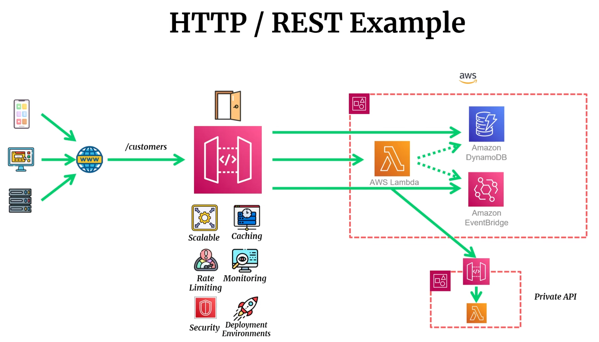

-   <details><summary style="font-size:25px;color:Orange">Lambda Function</summary>

    > AWS Lambda is a serverless computing service provided by Amazon Web Services (AWS) that allows users to run their code without having to manage servers or infrastructure. Here are some key terms and concepts related to AWS Lambda:
    > AWS Lambda is a serverless computing service that automatically runs code in response to events, managing the underlying compute infrastructure. It allows you to execute your code without provisioning or managing servers, enabling you to focus solely on your application logic. Here are the main concepts and components of AWS Lambda:
    > A **Lambda function** is the core concept of AWS Lambda. It is a piece of code that you write and deploy, which AWS Lambda automatically executes in response to events or triggers.

    -   **Lambda Definition in Terraform**:

        ```ini
        resource "aws_lambda_function" "sqs_processor" {
            function_name    = "sqs-processor"
            description      = "Processes messages from SQS and performs analysis tasks"
            runtime          = "python3.9"
            role             = aws_iam_role.lfn_analysis_role.arn
            handler          = "lambda_handler.sqs_processor_handler"
            filename         = data.archive_file.lambda_zip.output_path
            source_code_hash = data.archive_file.lambda_zip.output_base64sha256

            memory_size = 512 # Default is 128 MB, can be set between 128 MB and 10,240 MB
            timeout     = 120 # Default is 3 seconds, can be set up to 900 seconds (15 minutes)

            architectures = ["x86_64"] # Default is "x86_64", other option is "arm64"

            ## Reserved Concurrency (max limit)
            #   reserved_concurrent_executions = 9

            # Whether to publish creation/change as new Lambda Function Version. Defaults to false.
            publish = false

            layers = [aws_lambda_layer_version.lfn_layer.arn]
            vpc_config {
                # subnet_ids         = [for s in aws_subnet.detf_subnets : s.id]
                subnet_ids         = values(var.subnets)
                security_group_ids = [aws_security_group.lambda_analysis_sg.id]
            }

            file_system_config {
                arn              = aws_efs_access_point.lfn_analysis_file_access_point.arn
                local_mount_path = "/mnt/efs"
            }

            # Increase `/tmp` storage to 5GB
            ephemeral_storage {
                size = 512 # Default is 512 MB, can be set up to 10,240 MB (10 GB)
            }

            # Enable SnapStart for faster cold starts
            snap_start {
                apply_on = "None" # Default is "None"; other option is "PublishedVersions"
            }

            environment {
                variables = {
                INPUT_QUEUE_URL   = aws_sqs_queue.input_queue.id
                FAILURE_QUEUE_URL = aws_sqs_queue.failure_queue.id
                SUCCESS_TOPIC_ARN = aws_sns_topic.success_topic.arn
                PROJECT           = "Lambda Analysis"
                }
            }

            tags = {
                Name    = "sqs-processor"
                Project = "${var.project}-sqs-processor"
            }

            depends_on = [aws_efs_mount_target.lfn_analysis_efs_mnt_target]
        }

        ```

    -   **Components**:

        -   **Code**: Written in supported languages (Python, Node.js, Java, Go, Ruby, C#, etc.).
        -   **Handler**: The entry point of the Lambda function, where the execution begins.
        -   **Deployment Package**: Includes your code and any dependencies in a zip file or a container image (if using container-based Lambda).

    -   <details><summary style="font-size:20px;color:Magenta">Function Configuration</summary>

        Each Lambda function has a set of configurations that define how it behaves, including memory, timeout, and concurrency settings.

        1. **Basic Settings**

            - **Function Name**:

                - The name assigned to the function, which must be unique within an AWS Region and account.

            - **Runtime**:

                - Specifies the programming language and version that the Lambda function will use (e.g., Python 3.9, Node.js 18.x, Java 11).
                - AWS Lambda manages and updates runtimes, but deprecated versions eventually lose support, so updating periodically is crucial.

            - **Execution Role & Policies**:

                - Lambda functions require an **Identity and Access Management (IAM) role** with permissions to interact with AWS resources.
                - The role grants the function access to resources such as S3 buckets, DynamoDB tables, or the CloudWatch Logs service where function logs are stored.
                - Following the principle of least privilege, the role should have the minimum permissions needed.
                - `Resource-Based Policies`: Lambda functions can have resource-based policies to control which AWS accounts or services can invoke the function. This is especially useful for cross-account or cross-service access, like allowing an S3 bucket from another account to trigger a Lambda function.

            - **Handler**:
                - Defines the entry point of the function. The handler is a function within your code that AWS Lambda calls to start execution.
                - The format is typically `filename.method_name` (e.g., `lambda_function.lambda_handler`), where `lambda_function` is the filename and `lambda_handler` is the method name.

        2. **Memory and Timeout**

            - **Memory Allocation**:

                - The memory (in MB) allocated to a Lambda function can range from 128 MB to 10 GB, in increments of 1 MB.
                - More memory usually results in more **CPU** and **network bandwidth** allocation, which can speed up execution but also increase costs.
                - Lambda pricing is based on memory and execution time, so optimizing memory for performance and cost balance is essential.

            - **Timeout**:

                - The maximum time that a Lambda function can run per invocation, with a range from 1 second to 15 minutes (900 seconds).
                - If the function exceeds the timeout, it is terminated, so setting an appropriate timeout based on expected execution duration is critical to prevent early termination.
                - Specifies the maximum duration for function execution. Lambda terminates the function if it exceeds this time, ensuring resource cleanup and preventing long-running executions.

            - **Retry Policies**:
                - You can configure retry policies for asynchronous invocations and event source mappings. These are useful for automatically handling transient failures, allowing your function more opportunities to complete.

        3. **Environment Variables**

            - Key-value pairs used to store configuration data or secrets needed by the function, such as API keys, database credentials, or resource configurations.
            - **Environment Variable Encryption**: By default, Lambda encrypts environment variables using AWS Key Management Service (KMS). You can also specify a custom KMS key for added security.

        4. **Networking**: AWS Lambda can be configured to run inside a **Virtual Private Cloud (VPC)**, allowing your function to access private resources like RDS or EC2 instances.

            - When you configure a Lambda function to connect to a VPC, you specify subnets and security groups to control network access.
            - Note that adding VPC connectivity may impact Lambda’s cold start time because it requires additional network setup.
            - `VPC Subnets`: Functions running in VPC can interact with private subnets and on-premises resources through a VPN or Direct Connect.
            - `VPC Endpoints`: Can be used to access AWS services privately without internet access.

        </details>

    -   <details><summary style="font-size:20px;color:Magenta">Event Source Mapping</summary>

        An **AWS Lambda Event Source Mapping (ESM)** is a Lambda resource that acts as a **managed poller** to connect stream-based and queue-based event sources to a Lambda function.

        It is a key component in Lambda's architecture that enables the **"Pull" model** for certain services, relieving you of the burden of writing and managing your own polling or consumption logic.

        ```ini
        resource "aws_lambda_event_source_mapping" "sqs_trigger" {
            function_name    = aws_lambda_function.sqs_processor.arn
            event_source_arn = aws_sqs_queue.input_queue.arn
            batch_size       = 10
            enabled          = true
            # 👉 Together, they define the retry policy: Lambda retries until either retry attempts are exhausted OR record age expires, whichever comes first.
            maximum_retry_attempts        = 0  # How many times to retry failed batches
            maximum_record_age_in_seconds = 60 # Maximum age of a record that Lambda sends to a function for processing; default is 60 seconds
        }
        ```

        ##### The Pull Model vs. Push Model

        The concept of the Event Source Mapping is best understood in the context of Lambda's two fundamental event invocation models:

        1. **The Push Model** (Direct Invocation): In this model, the AWS service itself is configured to **directly invoke** your Lambda function when an event occurs. The service "pushes" the event to Lambda.

            - **Examples:** Amazon S3 (on file upload), Amazon SNS, Amazon API Gateway, Amazon EventBridge.
            - **Role:** The invoking service is responsible for sending the event and handling invocation details (synchronous or asynchronous).

        2. **The Pull Model** (Event Source Mapping): In this model, the **Lambda service** is responsible for actively **reading (polling)** records or messages from the source and then invoking your function. The Event Source Mapping is the resource that defines this polling connection.
            - **Event Source Mapping:** This is the AWS resource you create. It tells the Lambda service:
                - _Where_ to poll (e.g., an SQS queue ARN or Kinesis Stream ARN).
                - _Which_ Lambda function to invoke with the records.
                - _How_ to handle the records (e.g., batch size, filtering, error handling).
            - **Examples:** Amazon DynamoDB Streams, Amazon Kinesis Data Streams (KDS), Amazon Simple Queue Service (SQS), Amazon Managed Streaming for Apache Kafka (Amazon MSK), Amazon MQ.

        ##### How Event Source Mapping Works

        For services that use the Pull Model, the ESM manages the following internal process:

        3.  **Polling:** The Lambda service creates dedicated **event pollers** (highly available and auto-scaling resources) that continuously poll the configured stream or queue for new records/messages.
        4.  **Batching and Filtering:** The pollers collect the messages into a **batch** based on your configured settings. Before invoking the function, you can optionally apply **filter criteria** to the batch payload to discard records that don't match your rules, which can reduce cost and complexity.
            -   **Batch Size:** The maximum number of records to include in a single invocation (e.g., up to 10,000 for SQS).
            -   **Batching Window:** The maximum amount of time Lambda waits to collect records before invoking the function (up to 300 seconds).
        5.  **Invocation:** Once a batch is ready (either the maximum size is reached, the batching window expires, or the payload size reaches 6 MB), the Lambda service **synchronously invokes** your Lambda function with the batch of records as the input event.
        6.  **Checkpointing/Deletion:**
            -   For **Streams** (Kinesis/DynamoDB), Lambda automatically manages the **iterator/checkpoint** for the stream shard. If processing is successful, the checkpoint is advanced.
            -   For **Queues** (SQS), if the function returns successfully (no error), Lambda automatically **deletes** the messages from the queue.

        ##### Error Handling and Control

        A major benefit of the ESM is its built-in error handling and flow control for the pull model sources:

        -   **Retries:** For streams (KDS/DynamoDB), if a function fails, the ESM automatically **retries** the batch. You can configure the number of retries (`MaximumRetryAttempts`) and whether to split the batch (`BisectBatchOnFunctionError`).
        -   **Maximum Age:** For streams, you can set the `MaximumRecordAgeInSeconds` to discard records that are too old, preventing a single bad record from blocking the processing of newer records (a "poison pill").
        -   **Concurrency Control:** You can control the number of concurrent batches processed from each shard (for streams) using the `ParallelizationFactor`.
        -   **Destinations:** For certain services (Kinesis, DynamoDB, SQS), you can configure an **on-failure destination** (e.g., an SNS topic or SQS queue) where the entire failed batch record is sent after all retries are exhausted.

        </details>

    -   <details><summary style="font-size:20px;color:Magenta">Synchronous Invocation & Asynchronous Invocation</summary>

        AWS Lambda functions can be invoked in two fundamental ways: **Synchronously** and **Asynchronously**. The choice between the two depends heavily on the application's requirements for response time, error handling, and whether an immediate response is required by the caller.

        ##### Synchronous Invocation

        In a **synchronous** invocation, the caller makes a request, the function is executed immediately, and the caller **waits** for the function to complete and return a response. This is the default invocation type.

        -   **How it Works**:

            1.  **Caller Sends Request:** The client (e.g., API Gateway, AWS CLI, AWS SDK, or another Lambda function) calls the Lambda `Invoke` API with `InvocationType` set to `RequestResponse` (the default).
            2.  **Immediate Execution:** AWS Lambda executes the function's code immediately.
            3.  **Caller Waits:** The calling client's connection remains open until the function finishes execution or times out.
            4.  **Response/Error:** When the function completes, Lambda returns the function's response payload (including the result or any error details) directly back to the caller. The API response HTTP status code is typically $\mathbf{200}$ for a successful invocation, regardless of errors within the function's code.

        -   **Key Characteristics**:

            -   **Response Time:** You get an **immediate** response with the result.
            -   **Error Handling:** The **caller is responsible** for handling function errors and implementing any necessary retry logic.
            -   **Payload Size:** Maximum input payload is **6 MB**.
            -   **Common Integrations:** AWS services that require an immediate response often use synchronous invocation, such as **Amazon API Gateway** (for REST APIs), **Elastic Load Balancers (ELB)**, and **AWS Step Functions**.
            -   **Use Case:** Ideal for real-time, user-facing operations like web APIs, data transformations where the result is immediately needed, or request-response style workflows.

        ##### Asynchronous Invocation

        In an **asynchronous** invocation, the caller makes a request, and the Lambda service takes the event, queues it for processing, and **returns an immediate acceptance response** without waiting for the function to execute. The function runs in the background.

        -   **How it Works**:

            1.  **Caller Sends Request:** The client calls the Lambda `Invoke` API with `InvocationType` set to `Event`.
            2.  **Lambda Queues Event:** The Lambda service immediately places the event onto an **internal, managed queue**.
            3.  **Immediate Response:** The caller receives an immediate $\mathbf{202}$ **ACCEPTED** status code, confirming the event was successfully queued, but containing no information about the function's execution result.
            4.  **Background Processing:** A separate Lambda process reads the event from the queue and invokes the function.
            5.  **Error Handling (Retries):** If the function fails (e.g., returns an error or times out), the Lambda service automatically **retries** the invocation **up to two more times** by default.
            6.  **Destinations:** For both successful and failed asynchronous executions (after all retries), you can configure **Lambda Destinations** (e.g., SQS, SNS, EventBridge, or another Lambda function) to receive an **invocation record** detailing the outcome.

        -   **Key Characteristics**:

            -   **Response Time:** The caller receives an **immediate** $\mathbf{202}$ status code; execution happens in the background.
            -   **Error Handling:** The **Lambda service manages retries**. Failed events can be sent to a **Dead-Letter Queue (DLQ)** or an **on-failure Destination** after retries are exhausted.
            -   **Payload Size:** Maximum input payload is **1 MB**.
            -   **Common Integrations:** AWS services that inherently operate in an event-driven, fire-and-forget manner, such as **Amazon S3** (on object creation), **Amazon SNS**, and **Amazon EventBridge**.
            -   **Use Case:** Perfect for background jobs, long-running processes (up to 15-minute timeout), non-critical tasks like sending emails, processing log files, or data aggregation where the caller doesn't need an immediate result.

        ##### Summary Comparison Table 📊

        | Feature                  | Synchronous Invocation                                  | Asynchronous Invocation                                                   |
        | :----------------------- | :------------------------------------------------------ | :------------------------------------------------------------------------ |
        | **Invocation Type**      | `RequestResponse` (Default)                             | `Event`                                                                   |
        | **Caller Waits**         | **Yes** (Blocks until execution finishes or times out)  | **No** (Returns immediately)                                              |
        | **Response Code**        | $\mathbf{200}$ (Includes function result/error details) | $\mathbf{202}$ (Accepted/Queued)                                          |
        | **Retry Responsibility** | **Caller** must implement retries                       | **Lambda Service** manages retries (up to 2 attempts for function errors) |
        | **Intermediary**         | None (Direct Call)                                      | **Internal Queue** managed by Lambda                                      |
        | **Max Payload Size**     | 6 MB                                                    | 1 MB                                                                      |
        | **Recommended For**      | Real-time APIs, user-facing requests                    | Background tasks, event-driven workflows, long-running processes          |

        </details>

    -   <details><summary style="font-size:20px;color:Magenta">AWS Lambda Destinations</summary>

        AWS Lambda Destinations is a powerful feature that provides **visibility, routing, and control** over the results of a Lambda function's **asynchronous invocation**. It allows you to automatically send a detailed **execution record** to a downstream service based on whether the function invocation was successful or failed, all without writing extra code in your function.

        ```ini
        resource "aws_lambda_function_event_invoke_config" "lambda_destinations" {
            function_name = aws_lambda_function.gpc_cuckoo.function_name

            # 👉 Together, they define the retry policy: Lambda retries until either retry attempts are exhausted OR event age expires, whichever comes first.
            maximum_event_age_in_seconds = 21600 # Event age (in seconds) after which Lambda discards the event. Default is 6 hours (21600 seconds)
            maximum_retry_attempts       = 0     # Retry attempts (0 means no retry) on failure

            destination_config {
                on_failure { destination = aws_sqs_queue.failure_queue.arn }
                on_success { destination = aws_sns_topic.success_topic.arn }
            }
        }
        ```

        ##### Primary Purpose and Scope

        The core function of Lambda Destinations is to simplify the building of **event-driven workflows** and enhance **error handling** for non-real-time applications.

        -   **Applicable Invocations:** Destinations are primarily for **asynchronous invocations** (when using `InvocationType: Event`), where the caller doesn't wait for the result (e.g., from SNS, S3, or a direct asynchronous invoke).
        -   **Execution Record:** Instead of just sending the original event, the destination receives a full **invocation record** which is a JSON document containing:
            -   The **request payload** (the original event).
            -   The **response payload** (the function's return value on success, or error details like stack traces on failure).
            -   Contextual information (source ARN, destination ARN, Request ID, function version).
        -   **Zero Code Integration:** The routing is configured entirely on the Lambda function itself, decoupling the post-execution logic from the function's business logic.

        ##### Configuration and Targets

        You can configure two separate destinations for a single Lambda function:

        1. **On Success (`OnSuccess`)**: If the function is invoked asynchronously and successfully completes (returns without an exception) after all retries are exhausted, the execution record is sent to this destination.

            - **Use Cases:** Chaining functions together asynchronously, notifying a successful completion, or logging the final result.

        2. **On Failure (`OnFailure`)**: If the function is invoked asynchronously and fails (throws an exception or times out) after exhausting the configured retry attempts or exceeding the maximum event age, the failure record is sent to this destination.

            - **Use Cases:** Automated error investigation, sending a notification to an operations team, or triggering a cleanup workflow.

        -   **Supported Destination Targets**: Lambda Destinations can route the execution record to the following services:

            | Destination Target          | Data Format                                                          |
            | :-------------------------- | :------------------------------------------------------------------- |
            | **Another Lambda Function** | The record is passed as the **payload** to the destination function. |
            | **Amazon SQS**              | The record is passed as the **message body** to the queue.           |
            | **Amazon SNS**              | The record is passed as the **message** to the topic.                |
            | **Amazon EventBridge**      | The record is passed as the **Detail** in the `PutEvents` call.      |

        ##### Destinations vs. Dead Letter Queues (DLQ)

        Lambda Destinations are generally the **preferred solution** for asynchronous error handling, offering significant advantages over the older Dead Letter Queue (DLQ) mechanism configured directly on the function.

        | Feature              | Lambda Destination (OnFailure)                                                        | Dead Letter Queue (DLQ)                                                 |
        | :------------------- | :------------------------------------------------------------------------------------ | :---------------------------------------------------------------------- |
        | **Triggered When**   | Failure after **all retries** are exhausted (or event age is exceeded).               | Failure after **all retries** are exhausted (or event age is exceeded). |
        | **Targets**          | Lambda Function, SQS, SNS, EventBridge.                                               | SQS or SNS only.                                                        |
        | **Payload Content**  | **Execution Record** (includes original event **and** function response/stack trace). | **Original Event Payload** only.                                        |
        | **Success Handling** | **Supported** via `OnSuccess` configuration.                                          | **Not Supported** (Failure only).                                       |

        While a DLQ is simpler, a Destination gives you the full context of _why_ the function failed (the stack trace) and _what_ the original request was, enabling much richer error handling and automated recovery.

        </details>

    -   <details><summary style="font-size:20px;color:Magenta">Concurrency and Scaling</summary>

        **Concurrency** in AWS Lambda refers to the number of instances (or executions) of a function that can run simultaneously. AWS Lambda is inherently scalable and can handle multiple invocations in parallel, but understanding how concurrency works is crucial for ensuring predictable scaling behavior. You can manage concurrency to control costs and limit resource usage. AWS Lambda’s concurrency and scaling capabilities are essential for building scalable, serverless applications. Here’s a breakdown of key terms and concepts related to concurrency and scaling in AWS Lambda:

        1.  **Concurrency Limit**:

            -   AWS Lambda has default concurrency limits, which can be adjusted within AWS account settings. This limit is important for managing the maximum number of concurrent executions your account can have across all Lambda functions.
            -   Concurrency settings help ensure that Lambda functions don't overwhelm downstream services, databases, or other resources by invoking too many instances at once.

        2.  **Reserved Concurrency**:

            -   Reserved concurrency is the maximum number of concurrent executions that a specific Lambda function can handle. This is an optional configuration that isolates a portion of account-wide concurrency for a specific Lambda function.
            -   For example, if you reserve concurrency of `50` for one Lambda function, AWS guarantees that up to 50 concurrent executions of that function will run, while preventing it from using more than 50 concurrent executions and consuming resources that other functions need.

        3.  **Provisioned Concurrency**:

            -   Provisioned concurrency is a feature designed to reduce the latency of Lambda functions. It pre-warms a specific number of instances to ensure they are immediately available when requests arrive, preventing cold starts (the delay from initializing resources when a function is first invoked).
            -   This is particularly useful for applications where low latency is critical, such as interactive applications or APIs that require consistent response times.

        4.  **Cold Start**

            -   A **cold start** occurs when AWS Lambda needs to initialize a new environment for an incoming request. When a Lambda function is invoked, AWS must set up resources such as the execution environment, runtime, and dependencies.
            -   Cold starts can lead to latency in the initial request. For functions that require low latency, cold starts can be mitigated by using **Provisioned Concurrency** or by periodically invoking the function to keep it "warm."

        5.  **Auto Scaling**

            -   AWS Lambda automatically scales based on the number of incoming requests and concurrency limits. When more requests arrive than existing Lambda instances can handle, AWS Lambda automatically scales up by creating new instances.
            -   This process is automatic and can handle bursts of traffic efficiently, but scaling is limited by **concurrency configurations**, **reserved concurrency**, and **account-wide concurrency quotas**.

        6.  **Burst Concurrency**

            -   **Burst concurrency** is the initial scaling capacity that AWS Lambda provides within a short time for functions within a particular AWS Region.
            -   AWS Lambda can initially handle a burst of 500 to 3000 concurrent requests per second (depending on the Region). After this burst, Lambda gradually scales up at a rate of 500 additional concurrent invocations per minute until it reaches the maximum concurrency limit of the AWS account.

        7.  **Throttling**

            -   Throttling occurs when AWS Lambda exceeds its maximum concurrency limit (either at the account level or at the function level through reserved concurrency).
            -   When throttling happens, additional requests to a Lambda function are rejected with a `429 TooManyRequests` error. To handle this, the calling service (like API Gateway or SQS) can implement retry logic, or you can increase concurrency limits if throttling is frequent.

        8.  **Scaling Behavior and Invocation Model**

            -   **Synchronous Invocations**:
                -   In synchronous invocations (like those triggered by API Gateway, AWS SDK, or application integrations), Lambda returns the response immediately after execution, and the caller waits for the function to complete.
                -   When the request rate exceeds the function’s concurrency limit, new synchronous invocations are throttled.
            -   **Asynchronous Invocations**: For asynchronous invocations (like those triggered by S3 or CloudWatch Events), Lambda queues the events. It then retries these events if they fail or are throttled until they succeed or until Lambda exhausts the retry limit.
            -   **Event Source Mapping**: When integrating Lambda with services like Amazon SQS or Kinesis (stream-based services), Lambda reads and processes events as they arrive in the source. The scaling of Lambda for these integrations is determined by the event source's processing characteristics and partitioning.

        9.  **Lambda Scaling with Event Sources**

            -   **Amazon SQS**: Lambda can process up to 10 messages at a time from a single Amazon SQS queue and scales horizontally as the number of messages increases, limited by concurrency.
            -   **Amazon Kinesis and DynamoDB Streams**:
                -   Lambda scaling with Kinesis or DynamoDB streams is partitioned. AWS Lambda processes records from each shard or partition concurrently, but only one Lambda instance can process data from a specific shard at a time.
                -   The number of shards defines the maximum concurrency Lambda can achieve with these sources, so you may need to increase the shard count if the function requires greater concurrency.

        10. **Concurrency Scaling Considerations**: Concurrency affects costs, latency, and performance, so configuring concurrency properly is key to balancing efficiency and cost in AWS Lambda:

            -   **Cost**: Each instance adds cost, so unbounded concurrency can lead to high expenses. Reserved and provisioned concurrency options give finer control over costs.
            -   **Latency**: Low-latency applications may need provisioned concurrency to avoid cold starts.
            -   **Throttling Impact**: Throttling at peak times can cause delays or errors in applications, making it important to monitor concurrency usage and plan capacity according to traffic patterns.

        11. **Monitoring and Scaling Metrics**: AWS provides metrics in CloudWatch that help in monitoring and tuning Lambda function scaling:
            -   **ConcurrentExecutions**: Shows the total concurrent executions in the account.
            -   **UnreservedConcurrentExecutions**: Reflects concurrency left after reserved concurrency allocations.
            -   **Throttles**: Indicates throttling events due to exceeded concurrency limits, helping identify scaling needs.

        </details>

    -   <details><summary style="font-size:20px;color:Magenta">Lambda Throttling</summary>

        Lambda throttling is a mechanism used in AWS Lambda to limit the rate at which function executions can occur. This mechanism helps protect your resources and ensures the smooth operation of your AWS infrastructure by preventing a Lambda function from being overwhelmed with excessive requests. AWS Lambda provides two types of throttling:

        -   `Concurrent Execution Throttling`:

            -   Concurrent execution throttling limits the number of function executions that can run simultaneously. AWS imposes a default concurrency limit on your AWS account and can adjust this limit upon request.
            -   When the limit is reached, AWS will queue any additional invocation requests. These queued requests will be processed as soon as existing executions complete and resources become available. Throttled invocations do not result in errors; they are simply delayed.
            -   You can view and modify the concurrent execution limit for a specific function in the AWS Lambda Management Console.

        -   `Invocation Throttling`:

            -   Invocation throttling occurs when you send too many requests to invoke a Lambda function in a short period. This can happen when you repeatedly call the function with a high request rate.
            -   AWS enforces soft limits on the number of requests per second (RPS) that can be sent to a function. If you exceed these soft limits, AWS may throttle your requests, resulting in delays and retries.
            -   To mitigate invocation throttling, you can:
                -   Implement exponential backoff and retries in your code to handle throttled requests gracefully.
                -   Request a limit increase from AWS Support if your workload requires a higher request rate.

        -   `Implement Retries`: Build retry logic with exponential backoff into your Lambda client code to handle throttled requests and retries automatically.
        -   `Error Handling`: Check for error codes in the Lambda response to detect throttled invocations and take appropriate action.
        -   `Throttle Metrics`: Monitor CloudWatch metrics, such as `Throttles` and `ThrottleCount` to gain insight into the rate of throttled invocations.
        -   `Limit Increases`: If you anticipate higher traffic, request a concurrency limit increase from AWS Support. Ensure that your architecture and resource usage can handle the increased load.
        -   `Batch Processing`: If you're processing large numbers of records, consider batch processing to reduce the rate of function invocations.
        -   `Distributed Workloads`: Distribute workloads across multiple Lambda functions to avoid overwhelming a single function.
        -   `Provisioned Concurrency`: Consider using AWS Lambda Provisioned Concurrency to pre-warm your functions, ensuring that they can handle surges in traffic without experiencing cold start delays.

        </details>

    -   <details><summary style="font-size:20px;color:Magenta">Terms & Concepts</summary>

        1. **Dead Letter Queue (DLQ)**

            - Specifies an Amazon SQS queue or an Amazon SNS topic as a **Dead Letter Queue** for asynchronous invocation errors.
            - When a Lambda function cannot process an event after a certain number of retries, the event is sent to the DLQ for later analysis or reprocessing.
            - Useful for handling errors gracefully, ensuring events aren’t lost.

        2. **Error Handling and Retry Policies**

            - **Asynchronous Invocation**: Lambda automatically retries asynchronous invocations (e.g., from S3, SNS, CloudWatch) up to two times if there’s an error. You can configure the retry attempts to 0, 1, or 2.
            - **Event Source Mapping**: For sources like SQS, Kinesis, and DynamoDB streams, Lambda retries until the message expires, is processed successfully, or is moved to a **destination** or **DLQ** after a set number of attempts.
            - **Destinations**: With **AWS Lambda destinations**, you can route successful or failed asynchronous invocations to an SNS topic, SQS queue, EventBridge, or another Lambda function, which allows for advanced error handling and processing workflows.

        3. **Logging and Monitoring**: AWS Lambda integrates with **Amazon CloudWatch** for logging, monitoring, and observability.

            - `CloudWatch Logs`: Every function invocation produces logs, which can be viewed and monitored through CloudWatch. Lambda sends logs of function execution (including errors, timeouts, and custom logs) to Amazon CloudWatch by default. These logs are useful for debugging, monitoring, and performance tuning.
            - `X-Ray Tracing`: AWS X-Ray provides insights into function performance and latency by tracing requests as they pass through the application. It helps pinpoint bottlenecks, understand dependencies, and monitor overall performance.

            - `Invocations`: The number of times a function is called.
            - `Errors`: The number of errors that occurred during function execution.
            - `Duration`: The time it took for the function to execute.
            - `Throttles`: The number of times the function was throttled due to reaching the concurrency limit.

        4. **File System (EFS) Configuration**

            - **Amazon EFS (Elastic File System)**:
                - Allows Lambda functions to access a persistent file system across function invocations. This is helpful for functions that require shared storage, such as large models or datasets.
                - EFS can be mounted on Lambda functions configured within a VPC, and it’s useful for stateful workloads or functions with large code dependencies that exceed Lambda’s 10 GB limit.

        5. **Function Code Configuration**

            - **Deployment Package**:
                - A Lambda function’s deployment package contains the function code and dependencies, packaged in a `.zip` file or container image.
                - **Layers**: Lambda layers let you share code, libraries, or binaries across multiple Lambda functions without including them in each function’s deployment package. Up to 5 layers can be used per function, reducing package size and simplifying maintenance.
            - **Container Images**:
                - Lambda supports container images up to 10 GB, allowing you to package code and dependencies in Docker images for more complex applications or specific runtime requirements.
                - Images are stored in Amazon ECR and provide a way to deploy large applications with custom runtimes or dependencies.

        6. **Aliases and Versions**

            - **Versions**: Lambda functions can be versioned, with each published version being immutable. Versions allow you to reference specific function code and configuration states, providing stability for production applications.
            - **Aliases**: An alias is a pointer to a specific function version, often used to manage different environments (e.g., `dev`, `test`, `prod`). Aliases allow routing traffic between versions and enable canary deployments by splitting traffic to different versions.

        7. **Event Sources / Triggers**: **Event sources** are AWS services or external systems that generate events that can trigger a Lambda function to execute. These triggers define when and how Lambda functions are invoked.

            - **Common Event Sources**:
                - **S3**: Lambda can trigger when an object is created or deleted in an S3 bucket.
                - **API Gateway**: Lambda can be invoked via HTTP requests, making it suitable for serverless APIs.
                - **SNS (Simple Notification Service)**: Lambda can process messages from SNS.
                - **SQS (Simple Queue Service)**: Lambda can process messages from SQS queues.
                - **CloudWatch Events**: Lambda can trigger on scheduled events or based on system events (e.g., EC2 instance state change).
                - **DynamoDB Streams**: Lambda can trigger on changes in DynamoDB tables.

        8. **Lambda Execution Environment**: The **execution environment** is the runtime in which Lambda functions run. AWS Lambda automatically manages the environment that runs your code, scaling it based on demand.

            - **Features**:
                - **Isolated environment**: Functions run in isolated environments to ensure security.
                - **Runtime management**: AWS manages the language runtime and updates it.
                - **Environment variables**: Allows the use of environment variables for dynamic configuration.

        9. **Lambda Layers**: **Lambda layers** allow you to package external libraries, dependencies, or configuration files separately from your function code. These layers can be shared across multiple Lambda functions, reducing code duplication and improving maintainability.

            - **Features**:
                - You can include libraries, custom runtimes, or configuration data.
                - You can use up to 5 layers per Lambda function.
                - Layers can be reused by multiple Lambda functions or shared across accounts.

        10. **Lambda Pricing Model**: AWS Lambda follows a pay-per-use model, where you're charged based on the number of function invocations and the compute time used.

            - **Pricing Factors**:
                - **Number of invocations**: Charged for every request.
                - **Compute time**: Charged based on the function's memory and execution duration, measured in milliseconds.

        11. **AWS Lambda@Edge**: **Lambda@Edge** is an extension of AWS Lambda that allows you to run code closer to users (at Amazon CloudFront edge locations), reducing latency for global users.

            - **Features**:
                - Modify content delivery and customize responses for users.
                - Perform operations like URL rewrites, header manipulations, and cache key customizations.

        </details>

    -   <details><summary style="font-size:20px;color:Magenta">Features of Lambda Function</summary>

        -   `Serverless Execution`: AWS Lambda allows you to run your code without managing servers. You upload your code, and AWS Lambda takes care of provisioning and scaling the infrastructure needed to execute it.
        -   `Event-Driven Execution`: Lambda functions can be triggered by various AWS services or custom events. Examples of triggers include changes to data in an S3 bucket, updates to a DynamoDB table, or HTTP requests through API Gateway.
        -   `Supported Runtimes`: Lambda supports multiple programming languages, known as runtimes. These include Node.js, Python, Java, Ruby, Go, .NET, and custom runtimes through the use of custom execution environments.
        -   `Automatic Scaling`: Lambda automatically scales your applications in response to incoming traffic. Each function can scale independently, and you pay only for the compute time consumed.
        -   `Built-in Fault Tolerance`: AWS Lambda maintains compute capacity, and if a function fails, it automatically retries the execution. If a function execution fails repeatedly, Lambda can be configured to send the event to a Dead Letter Queue (DLQ) for further analysis.
        -   `Integrated Logging and Monitoring`: Lambda provides built-in logging through Amazon CloudWatch. You can monitor the performance of your functions, view logs, and set up custom CloudWatch Alarms to be notified of specific events or issues.
        -   `Environment Variables`: Lambda allows you to set environment variables for your functions. These variables can be used to store configuration settings or sensitive information, such as API keys.
        -   `Execution Role and Permissions`: Each Lambda function is associated with an IAM (Identity and Access Management) role that defines the permissions needed to execute the function and access other AWS resources.
        -   `Stateless Execution`: Lambda functions are designed to be stateless. However, you can store persistent data using other AWS services like Amazon S3, DynamoDB, or AWS RDS.
        -   `Cold Starts and Warm Containers`: Cold starts occur when a function is invoked for the first time or when there is a need to scale. Subsequent invocations reuse warm containers, reducing cold start times.
        -   `VPC Integration`: Lambda functions can be integrated with a VPC, allowing them to access resources inside a VPC, such as databases, and allowing private connectivity.
        -   `Cross-Region Execution`: You can configure Lambda functions to run in different AWS regions, providing flexibility and redundancy.
        -   `Versioning and Aliases`: Lambda supports versioning and aliases, allowing you to manage different versions of your functions and direct traffic to specific versions.
        -   `Maximum Execution Duration`: Each Lambda function has a maximum execution duration (timeout) that can be set. If the function runs longer than the specified duration, it is terminated.
        -   `Immutable Deployment Packages`: Once a Lambda function is created, its deployment package (code and dependencies) becomes immutable. If you need to make changes, you create a new version of the function.

        </details>

    -   <details><summary style="font-size:20px;color:Magenta">Limitation on Lambda Functions</summary>

        -   `Execution timeout`: The maximum execution time for a Lambda function is `900 seconds (15 minutes)`.
        -   `Concurrent executions`: By default, there is a soft `limit of 1,000 concurrent executions per account per region`. However, you can request a higher limit if you need it.
        -   `Environment variables`: You can set environment variables for your Lambda function, but `the maximum size of all environment variables combined is 4 KB`.

        -   `Deployment package size`: `The maximum compressed deployment package size for a Lambda function is 50 MB`. There are some exceptions for certain runtimes, as outlined in my previous answer.

            -   Uncompressed code & dependencies < 250 MB
            -   Compressed function package < 50MB
            -   Total function packages in a region < 75 GB
            -   Ephemeral storage < 512 MB
            -   Maximum execution duration < 900 seconds
            -   Concurrent Lambda functions < 1000

        -   `Memory allocation`: Up to 10 GB of memory to a Lambda function. The amount of memory you allocate also determines the amount of CPU and network resources that the function gets.
            -   `Memory allocation`: Up to 10 GB of memory starting from 128 MB with CPU 3GB.
        -   `Execution environment`: Lambda functions run in a stateless execution environment, so you can't store data on the local file system. However, you can use other AWS services like S3 or DynamoDB to store data.
        -   `Function invocations`: You can trigger a Lambda function in several ways, including through `API Gateway`, `S3 events`, `SNS notifications`, and more. However, there may be some limits or quotas on the number of invocations you can make in a given period.

        </details>

    -   <details><summary style="font-size:20px;color:Magenta">Usecases of Lambda</summary>

        AWS Lambda is a serverless compute service that lets you run code without provisioning or managing servers. It's often used for various use cases across different industries. Here are the top five most common use cases for AWS Lambda:

        -   **Event-Driven Processing**: AWS Lambda is frequently used to process events from various AWS services, such as Amazon S3, Amazon DynamoDB, Amazon SNS, Amazon SQS, and more. For example, you can trigger Lambda functions to process new objects uploaded to an S3 bucket, process messages from an SQS queue, or react to changes in a DynamoDB table.

        -   **Real-time File Processing**: Lambda functions can be used for real-time processing of data streams. For instance, you can use Lambda to analyze streaming data from Amazon Kinesis Data Streams or process logs from Amazon CloudWatch Logs in real-time.

        -   **Backend for Web Applications**: Lambda functions can serve as the backend for web applications, providing scalable and cost-effective compute resources. You can build APIs using AWS API Gateway and trigger Lambda functions to handle incoming HTTP requests, allowing you to build serverless web applications without managing infrastructure.

        -   **Scheduled Tasks and Cron Jobs**: Lambda functions can be scheduled to run at specific intervals using AWS CloudWatch Events. This allows you to automate tasks such as data backups, log archiving, or regular data processing jobs without needing to maintain dedicated servers or cron jobs.

        -   **Data Processing and ETL**: Lambda functions are commonly used for data processing and ETL (Extract, Transform, Load) tasks. You can trigger Lambda functions to process data as soon as it becomes available, perform transformations on the data, and then load it into a data warehouse or database. This approach enables real-time or near-real-time data processing without the need for complex infrastructure.

        </details>

    </details>

---

-   <details><summary style="font-size:25px;color:Orange">ECS</summary>

    > Amazon Elastic Container Service (**ECS**) is a fully managed container orchestration service that makes it easy for you to deploy, manage, and scale Docker containers on AWS. It abstracts away the complexity of managing the underlying infrastructure, allowing you to focus on building and running your applications. ECS eliminates the need to install, operate, and scale your own container management infrastructure. AWS ECS offers different ways to run your containers, catering to various needs and levels of control:

    -   <details><summary style="font-size: 25px;color:#C71585">Launch Types or Capacity Providers</summary>

        > Amazon Elastic Container Service (ECS) offers two primary **Compute Options** (often referred to as **Launch Types** or **Capacity Providers**) for running your containerized workloads: **AWS Fargate** (Serverless) and **Amazon EC2** (Customer-Managed). The choice depends heavily on your team's operational model, control requirements, and cost optimization strategy.

        1. **AWS Fargate (Serverless Launch Type)**: **AWS Fargate** is a **serverless compute engine** for containers that removes the need for you to provision, configure, or manage the underlying virtual machines (EC2 instances). You simply define the CPU and memory requirements for your containerized application, and AWS handles the rest.

            - **Key Characteristics**:

                - **Infrastructure Management:** **Fully managed by AWS**. You focus only on the container tasks; AWS manages the instance fleet, scaling, patching, and security hardening of the container hosts.
                - **Resource Allocation:** **Per-Task Granularity**. You specify the exact vCPU and memory (e.g., 0.5 vCPU and 4 GB memory) your **Task** needs, rather than selecting a fixed instance type. This leads to better resource utilization and less over-provisioning.
                - **Pricing:** **Pay-per-use**. You are billed for the requested vCPU and memory resources for the duration your tasks are running (billed per second). There is no cost for idle EC2 instances.
                - **Scalability:** **Automatic**. Fargate automatically provisions and scales the compute resources to meet the demand of your running tasks, making it ideal for variable, spiky, or unpredictable workloads.
                - **Control/Customization:** **Low**. You have no access to the host operating system (OS), which simplifies security but restricts the use of host-level features (like DaemonSets or specific kernel configurations).

            - **When to Choose Fargate**:
                - When **operational simplicity** and speed of deployment are the top priorities.
                - For **bursty, unpredictable workloads** or short-lived jobs (like batch processing), where paying per-second for only what you use provides cost efficiency.
                - For **microservices** where tasks are independent and can be scaled quickly.
                - When your team has **limited operational expertise** in managing EC2 clusters and Auto Scaling Groups.

        2. **Amazon EC2 (Customer-Managed Launch Type)**: The **Amazon EC2 Launch Type** requires you to manage a cluster of EC2 instances that host your containers. ECS uses these instances to place and run your container tasks.

            - **Key Characteristics**:

                - **Infrastructure Management:** **Customer-Managed**. You are responsible for provisioning, configuring, scaling (via Auto Scaling Groups), patching the OS, and security hardening the EC2 instances that form the cluster.
                - **Resource Allocation:** **Instance-Level**. You choose a fixed EC2 instance type (e.g., `c5.large`, `t3.medium`) and utilize the aggregate resources of the entire instance fleet. ECS then "bin-packs" container tasks onto the available instances.
                - **Pricing:** **Pay-per-instance**. You pay for the EC2 instance capacity and associated EBS storage regardless of how much of that capacity is actually utilized by your containers. Cost optimization requires careful capacity planning (using Reserved Instances or Savings Plans).
                - **Scalability:** **Manual/Configured**. Scaling is managed through **Auto Scaling Groups (ASG)** which use CloudWatch metrics to add or remove instances based on demand. Requires careful setup and maintenance.
                - **Control/Customization:** **High**. You have full control over the EC2 instance type (allowing for GPU, high I/O, or custom network configuration), the OS, and can install custom software or agents directly on the host.

            - **When to Choose EC2**:
                - When **cost optimization** is paramount for **long-running, predictable, high-utilization workloads** (where Reserved Instances provide significant savings).
                - When your workload requires **specific instance types** (e.g., GPU acceleration, specialized hardware).
                - When you need **OS-level access** or advanced networking and security configurations not exposed by Fargate.
                - When you need to run **DaemonSet-like agents** or security software directly on the container host.

        -   **Capacity Providers**: AWS recommends using **Capacity Providers** as the modern way to manage compute in an ECS cluster, allowing you to define the infrastructure capacity in a flexible way and use both Fargate and EC2 capacity within the same cluster.

            -   Capacity Providers enable **automatic managed scaling** for EC2, and allow ECS to use a **capacity provider strategy** to determine which capacity type (Fargate or EC2) to use when placing a new task.
            -   **Fargate Capacity Provider:** Points to the AWS Fargate infrastructure.
            -   **EC2 Capacity Provider:** Points to an Auto Scaling Group (ASG) of EC2 instances that you manage. ECS automatically manages the scaling of the ASG and the registration of instances into the cluster.

            | Feature               | AWS Fargate                                  | Amazon EC2                                              |
            | :-------------------- | :------------------------------------------- | :------------------------------------------------------ |
            | **Operational Model** | **Serverless**                               | **Customer-Managed VM**                                 |
            | **Infrastructure**    | Managed by AWS                               | Managed by Customer/ASG                                 |
            | **Resource Billing**  | Per-Task (vCPU/Memory per second)            | Per-Instance (Fixed hourly rate)                        |
            | **Cost Efficiency**   | Better for **spiky/low-utilization**         | Better for **high/steady-state utilization**            |
            | **Control**           | Low (No host access)                         | High (Full OS/Instance control)                         |
            | **Scaling**           | Automatic and seamless                       | Configured via Auto Scaling Group                       |
            | **Ideal For**         | Microservices, batch jobs, dynamic workloads | Predictable long-running services, specialized hardware |

        -   **External Launch Type (ECS Anywhere):** This allows you to register external instances (like on-premises servers or VMs) with your ECS clusters. This provides a consistent way to manage container workloads across hybrid environments.

        </details>

    -   <details><summary style="font-size: 25px;color:#C71585">Launch Types vs Capacity Providers</summary>

        The relationship between **Launch Types** and **Capacity Providers** in AWS ECS is one of an older, foundational concept (**Launch Types**) being largely superseded and enhanced by a newer, more flexible, and automated concept (**Capacity Providers**).

        In short, **Launch Types define _what kind of_ infrastructure your tasks run on**, while **Capacity Providers define _how that_ infrastructure is managed, scaled, and distributed**.

        1. **Launch Types (The "What" and "Where")**: A **Launch Type** is the fundamental designation for the compute environment that runs your ECS Tasks. It is a binary choice defined at the time of service or task creation (though its use is discouraged in modern deployments in favor of Capacity Providers).

            - **EC2 Launch Type (Customer-Managed):**
                - **What:** Specifies that tasks run on **Amazon EC2 instances** that you provision and manage (or use an Auto Scaling Group).
                - **Management:** You are responsible for scaling, patching, and maintaining the underlying virtual machines.
                - **Pre-Capacity Providers:** This was the only way to run containers on your own VMs in ECS, requiring separate, manual Auto Scaling Group setup.
            - **Fargate Launch Type (AWS-Managed/Serverless):**
                - **What:** Specifies that tasks run on **AWS Fargate** (serverless compute).
                - **Management:** AWS automatically provisions, manages, and scales the underlying compute environment.
                - **Current State:** For pure Fargate, using the Fargate Launch Type is functionally equivalent to using the Fargate Capacity Provider, but using the Capacity Provider is the **recommended best practice** as it enables strategies.

        2. **Capacity Providers (The "How" and "Strategy")**: **Capacity Providers** were introduced to decouple the task placement logic from the capacity management logic. They are attached to an ECS Cluster and represent the available infrastructure pools.

            - **Managed Scaling for EC2:** The primary benefit of EC2 Capacity Providers is **managed scaling**. ECS automatically integrates with the EC2 Auto Scaling Group (ASG), scaling the ASG **in response to task placement needs** (i.e., when a task is pending but there is no room) and managing instance draining for scale-in. This replaces the complex, separate ASG configuration required by the old EC2 Launch Type.
            - **Capacity Provider Strategies:** This is the most powerful feature. It allows you to define **how ECS should spread tasks** across multiple, heterogeneous capacity pools.
                - You can assign **weights** (to determine the ratio of tasks) and **base** (to define the minimum tasks) to different providers.
                - **Example:** A strategy might be: "Run 5 minimum tasks on `FARGATE` (base), and then distribute all remaining tasks 80% to `EC2_Spot` and 20% to `EC2_OnDemand` (weights)."
            - **Fargate and Fargate Spot:** Dedicated capacity providers exist for Fargate and Fargate Spot, enabling the use of strategies to easily mix and match these options.

        -   **Relationship and Modern Best Practice**: The modern best practice is to **always use Capacity Providers** instead of explicitly setting a Launch Type on a service or task.

            | Feature           | Launch Type                                          | Capacity Provider                                                                                                   |
            | :---------------- | :--------------------------------------------------- | :------------------------------------------------------------------------------------------------------------------ |
            | **Defines**       | The **type** of compute (EC2 or Fargate).            | The **pool** of compute and **how it scales**.                                                                      |
            | **Configuration** | Set directly on the service or task (old way).       | Configured on the cluster, then referenced by a strategy on the service/task.                                       |
            | **Scaling**       | EC2 requires external ASG setup. Fargate is managed. | **Managed scaling** is built-in for both Fargate and EC2 capacity.                                                  |
            | **Flexibility**   | Binary choice (only one type per service).           | Allows **Capacity Provider Strategies** to use multiple capacity types (e.g., Fargate and EC2 Spot) simultaneously. |
            | **Best Practice** | **Legacy/Discouraged** for EC2.                      | **Recommended approach** for all new deployments.                                                                   |

            If you use a **Capacity Provider Strategy** when creating an ECS service, you do not specify a Launch Type; the Capacity Provider effectively handles that designation as part of its definition.

        </details>

    -   <details><summary style="font-size: 25px;color:#C71585">Networking Mode</summary>

        AWS ECS offers several **network modes** that determine how your containerized tasks receive IP addresses, communicate with other resources, and are accessed externally. The choice of network mode is a critical design decision, especially when using the **EC2 launch type**.

        1. **`awsvpc` Network Mode (Recommended)**: `awsvpc` is the most flexible and recommended mode, and the **only option for AWS Fargate** tasks. It provides a level of network isolation comparable to running separate EC2 instances.

            | Aspect           | Details                                                                                                                                                                                                |
            | :--------------- | :----------------------------------------------------------------------------------------------------------------------------------------------------------------------------------------------------- |
            | **Networking**   | ECS creates and manages a dedicated **Elastic Network Interface (ENI)** for **each task**.                                                                                                             |
            | **IP Address**   | Each task receives its **own private IP address** directly from your **VPC subnet**.                                                                                                                   |
            | **Security**     | Each task can be assigned its **own security group**, offering **granular, task-level security** rules.                                                                                                |
            | **Port Mapping** | Containers within the same task share the ENI and IP. You only specify the **container port** (no need for host port mapping), and you won't face port conflicts for different tasks on the same host. |
            | **Use Case**     | **Microservices, Load Balancing, and Fargate.** Ideal for applications requiring robust network isolation, simplified networking, and where every task needs a unique, identifiable IP within the VPC. |
            | **Limitation**   | For EC2-backed clusters, the number of tasks on a single instance is limited by the maximum number of ENIs (and secondary IPs) the EC2 instance type supports.                                         |

            - `awsvpc` mode + `ip` target type allows the ECS Service to automatically handle load balancing without tying the target group to the underlying EC2 instance ASG.
            - Your `aws_ecs_service` contains a `network_configuration` block, which is designed to assign Task-level security groups and subnets, which only works with awsvpc network mode.

        2. **`bridge` Network Mode (EC2 Launch Type Only)**: The `bridge` mode uses the Docker daemon's built-in virtual network to facilitate communication.

            | Aspect           | Details                                                                                                                                                                                                                                                                                                                                    |
            | :--------------- | :----------------------------------------------------------------------------------------------------------------------------------------------------------------------------------------------------------------------------------------------------------------------------------------------------------------------------------------- |
            | **Networking**   | The task uses the Docker **`docker0` bridge** on the host. Containers get a private, internal IP address on the virtual bridge network, separate from the EC2 instance's IP.                                                                                                                                                               |
            | **IP Address**   | Containers have an internal-only IP (e.g., from the `172.17.0.0/16` range by default) and **share the EC2 host's ENI**.                                                                                                                                                                                                                    |
            | **Port Mapping** | Requires explicit **Port Mapping** defined in the Task Definition, where a container port is mapped to a **Host Port** on the EC2 instance (e.g., `containerPort:8080` maps to `hostPort:49153`). You can use **Dynamic Port Mapping** (`hostPort: 0`) to let the ECS agent automatically assign an available, ephemeral port on the host. |
            | **Security**     | All tasks on the EC2 instance share the EC2 host's **single security group**. Security rules are applied at the EC2 instance level, not the task level.                                                                                                                                                                                    |
            | **Use Case**     | Traditional Docker deployments, high container density (not limited by ENI count), and situations where the infrastructure layer (EC2) manages security.                                                                                                                                                                                   |
            | **Limitation**   | Only one task on the same host can use the same static host port, and security control is less granular.                                                                                                                                                                                                                                   |

            - When using bridge mode, the task's networking is handled entirely by the host's EC2 instance and Docker, so you cannot specify task-level subnets or security groups in the service definition.

        3. **`host` Network Mode (EC2 Launch Type Only)**: The `host` mode provides the least isolation and gives the container direct access to the host's networking stack.

            | Aspect           | Details                                                                                                                                                                                                                                  |
            | :--------------- | :--------------------------------------------------------------------------------------------------------------------------------------------------------------------------------------------------------------------------------------- |
            | **Networking**   | The container **bypasses the Docker network stack** and shares the host machine's network namespace directly.                                                                                                                            |
            | **IP Address**   | The container uses the **IP address of the EC2 host itself**.                                                                                                                                                                            |
            | **Port Mapping** | No port mapping is used. The container binds directly to the ports on the host. If the container listens on port 80, it is accessible via the host's IP address on port 80.                                                              |
            | **Use Case**     | **High-performance/low-latency** applications where the minimal network overhead is critical, or for tasks that need to inspect or control the host's network.                                                                           |
            | **Limitation**   | **Severe port conflicts** (only one task can run on a host using a given port) and **low task density**. It also has security risks, as the container has heightened access to the host network. **Not recommended** for most use cases. |

        4. **`none` Network Mode (EC2 Launch Type Only)**: The `none` network mode provides complete network isolation.

            | Aspect           | Details                                                                                                                                                |
            | :--------------- | :----------------------------------------------------------------------------------------------------------------------------------------------------- |
            | **Networking**   | The container is attached to an internal loopback interface only.                                                                                      |
            | **Connectivity** | The task has **no external network connectivity** (ingress or egress).                                                                                 |
            | **Use Case**     | Tasks that process pre-downloaded data and save the output to a mounted volume, or security-sensitive containers that should never access the network. |
            | **Limitation**   | Requires an external mechanism (like shared storage) for data transfer.                                                                                |

        </details>

    -   <details><summary style="font-size: 25px;color:#C71585">Dynamic Port Mapping</summary>

        **Dynamic Port Mapping** in AWS Elastic Container Service (ECS) is a feature that drastically improves resource utilization and simplifies container deployment by eliminating port conflicts on the underlying host.

        It allows **multiple tasks** (containers from the same service or different services) that expose the **same container port** to run on the **same EC2 instance** within your ECS cluster.

        The core of dynamic port mapping is the clever use of ephemeral ports on the host and integration with a modern AWS Load Balancer:

        1. **The Task Definition Setup**

            - In your **ECS Task Definition**, when defining the **Port Mappings** for your container, you specify the **Container Port** (the port your application inside the container listens on, e.g., `8080`).
            - Crucially, for the **Host Port** (the port on the EC2 instance the container port maps to), you set it to **`0`**. This value signals to the ECS container agent to dynamically select an **available, unused ephemeral port** on the host when the task is launched.

        2. **Task Launch and Port Assignment**

            - When the ECS service scheduler launches a new task on an EC2 instance, the ECS container agent checks for available ports in the ephemeral port range (typically 32768–65535 on Linux).
            - It then **dynamically assigns a unique, random host port** from this range (e.g., `49153`) to the container's fixed port (e.g., `8080`).
                - **Mapping Example:** `Host:49153` $\to$ `Container:8080`

        3. **Load Balancer Integration (The Key)**

            - Dynamic port mapping is almost always used in conjunction with an **Application Load Balancer (ALB)** or **Network Load Balancer (NLB)**:

                - When you create the ECS Service, you associate it with the load balancer and specify a **Target Group**.
                - The load balancer's Target Group is configured to perform health checks and forward traffic to the dynamic port assigned to the running task.
                - The ECS service automatically registers the new task's target (the EC2 instance IP + the dynamically assigned host port) with the load balancer's Target Group. This creates a complete routing path:
                - $$\text{Internet} \to \text{Load Balancer (Port 80/443)} \to \text{EC2 Instance IP}:\mathbf{\text{Dynamic Port}} \to \text{Container}:\text{Container Port}$$

            - Because each task gets a **unique host port**, multiple tasks from the same service (all listening on `8080` internally) can coexist on the same EC2 instance without port conflict.

        -   **Launch Type Considerations**:

            | Launch Type | Network Mode Support                                        | Dynamic Port Mapping Support                                                                                                                                                                                                                    |
            | :---------- | :---------------------------------------------------------- | :---------------------------------------------------------------------------------------------------------------------------------------------------------------------------------------------------------------------------------------------- |
            | **EC2**     | **Bridge** or **User-Defined** networks (use `hostPort: 0`) | **Fully Supported**. Essential for high EC2 density.                                                                                                                                                                                            |
            | **Fargate** | **`awsvpc`** mode **only**                                  | **Not Applicable/Necessary**. Each task gets its own Elastic Network Interface (ENI) with a unique IP address. Since each task has its own network stack and IP, they don't share ports on the same host, so dynamic port mapping isn't needed. |

        -   **Benefits**:

            -   **Increased Density and Utilization:** The primary advantage is being able to run multiple instances of the same service on a single EC2 container instance. This maximizes the utilization of your computing resources and reduces costs.
            -   **Simplified Scaling:** You can scale your service up or down without worrying about which EC2 instances have available, unused, static ports. ECS simply finds an available ephemeral port.
            -   **Zero Downtime Deployment:** Dynamic port mapping, combined with an ALB, facilitates rolling updates and blue/green deployments by allowing new tasks to launch on the same instance as old tasks (on a new dynamic port) before the old ones are terminated.

        </details>

    -   <details><summary style="font-size: 25px;color:#C71585">Task Definition (The Blueprint)</summary>

        > The **Task Definition** acts as a blueprint or template for your application. It is a JSON file that specifies all the necessary configurations for one or more containers that should run together as a single application unit.

        -   The **Docker images** to use for each container.
        -   **CPU and memory** allocation for the entire task and for individual containers.
        -   **Networking** configuration (like port mappings).
        -   **IAM roles** for the task to access other AWS services.
        -   **Logging** configuration, environment variables, and data volume mounts.
        -   **Revisioning:** Task Definitions are versioned (or "revisioned"). When you change a definition, ECS creates a new revision, allowing for rollbacks.

        </details>

    -   <details><summary style="font-size: 25px;color:#C71585">Task (The Running Instance)</summary>

        A **Task** is an _instantiation_ (a running instance) of a **Task Definition**. It represents one or more running containers that are configured and launched based on the blueprint provided by the Task Definition.

        -   **Lifecycle:**
            -   A Task is created when you run a Task Definition directly (a _standalone task_) or when a **Service** launches it.
            -   **Standalone Tasks** are typically used for one-off jobs, batch processing, or scheduled tasks (like cron jobs). Once the containers in a standalone task finish their work or stop, they are not automatically replaced.
        -   **Analogy:** If the Task Definition is the _recipe_, the Task is the _cooked meal_ following that recipe.

        </details>

    -   <details><summary style="font-size: 25px;color:#C71585">Service (The Manager) </summary>

        > An **ECS Service** is a mechanism used to manage **long-running, highly available** applications. It ensures that a specified number of Tasks (instances of a Task Definition) are always running in the cluster.

        -   **Core Responsibilities:**
            -   **Maintenance and Self-Healing:** The Service acts as a scheduler and manager. If a Task fails, stops, or becomes unhealthy for any reason, the Service automatically replaces it to maintain the **Desired Count** of running Tasks.
            -   **Load Balancing:** Services can integrate with Elastic Load Balancing (ELB) to distribute incoming application traffic across the running Tasks. Tasks launched directly (standalone tasks) cannot use a load balancer.
            -   **Scaling:** Services manage scaling—either manually or automatically via Auto Scaling policies—to increase or decrease the number of running Tasks based on demand.
            -   **Deployment:** Services handle rolling updates when you deploy a new Task Definition revision, replacing old Tasks with new ones in a controlled manner.

        | Feature                   | Task Definition                          | Task                                     | Service                                                |
        | :------------------------ | :--------------------------------------- | :--------------------------------------- | :----------------------------------------------------- |
        | **Purpose**               | Blueprint/Template                       | Single running instance of the blueprint | Manager for long-running Tasks                         |
        | **Output**                | A JSON configuration file                | A running set of container(s)            | Continuous operation and scaling of Tasks              |
        | **Typical Use**           | Defining an application's resource needs | One-off jobs, batch scripts              | Web servers, microservices, highly available apps      |
        | **High Availability**     | No                                       | No (single run/unmanaged)                | Yes (maintains desired count)                          |
        | **Load Balancer Support** | Defines ports for mapping                | No                                       | Yes (manages LB registration for all associated Tasks) |

        </details>

    -   <details><summary style="font-size: 25px;color:#C71585">Cluster</summary>

        > A **Cluster** is a logical grouping of the resources that run your containerized applications. It acts as the organizational boundary for your ECS components.

        -   **Logical Grouping:** It groups the compute capacity (either Amazon EC2 instances or AWS Fargate) on which your tasks and services run.
        -   **Availability:** Clusters are region-specific, but they facilitate high availability by allowing tasks to be spread across multiple **Availability Zones** within that region.
        -   **Analogy:** Think of the Cluster as the **datacenter** or the overall collection of compute resources dedicated to your applications.

        </details>

    -   <details><summary style="font-size: 25px;color:#C71585">Container Instance</summary>

        A **Container Instance** is a single **Amazon EC2 instance** that is registered to an ECS Cluster. This is the host machine that provides the computing power (CPU, memory, storage) for your containers.

        -   **ECS Agent:** Each Container Instance must run the **ECS Container Agent** software. This agent is the crucial piece of middleware that communicates with the ECS control plane. It is responsible for:
            -   Registering the EC2 instance with the cluster.
            -   Reporting the instance's current resource utilization.
            -   Starting and stopping containers (Tasks) as instructed by the ECS scheduler.
        -   **Note:** If you use the **AWS Fargate** launch type, you don't manage Container Instances, as Fargate is a serverless compute engine that abstracts away the underlying infrastructure.

        </details>

    -   <details><summary style="font-size: 25px;color:#C71585">Task Placement Constraints</summary>

        > **Constraints** are _hard-and-fast rules_ used to filter the list of eligible Container Instances. An instance must meet all specified constraints to be considered for task placement.

        | Constraint             | Description                                                                        | Use Case                                                                                   |
        | :--------------------- | :--------------------------------------------------------------------------------- | :----------------------------------------------------------------------------------------- |
        | **`memberOf`**         | Places tasks only on instances that satisfy an expression.                         | Run tasks only on instances with a specific instance type (`t2.*`) or custom attribute.    |
        | **`distinctInstance`** | Ensures that each running copy of a task is placed on a unique Container Instance. | Achieve high availability by preventing two tasks from failing due to a single host issue. |

        </details>

    -   <details><summary style="font-size: 25px;color:#C71585">Task Placement Strategies</summary>

        > **Strategies** are _algorithms_ used to select the final instance from the list of eligible instances remaining after the constraints have been applied. They define _how_ tasks are distributed.

        | Strategy      | Goal                                                                                                             | Use Case                                                                                                   |
        | :------------ | :--------------------------------------------------------------------------------------------------------------- | :--------------------------------------------------------------------------------------------------------- |
        | **`binpack`** | Maximize resource utilization by placing tasks on the instance with the least available memory or CPU.           | Cost optimization: Consolidate tasks to minimize the number of running instances.                          |
        | **`spread`**  | Distribute tasks evenly across a specified attribute (e.g., Availability Zone, instanceId, or custom attribute). | High availability and fault tolerance: Ensure that a failure in one area doesn't take down multiple tasks. |
        | **`random`**  | Places tasks on instances randomly.                                                                              | Used when placement does not matter or for one-off jobs.                                                   |

        </details>

    -   <details><summary style="font-size: 25px;color:#C71585">Capacity Providers</summary>

        > **Capacity Providers** simplify the management and scaling of the compute capacity that your ECS tasks use. They automate the process of provisioning and scaling the underlying infrastructure (EC2 instances or Fargate).

        -   **Launch Type Abstraction:** They standardize how ECS interacts with the two main compute options:
            1.  **EC2 Auto Scaling Group:** Manages scaling for EC2 capacity. The Capacity Provider ensures the Auto Scaling Group scales _in_ and _out_ based on task demand.
            2.  **AWS Fargate:** Uses **Fargate** and **Fargate Spot** capacity, abstracting infrastructure management entirely.

        -   **Capacity Provider Strategy:** This is a key feature that allows you to define how tasks are distributed across **multiple Capacity Providers** (e.g., 80% on Fargate, 20% on Fargate Spot). This distribution is controlled by two parameters:
            -   **Base:** The minimum number of tasks to run on a specific capacity provider.
            -   **Weight:** The relative portion of the _remaining_ desired task count that should be placed on a capacity provider.

        > Capacity Providers shift the focus from managing the compute layer to simply defining the **desired capacity ratio** for your application.

        </details>

    -   <details><summary style="font-size: 25px;color:#C71585">ECS Container Agent</summary>

        The **ECS Container Agent** is software that runs on every EC2 instance registered to an ECS cluster (the **Container Instance**). It acts as the intermediary, communicating between the **ECS control plane** (the management service in AWS) and the local Docker daemon on the host.

        -   **Core Responsibilities:**
            -   **Registration:** Registers the EC2 instance with the ECS cluster, making it available to run tasks.
            -   **Status Reporting:** Reports the instance's available resources (CPU, memory) and the state/health of running tasks back to the ECS control plane for scheduling decisions.
            -   **Task Management:** Polls the ECS API for new **Task Definitions** and translates those instructions into local Docker commands (create, start, stop, delete containers).
            -   **Resource Management:** Manages networking configurations and, in the case of the `awsvpc` network mode, handles the assignment and attachment of Elastic Network Interfaces (ENIs) to the task.

        </details>

    -   <details><summary style="font-size: 25px;color:#C71585">IAM Roles in AWS ECS</summary>

        AWS ECS uses a strict separation of duties, enforced through three primary IAM roles, each granting permissions for different entities:

        | IAM Role Name                      | Entity Assuming the Role                                  | Purpose / Scope of Permissions                                                                                                                                                                                                                                   | Launch Type   |
        | :--------------------------------- | :-------------------------------------------------------- | :--------------------------------------------------------------------------------------------------------------------------------------------------------------------------------------------------------------------------------------------------------------- | :------------ |
        | **1. Task IAM Role**               | **The Application Code** inside the container.            | Allows the application code to access other AWS services (e.g., read/write to S3, query DynamoDB, publish to SQS). This grants **application-level** permissions.                                                                                                | EC2 & Fargate |
        | **2. Task Execution IAM Role**     | **The ECS Agent** or the **ECS Service**.                 | Grants the permissions necessary for the ECS service to perform its own tasks, such as: **Pulling Docker images** from Amazon ECR, **Pushing container logs** to Amazon CloudWatch Logs, and **Retrieving secrets** from AWS Secrets Manager or Parameter Store. | EC2 & Fargate |
        | **3. Container Instance IAM Role** | **The EC2 Host/ECS Agent** (via an EC2 Instance Profile). | Grants the permissions necessary for the host instance and the ECS Agent to communicate with the ECS control plane, specifically for **registering the instance** to the cluster and **reporting health/status**.                                                | **EC2 only**  |

        -   **Key Distinction**: Task Role vs. Task Execution Role

            -   **Task Execution Role:** Used for setting up the container and managing the task's environment. If the task fails to start (e.g., cannot pull the image), the Execution Role is the one lacking permissions.
            -   **Task IAM Role:** Used after the container is running by the application code itself. If the application runs but can't save a file to S3, the Task IAM Role is the one lacking permissions.

        </details>

    #### Features of AWS ECS

    ECS offers a rich set of features for container orchestration:

    -   **Fully Managed Service:** AWS handles the control plane, scaling, and availability of the ECS service itself.
    -   **Choice of Compute Options:** Flexibility to choose between EC2 (more control) and Fargate (serverless).
    -   **Docker Compatibility:** Natively supports Docker containers.
    -   **Scalability:** Easily scale the number of tasks up or down based on demand. ECS integrates with Auto Scaling for both the underlying infrastructure (for EC2) and the number of tasks in a service.
    -   **Load Balancing:** Seamless integration with Elastic Load Balancing (Application Load Balancer, Network Load Balancer, and Classic Load Balancer) to distribute traffic across container instances.
    -   **Service Discovery:** Integrates with AWS Cloud Map (Service Discovery) to allow containers to discover and communicate with each other using DNS names. Also offers ECS Service Connect for simplified service-to-service communication.
    -   **Security:**
        -   **IAM Roles for Tasks:** Allows you to grant specific AWS permissions to containers.
        -   **Task Execution IAM Role:** Grants ECS permissions to pull container images and manage resources on your behalf.
        -   **VPC Integration:** Launch tasks directly into your VPC for network isolation.
        -   **Security Groups:** Control inbound and outbound traffic at the task level (with `awsVpc` networking mode).
        -   **AWS Secrets Manager and Parameter Store Integration:** Securely manage sensitive data and configuration.
    -   **Monitoring and Logging:** Integration with Amazon CloudWatch for metrics and logs.
    -   **Deployment Options:** Supports various deployment strategies like rolling updates and blue/green deployments for zero-downtime updates.
    -   **Task Networking:** Offers different networking modes to suit various application requirements.
    -   **Hybrid Deployments (ECS Anywhere):** Extend ECS to manage containers on your own infrastructure.
    -   **Integration with AWS Ecosystem:** Deep integration with other AWS services like IAM, VPC, CloudWatch, Auto Scaling, ECR, Cloud Map, and more.
    -   **Container Auto-Recovery:** ECS automatically restarts unhealthy containers to maintain the desired count.

    #### Configurations in AWS ECS

    Configuring ECS involves defining various aspects of your containerized applications and the environment they run in:

    1.  **Cluster Configuration:**

        -   Choosing a network configuration for the cluster's VPC.
        -   Enabling Container Insights for monitoring.
        -   Configuring Service Connect defaults.
        -   Associating Capacity Providers (for EC2 launch type).

    2.  **Task Definition Configuration:**

        -   Specifying container images and their settings (CPU, memory, ports, environment variables, etc.).
        -   Defining networking mode.
        -   Setting up volume mounts.
        -   Configuring health checks.
        -   Assigning IAM roles.
        -   Defining resource requirements (GPUs, etc.).
        -   Specifying logging drivers (e.g., `awslogs` for CloudWatch Logs).

    3.  **Service Configuration:**

        -   Choosing the task definition to run.
        -   Specifying the desired number of tasks.
        -   Selecting a task placement strategy and constraints.
        -   Configuring load balancing integration (target groups, listener ports).
        -   Setting up service auto scaling policies (based on CPU utilization, memory utilization, custom metrics, etc.).
        -   Defining deployment configurations (rolling update, blue/green).
        -   Configuring service discovery integration.
        -   Enabling task scale-in protection.

    4.  **Capacity Provider Configuration (for EC2):**

        -   Associating an Auto Scaling Group with the capacity provider.
        -   Defining managed scaling settings (target capacity, minimum/maximum scaling steps).
        -   Configuring managed termination protection.

    5.  **Networking Configuration:**

        -   Choosing the VPC and subnets for your ECS tasks (especially important for `awsVpc` networking mode).
        -   Configuring security groups to control access to your containers.
        -   Setting up network load balancers or application load balancers to expose your services.
        -   Configuring DNS settings for service discovery.

    6.  **Scaling Configuration:**

        -   Setting up Auto Scaling policies for ECS services based on various metrics.
        -   Configuring scaling based on custom metrics.
        -   Using predictive scaling.

    7.  **Security Configuration:**
        -   Defining IAM roles for tasks and task execution.
        -   Managing sensitive data using AWS Secrets Manager or Parameter Store.
        -   Applying the principle of least privilege to container permissions.

    #### Use Cases for AWS ECS

    > ECS is a versatile service suitable for a wide range of applications:

    -   **Microservices Architectures:** Easily deploy and manage distributed microservices with service discovery and load balancing.
    -   **Web Applications:** Host scalable and highly available web applications.
    -   **Batch Processing:** Run and manage batch jobs efficiently.
    -   **Machine Learning Inference:** Deploy and scale containerized machine learning models for real-time inference.
    -   **Hybrid Environments:** Manage container workloads consistently across the cloud and on-premises with ECS Anywhere.
    -   **Modernizing Legacy Applications:** Containerize and migrate existing applications to a more scalable and manageable platform.

    </details>

---

-   <details><summary style="font-size:25px;color:Orange">Step Function</summary>

    -   **NOTES**:
        -   Each state can store up to 256 KiB of data

    AWS Step Functions is a serverless orchestration service that lets you coordinate multiple AWS services into automated workflows. It helps break complex processes into a series of steps that can run in sequence or parallel. You define each step in the process using a state machine, and Step Functions automatically triggers each step, handles failures, and retries if needed, all while visualizing the flow for easier monitoring and debugging.. Below are the key terms and concepts of AWS Step Functions explained in detail:

    AWS Step Functions is a **serverless orchestration service** that lets you create robust, multi-step application workflows as visual diagrams called **State Machines**. It manages the sequencing, logging, error handling, and state management between the components (microservices, Lambda functions, etc.) of your application.

    -   <details><summary style="font-size:20px;color:Magenta">Core Concepts and Components</summary>

        1. **State Machine (Workflow)**: A State Machine is the central component of Step Functions. It's the definition of your entire workflow, expressed in the **Amazon States Language (ASL)**, a structured JSON-based language.

            - **Definition:** The ASL defines the sequence of steps (called **States**), the rules for transitioning between them, and the error handling logic.
            - **Visual Editor:** Step Functions provides **Workflow Studio**, a graphical console that allows you to design, arrange, and visualize the workflow without manually writing ASL.

        2. **State**: A **State** is a single element in your workflow—a step that performs a unit of work, makes a decision, or controls the flow. Every step in the workflow is a state.

        3. **Execution**: An **Execution** is a running instance of a State Machine. When you start a State Machine, a unique execution is created, and Step Functions automatically tracks its progress, managing the transitions from one state to the next.

        </details>

    -   <details><summary style="font-size:20px;color:Magenta">Workflow Types</summary>

        Step Functions offers two distinct workflow types, catering to different performance and duration needs:

        | Feature                 | Standard Workflows                                                            | Express Workflows                                                                         |
        | :---------------------- | :---------------------------------------------------------------------------- | :---------------------------------------------------------------------------------------- |
        | **Duration**            | Up to **one year**                                                            | Up to **five minutes**                                                                    |
        | **Execution Semantics** | **Exactly-once** (each step executes precisely once)                          | **At-least-once** (a step may execute more than once)                                     |
        | **Use Case**            | Long-running processes, auditing, human-in-the-loop, payment processing.      | High-volume, short-duration, event-rate workloads, IoT data ingestion, stream processing. |
        | **Pricing**             | Based on the number of **State Transitions**.                                 | Based on the number of requests, duration, and memory used.                               |
        | **History**             | Detailed, durable execution history is logged and viewable for up to 90 days. | History is logged to CloudWatch Logs (less detailed, but higher throughput).              |

        </details>

    -   <details><summary style="font-size:20px;color:Magenta">State Types (Building Blocks)</summary>

        States are categorized into two main groups: **Task States** (work performing) and **Flow States** (flow control).

        1. **Task States**: These perform the actual work by integrating with other services.

            - **Task State (`Task`):** Executes a unit of work. This is the most common state, used to call AWS services like **AWS Lambda** functions.
                - Optimized integrations with over 220 AWS services (DynamoDB, ECS, SNS, SQS, SageMaker, etc.)
                - External HTTPS endpoints (**HTTP Task**).
                - **Activities:** A mechanism for external applications (Activity Workers) to poll Step Functions for work, perform it, and send the result back.

        2. **Flow States**: These control the structure and flow of the execution.

            - **Choice State (`Choice`):** Adds **conditional branching** to the workflow (like an `if/else` statement) based on the input data.
            - **Parallel State (`Parallel`):** Executes multiple branches of states **concurrently** and waits for all of them to complete before moving to the next state.
            - **Map State (`Map`):** Used for **dynamic parallelism**. It executes a set of steps for _each item_ in an input array.
                - **Inline Map:** Executes concurrently within the main workflow execution (limited to 40 concurrent iterations).
                - **Distributed Map:** Launches thousands of independent child workflows (executions) for massive parallel processing, ideal for large data sets (e.g., millions of S3 objects).
            - **Wait State (`Wait`):** Pauses the execution for a specified amount of time or until a specific date/time.
            - **Pass State (`Pass`):** Simply passes its input to its output, performing no work. Useful for data manipulation or debugging.
            - **Succeed State (`Succeed`):** Stops an execution successfully, trimming the execution path.
            - **Fail State (`Fail`):** Stops an execution and marks it as a failure.

        </details>

    -   <details><summary style="font-size:20px;color:Magenta">Service Integration Patterns</summary>

        -   **Request Response (Default):** Step Functions calls the service and immediately moves to the next state upon receiving an HTTP response. The workflow does **not** wait for the job to complete.
        -   **Run a Job (`.sync`):** Step Functions starts a long-running job (e.g., AWS Batch, ECS Task, SageMaker Training Job) and **pauses** until the job is complete. This is supported only by **Standard Workflows**.
        -   **Wait for Callback (`.waitForTaskToken`):** Step Functions sends a unique **Task Token** to the integrated service (like SQS or SNS) and **pauses** indefinitely until an external process returns the token with a result. This is used for "human-in-the-loop" or integration with external systems. Supported only by **Standard Workflows**.

        </details>

    -   <details><summary style="font-size:20px;color:Magenta">Data Flow and Transformation</summary>

        **Data Flow and Transformation**: Data between states is passed as a **JSON payload**.

        The **Data Flow and Transformation** capabilities within AWS Step Functions are essential for managing and manipulating the JSON data (the **payload**) that moves between the individual steps (States) of your workflow. The primary tool for this is **JSONPath**.

        JSONPath allows you to select, filter, and extract specific elements from the input or output JSON payload, ensuring that each state only receives the necessary information and passes on only the relevant results.

        -   **The Data Flow Cycle**: In a Step Functions execution, data flows through each state in a predictable cycle using four key properties, all of which leverage JSONPath expressions (paths starting with `$`):

            1. **State Input**: When a state begins, it receives its **Input Payload**, which is usually the **Output** of the previous state.

            2. **InputPath (Input Filtering)**: The first operation is to filter the incoming payload using the `InputPath` property.

                - **Purpose:** To select a specific subset of the State Input to be used as the **Effective Input** for the state's task logic. This prevents the state from dealing with irrelevant data.
                - **Default:** If `InputPath` is omitted, the entire input payload (`$`) is passed to the state.
                - **Example:** If the input is `{"user_id": 123, "order_details": {...}}`, and you only need the order details, you set `"InputPath": "$.order_details"`. The state's task (e.g., a Lambda function) only sees the order details.

            3. **Parameters (Input Transformation)**: After filtering, the `Parameters` property (if present) allows you to perform **structural and value transformations** on the Effective Input before the task is executed.

                - **Purpose:** To create a new, well-formed JSON object that the integrated service (like a Lambda function or a DynamoDB API call) expects.
                - **Mechanism:** You define a JSON object where keys are the expected parameters, and values can be static text or dynamically sourced using JSONPath from the Effective Input.
                - **Example:** To rename a field for a Lambda function:
                    ```json
                    "Parameters": {
                    "customer_id.$": "$.user_id",
                    "timestamp": "2025-01-01T00:00:00Z"
                    }
                    ```
                    (Note the `.$` suffix, which tells Step Functions to evaluate the value as a JSONPath.)

            4. **ResultPath (Output Integration)**: Once the state's task (e.g., a Lambda function) completes, it produces a **Result**. The `ResultPath` determines how this result is integrated into the original state input payload.

                - **Purpose:** To combine the new result with the data that was passed into the state, preserving context from earlier steps.
                - **Mechanism:** You specify a JSONPath where the result should be placed.
                    - `"ResultPath": "$.new_field"`: The result is inserted into the payload under the key `new_field`.
                    - `"ResultPath": "$"`: The result completely **replaces** the entire State Input payload.
                    - Omit or `"ResultPath": null`: The result is **discarded**, and the original State Input becomes the State Output.

            5. **OutputPath (Output Filtering)**: The final step is to filter the data resulting from step 4 (the integrated input and result) using the `OutputPath` property.

                - **Purpose:** To select a subset of the integrated JSON payload to be passed as the **State Output** to the next state in the workflow.
                - **Default:** If `OutputPath` is omitted, the entire integrated payload (`$`) is passed.
                - **Example:** If the integrated payload is `{"user_id": 123, "task_result": "Success"}`, and you only want to pass the `task_result` to the next state, you set `"OutputPath": "$.task_result"`.

        -   **JSONPath and JSONata**:

            1. **JSONPath Fundamentals**: JSONPath expressions start with `$` and are used within the State Machine definition to reference data.

                | Expression     | Description                        | Example Input: `{"a": 1, "b": {"c": 2}}` | Result                    |
                | :------------- | :--------------------------------- | :--------------------------------------- | :------------------------ |
                | `$`            | The root object/element.           | `$`                                      | `{"a": 1, "b": {"c": 2}}` |
                | `$.name`       | Selects a child element by name.   | `$.a`                                    | `1`                       |
                | `$.name.child` | Selects a nested element.          | `$.b.c`                                  | `2`                       |
                | `$[0]`         | Selects an array element by index. | `$.array[0]` (if `array` is `[10, 20]`)  | `10`                      |

            2. **JSONata for Advanced Transformation (Using `Parameters`)**: While JSONPath is limited to selection, Step Functions leverages **JSONata** for complex transformations within the `Parameters` property. This allows you to perform operations like mapping, filtering, and aggregation.

                - **Example (JSONPath Selection):**
                    ```json
                    "Parameters": {
                        "userId.$": "$.detail.id"
                    }
                    ```
                - **Example (JSONata Transformation):**
                    ```json
                    "Parameters": {
                        "statusMessage.$": "States.Format('Order {} complete for user {}', $.order.id, $.user.id)",
                        "itemsTotal.$": "$.items[].price | $sum($)"
                    }
                    ```
                    The `States.Format` function is an intrinsic function provided by Step Functions that uses JSONata to build a string dynamically. This ability to perform logic within the data flow greatly enhances the workflow's flexibility.

        -   **Context Object (`$$`)**:Separate from the execution data, the **Context Object** (`$$`) is an internal, read-only JSON structure that Step Functions makes available to every state.

            -   **Purpose:** Provides metadata about the running execution, independent of the input/output data.
            -   **Contents:** Includes details like the execution ARN, state machine ARN, state name, retry counts, and the **Task Token** (crucial for `.waitForTaskToken` integration).
            -   **Usage:** You access context data by prefixing the path with `$$` (e.g., `"ARN.$": "$$.Execution.Id"`).

        </details>

    -   <details><summary style="font-size:20px;color:Magenta">Built-in Error Handling</summary>

        Step Functions automatically handles errors using declarative logic defined in ASL:

        -   **Retries (`Retry`):** You can define a policy to automatically retry a failed `Task` state a specified number of times, often using an **exponential backoff** strategy.
        -   **Catchers (`Catch`):** You can define a fallback state to transition to if a specific error is caught, allowing you to implement graceful degradation or alternative cleanup logic.

        </details>

    #### Terminology, Concepts and Components

    -   **State Machine**:

        -   A state machine is a workflow definition in Step Functions. It represents the various steps of your application as states.
        -   The state machine specifies how the states interact with each other, the transitions between states, and the inputs/outputs of each state.
        -   The state machine definition is written in JSON or Amazon States Language (ASL). It defines the states, transitions, input/output, and other configurations.

    -   **States**: States are the individual steps in a state machine. Step Functions supports several types of states:

        -   [Discovering workflow states to use in Step Functions](https://docs.aws.amazon.com/step-functions/latest/dg/workflow-states.html)
        -   `Task State`: Executes an AWS Lambda function or integrates with other AWS services like SNS, SQS, DynamoDB, etc.
        -   `Choice State`: Adds branching logic to your state machine based on certain conditions.
        -   `Parallel State`: Executes multiple branches of states simultaneously.
        -   `Map State`: Iterates over a list of items and executes the same workflow for each item.
        -   `Wait State`: Introduces a delay for a specified amount of time before moving to the next state.
        -   `Succeed State`: Indicates that the execution has succeeded.
        -   `Fail State`: Indicates that the execution has failed and provides error information.
        -   `Pass State`: Passes its input to its output, performing no work.

    #### Amazon State Language

    -   The QueryLanguage field can be set to "JSONPath" or "JSONata". If the top-level QueryLanguage field is omitted, it defaults to "JSONPath". If a state contains a state-level QueryLanguage field, Step Functions will use the specified query language for that state. If the state does not contain a QueryLanguage field, then it will use the query language specified in the top-level QueryLanguage field.

    -   **[Amazon States Language (ASL)](https://states-language.net/)**: ASL is the JSON-based and structured language used to define state machines. It includes the syntax for defining states, transitions, and error handling. Detailed Explanation of Common Fields:

        -   `Type`: Defines the type of state (`Task`, `Choice`, `Succeed`, `Fail`, etc.).
        -   `Resource`: Specifies the ARN of the resource to be executed (e.g., Lambda function ARN).
        -   `Next`: Specifies the next state to transition to after the current state completes.
        -   `End`: If set to true, designates the state as the final state.
        -   `InputPath`: JSONPath that selects part of the state input to be passed to the resource.
        -   `OutputPath`: JSONPath that selects part of the state output to be passed to the next state.
        -   `Parameters`: Passes specific JSON as input to the resource.
        -   `ResultPath`: Specifies where to place the result of the resource's execution in the state’s input.
        -   `ResultSelector`: Manipulates the raw result from the resource before it’s passed to the ResultPath.
        -   `Retry`: Array of retry policy objects that define retry logic for a state.
        -   `Catch`: Array of catcher objects that define what to do if an error is encountered.

    -   **Execution**: An execution is an instance of your state machine in action. Each execution is unique and can be tracked separately.
    -   **Context Object**: The context object contains metadata about the execution, such as execution ID, name, and start time. It can be accessed within the state machine. You can access context with `$$.` as in `$$.Execution.Id` in JSONPath expressions.
    -   **Event**: Events are the inputs, outputs, and error messages generated by each state during execution.

    -   **Error Handling**: AWS Step Functions support robust error handling with `Retry` and `Catch` fields.

        -   `Retry`: Defines retry behavior for states in case of errors. You can specify the number of retry attempts, interval between retries, and backoff rate.
        -   `Catch`: Defines how to handle errors that occur during state execution. You can specify different catch blocks for different error types.

    -   <details><summary style="font-size:20px;color:#FF1493">Input and Output Processing</summary>

        -   [**Input and Output Processing**](https://docs.aws.amazon.com/step-functions/latest/dg/concepts-input-output-filtering.html): Each state can receive input, process it, and produce output. The output of one state can be the input for the next state.
        -   [**Example**: Manipulating state data with paths in Step Functions workflows](https://docs.aws.amazon.com/step-functions/latest/dg/input-output-example.html)

        -   AWS Step Functions applies the `InputPath` field first, and then the `Parameters` field. You can first filter your raw input to a selection you want using `InputPath`, and then apply `Parameters` to manipulate that input further, or add new values. You can then use the `ResultSelector` field to manipulate the state's output before `ResultPath` is applied.

        -   <details><summary style="font-size:18px;color:#FF1493">InputPath:</summary>

            -   Extract a part of the JSON object from the original input to pass to the task of that state.
            -   **Purpose**: Filters the input data before it reaches the state.
            -   **Function**: Extracts a subset of the original input using a JSONPath expression.
            -   **Usage**: If you only need a portion of the input, you can define an `InputPath` to pass only that subset to the state.
            -   **Default Behavior**: If omitted or set to `"$"`, the entire input is passed to the state.

            -   **Example**:  
                Consider this input JSON:
                ```json
                {
                    "order": {
                        "id": "1234",
                        "customer": {
                            "name": "Alice",
                            "email": "alice@example.com"
                        },
                        "items": ["item1", "item2"]
                    }
                }
                ```
                If you only need the `customer` object:
                ```json
                "InputPath": "$.order.customer"
                ```
                The state will receive:
                ```json
                {
                    "name": "Alice",
                    "email": "alice@example.com"
                }
                ```

            </details>

        -   <details><summary style="font-size:18px;color:#FF1493">Parameters:</summary>

            -   Parameters are used to specify which parts of the input are passed to the state’s resource. They allow the customization of input data passed to the resource that performs the task.

            -   **Purpose**: Transforms input data before sending it to a task.
            -   **Function**: Allows you to customize the request by selecting or renaming fields.
            -   **Usage**: You can define **key-value pairs** to structure the input.

            -   **Example**: Using the same input JSON:

                ```json
                "Parameters": {
                    "customerName.$": "$.order.customer.name",
                    "customerEmail.$": "$.order.customer.email",
                    "orderItems.$": "$.order.items"
                }
                ```

                This modifies the input to:

                ```json
                {
                    "customerName": "Alice",
                    "customerEmail": "alice@example.com",
                    "orderItems": ["item1", "item2"]
                }
                ```

            </details>

        -   <details><summary style="font-size:18px;color:#FF1493">ResultSelector</summary>

            -   **Purpose**: Extract from the task result of a state and pass it to the `ResultPath`.
            -   **Function**: Similar to `Parameters`, but it applies to the **result** of a task.
            -   **Usage**: Extracts or restructures data **after** execution.

            -   **Example**:
                -   Assume an AWS Lambda task returns this output:
                    ```json
                    {
                        "statusCode": 200,
                        "body": {
                            "message": "Order processed successfully",
                            "orderId": "1234"
                        }
                    }
                    ```
                -   Applying a `ResultSelector`:
                    ```json
                    "ResultSelector": {
                        "message.$": "$.body.message",
                        "orderId.$": "$.body.orderId"
                    }
                    ```
                -   The transformed output becomes the following and passed to ResultPath:
                    ```json
                    {
                        "message": "Order processed successfully",
                        "orderId": "1234"
                    }
                    ```

            </details>

        -   <details><summary style="font-size:18px;color:#FF1493">ResultPath</summary>

            -   **ResultPath** is a field that place the results of a task of that state in the original input JSON. This allows the combining of the task of that state outputs with the initial input.
            -   **Purpose**: Controls where the **output of a state** is merged with its input.
            -   **Function**: Defines whether the result **replaces, merges, or is discarded**.
            -   **Usage**:
                -   If omitted, the result replaces the entire input.
                -   If set to a JSON path (like `$.result`), the result is merged into the input at that location.
                -   If set to `null`, the result is discarded and the state will pass the original input to the output
            -   If you use **Result** and **ResultPath** together to inject static data into the input:

                ```json
                // State Definition
                {
                    "Type": "Pass",
                    "Result": {
                        "orderStatus": "Confirmed"
                    },
                    "ResultPath": "$.status",
                    "Next": "NextState"
                }
                ```

                -   The output of the state would look like:

                ```json
                {
                    "originalInputKey": "someValue",
                    "status": {
                        "orderStatus": "Confirmed"
                    }
                }
                ```

            </details>

        -   <details><summary style="font-size:18px;color:#FF1493">OutputPath:</summary>

            -   Extract a part of the JSON object from the result of the task of that state to pass to the output of that state.
            -   `Purpose`: Filters the **final output** of a state **before passing it to the next state**.
            -   `Function`: Selects a portion of the final result to be passed along.
            -   `Usage`: If a state produces extra data that is unnecessary for downstream steps, `OutputPath` can extract only the relevant parts.
            -   `Example`:  
                Final state output:
                ```json
                {
                    "order": {
                        "id": "1234",
                        "processedData": {
                            "processed": true
                        }
                    },
                    "metadata": {
                        "timestamp": "2024-02-17T12:00:00Z"
                    }
                }
                ```
                Applying:
                ```json
                "OutputPath": "$.order"
                ```
                The output passed to the next state will be:
                ```json
                {
                    "id": "1234",
                    "processedData": {
                        "processed": true
                    }
                }
                ```

            </details>

        ##### REMARKS:

        </details>

    -   <details><summary style="font-size:20px;color:#FF1493">JSONPath</summary>

        JSONPath is a query language used for extracting and filtering data from JSON documents. It is similar to XPath for XML but designed specifically for JSON. JSONPath expressions allow you to navigate JSON structures, retrieve specific elements, and manipulate data.

        -   **Basic Syntax of JSONPath**: JSONPath expressions use **dot notation** (`$.key`) and **bracket notation** (`$['key']`) to access elements inside a JSON document.

        | **Symbol**    | **Description**                         | **Example**                                                               |
        | ------------- | --------------------------------------- | ------------------------------------------------------------------------- |
        | `$`           | Root element                            | `$` selects the entire JSON object                                        |
        | `.`           | Child operator                          | `$.name` selects `"John Doe"` from `{"name": "John Doe"}`                 |
        | `[]`          | Bracket notation for keys or indexes    | `$['name']` (same as `$.name`), `$[0]` selects the first item in an array |
        | `*`           | Wildcard (selects all elements)         | `$.*` selects all keys at the root level                                  |
        | `..`          | Recursive descent (searches all levels) | `$..price` selects all `price` values from nested objects                 |
        | `?()`         | Filter expression                       | `$[?(@.price > 20)]` selects items where `price > 20`                     |
        | `@`           | Current element in filter expressions   | `$[?(@.status == "active")]` selects elements with `"status": "active"`   |
        | `[,]`         | Union (select multiple elements)        | `$['name', 'age']` selects both `name` and `age`                          |
        | `[start:end]` | Array slice (Python-like slicing)       | `$[0:3]` selects the first three elements of an array                     |

        1. **Selecting a Specific Key (`$.key`)**

            ```json
            {
                "name": "John Doe",
                "age": 30,
                "email": "john@example.com"
            }
            ```

            ```json
            $.name
            ```

            ```json
            "John Doe"
            ```

        2. **Accessing Nested Keys (`$.parent.child`)**

            ```json
            {
                "user": {
                    "id": 101,
                    "name": "Alice",
                    "contact": {
                        "email": "alice@example.com",
                        "phone": "1234567890"
                    }
                }
            }
            ```

            ```json
            $.user.contact.email
            ```

            ```json
            "alice@example.com"
            ```

        3. **Selecting Elements from an Array (`$[index]`)**

            ```json
            {
                "products": [
                    { "name": "Laptop", "price": 1200 },
                    { "name": "Phone", "price": 800 },
                    { "name": "Tablet", "price": 600 }
                ]
            }
            ```

            ```json
            $.products[1]
            ```

            ```json
            { "name": "Phone", "price": 800 }
            ```

        4. **Selecting All Items in an Array (`$[*]`)**

            ```json
            $.products[*].name
            ```

            ```json
            ["Laptop", "Phone", "Tablet"]
            ```

        5. **Using Wildcards (`$.*` or `$[*]`)**

            ```json
            {
                "id": 1,
                "name": "Alice",
                "contact": {
                    "email": "alice@example.com",
                    "phone": "1234567890"
                }
            }
            ```

            ```json
            $..email
            ```

            ```json
            ["alice@example.com"]
            ```

            (Finds all `email` values in the JSON)

        6. **Using Filters (`$[?()]`)**

            ```json
            {
                "employees": [
                    { "name": "John", "age": 30, "salary": 5000 },
                    { "name": "Jane", "age": 25, "salary": 6000 },
                    { "name": "Doe", "age": 28, "salary": 7000 }
                ]
            }
            ```

            ```json
            $.employees[?(@.salary > 6000)]
            ```

            ```json
            [{ "name": "Doe", "age": 28, "salary": 7000 }]
            ```

            (Selects employees with salary greater than 6000)

        7. **Selecting Multiple Keys (`$['key1', 'key2']`)**

            ```json
            $.employees[*]['name', 'salary']
            ```

            ```json
            [
                { "name": "John", "salary": 5000 },
                { "name": "Jane", "salary": 6000 },
                { "name": "Doe", "salary": 7000 }
            ]
            ```

        8. **Selecting Data from a Range (`$[start:end]`)**

            ```json
            $.employees[0:2]
            ```

            ```json
            [
                { "name": "John", "age": 30, "salary": 5000 },
                { "name": "Jane", "age": 25, "salary": 6000 }
            ]
            ```

            (Selects the first two employees)

        </details>

    #### Example Workflow with State Machine Definition

    ```json
    {
        // Optional comment describing the purpose of the state machine
        "Comment": "A description of my state machine",
        // The name of the state to start execution with
        "StartAt": "Add Order Entry",
        // All states in the state machine are defined under the "States" key
        "States": {
            // First state: Add Order Entry
            "Add Order Entry": {
                "Type": "Pass", // A Pass state simply passes its input to output without any work
                "Result": "Order Entry Added", // This is the hardcoded result/output
                "Next": "Choice" // Next state to transition to
            },
            // A dummy choice state (Note: it's a Pass state here, not a real Choice type)
            "Choice": {
                "Type": "Pass", // Again, just passing data through
                "Result": "Choice State", // Hardcoded result to simulate a decision point
                "Next": "Call Credit Card Service To Charge Customer" // Moves to Lambda task
            },
            // Lambda Task to charge the customer
            "Call Credit Card Service To Charge Customer": {
                "Type": "Task", // A Task state performs actual work by invoking a resource
                "Resource": "arn:aws:states:::lambda:invoke", // Managed integration with AWS Lambda
                // Parameters to send to the Lambda function
                "Parameters": {
                    "Payload.$": "$", // Sends the entire state input as the payload
                    "FunctionName": "arn:aws:lambda:us-east-1:755314965794:function:Test:$LATEST"
                },
                // Retry policy configuration
                "Retry": [
                    {
                        "ErrorEquals": [
                            // Types of errors to retry on
                            "Lambda.ServiceException",
                            "Lambda.AWSLambdaException",
                            "Lambda.SdkClientException"
                        ],
                        "IntervalSeconds": 2, // Wait 2 seconds before retrying
                        "MaxAttempts": 6, // Retry up to 6 times
                        // Exponential backoff: A multiplier that increases the delay time exponentially for each retry
                        "BackoffRate": 2 // Delay_n = IntervalSeconds × (BackoffRate)^(n-1)
                    }
                ],
                "Next": "Success", // If successful, go to the Success state
                // Catch any errors if the Lambda fails
                "Catch": [
                    {
                        "ErrorEquals": [
                            "States.ALL" // Catch all errors
                        ],
                        "Next": "Fallback - Delete failed order", // Go to a cleanup/failure handler
                        "ResultPath": "$.result" // Store error result in the `result` field
                    }
                ],
                "ResultPath": "$.result" // Store the Lambda output in `result` field of state data
            },
            // Cleanup task in case of failure (e.g., delete from DynamoDB)
            "Fallback - Delete failed order": {
                "Type": "Task", // A task to perform DynamoDB deletion
                "Resource": "arn:aws:states:::dynamodb:deleteItem", // Managed integration with DynamoDB
                // Parameters for DynamoDB DeleteItem API
                "Parameters": {
                    "TableName": "CustomerOrdersTable", // DynamoDB table to delete from
                    "Key": {
                        "customerId": {
                            "S.$": "$.customerId" // Take the value at path $.customerId from the input JSON, and use it as the value of a DynamoDB String-typed attribute.
                        },
                        "orderId": {
                            "S.$": "$.orderId" // Use state input to provide orderId
                        }
                    }
                },
                "Next": "Fail" // After deleting, go to the Fail state
            },
            // Indicates successful completion
            "Success": {
                "Type": "Succeed" // Terminates the execution successfully
            },
            // Indicates failure completion
            "Fail": {
                "Type": "Fail" // Terminates execution with a failure
            }
        }
    }
    ```

    #### Use Cases

    -   **ETL and Data Processing**: Orchestrate ETL (Extract, Transform, Load) workflows by integrating with AWS Glue, Lambda, and S3.
    -   **Microservices Coordination**: Coordinate microservices architectures, ensuring the right services are called in the correct sequence with error handling.
    -   **Long-Running Processes**: Manage long-running processes such as order fulfillment, user sign-ups, or data analysis tasks that involve multiple steps and services.
    -   **Serverless Applications**: Build complex serverless applications by orchestrating Lambda functions and other AWS services without managing servers.
    -   **Automation and Batch Jobs**: Automate batch jobs and administrative tasks that require coordination of multiple services.

    #### Standard Workflow vs Express Workflow

    AWS Step Functions offers two types of workflows to handle different use cases: Express Workflows and Standard Workflows. Each has its own characteristics and is suited for different kinds of tasks.

    -   **Standard Workflows**

        -   `Execution Duration`: Standard Workflows can run for up to a year, making them suitable for long-running processes.
        -   `Execution History`: They provide detailed execution history for each step, which is useful for debugging and auditing.
        -   `State Transition`: State transitions are recorded, and you can visualize the execution flow.
        -   `Reliability`: Designed for high reliability and durability, ensuring the state machine's execution is accurately recorded and completed.
        -   `Concurrency`: They support high levels of concurrency but have a rate limit for execution starts.
        -   `Error Handling`: Supports robust error handling and retry mechanisms.

        -   `Use Cases`: Use when you need detailed execution history, long-running processes, complex business logic, and robust error handling.

            -   Long-running ETL processes.
            -   Complex business workflows that require detailed audit trails.
            -   Processes where each step's result and execution path need to be tracked and visualized.

        -   `Pricing`
            -   Pricing is based on the number of state transitions.
            -   Execution time also impacts cost.

    -   **Express Workflows**

        -   `Execution Duration`: Express Workflows are designed for short-lived executions, with a maximum duration of five minutes. - `Execution Volume`: Optimized for high-volume, short-duration workloads. - `Concurrency`: Can handle a much higher rate of executions compared to Standard Workflows. - `State Transition`: Transitions are recorded at a summary level rather than a detailed step-by-step history. - `Cost`: Pricing is based on the number of requests and their duration, making it cost-effective for high-frequency, short-duration tasks. - `Reliability`: Provides good reliability, though not as high as Standard Workflows. Suitable for high-scale operations that need to manage massive volumes of requests efficiently.

        -   `Use Cases`: Use when you need to handle a high volume of short-duration executions efficiently and cost-effectively, such as in real-time data processing and event-driven architectures.

            -   Real-time data processing.
            -   Event-driven architectures.
            -   Microservices orchestration.
            -   High-frequency, short-duration jobs such as real-time file processing or data ingestion tasks.

        -   `Pricing`
            -   Based on the number of requests and their duration.
            -   More cost-effective for high-throughput, short-duration tasks.

    -   **Detailed Comparison**

        | Feature            | Standard Workflows                             | Express Workflows                                |
        | :----------------- | :--------------------------------------------- | :----------------------------------------------- |
        | Execution Duration | Up to 1 year                                   | Up to 5 minutes                                  |
        | Concurrency        | High, but with rate limits on execution starts | Extremely high, designed for massive concurrency |
        | State Transition   | Detailed history for each step                 | Summary-level transitions                        |
        | Error Handling     | Robust with detailed retry policies            | Basic retry capabilities                         |
        | Execution History  | Detailed and visualized                        | Minimal, focused on summary information          |
        | Cost Model         | Per state transition                           | Per request and duration                         |
        | Use Cases          | Long-running, complex workflows                | Short-duration, high-volume tasks                |

    #### Features and Capabilities

    -   **Visual Workflow Design**: Step Functions provides a visual editor in the AWS Management Console to create and visualize workflows, making it easier to understand and design complex workflows.
    -   **Built-in Error Handling**: Step Functions includes built-in error handling, retry, and catch capabilities to handle errors and exceptions during state execution.
    -   **Service Integrations**: Step Functions can integrate with over 200 AWS services, including Lambda, SNS, SQS, DynamoDB, ECS, Batch, Glue, and more. This allows for powerful orchestration of complex tasks across multiple services.
    -   **Execution History**: Step Functions provides detailed execution history, including event logs for each step of your workflow. This helps with debugging and monitoring.
    -   **Express Workflows**: In addition to standard workflows, Step Functions offers express workflows designed for high-volume, short-duration workflows. They provide lower latency and cost for large-scale applications.

    </details>

---

-   <details><summary style="font-size:25px;color:Orange">API Gateways</summary>

    

    AWS API Gateway is a fully managed service that makes it easy for developers to create, publish, and manage APIs at any scale. It provides a way to create **RESTful APIs**, **WebSocket APIs**, and **HTTP APIs** that can be used to interact with back-end services, such as AWS Lambda, Amazon EC2, and other AWS services, as well as with third-party services.
    AWS API Gateway is a fully managed service that enables developers to create, publish, and manage **RESTful APIs**, **WebSocket APIs**, and **HTTP APIs** at any scale. It serves as a front-door to various backend services like AWS Lambda, EC2, or any web application. Here are the crucial concepts and components of **AWS REST API Gateway**:
    These components and concepts make API Gateway a robust and scalable solution for creating and managing REST APIs, with seamless integration into the AWS ecosystem. API Gateway allows you to build secure, flexible, and scalable APIs that can interact with a variety of backends, including serverless services like AWS Lambda.
    The **REST API** in API Gateway allows developers to create RESTful web services that can interact with a wide range of backend services. API Gateway acts as an intermediary between the client and the backend.

    -   **Components**:

        -   **Stages**: Different deployment environments (e.g., dev, test, prod) with unique URLs.
        -   **Resources**: Logical endpoints in your API that represent entities or operations.
        -   **Methods**: HTTP methods (e.g., GET, POST, PUT, DELETE) applied to resources.

    -   <details><summary style="font-size:20px;color:#FF1493">Terms and Concepts</summary>

        ##### Stages:

        A **stage** in API Gateway is a logical separation of your API for different environments such as development, testing, or production.

        -   **Features**:

            -   **Stage Variables**: Similar to environment variables, used to define values specific to the stage (e.g., `api_key`, backend endpoint).
            -   **Stage URLs**: Each stage has a unique URL, for example, `https://api-id.execute-api.aws-region.amazonaws.com/prod/`.

        ##### Resources:

        **Resources** represent individual endpoints in your API, which map to a particular functionality or entity in your application.
        A resource is an object that represents an entity, such as a customer, order, or product, in the context of an API. Each resource is associated with one or more methods, such as GET, POST, PUT, DELETE, that can be used to access or manipulate the resource's data.

        -   **Path Parameters**: Resources can include path parameters (e.g., `/users/{user_id}`) to pass variables within the URL.
        -   **Nested Resources**: You can create hierarchical resource paths (e.g., `/users/{user_id}/orders`) to organize related API endpoints.

        ##### Methods:

        Each resource in a REST API can have one or more **HTTP methods** associated with it, defining how the resource can be interacted with (e.g., GET, POST, PUT, DELETE).
        A method is an action that can be performed on a resource, such as retrieving, updating, or deleting data. Each method is associated with an HTTP verb, such as GET, POST, PUT, or DELETE, that indicates the type of action that is being performed.

        -   **Integration with Backends**: Methods define how the API Gateway interacts with backend services, such as AWS Lambda functions, Amazon EC2, or HTTP endpoints.
        -   **Input/Output Mapping**: Request and response payloads can be transformed or mapped to fit the backend’s format using **mapping templates**.

        ##### Integration Types:

        API Gateway allows you to integrate the frontend API with various backend services via different integration types:

        -   **Lambda Integration**: Direct integration with AWS Lambda functions, allowing you to run serverless functions as API endpoints.
        -   **HTTP/HTTP_PROXY Integration**: API Gateway can route requests to HTTP-based backends such as web servers or third-party APIs.
        -   **AWS Service Integration**: Integrate with other AWS services like DynamoDB, SNS, or SQS directly, without requiring Lambda.

        ##### Proxy Integration

        In AWS API Gateway, **Proxy Integration** is a feature that allows the API to pass through all HTTP requests directly to an AWS Lambda function or another HTTP endpoint without configuring each method, parameter, or mapping. It creates a streamlined and flexible setup, especially useful for microservices architectures. Followings are the key points of proxy integration with aws lambda

        1. **Direct Pass-through of Requests**: API Gateway passes the entire request payload to the Lambda function, including the request's headers, query parameters, HTTP method, and body as a JSON object. Lambda receives it in a standard format, making it versatile for different types of requests.
        2. **Single Lambda Handler for All Requests**: With Proxy Integration, a single Lambda function can handle all endpoints and HTTP methods in the API. This reduces the need for defining individual integrations and mappings for each API resource.
        3. **Simplified Deployment**: It streamlines the process of setting up APIs because there’s no need to configure API Gateway resources like request/response templates or parameter mappings. This is especially beneficial for quickly deploying microservices.
        4. **Flexible Response**: The Lambda function returns a response with headers, status codes, and body, which API Gateway then relays back to the client.
        5. **Reduced Configuration**: Since Proxy Integration requires fewer manual configurations, it’s less prone to configuration errors and is generally easier to manage.

        In contrast, **Non-Proxy Integration** involves more detailed configurations for each endpoint and allows for customized mapping and transformations. However, Proxy Integration is typically preferred for simpler, JSON-based APIs that don’t need intricate transformations.

        ##### Endpoints and Custom Domain Names:

        API Gateway provides default **API endpoints** but also allows you to associate your API with a **custom domain name**.

        -   **Features**:
            -   **Regional Endpoints**: Serve requests from specific AWS regions.
            -   **Edge-Optimized Endpoints**: Uses CloudFront to serve requests to globally distributed users.
            -   **Custom Domain**: Map your custom domain name (e.g., `api.yourdomain.com`) to your API Gateway endpoint.

        ##### Authorization:

        API Gateway supports several types of authorization to secure access to your APIs:

        -   **IAM Roles**: Use AWS IAM roles to authorize access to your API based on user identity and policies.
        -   **Cognito User Pools**: Use Amazon Cognito to control access via OAuth2 or JWT-based token authentication.
        -   **Lambda Authorizer**: Use a custom Lambda function to authenticate and authorize requests based on custom logic (e.g., checking API keys, tokens).
        -   **API Keys**: Restrict access to your API using **API keys**, which are passed in the request headers.

        ##### Caching:

        API Gateway provides **caching** at the **stage level** to reduce the latency of your API and improve performance.

        -   **Features**:
            -   Store responses from your backend services in an API Gateway cache.
            -   Specify TTL (Time to Live) for cache data.
            -   Cache data per method and per request, based on query strings or headers.

        ##### Monitoring and Metrics:

        API Gateway integrates with **Amazon CloudWatch** for monitoring, logging, and alerting, giving insights into API performance and usage.

        -   **CloudWatch Metrics**: API Gateway automatically publishes metrics such as **latency**, **error rates**, **cache hits/misses**, and **throttling** counts to CloudWatch.
        -   **CloudWatch Logs**: API Gateway can be configured to log request/response data and error details for debugging.

        ##### Throttling and Rate Limiting:

        API Gateway allows you to control the rate of incoming requests to prevent overloading your backend services.

        -   **Default Throttling**: Set default limits for request rates and burst limits for your API.
        -   **Usage Plans**: Use API keys with usage plans to apply throttling rules and quota limits to individual users or applications.

        ##### API Gateway VPC Link:

        **VPC Link** allows API Gateway to integrate with private resources inside a **VPC**, such as internal web services or databases.

        -   **Features**:
            -   **Private Integration**: Allows API Gateway to access services running in a private VPC without exposing them to the public internet.
            -   Ideal for accessing backend services like EC2, ECS, or load balancers that are hosted in a private subnet.

        ##### Mock Integration:

        **Mock Integration** is used to return static responses without sending requests to any backend. It’s useful for testing and prototyping.

        -   **Features**:
            -   Simulate API responses.
            -   Set up static responses based on incoming requests.
            -   No backend services involved.

        ##### Deployment:

        API Gateway provides the ability to **deploy** APIs to various stages (e.g., dev, test, prod) and manage different versions of your APIs.

        -   **Features**:
            -   **Deployment** creates a snapshot of your API configuration and methods at a specific point in time.
            -   You can **roll back** to previous versions of the API if needed.
            -   Each stage has a unique URL for accessing the deployed API.

        ##### Cross-Origin Resource Sharing (CORS):

        **CORS** is a security feature implemented by browsers to restrict web applications from making requests to a domain different from the one that served the web page.

        -   **Features**:
            -   API Gateway supports **CORS** to allow restricted resources to be accessed on a domain different from the origin.
            -   You can configure **CORS** settings to control which origins and methods are allowed for your API.

        ##### OpenAPI (Swagger) Support:

        API Gateway supports the **OpenAPI Specification (formerly known as Swagger)** for defining your API structure.

        -   **Features**:
            -   Import and export your API definitions using OpenAPI/Swagger files.
            -   Simplifies API development by providing a standard, machine-readable format.
            -   Use OpenAPI definitions for documentation or collaboration purposes.

        ##### API Gateway Policies:

        API Gateway supports **resource policies** that allow you to control access to your API at the **resource level**.

        -   **Features**:
            -   You can restrict access to specific IP ranges, VPCs, or AWS accounts.
            -   Resource policies are useful for implementing fine-grained access control to APIs.

        ##### SDK Generation:

        API Gateway can automatically generate **SDKs (Software Development Kits)** for various programming languages (e.g., JavaScript, iOS, Android) based on your API definitions.

        -   **Features**:
            -   Simplifies the integration of APIs into client applications.
            -   Generates client-side code that can handle API calls, including authentication and request/response handling.

        ##### Error Handling:

        API Gateway allows you to define custom error responses, enabling better error handling in your API.

        -   **Features**:
            -   You can set up custom response templates to format error messages.
            -   Define specific HTTP status codes based on the response from the backend (e.g., 4xx for client errors, 5xx for server errors).

        ##### Access Logs:

        API Gateway provides **detailed access logs** to monitor API usage and analyze performance.

        -   **Features**:

            -   Logs include detailed information such as request timestamps, IP addresses, request/response payloads, and latency.
            -   Access logs can be stored in CloudWatch Logs for long-term analysis.

        </details>

    -   <details><summary style="font-size:20px;color:#FF1493">Features of AWS APIGateway</summary>

        Amazon API Gateway is a fully managed service that acts as a **"front door"** for applications to access data, business logic, or functionality from your backend services. It handles all the tasks involved in accepting and processing up to hundreds of thousands of concurrent API calls, offering a comprehensive set of features for API management. Here are the detailed features of AWS API Gateway:

        -   **API Types and Protocols**: API Gateway supports building and deploying three main types of APIs, each optimized for different use cases:

            -   **REST APIs (RESTful):**
                -   Creates APIs using resources and methods that support standard HTTP methods (GET, POST, PUT, DELETE, etc.).
                -   Offers a full suite of API management features, including API keys, usage plans, and request/response transformations.
                -   Provides higher flexibility and more fine-grained control over the API request/response lifecycle.
            -   **HTTP APIs:**
                -   A lighter-weight, lower-latency, and more cost-effective option for building RESTful APIs.
                -   Optimized for serverless workloads (like AWS Lambda) and public HTTP endpoints.
                -   Best suited for use cases that don't require the full API management features of REST APIs.
            -   **WebSocket APIs:**
                -   Enables **stateful, full-duplex communication** between a client and the server using the WebSocket protocol.
                -   Ideal for real-time, two-way communication applications like chat apps, streaming dashboards, and real-time gaming.

        -   **Security and Access Control**: API Gateway provides robust security features to protect your APIs from unauthorized access and attacks:

            -   **Authentication and Authorization:**
                -   **AWS IAM:** Uses IAM roles and policies to control who can create, deploy, and invoke your APIs.
                -   **Lambda Authorizers (Custom Authorizers):** You can write a custom AWS Lambda function to authorize API requests using bearer tokens (like JWT) or other custom schemes.
                -   **Amazon Cognito User Pools:** Allows using Amazon Cognito as an identity provider to manage user sign-up and sign-in, and secure access to your REST APIs.
                -   **JWT Authorizers:** Natively supports authorization using JSON Web Tokens (JWTs) for HTTP APIs via OpenID Connect (OIDC) and OAuth 2.0.
            -   **Resource Policies:** Uses JSON policies attached to the API to control access based on source IP address ranges (CIDR blocks) or specified AWS accounts/principals.
            -   **AWS WAF Integration:** Seamlessly integrates with **AWS Web Application Firewall (WAF)** to protect your APIs from common web exploits (like SQL injection and cross-site scripting) that could affect availability, compromise security, or consume excessive resources.
            -   **Mutual TLS (mTLS):** For both REST and HTTP APIs, mTLS ensures that both the client and the API Gateway verify each other's identity using certificates.
            -   **Private APIs:** Allows you to expose your APIs only to resources within your Amazon Virtual Private Cloud (VPC) using VPC endpoints.

        -   **Traffic Management and Performance**: Features designed to ensure your APIs can handle high load reliably and performantly:

            -   **Scalability:** API Gateway is an **always-on, scalable service** that automatically handles large traffic volumes without requiring you to manage infrastructure.
            -   **Throttling:** Allows you to define request limits (**rate limits**) and burst capacities at the account, stage, or individual method level to prevent API backend services from being overwhelmed.
            -   **Caching:** For **REST APIs**, you can enable caching to store responses for a specified time-to-live (TTL), reducing the number of calls to your backend and lowering latency.
            -   **Edge Optimization (via Amazon CloudFront):** Uses the **Amazon CloudFront** global edge network to cache and accelerate API requests and responses, providing low latency for end users worldwide.
            -   **Request/Response Transformation:** Supports data mapping and transformation using **Apache Velocity Template Language (VTL)** to convert the request payload before it reaches the backend and the response payload before it's sent back to the client.
            -   **CORS Support:** Provides built-in support for **Cross-Origin Resource Sharing (CORS)**, allowing web applications loaded in one domain to interact with resources from a different domain.

        -   **Integration and Deployment**: API Gateway simplifies the connection to various backend services:

            -   **Backend Integrations:**
                -   **AWS Lambda:** Simplifies building **serverless APIs** by directly invoking Lambda functions.
                -   **HTTP/VPC Link:** Allows integration with any publicly accessible HTTP endpoint or private resources (like an Application Load Balancer or EC2 instance) within a VPC using a VPC Link.
                -   **Other AWS Services:** Native integration with services like Amazon DynamoDB, Amazon S3, AWS Step Functions, and more.
                -   **Mock Integrations:** Allows you to test your API methods without calling the backend, returning a mocked response directly from the Gateway.
            -   **API Management and Lifecycle:**
                -   **Stages:** Allows you to deploy your API to multiple environments (e.g., `dev`, `test`, `prod`) by creating stages, each with its own configuration.
                -   **Canary Release Deployments (REST APIs):** Supports canary release deployments to safely roll out changes by splitting traffic between a current stage and a new stage revision.
                -   **Custom Domain Names:** Enables mapping your custom domain name (e.g., `api.example.com`) to your API endpoint.
                -   **OpenAPI Support:** Supports importing and exporting APIs using **OpenAPI (formerly Swagger) specification** versions 2 and 3.

        -   **Monitoring and Observability**: API Gateway provides tools to monitor and troubleshoot your APIs:

            -   **Amazon CloudWatch Metrics:** Automatically sends detailed performance metrics (like call counts, latency, and error rates) to CloudWatch, allowing you to monitor API usage and set custom alarms.
            -   **CloudWatch Logging:** Supports logging of API execution and access logging to CloudWatch Logs, aiding in debugging and auditing.
            -   **AWS X-Ray Integration:** Integrates with **AWS X-Ray** to provide end-to-end tracing and a visual map of all components involved in an API request, helping to analyze and triage performance issues.
            -   **Usage Plans (REST APIs):** Allows you to manage client usage by defining **usage plans**, including daily or monthly quotas and throttling limits, tied to unique **API keys** issued to third-party developers.

        </details>

    -   <details><summary style="font-size:20px;color:#FF1493">Request-Response Flow</summary>

        The AWS API Gateway **Request-Response Flow** for REST APIs is structured around four main components: **Method Request**, **Integration Request**, **Integration Response**, and **Method Response**. These components allow you to define the external API contract, transform data, enforce security, and map backend results to client responses.

        This intricate setup, often called a **Custom Integration** or **Non-Proxy Integration**, provides the highest degree of control over the data flow between the client and the backend service.

        1. **Method Request (The Client Contract)**: The **Method Request** defines the public-facing contract of your API method. It specifies what API Gateway expects to receive from the client and what validation and authorization checks to perform before routing the request further.

            - **HTTP Method and Resource Path:** The combination (e.g., `GET /users/{id}`).
            - **Authorization:** Defines how the client is authenticated and authorized.
                - **Authorization Type:** Includes AWS_IAM, Cognito User Pools, Lambda Authorizers, or NONE (public access).
                - **Authorization Scopes:** Used with Cognito User Pools to restrict access based on defined scopes.
            - **Request Parameters:** Defines which parameters API Gateway should expect from the client. These can be:
                - **Path Parameters:** (e.g., `{id}` in `/users/{id}`).
                - **Query String Parameters:** (e.g., `?limit=10`).
                - **Headers:** (e.g., `Authorization`, `X-Custom-Header`).
                - **Required Flag:** Specifies whether the parameter is mandatory.
            - **Request Body:** Defines the expected structure of the request body (e.g., for a POST or PUT method).
                - **Request Models:** Associates a **JSON Schema Model** (defined in API Gateway) with a specific Content-Type (e.g., `application/json`).
                - **Request Validation:** Allows you to enable validation of required parameters and/or the request body against the defined models, preventing malformed requests from reaching the backend.

        2. **Integration Request (Request Transformation to Backend)**: The **Integration Request** acts as the crucial translator between the client-facing format (**Method Request**) and the format required by the backend service (the **Integration Endpoint**).

            - **Integration Type:** The service API Gateway will connect to:
                - **AWS:** Connects to an AWS service (e.g., Lambda, DynamoDB, SQS).
                - **HTTP:** Connects to an external HTTP/HTTPS endpoint.
                - **MOCK:** Returns a response directly from API Gateway without hitting a backend.
                - **VPC LINK:** Connects to a private resource in your VPC (e.g., an ALB/NLB).
            - **Integration Endpoint URI:** The exact address of the backend service (e.g., a Lambda ARN, an SQS queue URL, or an external URL).
            - **Credentials/Role:** The **IAM Role** that API Gateway will assume to call the backend service (critical for AWS service integrations like Lambda or DynamoDB).
            - **Request Mapping Templates (The Core Transformation):**
                - These are templates written in **Velocity Template Language (VTL)**.
                - They define how the data collected in the **Method Request** (parameters, headers, body, and **Context variables** like client IP or stage) should be transformed into the payload that the backend expects.
                - _Example:_ Transforming a simple JSON body from the client into the complex DynamoDB `PutItem` JSON structure.
            - **Parameter Mapping:** Maps headers, query string parameters, or path variables from the Method Request to the **Integration Request** parameters (headers, query strings, or path variables) before the VTL transformation.

        3. **Integration Response (Response from Backend)**: The **Integration Response** defines how API Gateway handles the raw response, status codes, and body received from the backend service. It is the first step in translating the backend's internal response format back to a client-friendly API response.

            - **HTTP Status Regex:** This is the most important part. It uses a **regular expression** (regex) to match the HTTP status code or an error message pattern from the backend response.
                - _Example:_ A regex of `2\d{2}` matches any $2\text{xx}$ success code.
                - **Selection:** Based on the match, API Gateway selects the appropriate **Integration Response** configuration.
            - **Response Mapping Templates (Backend-to-Client Transformation):**
                - VTL templates that transform the raw response body received from the backend into the desired client response body format.
                - _Example:_ A Lambda function might return a JSON object like `{"db_status": "OK", "data": {...}}`. The VTL can extract and reformat this to just `{"result": {...}}` for the client.
            - **Header Mappings:** Allows you to extract values from the backend response and map them to new, specific **Integration Response Headers**.

        4. **Method Response (The Final Client Response)**: The **Method Response** defines the final structure of the response that is returned to the client and represents the API's documented output contract. It receives the transformed data from the Integration Response and packages it for delivery.

            - **HTTP Status Code:** Defines the status codes the client will receive (e.g., 200, 201, 400, 500). **A Method Response must be defined for every status code the API can return.**
            - **Response Headers:** Defines which headers will be included in the final response sent to the client. The values for these headers are typically mapped from the **Integration Response** headers.
            - **Response Models:** Associates a JSON Schema Model with the response body for a given status code and Content-Type. This serves primarily for documentation and validation purposes (though response validation is less common than request validation).

            The process completes when the data and headers from the selected **Integration Response** are mapped to the final headers and body of the corresponding **Method Response** structure, which is then sent back to the original client.

        </details>

    -   <details><summary style="font-size:20px;color:#FF1493">Mapping Templates</summary>

        Mapping Templates in AWS API Gateway are the core mechanism for **data transformation** and **mediation** between the external API client and the internal backend service. They are essential for **non-proxy integrations** where you need precise control over the request and response payloads.

        Mapping templates are written using the **Velocity Template Language (VTL)**, which allows you to use simple scripting logic to modify the JSON, XML, or other text payloads.

        ##### Where Mapping Templates are Used

        Mapping templates are used at two critical points in the request-response cycle:

        1. **Integration Request Mapping Template**: This template transforms the incoming client request (the **Method Request**) into the format required by the backend service (the **Integration Request**).

            - **Role:** Translator from **client API contract** to **backend service format**.
            - **Input Data:** Accesses the original request body, headers, query parameters, path parameters, and **context variables** (like the caller's IP or authentication details).
            - **Output Data:** The final payload sent to the backend (e.g., the JSON event for a Lambda function, or the specific JSON structure for a direct DynamoDB API call).
            - **Primary Use Cases:**
                - **Lambda Invocation:** Capturing all request details (headers, body, query strings) and packaging them into a single JSON object that is easy for a Lambda function to parse.
                - **AWS Service Integration:** Transforming a simple HTTP request into the complex JSON required to call an AWS SDK action (e.g., converting a `GET /user/{id}` request into the DynamoDB `GetItem` action format).

        2. **Integration Response Mapping Template**: This template transforms the raw response received from the backend service back into a format suitable for the API client (the **Method Response**).

            - **Role:** Translator from **backend service response** to **client API contract**.
            - **Input Data:** The raw response body received from the backend service (e.g., the JSON object returned by Lambda).
            - **Output Data:** The final response body sent to the client.
            - **Primary Use Cases:**
                - **Flattening/Simplifying:** Removing unnecessary metadata (like AWS service wrappers, DynamoDB data type descriptors, or Lambda function execution context) from the backend's response before sending it to the client.
                - **Error Transformation:** Changing the error body from a backend service into a clean, standardized error message the client understands.
                - **Response Code Override:** Using VTL logic to inspect the backend response body and dynamically override the HTTP status code that API Gateway returns to the client (e.g., inspecting a Lambda response for an "Error" field and changing the status code from 200 to 400).

        -   **Content-Type Handling**:

            -   Mapping templates are associated with **content types**. You can create different templates based on content types like `application/json` or `application/xml`, allowing you to support multiple client formats.
            -   API Gateway then selects the appropriate mapping template based on the content type specified in the client’s request.

        ##### Velocity Template Language (VTL)

        VTL is a simple templating engine that powers the mapping templates. It provides the syntax to access data and apply basic logic.

        -   **VTL Syntax Fundamentals**

            | Syntax   | Description                                            | Example                       |
            | :------- | :----------------------------------------------------- | :---------------------------- |
            | **`#`**  | Used for directives (logic, loops, setting variables). | `#set`, `#if`, `#foreach`     |
            | **`$`**  | Used for variables and references.                     | `$input`, `$context`, `$util` |
            | **`##`** | Used for single-line comments.                         | `## This line is a comment`   |

        -   **Key VTL Variables Available**: You access data within the VTL templates using three main object references:

            | Variable       | Description                                                                                      | Example Usage                                                 |
            | :------------- | :----------------------------------------------------------------------------------------------- | :------------------------------------------------------------ |
            | **`$input`**   | Provides methods to access the **request body and parameters**.                                  | `$input.json('$.user.name')` (selects a field using JSONPath) |
            | **`$context`** | Provides information about the **API execution context**.                                        | `$context.identity.sourceIp` (gets the client IP)             |
            | **`$util`**    | Provides **utility functions** for tasks like JSON parsing, base64 encoding, and error handling. | `$util.base64Encode($input.body)`                             |

        -   **Common VTL Examples**

            1. **Extracting/Selecting Data**: The most common use is to extract specific parts of the request payload using the `$input.path()` or `$input.json()` methods:

            ```vtl
            ## Integration Request to Lambda
            #set($body = $input.json('$'))
            {
            "userId": "$input.params('id')",
            "requestBody": $body,
            "callerIp": "$context.identity.sourceIp"
            }
            ```

            2. **Conditional Logic**: VTL allows for simple conditional checks, useful for handling missing optional fields or dynamic status codes:

            ```vtl
            ## Conditional check for a required header
            #if($input.params('X-Customer-ID') == '')
            #set($context.responseOverride.status = 400)
            #end
            ```

            3. **Looping**: You can iterate over arrays in the payload, which is useful for transforming `application/x-www-form-urlencoded` data or reformatting data structures.

            ```vtl
            ## Used to process an array of items in the request body
            #foreach($item in $input.path('$.items'))
            {
            "itemName": "$item.name"
            }
            #if($foreach.hasNext),#end
            #end
            ```

        Using VTL mapping templates is crucial for achieving **loose coupling** in your architecture, as it allows the external client-facing API and the internal backend service implementation to evolve independently.

        </details>

    -   <details><summary style="font-size:20px;color:#FF1493">JSON Schema (APIGateway Model)</summary>

        JSON Schemas, referred to as **Models** in AWS API Gateway, are reusable, powerful JSON documents that define the **structure, format, and constraints** of the request and response payloads for your API methods. They are defined once per API and can be referenced by multiple methods, serving a dual purpose: **request body validation** and **code generation/documentation**.

        API Gateway Models use the **JSON Schema Draft 4** syntax.

        ##### Primary Functions of API Gateway Models

        1. **Request Body Validation (The Main Use Case)**: This is the most critical function. By associating a Model with a **Method Request** and enabling a **Request Validator**, API Gateway performs schema validation _before_ forwarding the request to your backend service (like a Lambda function).

            - **How it Works:** When a client sends a request with a body, API Gateway checks if the payload adheres to the rules defined in the associated JSON Schema Model (for the specified Content-Type, e.g., `application/json`).
            - **Benefits:**
                - **Offloads Validation:** Moves basic structural validation (type checking, required fields, constraints) from your backend code (e.g., Lambda) to the API Gateway layer. This saves execution time and costs for invalid requests.
                - **Immediate Feedback:** If the request body fails validation, API Gateway immediately returns a $\mathbf{400}$ **Bad Request** error to the client without ever invoking the backend integration.
                - **Security:** Enforces strict data types and prevents unexpected payload structures that could potentially lead to injection or unexpected runtime errors in the backend.

        2. **Payload Transformation Guidance**: When defining a **Mapping Template** (using VTL), you can ask API Gateway to generate a _starter template_ based on the defined Model. This gives you a pre-filled VTL template with all the fields and paths defined in the schema, simplifying the process of writing complex transformation logic.

        3. **Documentation and SDK Generation**: Models serve as essential input for API Gateway's documentation and SDK generation features:

            - They provide a formalized, machine-readable contract for your API's input and output data structures.
            - When you use API Gateway to generate client SDKs (for languages like JavaScript, Android, or iOS), the Models are used to create the corresponding data structures in the target programming language.

        ##### JSON Schema Fundamentals

        API Gateway Models are implemented as JSON objects adhering to the JSON Schema Draft 4 specification. Key keywords define the rules:

        | Keyword                     | Purpose                                                                                                                                                                                                           | Example                                                |
        | :-------------------------- | :---------------------------------------------------------------------------------------------------------------------------------------------------------------------------------------------------------------- | :----------------------------------------------------- |
        | **`type`**                  | Defines the data type of the value (e.g., `object`, `array`, `string`, `number`, `integer`, `boolean`).                                                                                                           | `"type": "object"`                                     |
        | **`properties`**            | Used for `type: object`. Defines the fields the object is expected to have.                                                                                                                                       | `"properties": {"name": {"type": "string"}}`           |
        | **`required`**              | An array of property names that **must** be present in the request body.                                                                                                                                          | `"required": ["name", "email"]`                        |
        | **`pattern`**               | A regular expression constraint used for string validation.                                                                                                                                                       | `"pattern": "^[a-zA-Z]+$"` (must contain only letters) |
        | **`minimum`/`maximum`**     | Numeric constraints for `type: number` or `type: integer`.                                                                                                                                                        | `"minimum": 18`                                        |
        | **`maxLength`/`minLength`** | Length constraints for `type: string` or `type: array`.                                                                                                                                                           | `"maxLength": 50`                                      |
        | **`additionalProperties`**  | A boolean (default `true`). Setting this to **`false`** ensures the client cannot include any properties in the payload that are _not_ defined in the `properties` list. This is highly recommended for security. | `"additionalProperties": false`                        |
        | **`$ref`**                  | Used to reference another defined model within the same API, enabling the creation of complex or nested data structures.                                                                                          | `"items": {"$ref": "https://.../models/ItemModel"}`    |

        -   **Example Model (JSON Schema)**: This schema validates a request body for creating a user:

            ```json
            {
                "$schema": "http://json-schema.org/draft-04/schema#",
                "title": "NewUserRequest",
                "type": "object",
                "properties": {
                    "username": {
                        "type": "string",
                        "minLength": 4,
                        "maxLength": 30
                    },
                    "email": {
                        "type": "string",
                        "format": "email"
                    },
                    "age": {
                        "type": "integer",
                        "minimum": 18
                    }
                },
                "required": ["username", "email"],
                "additionalProperties": false
            }
            ```

        ##### Model Integration Steps

        1.  **Create the Model:** Define the JSON Schema in the API Gateway **Models** section.
        2.  **Create a Request Validator:** In the API Gateway console, you create a Request Validator and specify whether it should validate the request body, query parameters, or both.
        3.  **Apply to Method:** In the **Method Request** settings for a specific resource and HTTP verb (e.g., `POST /users`):
            -   Set the **Request Validator** to the one created in step 2.
            -   Under **Request Body**, associate the Model with a **Content-Type** (e.g., map the `NewUserRequest` Model to the content type `application/json`).

        Once these steps are complete, API Gateway will automatically check all incoming `POST /users` requests against the defined schema and reject invalid requests with a $\mathbf{400}$ error before execution even begins.

        </details>

    -   <details><summary style="font-size:20px;color:#FF1493">Usage Plans</summary>

        Usage Plans in AWS API Gateway are a powerful mechanism to control access to your APIs, manage request traffic, and often serve as the foundation for **API monetization and tiered access** for different customers. They bundle together **API Stages**, **Throttling limits**, and **Quotas**, and link them to individual **API Keys**.

        A Usage Plan governs how a client is permitted to interact with your deployed APIs. It is defined by three main components:

        -   **API Stages**: The usage plan defines exactly which deployed API stages it applies to. A single Usage Plan can grant access to **one or more API stages** across one or more REST APIs.

            -   **Example:** A "Premium" usage plan might grant access to the `v2/prod` stage of the `DataAPI` and the `beta` stage of the `AnalyticsAPI`.

        -   **Throttling (Rate Limiting)**: Throttling controls the rate at which clients can submit requests to prevent your backend systems from being overwhelmed by traffic spikes or misuse.

            -   **Rate:** The steady-state average rate, defined as the number of requests per second (RPS) that API Gateway allows.
            -   **Burst:** The maximum number of concurrent requests that API Gateway will service before returning an HTTP **429 Too Many Requests** error. This is based on the **Token Bucket Algorithm**, allowing a client to temporarily exceed the stable rate for short bursts of activity.
            -   **Granularity:** Throttling can be applied at the **API Stage level** and, more importantly, at the **Per-Client/Per-Key level** within the Usage Plan, allowing you to set different throttle limits for different customer tiers (e.g., 10 RPS for Basic, 100 RPS for Gold).

        -   **Quota**: The quota defines the **total number of requests** that an individual client (identified by an API Key) can make within a specified time period.

            -   **Requests:** The total request count limit (e.g., 10,000 requests).
            -   **Period:** The time interval over which the request count is tracked (e.g., day, week, or month).
            -   **Enforcement:** Once a client's request count exceeds the quota for the period, API Gateway will reject subsequent requests with an HTTP **403 Forbidden** error until the next period begins. You can also grant an **extension** to the quota for a specific API Key if needed.

        -   **The Role of API Keys**: Usage Plans are enforced on a per-client basis through **API Keys**.

            -   **API Key Creation:** You create a unique API Key (an alphanumeric string) for each client or customer.
            -   **Association:** Each API Key is explicitly associated with a Usage Plan.
            -   **Client Usage:** When a client makes a request, they must include their API Key in a designated header (usually `x-api-key`).
            -   **Method Requirement:** To enable Usage Plan enforcement, you must explicitly configure individual API methods (or the entire API Stage) to require an API Key. If a method does not require an API Key, it will bypass the usage plan's throttling and quota limits.

            | Plan        | Throttling (RPS)     | Quota (Requests/Month) | Associated API Keys |
            | :---------- | :------------------- | :--------------------- | :------------------ |
            | **Basic**   | Rate: 10, Burst: 5   | 100,000                | Client A, Client B  |
            | **Premium** | Rate: 100, Burst: 50 | 10,000,000             | Client C, Client D  |

        -   **Important Implementation Details and Limitations**:

            -   **Not for Authentication/Authorization:** API Keys should **not** be used for general authentication or authorization (i.e., verifying _who_ a user is or _what_ resources they can access). For that, use mechanisms like **IAM**, **Lambda Authorizers**, or **Cognito User Pools**. API Keys are purely for **usage metering, throttling, and quota enforcement**.
            -   **Best-Effort Enforcement:** Usage plan quotas and throttling are applied on a **best-effort basis**. They are not hard, guaranteed limits, especially under extremely high load. AWS recommends using services like **AWS WAF** for strict request blocking and **AWS Budgets** to monitor costs.
            -   **Viewing Usage:** API Gateway provides a console view to track the usage data for each API Key linked to a Usage Plan, helping you monitor customer consumption.

        </details>

    -   <details><summary style="font-size:20px;color:#FF1493">API KEY</summary>

        API Keys in AWS API Gateway are long, uniquely generated strings used primarily for **tracking, metering, and controlling access rates** to your REST and WebSocket APIs. They act as a token required to identify the calling client and associate that client with a **Usage Plan**.

        **Crucially, AWS strongly recommends against using API Keys alone for authentication or fine-grained authorization.** They are best used as a mechanism for **monetization** and **traffic management**.

        ##### Purpose and Mechanism

        The core function of an API Key is to link an API client to a **Usage Plan**, which dictates how much traffic that client is allowed to send to the API.

        1. **Usage Plans**: An API Key must be associated with a **Usage Plan**. The Usage Plan is where the actual controls are defined:

            - **Throttling:** Sets the steady-state **rate limit** (requests per second) and the maximum **burst limit** (maximum concurrent requests allowed in a short period).
            - **Quota:** Sets the total number of requests a client can make within a specific time period (e.g., 10,000 requests per month).

        2. **The Flow**
            1. **Client Request:** A client sends a request to an API Gateway method that is configured to require an API key, including the key in a specified header (usually `x-api-key`).
            2. **Key Check:** API Gateway checks the provided key against its database of valid keys.
            3. **Usage Plan Association:** If the key is valid, API Gateway identifies the associated **Usage Plan** and **API Stage**.
            4. **Enforcement:** API Gateway checks the client's current usage against the plan's defined **throttling** and **quota** limits.
            5. **Execution/Rejection:**
                - If the limits are exceeded, the request is immediately rejected with a $\mathbf{429}$ **Too Many Requests** status code.
                - If the limits are honored, the request is passed to the backend integration, and the request count for that key is logged.

        ##### Configuration Steps

        To use an API key, you must configure three components:

        3. **Create the API Key**: You generate a unique API key directly within the API Gateway console or via API/CLI. This key is then distributed to the API consumers.

        4. **Configure the API Method**: For each method (`GET`, `POST`, etc.) on a resource that you want to protect, you must explicitly set the **API Key Required** setting to **`true`** in the **Method Request** configuration.

        5. **Create and Associate the Usage Plan**:

            - **Create Usage Plan:** Define the desired Rate, Burst, and Quota.
            - **Associate Stage:** Link the Usage Plan to the specific **API Stage** (e.g., `prod`, `dev`) that contains your API methods.
            - **Associate API Key:** Add the newly created API Key to the Usage Plan. A single API key can grant access to multiple API stages/APIs if they are all included in the same Usage Plan.

        -   **API Key Source**: You can configure where API Gateway looks for the key in the request:
            -   **`HEADER` (Default):** The key is expected in the standard `X-API-KEY` header of the request.
            -   **`AUTHORIZER`:** The key is returned by an identity source (like a Lambda Authorizer) and can be checked against a usage plan.

        ##### API Keys vs. Authorization

        It is crucial to understand the difference between API Keys and true authorization mechanisms:

        | Feature           | API Key                                                                   | IAM or Lambda Authorizer                                                                   |
        | :---------------- | :------------------------------------------------------------------------ | :----------------------------------------------------------------------------------------- |
        | **Primary Goal**  | **Metering and Throttling** (traffic management).                         | **Authentication and Authorization** (identity and permission).                            |
        | **Identity**      | Identifies the **consumer account** or **application**.                   | Identifies the **individual user** (e.g., Jane Doe).                                       |
        | **Granularity**   | Coarse-grained. Checks if the key is **valid** for _any_ API in the plan. | Fine-grained. Checks if the user has permission to access _this specific_ resource/method. |
        | **Best Practice** | Use for **SaaS APIs, Billing, and Rate Limiting**.                        | Use for **User Logon, Role-Based Access Control (RBAC)**, and sensitive data protection.   |

        **API Keys are not sufficient for security.** If a malicious user steals a key, they gain access to all APIs associated with that key's Usage Plan. For security, you should use **IAM Roles**, **Lambda Authorizers**, or **Cognito User Pools** for authentication and authorization, often **in conjunction with** an API Key for metering.

        </details>

    -   <details><summary style="font-size:20px;color:#FF1493">RESTful APIs:</summary>

        RESTful APIs in AWS API Gateway allow you to build, deploy, and manage RESTful APIs at scale. They adhere to the principles of REST (Representational State Transfer) architecture.

        AWS API Gateway is a fully managed service that allows developers to **create, publish, maintain, monitor, and secure REST, HTTP, and WebSocket APIs at any scale**. A RESTful API in API Gateway acts as the "front door" for client applications to access backend services like AWS Lambda, EC2, or other public web services.

        The REST API type in API Gateway is the feature-rich, low-latency option that provides granular control over the API lifecycle.

        -   **Core Concepts and Components**:A REST API in API Gateway is fundamentally structured as a collection of **Resources** and **Methods**.

            1. **API (The Container)**: The top-level entity that contains all the resources and methods for your web service. It is deployed to a specific **Stage** and uses an **Endpoint Type**.

            2. **Resource**: A **Resource** is a logical entity that is accessible via a path and typically maps to a data model (e.g., `/users`, `/products/{id}`).

                - **Resource Path:** The URI component used to access the resource (e.g., `/products`).
                - **Path Parameters:** Variables embedded in the resource path (e.g., `{id}` in `/products/{id}`). These are extracted by API Gateway and passed to the backend.

            3. **Method**: A **Method** is a request handler attached to a **Resource** that corresponds to a standard HTTP verb (**GET, POST, PUT, DELETE, PATCH**). It defines the entry point for a client request and the contract for the response.

            4. **Integration (The Communication Layer)**: The most critical part of the Method, the **Integration** defines how API Gateway communicates with the backend service. It is composed of two main phases:

                | Component                | Description                                                                                                                                                                                                        |
                | :----------------------- | :----------------------------------------------------------------------------------------------------------------------------------------------------------------------------------------------------------------- |
                | **Method Request**       | The **client-facing interface**. Defines the data expected from the client (path params, query strings, headers, body) and includes **Authorization** and **Request Validation** settings.                         |
                | **Integration Request**  | The **backend-facing configuration**. This is the request API Gateway sends to the backend. It includes data **transformation** using VTL (Velocity Template Language) and specifies the backend endpoint.         |
                | **Integration Response** | The **backend response configuration**. Defines how the response from the backend is handled, including mapping backend status codes to API Gateway status codes and performing **response transformation** (VTL). |
                | **Method Response**      | The **client-facing response**. Defines the expected HTTP status codes, headers, and body models returned to the client.                                                                                           |

        -   **Integration Types**:API Gateway offers several ways to integrate with a backend, giving you flexibility over control and development speed.

            | Integration Type  | Description                                                                                                                                                                                                       | Granular Control? | Use Case                                                                                      |
            | :---------------- | :---------------------------------------------------------------------------------------------------------------------------------------------------------------------------------------------------------------- | :---------------- | :-------------------------------------------------------------------------------------------- |
            | **Lambda Proxy**  | A simplified, recommended approach for AWS Lambda. API Gateway sends the entire client request as a single JSON object to Lambda and expects a specific JSON structure in return.                                 | No (Simplified)   | Standard serverless applications (e.g., reading from DynamoDB).                               |
            | **Lambda Custom** | Gives you **full control** over the request and response mapping using **VTL**. API Gateway transforms the request before invoking Lambda and transforms the response before sending it back to the client.       | Yes (Granular)    | Advanced scenarios where you need to integrate with legacy systems or non-standard protocols. |
            | **HTTP Proxy**    | API Gateway acts as a simple pass-through proxy to any **HTTP endpoint** (e.g., a server on EC2, an external third-party API). The client request is forwarded as-is, and the backend response is returned as-is. | No (Pass-Through) | Integrating with existing web services or microservices.                                      |
            | **AWS Service**   | Allows API Gateway to directly call an AWS service action (e.g., DynamoDB's `PutItem`, SQS's `SendMessage`) without needing an intermediary Lambda function. Requires VTL mapping.                                | Yes (Granular)    | Directly interacting with AWS infrastructure to optimize latency and remove Lambda overhead.  |
            | **Mock**          | API Gateway responds immediately without forwarding the request to any backend.                                                                                                                                   | N/A               | Testing, returning static data, or implementing temporary error responses.                    |
            | **Private**       | Used with a **VPC Link** to securely integrate with resources in your Amazon VPC, such as Application Load Balancers (ALBs) or Network Load Balancers (NLBs).                                                     | Yes/No            | Internal APIs for corporate or private applications.                                          |

        -   **Key Features and Advanced Concepts**:

            1. **Deployment and Stages**: An API must be **deployed** to a **Stage** before it can be invoked.

                - **Stage:** A logical reference to a lifecycle state of your API (e.g., `prod`, `dev`, `beta`).
                - **Stage Variables:** Key-value pairs defined in a Stage that can be referenced in the Integration configuration (e.g., to point a `dev` stage to a `DevLambda` function and a `prod` stage to a `ProdLambda` function).

            2. **Authorization and Authentication**: API Gateway offers robust security mechanisms:

                - **IAM Authorization:** Uses AWS Identity and Access Management (IAM) permissions for authenticated calls, typically for clients within the AWS ecosystem.
                - **Lambda Authorizers (Custom Authorizers):** A Lambda function you write to execute authorization logic (e.g., validating custom tokens or session IDs) and return an IAM policy to API Gateway.
                - **Cognito User Pool Authorizer:** Integrates directly with an Amazon Cognito User Pool to manage authentication (signing in users) and authorize API access using tokens (ID and Access Tokens).
                - **API Keys & Usage Plans:** Used for metering, throttling, and controlling access to your APIs.

            3. **Traffic Management**

                - **Throttling:** Limits the number of requests per second for the entire API or for individual methods to protect the backend service from being overwhelmed.
                - **Caching:** Enables caching of API responses to improve latency and reduce the load on your backend. You configure the Time-To-Live (TTL) for cached responses.

            4. **Transformation and Validation**

                - **Mapping Templates (VTL):** Used in the Integration Request and Integration Response to transform the request body/parameters between the client's format and the backend's required format. This is where you can manually map, extract, or compute data.
                - **Request Validation:** Allows you to define JSON Schemas (**Models**) for the request body and validate incoming client requests before they hit the backend. This offloads input validation from your backend service.

            5. **Endpoint Types**: Defines the client-facing public address of your API:
                - **Edge-Optimized (Default):** The API requests are routed through the **Amazon CloudFront** content delivery network (CDN) to minimize latency for geographically dispersed clients.
                - **Regional:** The API is deployed only in the current AWS region. Best for clients primarily in the same region, or when you use your own CDN.
                - **Private:** The API is accessible only from within your Amazon VPC using an **Interface VPC Endpoint**. Best for internal-only applications.

        ##### Terms & Concepts:

        -   `Resource-Based Architecture`: RESTful APIs in AWS API Gateway follow a resource-based architecture where resources (e.g., objects, data) are exposed as endpoints (e.g., URLs) and support standard CRUD operations (Create, Read, Update, Delete) on these resources.
        -   `HTTP Methods`: You can define HTTP methods (e.g., GET, POST, PUT, DELETE) for each resource, allowing clients to interact with the API through these methods.
        -   `Integration`: RESTful APIs can integrate with backend services such as AWS Lambda functions, AWS Elastic Beanstalk applications, or HTTP endpoints. Integration options include Lambda functions, HTTP endpoints, AWS services, and AWS Lambda Proxy integration.
        -   `Security`: API Gateway provides features like AWS IAM authorization, resource policies, and usage plans to secure and control access to your RESTful APIs. You can configure API keys, IAM roles, and resource policies for authentication and authorization.
        -   `Monitoring and Analytics`: You can monitor API usage, performance metrics, and logs using Amazon CloudWatch and Amazon API Gateway's built-in logging and monitoring features. API Gateway provides detailed metrics, access logs, and execution logs for monitoring and troubleshooting.
        -   `Use Cases`: RESTful APIs are suitable for building web services, microservices, and mobile backends where resources need to be exposed and accessed via standard HTTP methods. They are ideal for building CRUD-based applications and adhering to REST architectural principles.

        ##### RESTful APIs Features:

        -   `Protocol Support`:
            -   REST APIs provide comprehensive support for building RESTful APIs according to the principles of Representational State Transfer (REST).
            -   They support HTTP/1.1 and HTTPS protocols.
        -   `Custom Domain Names`:
            -   REST APIs support custom domain names, allowing you to provide a branded API endpoint with your own domain name.
            -   You can configure custom domain names directly within API Gateway without additional mappings.
        -   `Resource-Based Routing`:
            -   REST APIs offer resource-based routing, allowing you to define hierarchical resource structures using paths and HTTP methods (e.g., GET /users, POST /users/{id}).
            -   They follow RESTful design principles, making it easy to organize and expose your API resources.
        -   `Integration Types`:
            -   REST APIs support a variety of integration types, including Lambda functions, HTTP endpoints, AWS services, and AWS Step Functions.
            -   You can choose the integration type that best fits your use case, allowing you to integrate with various backend systems and services.
        -   `API Keys and IAM Roles`:
            -   REST APIs support API keys and AWS Identity and Access Management (IAM) roles for controlling access to your APIs.
            -   You can use API keys to throttle and monitor API usage, and IAM roles to grant fine-grained access permissions to API resources.

        ##### RESTful APIs Limitations:

        While REST APIs in AWS API Gateway offer a wide range of features for building RESTful APIs, they also have some limitations to consider. Here are some of the key limitations of REST APIs in AWS API Gateway:

        -   `Cold Start Latency`: Like other serverless architectures, REST APIs using Lambda functions may experience cold start latency, where the initial invocation of a function takes longer due to resource provisioning. This latency can impact the responsiveness of the API.
        -   `Integration Limits`: REST APIs have integration limits, such as a maximum of 30 integration responses per method, a maximum of 10 authorizers per method, and a maximum payload size of 10 MB for request and response bodies. These limits may impact the complexity and scalability of your API design.
        -   `Rate Limiting Constraints`: While API Gateway supports rate limiting for controlling access to APIs, there are limitations on the granularity of rate limiting configurations. For example, you cannot specify rate limits based on specific API keys or client IPs, and the default rate limit is applied globally to all clients.
        -   `API Gateway Throttling`: API Gateway imposes throttling limits on API requests to prevent abuse and ensure system stability. While throttling is necessary for protecting backend resources, it can lead to temporary service interruptions if request rates exceed the configured limits.
        -   `Payload Transformations`: API Gateway supports payload transformations for modifying request and response payloads using mapping templates. However, these transformations are limited in functionality compared to dedicated transformation services, and complex transformations may require additional processing.
        -   `CORS Configuration`: Cross-Origin Resource Sharing (CORS) configuration in API Gateway has limitations, such as a maximum of 30 CORS configurations per API and restrictions on wildcard (\*) usage. This may impact the flexibility of CORS policies for enabling cross-origin requests.
        -   `Monitoring and Logging Limits`: While API Gateway provides monitoring and logging capabilities for tracking API usage and performance, there are limits on the volume of logs and metrics that can be stored and retained. This may require additional monitoring solutions for long-term data retention and analysis.
        -   `Integration Timeout`: API Gateway imposes integration timeouts for API requests to backend services. If the backend service does not respond within the specified timeout period, the request may fail with a timeout error. Configuring appropriate timeout values is important for handling varying backend response times.
        -   `Integration Response Mapping`: Mapping integration responses to HTTP status codes and headers in API Gateway can be complex, especially for APIs with multiple integration responses. Managing response mappings and error handling logic may require careful configuration and testing.

        </details>

    -   <details><summary style="font-size:20px;color:#FF1493">HTTP APIs:</summary>

        HTTP APIs in AWS API Gateway offer a more lightweight and cost-effective alternative to traditional RESTful APIs. They are optimized for serverless workloads and provide features tailored to modern web applications.

        -   `Simplified Configuration`: HTTP APIs in AWS API Gateway offer a more lightweight and cost-effective alternative to traditional RESTful APIs. They provide simplified configuration options for defining routes, methods, and integrations, making it easier to build and manage APIs.
        -   `Built-in CORS Support`: HTTP APIs provide built-in Cross-Origin Resource Sharing (CORS) support, allowing you to define CORS policies to control access from web browsers. CORS settings can be configured at the API level or the route level.
        -   `JWT Authorizers`: HTTP APIs support JWT (JSON Web Token) authorizers for authentication and authorization. You can use JWT tokens to authenticate and authorize requests, simplifying the implementation of authentication in serverless applications.
        -   `Payload Validation`: HTTP APIs support payload validation, allowing you to validate request and response payloads against JSON schemas or OpenAPI definitions. You can define request and response models and validate incoming and outgoing payloads against these models.
        -   `Cost-Effective`: HTTP APIs offer a lower cost structure compared to RESTful APIs, making them suitable for serverless applications with high traffic volume. They provide a cost-effective option for building modern web applications and serverless microservices.
        -   `Use Cases`: HTTP APIs are well-suited for building modern web applications, single-page applications (SPAs), and serverless microservices where simplicity, scalability, and cost-effectiveness are priorities. They are ideal for scenarios where traditional RESTful APIs may be too complex or costly to manage.

        #### HTTP APIs Features:

        -   `Protocol Support`:
            -   HTTP APIs are designed to provide a low-latency and low-cost option for building HTTP-based APIs.
            -   They support HTTP/1.1 and HTTP/2 protocols.
        -   `API Mapping`:
            -   HTTP APIs offer simplified API mapping, allowing you to map multiple custom domain names to a single API endpoint.
            -   They do not support custom domain names directly; instead, you configure API mappings using API Gateway stages.
        -   `WebSocket Support`:
            -   HTTP APIs support WebSocket connections, making it easy to build real-time, bidirectional communication applications such as chat apps, gaming platforms, and IoT applications.
            -   They provide native WebSocket support, allowing you to handle WebSocket connections without the need for additional services.
        -   `Lambda Proxy Integration`:
            -   HTTP APIs support Lambda proxy integration, where the integration request and response payloads are passed directly to and from Lambda functions.
            -   This simplifies the integration setup and enables you to build serverless applications with Lambda functions as the backend.
        -   `OAuth 2.0 and JWT Authorizers`:

            -   HTTP APIs support OAuth 2.0 and JSON Web Token (JWT) authorizers for authenticating and authorizing API requests.
            -   You can use OAuth 2.0 or JWT tokens to protect your APIs and control access based on user identities or custom claims.

        #### HTTP APIs Limitations:

        -   `Limited Protocol Support`: HTTP APIs support HTTP/1.1 and HTTP/2 protocols but do not support older protocols such as HTTP/1.0. This may limit compatibility with some legacy systems or clients.
        -   `Limited Integration Options`: HTTP APIs have limited integration options compared to REST APIs. They primarily support Lambda functions and HTTP endpoints as backend integrations. While Lambda proxy integration is convenient for serverless architectures, it may not be suitable for complex integration scenarios.
        -   `Limited Deployment Options`: HTTP APIs are only available in the API Gateway version 2.0, which means they do not support the previous version 1.0 deployment options. This may impact migration efforts or compatibility with existing API Gateway features.
        -   `Limited Customization`: HTTP APIs offer fewer customization options compared to REST APIs. For example, they do not support custom domain names directly; instead, you must use API mappings to map custom domain names to API endpoints.
        -   `No Stage Variables`: HTTP APIs do not support stage variables, which are commonly used in REST APIs to define environment-specific configuration values. This may require alternative approaches for managing environment-specific settings.
        -   `No Resource Policies`: HTTP APIs do not support resource policies, which are used in REST APIs to control access to API resources based on IP address or VPC endpoint. This may limit security controls for certain use cases.
        -   `Limited Monitoring and Logging`: HTTP APIs offer basic monitoring and logging capabilities compared to REST APIs. While you can enable logging and monitoring for HTTP APIs, the available metrics and logs may be limited compared to REST APIs.
        -   `Limited API Gateway Features`: Some advanced API Gateway features, such as AWS WAF integration, caching, and request/response transformations, are not fully supported or may have limitations when using HTTP APIs.

        </details>

    -   <details><summary style="font-size:20px;color:#FF1493">WebSocket APIs:</summary>

        WebSocket APIs in AWS API Gateway enable real-time, bidirectional communication between clients and servers over a single TCP connection. They provide full-duplex communication channels.

        -   `Real-time Communication`: WebSocket APIs support low-latency, real-time communication between clients and servers, making them ideal for applications requiring real-time updates and notifications.
        -   `Persistent Connection`: WebSocket APIs establish a persistent connection between clients and servers, allowing both parties to send messages to each other asynchronously.
        -   `Serverless Integration`: You can integrate WebSocket APIs with AWS Lambda functions to handle WebSocket messages and execute business logic in a serverless environment.
        -   `Security`: WebSocket APIs support authentication and authorization mechanisms to secure connections and control access to resources.
        -   `Scalability`: AWS API Gateway automatically scales WebSocket APIs to handle high volumes of concurrent connections and messages.
        -   `Use Cases`: WebSocket APIs are commonly used in applications such as chat applications, multiplayer games, real-time collaboration tools, and financial trading platforms.
        </details>

    -   <details><summary style="font-size:20px;color:#FF1493">Use Cases of API Gateway</summary>

        AWS API Gateway has several practical use cases in data engineering, especially in creating and managing APIs that interface with various data pipelines and processes. Here are some common use cases:

        1. **Exposing Data Processing Pipelines as APIs**

            - **Use Case**: Create APIs for external or internal users to submit data for processing.
            - **Example**: An API that receives data from clients and triggers an AWS Lambda function, which preprocesses and loads the data into AWS S3, DynamoDB, or RDS. This can be used in ETL pipelines.

        2. **Real-Time Data Ingestion for Streaming Pipelines**

            - **Use Case**: Provide a scalable, low-latency endpoint for ingesting streaming data.
            - **Example**: API Gateway can front Amazon Kinesis to ingest real-time event data, such as IoT sensor data, which can then be processed and analyzed in real time.

        3. **Orchestrating Data Jobs via API**

            - **Use Case**: Expose APIs to trigger specific data engineering jobs or workflows.
            - **Example**: Use API Gateway to trigger AWS Step Functions, which orchestrate complex ETL pipelines involving services like Lambda, Glue, or EMR for data processing and transformations.

        4. **Data Enrichment as a Service**

            - **Use Case**: Provide an API to enhance datasets with additional data from external or internal sources.
            - **Example**: An API Gateway that fronts a Lambda function to enrich customer records by calling external APIs (e.g., validating address details or credit scores).

        5. **Secure Data Access for Analytics**

            - **Use Case**: Securely expose APIs to provide controlled access to datasets stored in S3, DynamoDB, or RDS.
            - **Example**: An internal API that returns filtered data from S3 buckets or a database (PostgreSQL/MySQL) based on user roles or other security constraints using AWS Identity and Access Management (IAM) and API Gateway custom authorizers.

        6. **Serverless Microservices for Data Transformation**

            - **Use Case**: Enable microservices architecture for data transformation logic.
            - **Example**: API Gateway can be used to invoke Lambda functions that handle data transformations (e.g., format conversion, aggregations) before persisting the data into a data lake or a data warehouse.

        7. **REST API for Querying and Fetching Data**

            - **Use Case**: Create APIs for querying datasets for downstream applications.
            - **Example**: Use API Gateway to expose a REST API for querying a dataset stored in Amazon Redshift or DynamoDB, enabling data retrieval for dashboards or analytics apps.

        8. **Data Validation and Preprocessing Layer**

            - **Use Case**: Validate incoming data before ingestion into the data pipeline.
            - **Example**: API Gateway can expose an API that receives raw data, performs basic validation (via Lambda), and then forwards the valid data to S3 or a Kinesis stream.

        9. **Monitoring and Logging of Data APIs**

            - **Use Case**: Implement monitoring and logging for data ingestion and processing APIs.
            - **Example**: API Gateway can be used with AWS CloudWatch to monitor API performance, logging, and error tracking for APIs that ingest and process data in real-time systems.

        10. **API Gateway as Proxy for Third-Party Data Sources**

            - **Use Case**: Use API Gateway as a proxy to fetch or send data to third-party APIs.
            - **Example**: API Gateway can proxy requests to external services (e.g., payment processors, data providers) and integrate their data into internal pipelines.

        11. **Public Data APIs for External Partners or Customers**

            - **Use Case**: Expose specific datasets or aggregated data as APIs for external customers or partners.
            - **Example**: A data product that exposes aggregated reports or analytics data via API Gateway to allow external partners to query specific metrics or KPIs.

        12. **Rate Limiting and Throttling for Ingestion APIs**

            - **Use Case**: Control the flow of data ingestion by applying rate limits or throttling.
            - **Example**: API Gateway allows you to set up throttling policies to control the number of requests per second to prevent overloading downstream services like Kinesis, S3, or RDS.

        </details>

    </details>

---

-   <details><summary style="font-size:25px;color:Orange">AWS EMR</summary>

    Amazon Elastic MapReduce (EMR) is a managed big data platform on AWS that simplifies the processing and analysis of large datasets using popular open-source frameworks such as Apache Hadoop, Apache Spark, and Apache HBase. Here are some key terms and concepts associated with AWS EMR:
    AWS EMR (Amazon Elastic MapReduce) is a cloud-based big data platform provided by Amazon Web Services (AWS). It simplifies the processing and analysis of large datasets by offering a managed environment for running open-source distributed computing frameworks such as Apache Hadoop, Apache Spark, Apache Hive, and Apache HBase. In simple terms, AWS EMR allows you to:
    Amazon Elastic MapReduce (Amazon EMR) is a cloud big data platform designed to process and analyze vast amounts of data using frameworks like Apache Hadoop, Spark, HBase, and Presto. The key components and configurations in Amazon EMR, including **Master Node, Core Node, Task Node, Managed Scaling, Steps, Amazon EMR Studio, and Security Configurations**, are as follows:

    -   **Cluster**: A cluster is a group of EC2 instances (nodes) provisioned by EMR to perform data processing tasks. EMR clusters can include master nodes, core nodes, and task nodes, depending on the configuration.

    -   **Instance Type**: An instance type determines the compute, memory, and storage capacity of each node in an EMR cluster. AWS offers various instance types optimized for different workloads and use cases.

    -   **Bootstrap Actions**: Bootstrap actions are scripts or commands executed on cluster nodes during cluster startup. They are used to install software packages, configure environment settings, or perform custom initialization tasks.

    -   **Cluster Auto-termination**: Cluster auto-termination is a feature of EMR that automatically shuts down idle clusters after a specified period of inactivity. It helps minimize costs by ensuring that clusters are only running when needed.

    #### Master Node:

    The master node is the control node of an EMR cluster responsible for coordinating the execution of tasks and managing the overall cluster. It hosts the Hadoop Distributed File System (HDFS) NameNode and other cluster-level services.

    -   **Role**:
        -   The **master node** coordinates the entire cluster by assigning tasks to core and task nodes, tracking their progress, and managing the cluster state.
        -   It runs key cluster management services such as Hadoop NameNode (for HDFS), YARN Resource Manager (for resource allocation), or Spark driver (for job coordination).
    -   **Significance**:
        -   Without the master node, the cluster cannot function, as it orchestrates data processing and resource management.
        -   Typically, a cluster has **one master node**, but you can set up high availability with multiple master nodes in EMR versions that support this feature.
    -   **Specifications**:
        -   Should have robust hardware specifications since it handles critical management processes.

    #### Core Node:

    Core nodes are responsible for storing and processing data in an EMR cluster. They host HDFS DataNodes and participate in data processing tasks such as MapReduce or Spark jobs.

    -   **Role**:
        -   Core nodes are responsible for running processing tasks and storing data in the Hadoop Distributed File System (**HDFS**).
        -   They manage long-term data storage and perform computational tasks like executing map and reduce operations in Hadoop or Spark jobs.
    -   **Significance**:
        -   Core nodes form the backbone of the EMR cluster as they handle data and process workloads simultaneously.
        -   They report back to the master node on task progress.
    -   **Characteristics**:
        -   Loss of core nodes may lead to data loss unless redundancy is configured using S3 or HDFS replication.

    #### Task Node:

    Task nodes are optional nodes in an EMR cluster used to offload processing tasks from core nodes. They do not store data and are typically used to scale processing capacity dynamically.

    -   **Role**:
        -   Task nodes perform only computational tasks without storing data in HDFS.
        -   These are optional and typically added to increase processing capacity during peak workloads.
    -   **Significance**:
        -   Task nodes provide scalability and flexibility, enabling the cluster to handle larger workloads dynamically.
        -   They can be added or removed without impacting the cluster's data storage.
    -   **Use Case**:
        -   Useful for one-off tasks or temporary scaling of compute capacity.

    #### Managed Scaling

    Managed Scaling is a feature of EMR that automatically resizes the cluster by adding or removing task nodes based on the workload and resource requirements. It helps optimize cluster utilization and cost-efficiency.

    -   **Description**:
        -   Managed Scaling allows Amazon EMR to **automatically adjust the number of nodes** in a cluster based on workload demands.
    -   **How It Works**:
        -   The cluster adjusts the compute capacity (adding/removing nodes) to match application needs, optimizing costs and performance.
        -   Scaling is based on CloudWatch metrics and thresholds defined by the user.
    -   **Benefits**:
        -   **Cost Efficiency**: Reduces costs by scaling down resources when idle.
        -   **Performance Optimization**: Ensures sufficient capacity during peak loads.
    -   **Configuration**:
        -   Enabled during cluster setup, with users specifying the minimum and maximum node limits.

    #### Steps:

    Steps are individual processing tasks or jobs submitted to an EMR cluster for execution. Each step typically represents a specific data processing operation, such as running a MapReduce job or executing a Spark application.

    -   **Definition**:
        -   A "Step" in Amazon EMR represents a unit of work to be performed on the cluster, such as running a Hadoop, Spark, or Hive job.
    -   **Types**:
        -   **Custom JARs**: User-defined MapReduce applications.
        -   **Streaming Programs**: Hadoop Streaming jobs.
        -   **Framework-Specific**: Spark applications, Hive queries, or Presto queries.
    -   **Execution Flow**:
        -   Steps are added in sequence and executed in the order defined.
        -   A step can be terminated early if it fails or on user intervention.
    -   **Benefits**:
        -   Simplifies job submission and allows monitoring progress via the AWS Management Console.

    #### Amazon EMR Studio

    Amazon EMR Studio is an integrated development environment (IDE) for data scientists and developers to interactively develop, visualize, and debug big data applications on EMR clusters. It provides a notebook-like interface with support for multiple programming languages and frameworks.

    -   **Overview**:
        -   Amazon EMR Studio is an integrated, web-based environment for developing, debugging, and running big data applications using tools like Apache Spark and Jupyter notebooks.
    -   **Features**:
        -   **Notebook Integration**: Supports Jupyter-based notebooks for Spark development.
        -   **Collaboration**: Multiple users can collaborate on shared notebooks.
        -   **Job Management**: Enables monitoring and debugging Spark jobs in real time.
        -   **Interactive UI**: Offers a streamlined interface for data scientists and analysts.
    -   **Benefits**:
        -   Simplifies development by eliminating the need for SSH or manual job setup.
        -   Enhances productivity through direct integration with EMR clusters and AWS Identity and Access Management (IAM).

    #### Security Configurations

    Security configurations in EMR define encryption settings, authentication mechanisms, and authorization policies to ensure data security and compliance with regulatory requirements. They can be applied to EMR clusters to enforce security best practices.

    -   **Purpose**:
        -   Security configurations define encryption settings, authentication mechanisms, and network policies to safeguard data processed by EMR.
    -   **Key Elements**:
        1. **Encryption**:
            - **At Rest**: Data stored in S3, HDFS, or EBS volumes can be encrypted.
            - **In Transit**: Secure communication between cluster nodes using TLS.
        2. **Authentication**:
            - Kerberos integration can be used for secure authentication and authorization.
        3. **Access Control**:
            - IAM roles and policies manage who can access and perform actions on the cluster.
        4. **Data Governance**:
            - AWS Lake Formation or AWS Glue Data Catalog can be used to enforce fine-grained access control.
    -   **Configuration**:
        -   Defined during cluster setup via the **Security Configuration** feature in the AWS Management Console.
    -   **Compliance**:
        -   Helps meet regulatory requirements such as GDPR, HIPAA, or PCI DSS.

    </details>

---

-   <details><summary style="font-size:25px;color:Orange">AWS Redshift</summary>

    > Amazon Redshift is a fully managed, petabyte-scale data warehousing service provided by AWS (Amazon Web Services). It is designed to handle large-scale analytics workloads, allowing users to analyze vast amounts of data quickly and cost-effectively.
    > Amazon Redshift is a fully managed data warehousing service provided by AWS, designed for running analytics queries on large datasets. Here are some key terms and concepts associated with AWS Redshift:

    -   **Cluster**: A cluster is the main computing and storage infrastructure in Amazon Redshift. It consists of one or more compute nodes (instances) and an optional leader node. The leader node manages query execution and optimization, while the compute nodes store data and perform parallel query processing.

    -   **Node Type**: A node type defines the computing and storage capacity of each node in a Redshift cluster. AWS offers different node types optimized for various workloads and use cases, such as **dense compute**, **dense storage**, and **RA3** (managed storage).

    -   **Leader Node**: The leader node in a Redshift cluster coordinates query execution, optimization, and communication among compute nodes. It distributes queries to compute nodes, aggregates results, and sends them back to clients.

    -   **Compute Node**: Compute nodes in a Redshift cluster store data blocks and perform query processing in parallel. They execute SQL queries, perform data filtering, aggregation, and sorting operations, and participate in data distribution and redistribution tasks.

    -   **Data Warehouse**: A data warehouse is a central repository for storing and analyzing structured data from various sources. Amazon Redshift serves as a fully managed data warehouse solution, providing scalable storage and compute resources for analytics workloads.

    -   **Columnar Storage**: Redshift stores data in a columnar format, where each column is stored separately on disk. This storage model enables efficient compression, encoding, and query performance for analytical workloads, especially those involving aggregation and filtering of data.

    -   **Distribution Styles**: Redshift supports different distribution styles for distributing data across compute nodes in a cluster. These include EVEN distribution, KEY distribution, and ALL distribution. Distribution styles impact query performance and resource utilization.

    -   **Sort Keys**: Sort keys define the order in which data is physically stored on disk within each compute node. Redshift supports `compound` and `interleaved` sort keys, which influence query performance by reducing the need for data sorting during query execution.

    -   **Data Compression**: Redshift employs column-level compression techniques to reduce storage space and improve query performance. It automatically chooses the most appropriate compression algorithms based on data types and distributions.

    -   **Workload Management (WLM)**: WLM is a feature of Redshift that manages query queues and resource allocation to ensure optimal performance and concurrency. It allows users to define query queues, set concurrency limits, and prioritize query execution based on workload requirements.

    -   **Amazon Redshift Spectrum**: Redshift Spectrum is a feature that extends Redshift's querying capabilities to data stored in Amazon S3. It enables users to run SQL queries on data stored in S3 without loading it into a Redshift cluster, providing cost-effective storage and on-demand querying.

    -   **Cluster Snapshot**: An AWS Redshift Cluster Snapshot is a point-in-time backup of an Amazon Redshift cluster. It captures the cluster's data and metadata, enabling you to restore the cluster to the state it was in when the snapshot was taken. Snapshots are essential for data protection, disaster recovery, and maintaining data consistency.

        -   **Automated Snapshots**:

            -   Automatically created by Amazon Redshift at regular intervals.
            -   Controlled by the backup retention period, which can range from 1 to 35 days.
            -   Deleted automatically after the retention period unless manually converted to a manual snapshot.

        -   **Manual Snapshots**:
            -   Created by the user explicitly.
            -   Retained until the user deletes them.
            -   Useful for long-term backups or before performing critical operations, such as upgrades or major schema changes.

        1. `Point-in-Time Backup`: Includes all data in the cluster, including user-defined tables, system tables, and metadata (e.g., schemas, access control settings).
        2. `Incremental Backups`: Snapshots are incremental, meaning only the data that has changed since the last snapshot is stored. This reduces storage costs.
        3. `Restoration`: Snapshots can be used to create a new cluster or restore an existing cluster to the snapshot's state.
        4. `Cross-Region Snapshots`: Snapshots can be automatically copied to other AWS regions for disaster recovery or compliance needs.
        5. `Encryption`: If your Redshift cluster is encrypted, snapshots will also be encrypted.

    -   **Federated Query**: A Federated Query refers to the ability to run SQL queries across multiple, diverse data sources as if they were part of the same database. This is particularly powerful when you need to analyze data stored in different systems without needing to move it into a single location.

        1. `Amazon Athena Federated Query`

            - Amazon Athena is a serverless query service that allows you to query data in S3 using SQL. With Athena Federated Query, you can extend this functionality to other data sources, such as RDS databases (Aurora, PostgreSQL, MySQL), DynamoDB, Redshift, JDBC sources, or even on-premises databases.
            - `How it works`: Athena connects to data sources through AWS Lambda functions, which act as data source connectors. When you run a query, Athena invokes the Lambda connector, retrieves the data, and processes it in the query. Results are returned to you as if the data came from a single source.

        2. `Amazon Redshift Federated Query`
            - With Amazon Redshift, you can use Federated Query to query live data in Amazon RDS, Amazon Aurora PostgreSQL, and other Redshift clusters.
            - `Use case`: This feature is useful for scenarios where you need to join and analyze data in Redshift with data in an external database, without duplicating or moving the data.
            - `Example`: You can run a query in Redshift that joins tables in Redshift with tables in an RDS Aurora PostgreSQL database.
            - `Architecture`: Redshift uses Amazon Redshift Spectrum to handle federated queries. Redshift Spectrum allows querying data in S3, but Federated Query extends this by enabling queries across both S3 and RDS/Aurora databases.

    #### AWS Redshift Serverless

    -   Redshift Serverless eliminates the need to provision and manage clusters
    -   Works similarly to other AWS serverless services like Lambda or DynamoDB
    -   No need to create a cluster; data storage and querying can begin immediately

    -   **Key Components**

        -   **Namespace**
            -   A namespace contains database objects (e.g., tables, users, and backups)
            -   Default settings or custom settings can be used during setup
            -   Example: Setting namespace as `my-first-namespace` with a default database `dev`
            -   Can associate an IAM role for permissions and logging
        -   **Work Group**
            -   Contains compute resources measured in Redshift Processing Units (RPU)
            -   Defines how much capacity the system will use for processing
            -   Capacity starts at 8 RPUs (for up to 128 GB storage) and can go up to 512 RPUs
            -   Can customize the work group, e.g., naming it `my-first-group`
            -   Security settings: Define security groups and subnets for the work group

    -   **Setting up Redshift Serverless**

        -   Start by creating a namespace and work group
            -   Example: Customize the namespace and work group during creation
        -   `Configure capacity`: Start with a base capacity of 8 RPUs
            -   Can later scale up in increments of 8 RPUs (e.g., 16, 24 RPUs) without downtime
        -   `Configure security`: Choose the security group and subnets
        -   Associate IAM roles as needed
        -   Once the configuration is completed, the Redshift Serverless environment is ready

    -   **Benefits of AWS Redshift Serverless**

        -   `Pay-for-use model`
            -   You only pay for the compute capacity and resources used
            -   No need for cluster management or scaling configurations
        -   `Simplified querying`: Use Redshift Query Editor v2 or third-party tools to run queries
        -   AWS provides a $300 credit for first-time users of Redshift Serverless

    -   **Monitoring and Scaling**

        -   Monitor compute usage via the work group
            -   View usage statistics over the past few hours (e.g., last 3 or 6 hours)
            -   Check remaining credits from the $300 trial credit
        -   `Scaling compute capacity`:
            -   Adjust base RPU capacity from the work group (e.g., 8 to 16 RPUs)
            -   Scaling happens without downtime in increments of 8 RPUs
        -   `Namespace management`:
            -   Contains database and backup information
            -   Allows for secure integrations like zero ETL integration and user-level configuration
            -   Manage users and permissions at the schema level

    -   **Connecting to Redshift Serverless**
        -   Use Query Editor v2 or third-party tools to connect
        -   `Provide connection details`: database username and password
            -   Example: Username `redshift-admin` with password set during work group creation
        -   Use the connection details (e.g., endpoint, port number) to connect via external tools

    #### How AWS Redshift is Used in Industries

    -   **Data Warehousing and Analytics**:

        -   AWS Redshift is primarily used for large-scale data warehousing. It allows businesses to store and analyze large datasets.
        -   Companies use Redshift to run complex queries on large datasets, perform business intelligence (BI) analytics, and generate reports. For example, an e-commerce company might use Redshift to analyze customer behavior and optimize marketing strategies.

    -   **Big Data Processing**:

        -   Redshift can handle big data workloads efficiently.
        -   Organizations process and analyze petabytes of data from various sources like log files, transactional databases, and IoT devices. For instance, a financial institution might use Redshift to process and analyze transaction data for fraud detection.

    -   **Data Integration**:

        -   Redshift integrates with various data sources for data consolidation.
        -   Companies often use Redshift to consolidate data from different systems (CRM, ERP, etc.) into a single repository for unified analytics. For example, a healthcare provider might integrate patient records from multiple systems into Redshift for comprehensive analysis.

    -   **Business Intelligence and Reporting**:

        -   Redshift supports BI tools and reporting services.
        -   Redshift serves as the backend for BI tools like Tableau, Looker, and Power BI, providing the data needed for dashboards and reports. A retail chain might use BI tools to create sales performance dashboards based on data in Redshift.

    -   **Advanced Analytics and Machine Learning**:
        -   Redshift supports advanced analytics and machine learning through integrations.
        -   Organizations use Redshift for predictive analytics and machine learning models. For example, an online streaming service might use Redshift to analyze viewing patterns and recommend new content to users.

    #### Cluster Management Models

    -   **24/7 Availability**:

        -   Some organizations keep their Redshift clusters running 24/7 to ensure constant access to data.
        -   This model is used when real-time or frequent access to data is required, such as in high-frequency trading scenarios or continuous analytics for large-scale operations.

    -   **On-Demand / Scheduled Usage**:

        -   Redshift clusters can be started and stopped on demand or scheduled to run only during specific times.
        -   This model is used to save costs when data processing or analysis is needed only during certain hours. For example, a company might run their Redshift cluster only during business hours or during batch processing windows.

    -   **Data Pipeline and ETL Processes**:

        -   Clusters may be used for specific ETL (Extract, Transform, Load) processes.
        -   Redshift clusters might be used to load data from source systems, perform transformations, and then store the results for further analysis. This is common in scenarios where data is loaded from sources at regular intervals.

    #### Common Use Cases

    1. **Customer Analytics**: Understanding customer behavior and preferences through sales data and transaction analysis.
    2. **Financial Analysis**: Managing and analyzing financial transactions, reports, and forecasting.
    3. **Operational Reporting**: Generating regular reports for operations, such as inventory management or performance metrics.
    4. **Marketing Analytics**: Evaluating marketing campaign effectiveness and customer engagement.
    5. **Data Aggregation**: Combining data from different sources for a unified view and analysis.
    6. **Compliance Reporting**: Preparing reports for regulatory compliance in industries like finance and healthcare.

    #### Example of Redshift Use

    | **Industry**   | **Use Case**                   | **Example**                                            |
    | -------------- | ------------------------------ | ------------------------------------------------------ |
    | **Retail**     | Customer Behavior Analysis     | Analyzing purchase patterns to optimize inventory.     |
    | **Finance**    | Fraud Detection                | Analyzing transaction data for suspicious activities.  |
    | **Healthcare** | Patient Data Integration       | Aggregating patient records from different systems.    |
    | **E-commerce** | Sales Performance Analytics    | Evaluating sales data to adjust marketing strategies.  |
    | **Telecom**    | Network Performance Monitoring | Analyzing network traffic data for performance issues. |

    </details>

---

-   <details><summary style="font-size:25px;color:Orange">AWS Glue</summary>

    [AWS Glue ETL scripts in PySpark](https://docs.aws.amazon.com/glue/latest/dg/aws-glue-programming-python.html)

    AWS Glue is a fully managed extract, transform, and load (ETL) service provided by Amazon Web Services (AWS). It offers a range of features and components for building and managing data integration workflows. Here's an explanation of the terms and concepts used in AWS Glue:
    AWS Glue is a fully managed ETL (Extract, Transform, Load) service that simplifies data preparation, transformation, and loading processes for analytics. It automates much of the work involved in data integration, providing a scalable platform for processing large data sets. Here are the main concepts in AWS Glue:

    -   `ETL`: Stands for Extract, Transform, and Load. It refers to the process of extracting data from various sources, transforming it into a desired format, and loading it into a target destination, such as a data warehouse or data lake.
    -   `Jobs`: In AWS Glue, jobs are ETL workflows that define the data transformation logic to be applied to datasets. Jobs are created using the Glue ETL language, which is based on Apache Spark. Jobs can perform various data processing tasks, such as filtering, aggregating, joining, and transforming data.
    -   `Development Endpoints`: Development endpoints are AWS Glue resources that provide an environment for developing and testing ETL scripts and jobs. They allow developers to interactively write, debug, and run Glue ETL scripts using tools like Jupyter notebooks or integrated development environments (IDEs).
    -   `Triggers`: Triggers are AWS Glue components used to schedule the execution of ETL jobs based on time or event triggers. They enable automation of data processing workflows by specifying when jobs should be run, such as hourly, daily, or in response to data arrival events.
    -   `Schedulers`: Schedulers are AWS Glue components responsible for managing the execution and scheduling of ETL jobs. They ensure that jobs are executed according to the specified schedule, monitor job execution status, and handle job failures or retries.
    -   `Connections`: Connections are AWS Glue resources used to define and store connection information for accessing external data sources, such as databases, data warehouses, or cloud storage services. They store connection parameters like endpoint URL, port number, authentication credentials, and encryption settings.
    -   `Security and Access Control`: AWS Glue provides features for managing security and access control to data and resources. It integrates with AWS `IAM` (Identity Access Management) to control user access to Glue resources, enforce permissions, and audit user actions. Glue also supports encryption of data at rest and in transit for enhanced security.
    -   `Serverless Architecture`: AWS Glue is built on a serverless architecture, which means that users do not need to provision or manage any infrastructure. AWS Glue automatically scales resources up or down based on demand, allowing users to focus on building and managing data integration workflows without worrying about underlying infrastructure.

    #### Data Catalog

    The **AWS Glue Data Catalog** is a centralized metadata repository that stores information about data sources. It is a key component of AWS Glue, providing a catalog of data for discovery, querying, and processing.
    The AWS Glue Data Catalog is a central metadata repository that stores metadata information about datasets, tables, and schemas. It provides a unified view of the data assets within an organization and enables data discovery, querying, and analysis.
    Data Catalog is the central metadata repository within AWS Glue. It acts as a unified metadata repository for all your data sources and stores metadata about data structures and schema. Here are its key features and concepts:

    -   `Metadata Storage`: Stores information such as table definitions, schemas, and locations of data in S3, RDS, Redshift, and other sources.
    -   `Centralized Repository`: Provides a single place to store and access metadata, making it easy to discover and manage data.
    -   `Automatic Schema Discovery`: Works with Crawlers to automatically infer and catalog the schema of your data.
    -   `Integration with AWS Services`: Integrates seamlessly with AWS services like Amazon Athena, Amazon Redshift Spectrum, and Amazon EMR for querying and analysis.
    -   **Features**:
        -   Stores **table definitions**, schema information, and metadata for data sources (e.g., S3, RDS, Redshift).
        -   Automatically crawls data sources to extract metadata.
        -   Provides a unified view of data across different data stores.
        -   Integrated with services like **Amazon Athena** and **Amazon Redshift Spectrum** for querying.

    #### Crawlers

    A **crawler** in AWS Glue is used to automatically scan data stores and extract metadata to populate the Glue Data Catalog. Crawlers determine the schema of the data and create or update tables in the Data Catalog.
    Crawlers are AWS Glue components used to automatically discover and catalog data stored in various data sources, such as Amazon S3, Amazon RDS, Amazon Redshift, and databases hosted on-premises or in other cloud platforms. Crawlers analyze data in these sources, infer its schema, and create metadata entries in the Glue Data Catalog.
    Crawlers are components in AWS Glue that automate the process of discovering and cataloging data. Crawlers traverse your data sources, inspect the data, and infer the schema to populate the Data Catalog. Key aspects include:

    -   `Schema Inference`: Automatically determines the structure of your data, such as tables and columns.
    -   `Data Source Detection`: Can work with various data sources including S3, RDS, DynamoDB, and more.
    -   `Scheduled Runs`: Can be scheduled to run at regular intervals to keep the Data Catalog up-to-date with changes in the data.
    -   `Output`: Creates or updates tables in the Data Catalog with the inferred schema and metadata.

    -   **Features**:
        -   Can crawl structured and semi-structured data in **Amazon S3**, **RDS**, **DynamoDB**, and other sources.
        -   Automatically infers the schema, partitions, and formats of the data.
        -   Supports custom classifiers for non-standard data formats.

    #### Classifiers

    Classifiers are AWS Glue components used to classify the format and structure of data files. They analyze the content of data files and determine their file format, compression type, and schema. Glue provides built-in classifiers for common file formats like CSV, JSON, Parquet, and Avro, as well as custom classifiers for proprietary formats.
    A **classifier** in AWS Glue is a rule that determines the format and structure of a data source, such as CSV, JSON, or Parquet.

    -   Classifiers in AWS Glue help Crawlers understand the structure of your data. They determine the schema of the data by recognizing patterns in the data files. Classifiers can be predefined or custom:

    -   `Built-in Classifiers`: AWS Glue comes with a set of built-in classifiers for common file types like JSON, CSV, Parquet, Avro, etc.
    -   `Custom Classifiers`: You can create custom classifiers using grok patterns, JSONPath, or XML tags to handle specific data formats.
    -   `Pattern Matching`: Classifiers use pattern matching to determine how to parse and structure the data.
    -   `Integration with Crawlers`: Crawlers use these classifiers to infer the schema of your data and create corresponding tables in the Data Catalog.

    -   **Features**:
        -   AWS Glue comes with built-in classifiers for common file formats.
        -   You can create **custom classifiers** to handle non-standard or proprietary data formats.

    #### Glue ETL Jobs

    An **ETL job** in AWS Glue defines the process of extracting data from a source, transforming it based on business logic, and loading it into a destination (e.g., S3, Redshift, RDS).

    -   **Types of Jobs**:

        -   **Python or PySpark Scripts**: Glue jobs typically run Python or PySpark scripts to process and transform data.
        -   **Spark-based ETL**: AWS Glue runs on **Apache Spark** under the hood for large-scale data processing.

    -   **Job Creation**:
        -   AWS Glue can automatically generate ETL code using its **Job Wizard**, based on the source and target data schemas.
        -   Users can write custom transformation logic in **PySpark** or **Python**.

    #### Glue Triggers

    **Triggers** in AWS Glue are used to automate the start of jobs based on a schedule or event.

    -   **What is an AWS Glue Trigger?**

        -   An AWS Glue Trigger is a mechanism to start Glue Jobs or Crawlers automatically based on:

            -   A schedule (time-based)
            -   A manual action (on-demand)
            -   Or dependent job/crawler completion status (conditional)

        -   Can be used independently or within Glue Workflows

    -   **Glue Trigger Use Cases**

        -   Start a job when a crawler completes
        -   Start a job when a previous job succeeds/fails
        -   Schedule a daily ETL pipeline at midnight
        -   Launch a pipeline from an external event using an on-demand trigger

    -   **Types of Triggers**

        -   `SCHEDULED`: Runs automatically at a specified cron or rate expression
        -   `ON_DEMAND`: Runs only when explicitly invoked via console, CLI, or SDK
        -   `CONDITIONAL`: Fires when specified jobs or crawlers succeed/fail

    -   **Trigger Components**

        -   **Name**: Unique name for the trigger
        -   **Type**: `SCHEDULED`, `ON_DEMAND`, or `CONDITIONAL`
        -   **Actions**: List of Jobs or Crawlers to start when trigger fires
        -   **Predicate**: For `CONDITIONAL` triggers, defines conditions like job success or failure
        -   **Schedule**: For `SCHEDULED` triggers, uses cron or rate expressions
        -   **WorkflowName**: Associates the trigger with a Workflow (optional)
        -   **StartOnCreation**: If `True`, starts trigger right after creation
        -   **State**: `ACTIVE` or `INACTIVE`
        -   **Description**: Optional description

    -   **Example: Conditional Trigger**

        ```json
        {
            "Name": "trigger-after-job-a",
            "Type": "CONDITIONAL",
            "Actions": [{ "JobName": "job-b" }],
            "Predicate": {
                "Conditions": [
                    {
                        "LogicalOperator": "EQUALS",
                        "JobName": "job-a",
                        "State": "SUCCEEDED"
                    }
                ]
            }
        }
        ```

    -   **Example: Scheduled Trigger**

        ```json
        {
            "Name": "daily-trigger",
            "Type": "SCHEDULED",
            "Schedule": "cron(0 0 * * ? *)",
            "Actions": [{ "JobName": "daily-etl-job" }]
        }
        ```

    -   **Lifecycle of a Trigger**

        -   **Create**: Via Console, CLI, or SDK (e.g., `create_trigger()` in boto3)
        -   **Activate**: Call `start_trigger()` if not `StartOnCreation`
        -   **Execute**: Trigger fires when condition is met
        -   **Disable/Delete**: Use `update_trigger()` or `delete_trigger()`

    -   **Trigger Status and Monitoring**

        -   Monitor in AWS Glue Console under Triggers
        -   Track job logs in CloudWatch Logs
        -   Use AWS CloudTrail to trace API calls

    -   **IAM Permissions Needed**

        ```json
        {
            "Effect": "Allow",
            "Action": [
                "glue:CreateTrigger",
                "glue:StartTrigger",
                "glue:GetTrigger",
                "glue:DeleteTrigger",
                "glue:UpdateTrigger"
            ],
            "Resource": "*"
        }
        ```

    -   **Integration with Workflows**

        -   Triggers define orchestration in Glue Workflows
        -   Each trigger is a node in the visual graph
        -   Use `Predicate.Conditions` to define dependencies

    -   **Testing Triggers**

        -   **On-demand**: Call `start_trigger()`
        -   **Conditional**: Manually run dependency and watch behavior
        -   **Scheduled**: Use `rate(5 minutes)` for quick testing

    -   **Common Issues**

        -   **Trigger not firing**: State is `INACTIVE` or `StartOnCreation` was `False`
        -   **Conditional trigger not working**: Misconfigured predicate
        -   **Scheduled trigger not working**: Invalid cron expression
        -   **IAM permission errors**: Missing required Glue permissions

    -   **Summary Cheat Sheet**

        -   `Trigger`: A mechanism to start jobs/crawlers automatically
        -   `Type`: ON_DEMAND, SCHEDULED, CONDITIONAL
        -   `Actions`: Jobs or crawlers to run
        -   `Predicate`: Dependencies on job/crawler result
        -   `WorkflowName`: Optional Glue Workflow association
        -   `State`: ACTIVE or INACTIVE

    #### Glue Workflows

    AWS Glue Workflow is a managed orchestration feature that allows you to define a data pipeline composed of AWS Glue jobs, crawlers, and triggers, and to manage their execution order in a visual, DAG-like (Directed Acyclic Graph) interface.
    A workflow in AWS Glue is a set of interconnected actions executed in a specified order. It helps automate the orchestration of multiple AWS Glue jobs and crawlers, allowing for a streamlined ETL process.
    A **workflow** in AWS Glue is a collection of jobs, crawlers, and triggers organized in a directed acyclic graph (DAG) that defines the sequence of tasks.

    -   **Workflow**

        -   A **container** for defining, managing, and monitoring complex ETL pipelines.
        -   It orchestrates multiple components like Jobs, Crawlers, and Triggers in a **logical sequence**.

    -   **Workflow Graph**

        -   A **visual representation** of your pipeline in the AWS Console.
        -   It shows the **dependencies** and **execution flow** between different entities (e.g., Job A → Trigger → Job B).

    -   **Workflow Run**

        -   Represents a **single execution instance** of a workflow.
        -   Every time you start a workflow manually or by trigger, a new **run ID** is generated.

    -   **Workflow Run Properties**

        -   Key-value pairs (e.g., `{"S3_BUCKET": "my-bucket", "JOB_NAME": "etl_job"}`) that can be **passed between nodes** (job/crawler).
        -   Used to **parameterize Jobs** and **track lineage** across runs.

    -   **Conditional Trigger**

        -   Triggered when **specified conditions are met** (e.g., job succeeded/failed).
        -   You can chain multiple jobs/crawlers based on previous outcomes.

    -   **Start and End Nodes**

        -   Every workflow begins with a **Start trigger** and ends when **all branches** are completed.
        -   You can **manually define the Start trigger** or let AWS Glue infer it.

    -   **Error Handling & Monitoring**

        -   Errors during a workflow run can be captured and rerouted.
        -   Glue integrates with **CloudWatch Logs** and **CloudWatch Events** for logging and monitoring.

    -   **Best Practices**

        -   **Use run properties** to avoid hardcoding values in your scripts.
        -   **Isolate failed components** with conditional triggers.
        -   **Combine with Step Functions** for hybrid orchestration if needed.
        -   **Tag and document each workflow** for observability and cost tracking.

    #### Glue Connection

    A **connection** in AWS Glue is used to define how AWS Glue interacts with external data sources (e.g., relational databases, data warehouses).

    -   **Features**:
        -   Supports a variety of connection types, such as **JDBC** connections to relational databases (RDS, Redshift).
        -   Allows for secure access to data sources with VPC-based security configurations.

    #### Glue Studio

    AWS Glue **Studio** is a graphical interface for building, running, and monitoring ETL jobs.

    -   **Features**:
        -   Provides a drag-and-drop interface for creating ETL workflows without needing to write code.
        -   Users can visually define the data flow and the transformations required on the data.

    #### Glue DataBrew

    AWS Glue DataBrew is a powerful visual data preparation tool designed to simplify the process of cleaning, transforming, and analyzing data. It is part of the AWS Glue ecosystem, which provides a serverless environment for data integration, ETL (Extract, Transform, Load), and analytics.

    AWS Glue DataBrew is a fully managed, no-code data preparation service that enables users to clean, transform, and visualize data without writing any code. DataBrew provides a simple, interactive interface to work with data from various sources, perform data transformations, and prepare the data for analysis or machine learning (ML).

    -   **Key Features**:

        -   `Visual Interface`: A drag-and-drop interface for data transformation and cleaning.
        -   `Pre-built transformations`: Over 250 built-in transformations to handle common data preparation tasks such as data cleaning, filtering, grouping, and more.
        -   `Data Profiling`: Provides insights into your data’s quality, distribution, and patterns.
        -   `Data Exploration`: Easy data exploration features to inspect and filter datasets interactively.
        -   `Integrated with AWS Services`: Integrates well with AWS analytics and machine learning services like Amazon S3, Amazon Redshift, Amazon RDS, and AWS Glue.

    -   **Projects**: A DataBrew project allows you to create, manage, and organize data transformation tasks. A project contains the following:

        -   `Dataset`: The data you’re working on.
        -   `Recipe`: A series of transformations applied to the dataset.
        -   `Profile and Data Visualizations`: Insights into the dataset, like distributions, missing values, and outliers.

        -   Projects allow users to experiment with and refine transformations before creating a recipe or final output.

    -   **Datasets**: Datasets in DataBrew represent the data you want to transform and prepare for analysis. These datasets can come from a variety of sources such as Amazon S3, Amazon RDS, Amazon Redshift, Amazon Athena, and Amazon DynamoDB

        -   When you create a dataset in DataBrew, you specify the data source, and DataBrew automatically ingests the data into the workspace for transformation.

    -   **Recipes**: Recipes are a set of transformations applied to datasets. You can think of a recipe as a step-by-step guide for cleaning and transforming data. Recipes are reusable, meaning you can apply them to other datasets for similar transformations. Common transformations include:

        -   `Cleaning`: Removing duplicates, handling missing values, or fixing incorrect data types.
        -   `Normalization`: Scaling or standardizing numerical values.
        -   `Filtering`: Removing outliers or unnecessary rows based on specified conditions.
        -   `Column Operations`: Adding new columns, renaming, or dropping columns.
        -   `Grouping and Aggregation`: Summarizing data by applying functions like sum, average, etc.
        -   `Joins`: Merging data from different datasets.

    -   **Transformation Steps**: Each recipe consists of multiple **transformation steps**, which can be executed one after another. These steps can be added using the visual interface, and each step is an operation performed on your dataset. Transformation steps include:

        -   `Built-in Functions`: DataBrew provides over 250 predefined functions that cover common operations like filtering, aggregation, string manipulations, and more.
        -   `Custom Expressions`: You can also define custom expressions using a formula editor for advanced transformations.
        -   `Data Type Conversions`: Automatically convert columns to the right data types (e.g., from string to date).

    -   **Data Profiling**: Data profiling is the process of inspecting a dataset to understand its quality and distribution. AWS Glue DataBrew automatically analyzes the dataset to provide a profile that includes:

        -   `Column statistics`: Counts, averages, min/max values, and unique counts.
        -   `Data Quality Indicators`: Missing values, duplicates, and outliers.
        -   `Data Distribution`: Histograms, value distributions, and data patterns.

        -   These insights help you understand the state of your data before performing transformations.

    -   **Schedules**: You can schedule the execution of recipes to run periodically or based on specific events. Scheduling is useful when you need to automate data transformations or refresh datasets regularly. You can set up scheduled jobs to:

        -   Run recipes on a defined frequency (e.g., daily, weekly).
        -   Execute upon the arrival of new data in an S3 bucket or another source.

    -   **Outputs**: After running a recipe on a dataset, you’ll want to store or output the transformed data. AWS Glue DataBrew supports several output options:

        -   `Amazon S3`: Output data can be stored as CSV, Parquet, JSON, or other formats.
        -   `Amazon Redshift`: You can write the output directly into a Redshift data warehouse.
        -   `Amazon RDS`: Results can also be written back to RDS instances.
        -   `AWS Glue Data Catalog`: The results of transformations can be registered in the AWS Glue Data Catalog, allowing you to use the data in other services like Athena, Redshift Spectrum, or Amazon EMR.

    -   **Job Execution**: Once a recipe has been created, you can turn it into an **AWS Glue Job**. Jobs execute the recipe on a dataset and produce the output. You can monitor the progress of jobs, view logs, and track performance.

    -   **DataBrew Workflow**: The typical workflow in AWS Glue DataBrew involves the following steps:

        -   `Data Ingestion`: First, you connect to your data source (e.g., S3, Redshift, RDS, or Athena) and create a dataset.
        -   `Data Exploration and Profiling`: Explore the data by inspecting the columns, missing values, and distributions. Use profiling to understand data quality and potential issues.
        -   `Data Transformation`: Create a project and apply transformations to the dataset using recipes. DataBrew provides visual tools to apply these transformations.
        -   `Data Output`: After applying transformations, you can output the clean data to Amazon S3, Redshift, or other services.
        -   `Automation`: Optionally, schedule jobs to automate data processing workflows.

    -   **Security & Access Control**: AWS Glue DataBrew integrates with AWS Identity and Access Management (IAM) to manage user permissions. You can specify which users or roles can access specific datasets, projects, and recipes. Additionally, it integrates with AWS Key Management Service (KMS) for data encryption and ensures that data privacy and access control are enforced.

    -   **Security Features**:

        -   **IAM-based access control** for granular user permissions.
        -   **Encryption** of data at rest and in transit.
        -   **Audit logging** through AWS CloudTrail for monitoring user activity.

    -   **Pricing**: AWS Glue DataBrew is priced based on two primary factors:
        -   `Data Processing`: You are charged for the time that DataBrew spends processing your datasets, typically based on the number of data rows and transformation complexity.
        -   `Job Execution`: You are also charged for the execution of Glue Jobs based on compute usage.

    #### Glue Job Bookmarks

    **Job bookmarks** in AWS Glue are used to track the processing state of jobs. This allows AWS Glue to process only new or updated data since the last run, making ETL jobs more efficient.

    -   **Features**:
        -   Tracks previously processed data to avoid reprocessing.
        -   Can be used to incrementally process data from sources such as S3 or relational databases.

    #### Glue DynamicFrames

    A **DynamicFrame** is an extension of the Apache Spark DataFrame, designed specifically for AWS Glue. It allows for more flexible data transformations by providing support for semi-structured data.

    -   **Features**:
        -   **Schema flexibility**: Can handle missing or inconsistent data without enforcing a strict schema.
        -   **Ease of transformation**: Includes built-in functions for transforming and cleaning data.

    #### Glue Partitions

    AWS Glue supports **partitioning** of data to improve query performance. Partitioning splits data into smaller chunks based on specific keys (e.g., date, region).

    -   **Features**:
        -   Reduces the amount of data scanned for queries or ETL jobs.
        -   Useful when working with large datasets in Amazon S3 or other distributed storage systems.

    #### Glue Dev Endpoints

    A **Glue Dev Endpoint** allows you to interactively develop and test ETL scripts using **Apache Zeppelin** notebooks or IDEs like **PyCharm**.

    -   **Features**:
        -   Provides an interactive development environment for testing PySpark scripts.
        -   Can be used to connect to AWS Glue Data Catalog and run jobs in a development setting before deploying them to production.

    #### AWS Glue Data Lakes

    Glue integrates with **data lakes** for data cataloging, processing, and querying. Data lakes store large amounts of structured and unstructured data.

    -   **Integration with AWS Lake Formation**: AWS Glue works seamlessly with AWS Lake Formation for creating, managing, and securing a data lake.

    #### Glue Transformations

    AWS Glue provides several built-in transformations to clean and prepare data:

    -   **Mapping**: Apply transformations to fields (e.g., renaming, converting data types).
    -   **Filtering**: Exclude or include rows based on specific conditions.
    -   **Joining**: Join datasets based on a common key.
    -   **Aggregating**: Perform aggregate functions (e.g., sum, average) on datasets.

    #### Glue Metrics and Logging

    AWS Glue provides detailed logging and monitoring of ETL jobs:

    -   **Amazon CloudWatch**: Monitor job logs, performance metrics, and failures in real time.
    -   **Job Metrics**: Provides information on job execution time, processed data volume, and errors.

    Monitoring AWS Glue jobs through AWS CloudWatch is crucial for ensuring data pipelines run efficiently and reliably. Here are some key AWS Glue metrics that can be monitored in CloudWatch:

    1. **Job Metrics**

        - **`Glue.JobRunsSucceeded`**: The number of Glue job runs that have succeeded.
        - **`Glue.JobRunsFailed`**: The number of Glue job runs that have failed.
        - **`Glue.JobRunsStopped`**: The number of Glue job runs that have been manually stopped.
        - **`Glue.JobRunsTimeout`**: The number of Glue job runs that have timed out.
        - **`Glue.JobRunTime`**: The amount of time a Glue job took to execute (in milliseconds).
        - **`Glue.ConcurrentRunsExceeded`**: The number of jobs that couldn't start because the concurrent job run limit was exceeded.

    2. **Crawler Metrics**

        - **`Glue.CrawlerSucceeded`**: The number of crawlers that succeeded.
        - **`Glue.CrawlerFailed`**: The number of crawlers that failed.
        - **`Glue.CrawlerStopped`**: The number of crawlers that were stopped.
        - **`Glue.CrawlerRunTime`**: The time taken for the crawler to complete its task (in milliseconds).

    3. **Data Quality Metrics**

        - **`Glue.RowsWritten`**: Number of rows written by a Glue job to a target.
        - **`Glue.RowsRead`**: Number of rows read by a Glue job from the source.
        - **`Glue.DPUHours`**: The aggregate DPU (Data Processing Unit) hours used by Glue jobs.

    4. **Partition Metrics**

        - **`Glue.PartitionsCreated`**: The number of partitions that Glue created in the catalog.
        - **`Glue.PartitionsDeleted`**: The number of partitions deleted in the catalog.

    5. **Error Handling and Exceptions**
        - **`Glue.Errors`**: The number of errors that occurred during job execution.
        - **`Glue.ResourceErrors`**: Errors related to insufficient resources (memory, DPUs, etc.).
        - **`Glue.CodeErrors`**: Errors caused by problems in the job code.
        - **`Glue.ServiceErrors`**: Errors related to AWS Glue service failures.

    These metrics provide insights into job performance, resource usage, and errors, which help in proactive monitoring and troubleshooting.

    </details>

---

-   <details><summary style="font-size:25px;color:Orange">Amazon Kinesis</summary>

    The main difference between Kinesis Data Streams, Kinesis Data Firehose, and Amazon Managed Service for Apache Flink lies in their primary function, level of management, and real-time processing capabilities within the AWS streaming data ecosystem.

    -   **Kinesis Services**:

        | Feature                | **Kinesis Data Streams (KDS)**                                                                                                                          | **Kinesis Data Firehose (KDF)**                                                                                                         | **Managed Service for Apache Flink**                                                                                    |
        | :--------------------- | :------------------------------------------------------------------------------------------------------------------------------------------------------ | :-------------------------------------------------------------------------------------------------------------------------------------- | :---------------------------------------------------------------------------------------------------------------------- |
        | **Primary Function**   | **Data Transport/Storage** - A persistent, real-time data ingestion and storage layer.                                                                  | **Data Delivery** - An automated, fully managed service for loading data to a destination.                                              | **Data Processing/Analysis** - A fully managed platform for processing streaming data in real-time.                     |
        | **Data Flow/Control**  | **Producers PUSH** data. **Consumers PULL** data. You build the consumer application.                                                                   | **Producers PUSH** data. **Firehose PUSHES** to the destination. Fully managed delivery.                                                | Consumes from Kinesis Streams/Firehose/MSK, **processes**, and outputs to a destination.                                |
        | **Real-time Latency**  | **Real-time** (milliseconds). Best for time-sensitive applications.                                                                                     | **Near Real-time** (depends on buffering configuration, minimum buffer time is 60 seconds).                                             | **Real-time** (sub-second latency for complex analysis).                                                                |
        | **Scalability & Mgmt** | Requires **manual provisioning and management of Shards** (though **On-Demand** mode is available).                                                     | **Fully Managed** and **auto-scaling** (serverless).                                                                                    | **Fully Managed** and **serverless** processing engine.                                                                 |
        | **Data Retention**     | Stores data for **24 hours by default**, configurable up to **365 days**. Allows for data replay.                                                       | **No internal data storage**; data is delivered to the destination. Uses S3 for backup of failed deliveries.                            | Applications are **stateful**, but the service does not function as long-term data storage.                             |
        | **Typical Use Cases**  | Building **custom real-time applications**, complex event processing, real-time dashboards, or when multiple applications need to read the same stream. | **Loading streaming data** into destinations like Amazon S3, Redshift, OpenSearch Service, or Splunk with minimal operational overhead. | **Complex streaming analytics** (windowing, joins, aggregates) using SQL or Java/Scala/Python (Apache Flink framework). |

    -   <details><summary style="font-size: 25px;color:#C71585">Amazon Kinesis Data Streams (KDS)</summary>

        -   Paralleization Factor
        -   Throughputs
        -   **Producers**:
            -   Amazon Kinesis Agent (Stand Alone Java Application)
            -   SDK
            -   Amazon Kinesis Producer Library (KPL)
        -   **Consumers**:
            -   Amazon Kinesis Data Analytics
            -   Amazon Kinesis Data Firehose
            -   Amazon Kinesis Client Library (KCL)
            -

        Amazon Kinesis Data Streams (KDS) is a highly scalable and durable **real-time streaming data service** that continuously captures gigabytes of data per second from hundreds of thousands of sources. It acts as a massive buffer, decoupling the data producers from the data consumers, allowing multiple applications to process the same stream concurrently and independently.

        ##### Capacity Modes

        Amazon Kinesis Data Streams offers two primary **capacity modes** that determine how your stream scales and how you are billed: **Provisioned** and **On-demand**. Choosing the right mode depends on whether your data traffic is predictable or highly variable.

        1. **Provisioned Mode**: In Provisioned mode, you manually specify the number of **shards** for your data stream. A shard is the base unit of throughput.

            - **Capacity:** Each shard provides a fixed capacity of **1 MB/s** (or 1,000 records/s) for data input and **2 MB/s** for data output.
            - **Scaling:** You are responsible for scaling. If traffic increases, you must manually "split" shards; if it decreases, you "merge" them to save costs.
            - **Cost:** You pay a flat hourly rate per shard, regardless of how much data you actually send.
            - **Best For:** Workloads with **predictable traffic** where you can "right-size" the stream to minimize costs.

        2. **On-demand Mode**: On-demand mode is a serverless option where AWS automatically manages the shard capacity for you.

            - **Capacity:** The stream automatically scales up or down in response to your traffic. As of late 2024, it can scale to handle up to **10 GB/s** of write throughput.
            - **Scaling:** There is no manual shard management. AWS monitors the throughput and adds capacity as needed (it typically accommodates up to double your previous peak within a 15-minute window).
            - **Cost:** You pay for the data throughput (per GB ingested and retrieved) and an hourly rate for the stream itself.
            - **Best For:** **Unpredictable or "spiky" workloads** where traffic patterns are unknown or change rapidly, or when you want to avoid the operational overhead of manual scaling.

        3. **Pro Tip**: In 2025, AWS introduced On-demand Advantage, an account-level setting that offers discounted rates (up to 60% lower) and "warm throughput" capabilities for high-volume on-demand users.

        ##### Core Architecture and Components

        The Kinesis Data Streams architecture is composed of producers, the data stream itself (which contains shards and data records), and consumers.

        4. **Producers**: **Producers** are applications or sources that continuously push **Data Records** into the Kinesis data stream.

            - **Examples:** Website clickstreams, social media feeds, financial transaction systems, application logs, and IoT device data.
            - **Tools:** AWS provides tools to simplify data ingestion:
                - **Kinesis Producer Library (KPL):** A Java library that helps achieve high throughput by aggregating multiple records into a single request, batching, and handling retry logic.
                - **Kinesis Agent:** A standalone Java software application that continuously monitors log files and reliably publishes data to a Kinesis stream.
                - **AWS SDK/API:** Direct _PutRecord_ or _PutRecords_ API calls for custom producers.

        5. **Kinesis Data Stream**: The **Stream** is the core resource in KDS. It's an ordered sequence of data records that you provision capacity for (or use On-Demand mode).

            - **Shard:** A **Shard** is the base **throughput unit** of a Kinesis Data Stream. A stream is composed of one or more shards. You can create upto **500** Shards per Stream which can be increased upon request to AWS Support.

                - 
                - 

                - **Capacity per Shard (in Provisioned Mode):**
                    - **Write:** Up to 1 MB/sec or 1,000 records/sec.
                    - **Read:** Up to 2 MB/sec or 5 transactions/sec.
                - The total capacity of the stream is the sum of the capacities of all its shards. Shards are used for **horizontal scaling** and **parallel processing**.

            - **Data Record:** The unit of data stored in the stream. Each record is an immutable sequence of bytes and consists of three elements:
                - **Data Blob:** The actual data payload (up to 1 MB after Base64-decoding).
                - **Partition Key:** A string specified by the producer used to group data by shard. All records with the same partition key are guaranteed to be routed to the same shard. This is critical for maintaining **ordering** within a specific key's data flow.
                - **Sequence Number:** A unique, monotonically increasing identifier for each data record within a shard. KDS assigns this number when the record is successfully added to the stream.

        6. **Consumers**: **Consumers** (also called **Kinesis Applications**) read and process the data records from one or more shards in the stream.

            - **Examples:** AWS Lambda functions, Amazon Managed Service for Apache Flink applications, or custom applications running on Amazon EC2.
            - **Tools:**
                - **Kinesis Client Library (KCL):** A pre-built library that simplifies consumer development by handling complex tasks like load balancing, fault tolerance, multi-shard reading, and checkpointing (tracking the last successfully processed record).
                - **AWS Lambda:** Uses Event Source Mappings to automatically poll the stream, handle checkpointing, and invoke a Lambda function with a batch of records.

        ##### Key Features and Concepts

        -   **Data Management & Processing**

            -   **Data Ordering (Per Shard):** KDS guarantees that records within a single **Shard** are delivered to the consumer in the **exact order** in which they were written by the producer. This is maintained by the **Sequence Number**.
            -   **Replayability and Durability:** Unlike a message queue (where a message is deleted after being read), KDS persists the data.
                -   **Retention Period:** The duration for which records are accessible after being added to the stream. By default, this is **24 hours**, but it can be extended up to **365 days** for an extra cost. This allows multiple consumers to read the same data and gives consumers time to recover from failures and reprocess data.
            -   **Checkpointing:** Consumers need to keep track of their progress (the last sequence number successfully processed) for each shard. This is called **checkpointing** and allows consumers to resume processing from where they left off after a crash or restart.

        -   **Scaling and Capacity**

            -   **Capacity Mode:** Determines how the stream's capacity is managed and how you are charged.
                -   **Provisioned Mode:** You manually specify the number of shards. You are charged per shard-hour, regardless of usage. Requires capacity planning but offers the most control.
                -   **On-Demand Mode:** KDS automatically manages and scales the shards based on your throughput needs. You are charged based on the actual data throughput ingested and retrieved, eliminating the need for capacity planning.
            -   **Resharding:** The process of dynamically changing the number of shards in a provisioned stream to adjust capacity.
                -   **Split:** Dividing one shard into two, typically to increase the stream's capacity.
                -   **Merge:** Combining two adjacent shards into one, typically to decrease capacity and save costs.

        -   **Consumer Throughput**

            -   **Shared Throughput (Default):** All consumers that read directly from a shard share the shard's total read throughput of 2 MB/s. If you have many consumers, they may experience contention and throttling.
            -   **Enhanced Fan-Out (EFO):** A dedicated feature that provides up to **2 MB/s of dedicated read throughput** per consumer per shard. This eliminates contention and allows multiple consumers to read with high throughput and low latency. You pay a fee per "Consumer-Shard Hour."

        ##### Security and Integration Features

        -   **Security:**

            -   **Encryption at Rest:** KDS uses **Server-Side Encryption** (SSE) with **AWS Key Management Service (KMS)** to encrypt data stored within the stream.
            -   **Access Control:** Integration with **AWS Identity and Access Management (IAM)** allows for fine-grained control over which users or roles can perform actions like putting or getting records.
            -   **VPC Endpoints:** Allows traffic between your Amazon Virtual Private Cloud (VPC) and Kinesis Data Streams to remain within the AWS network.

        -   **Integrations:** KDS serves as a central data ingestion layer, integrating seamlessly with various AWS services:
            -   **AWS Lambda:** Directly processes records from the stream in real-time.
            -   **Kinesis Data Firehose:** Can read from KDS to deliver data to destinations like **Amazon S3**, **Amazon Redshift**, or **Amazon OpenSearch Service**.
            -   **Amazon Managed Service for Apache Flink:** Reads KDS data to perform complex real-time analytics using standard SQL or Java/Scala code.

        Would you like to explore a specific component, such as **Enhanced Fan-Out** or **Resharding**, in more detail?

        </details>

    -   <details><summary style="font-size: 25px;color:#C71585">Amazon Kinesis Data Firehose (KDF)</summary>

        **Amazon Data Firehose** (formerly known as Amazon Kinesis Data Firehose) is a fully managed, serverless service designed to capture, transform, and load streaming data into data lakes, warehouses, and analytics services.

        Unlike Kinesis Data Streams—which is a storage layer requiring custom consumers—Firehose is a **delivery layer** that simplifies the "ingest-and-load" process with almost zero coding.

        1.  **Core Architecture & Components**: A Firehose workflow follows a linear path: **Source → Delivery Stream → Destination.**

            -   **Source:** Where the data originates.
            -   **Direct PUT:** Using the AWS SDK or CLI (`PutRecord` / `PutRecordBatch`).
            -   **Kinesis Data Streams:** Firehose can read directly from an existing Kinesis stream.
            -   **Amazon MSK:** Ingest data directly from Apache Kafka topics.
            -   **AWS Integrations:** 20+ services like CloudWatch Logs, VPC Flow Logs, and AWS IoT.

            -   **Delivery Stream:** The underlying Firehose entity that handles the buffering, transformation, and transport logic.
            -   **Destination:** The final storage or analytics tool.
            -   **AWS Sinks:** Amazon S3, Redshift, OpenSearch Service.
            -   **Third-Party Sinks:** Splunk, Snowflake, Datadog, New Relic, MongoDB.
            -   **Custom Sinks:** Any generic HTTP endpoint.

        2.  **Key Features & Processing Concepts**

            -   **Buffering (The "Batching" Mechanism)**: Firehose does not deliver records one by one; it groups them to optimize storage costs and performance. Delivery is triggered by whichever limit is reached first:

                -   **Buffer Size:** A range (usually 1 MB to 128 MB). When the accumulated data reaches this size, it is flushed.
                -   **Buffer Interval:** A time range (usually 60 to 900 seconds). If the size limit isn't reached, the data is flushed anyway once the timer expires.

            -   **Data Transformation (AWS Lambda)**: You can trigger a Lambda function to process data **in-flight**.

                -   **Common Use Cases:** Masking PII, filtering records, or converting CSV to JSON.
                -   **Blueprint Support:** AWS provides pre-built blueprints for common tasks like converting Apache logs to JSON.

            -   **Format Conversion (JSON to Parquet/ORC)**: Firehose can automatically convert incoming JSON data into **columnar formats** like Apache Parquet or ORC before saving to S3.

                -   **Benefit:** Columnar formats are significantly faster and cheaper to query using services like **Amazon Athena** or **Amazon Redshift Spectrum**.

            -   **Dynamic Partitioning**: This feature allows you to organize data in S3 based on attributes _inside_ the data itself (e.g., `customer_id` or `region`).

                -   **Standard:** `s3://bucket/yyyy/mm/dd/hh/`
                -   **Dynamic:** `s3://bucket/customer_id=123/region=us-east-1/yyyy/mm/dd/`

        3.  **Advanced Terms & Reliable Delivery**

            -   **Source Record Backup:** If you perform transformations, Firehose can simultaneously save the **raw, untransformed** data to a separate S3 bucket. This is crucial for disaster recovery or auditing.
            -   **Retry Logic:** If a destination (like Redshift or an HTTP endpoint) is down, Firehose will automatically retry delivery for up to **24 hours** (configurable). If it still fails, the data is sent to an "Error Bucket" in S3.
            -   **Exactly-Once Delivery (to S3):** Firehose uses a "Write-ahead" approach to ensure that data is delivered to S3 exactly once, even if a retry occurs.
            -   **Server-Side Encryption (SSE):** You can encrypt data at rest using AWS KMS keys as it passes through the Firehose stream.

        4.  **Key Differences: Firehose vs. Data Streams**

            | Feature          | Kinesis Data Streams (KDS)            | Amazon Data Firehose                  |
            | ---------------- | ------------------------------------- | ------------------------------------- |
            | **Primary Goal** | Real-time "buffer" for custom apps.   | Near real-time "delivery" to sinks.   |
            | **Management**   | You manage Shards (or use On-Demand). | Fully Managed (Auto-scales).          |
            | **Latency**      | < 1 second (Sub-second).              | 60 seconds to 15 minutes (Buffering). |
            | **Storage**      | 24 hours to 365 days.                 | No storage (Transient only).          |
            | **Consumers**    | Lambda, Kinesis Client Library (KCL). | Built-in (S3, Redshift, etc.).        |

        5.  **Use Case Example: Log Analytics**

            -   **Source:** Your web servers use the **Kinesis Agent** to send logs to Firehose.
            -   **Transformation:** A **Lambda function** scrubs the user's IP address for privacy.
            -   **Conversion:** Firehose converts the JSON log into **Parquet**.
            -   **Destination:** The Parquet file is saved to **S3**, where **Amazon Athena** queries it for daily reports.

        </details>

    -   <details><summary style="font-size: 25px;color:#C71585">Amazon Managed Service for Apache Flink (previously Kinesis Data Analytics)</summary>

        Amazon Managed Service for Apache Flink (formerly known as Amazon Kinesis Data Analytics) is a fully managed, serverless service that allows you to run **Apache Flink** applications to process streaming data in real time.

        It eliminates the operational heavy lifting of managing Flink clusters, providing a "pay-as-you-go" environment for high-throughput, low-latency stream processing.

        1.  **Core Architecture & Components**: An application in this service follows the standard Flink dataflow model: **Source → Transform → Sink**.

            -   **Application:** The primary AWS resource. It contains your code (Java, Python, Scala, or SQL), configuration, and the underlying managed Flink cluster.
            -   **Operators:** These are the "engines" of your application. Each operator performs a specific transformation (e.g., `map`, `filter`, `join`, `window`). Operators can be **chained** together to improve performance by reducing data transfer between threads.
            -   **Connectors**:
                -   **Source:** The input connector that ingests data. Common sources include Amazon Kinesis Data Streams, Amazon MSK (Managed Streaming for Apache Kafka), and Amazon S3.
                -   **Sink:** The output connector where the processed data is sent. Common sinks include Kinesis Data Streams, Amazon S3 (Data Lakes), Amazon OpenSearch, or custom HTTP endpoints.

        2.  **Resource Management: KPUs**: The service uses a proprietary unit called the **Kinesis Processing Unit (KPU)** to abstract compute resources.

            | Resource       | Per 1 KPU                          |
            | -------------- | ---------------------------------- |
            | **vCPU**       | 1 Core                             |
            | **Memory**     | 4 GB (1 GB Native / 3 GB JVM Heap) |
            | **Disk Space** | 50 GB (Ephemeral)                  |

            -   **Parallelism:** The number of concurrent instances of a specific task. If your application has a parallelism of 8, it can process 8 data partitions simultaneously.
            -   **ParallelismPerKPU:** Defines how many parallel subtasks can run on a single KPU (default is 1).
            -   **Task Slots:** The basic unit of resource sharing in Flink. One KPU contains one or more task slots depending on your configuration.

        3.  **Core Flink Concepts (Data Processing)**: To build effective applications, you must understand how Flink handles the "chaos" of streaming data.

            1. **State Management**: Flink is a **stateful** engine, meaning it remembers information across different events (e.g., a running total).

                - **Keyed State:** State that is partitioned by a key (e.g., "total sales per user ID").
                - **Operator State:** State that is bound to a specific operator instance regardless of the keys.

            2. **Time & Watermarks**: Handling "late" data is the hardest part of streaming.

                - **Event Time:** The time the event actually happened (recorded in the data itself).
                - **Processing Time:** The time the event reached the AWS server.
                - **Watermarks:** Special markers injected into the stream that tell Flink, "We don't expect any data older than to arrive anymore." This allows Flink to close time windows even if some data is delayed.

            3. **Windowing**: In Amazon Managed Service for Apache Flink, **Windowing** is the core mechanism used to process infinite streams of data by slicing them into finite "buckets" of time or events. Since a stream never ends, windows allow you to perform aggregations like `SUM`, `AVG`, or `COUNT` over a specific period. There are three primary types of windows you will encounter: **Tumbling**, **Hopping**, and **Session**.

                1. **Tumbling Windows**: Tumbling windows are fixed-size, contiguous, and **non-overlapping**. They are the simplest form of windowing.

                    - **How they work:** When a window closes, a new one starts immediately. Each data point belongs to exactly **one** window.
                    - **Key Parameter:** `Size` (e.g., 5 minutes).
                    - **Example:** If you have a 5-minute tumbling window starting at 10:00, the windows are `[10:00, 10:05)`, `[10:05, 10:10)`, and so on.
                    - **Use Case:** Periodic reporting, such as "Total sales per hour" or "Number of website visits per minute."
                    - **Flink SQL Syntax:** `TUMBLE(table_name, DESCRIPTOR(time_col), INTERVAL '5' MINUTES)`

                2. **Hopping Windows (Sliding Windows)**: Hopping windows are fixed-size but **can overlap**. They are used when you want a "moving" view of your data.

                    - **How they work:** They are defined by a **Size** and a **Hop** (or Slide). If the Hop is smaller than the Size, the windows overlap. An individual data point can belong to **multiple** windows.
                    - **Key Parameters:** `Size` (e.g., 10 minutes) and `Hop` (e.g., 5 minutes).
                    - **Example:** A window of 10 minutes that hops every 5 minutes will result in: `[10:00, 10:10)`, `[10:05, 10:15)`, `[10:10, 10:20)`.
                    - **Use Case:** Calculating moving averages or trends, such as "The average CPU usage over the last 5 minutes, updated every 30 seconds."
                    - **Flink SQL Syntax:** `HOP(table_name, DESCRIPTOR(time_col), INTERVAL '5' MINUTES, INTERVAL '10' MINUTES)`

                3. **Session Windows**: Session windows are **dynamic**; they do not have a fixed start or end time. Instead, they are defined by periods of activity separated by gaps of inactivity.

                    - **How they work:** A window "stays open" as long as data keeps arriving within a specific **Gap** duration. If no data arrives for longer than the gap, the window closes.
                    - **Key Parameter:** `Gap` (e.g., 15 minutes of inactivity).
                    - **Example:** A user browses a website at 10:00, 10:05, and 10:10. If the gap is 15 minutes, all these events are in one window. If they don't click again until 10:30, a new session window begins.
                    - **Use Case:** Analyzing user behavior where activity comes in bursts, such as "User session duration" or "Gaming session telemetry."
                    - **Flink SQL Syntax:** `SESSION(table_name, DESCRIPTOR(time_col), INTERVAL '15' MINUTES)`

                - **Key Comparison Table**

                    | Feature            | Tumbling      | Hopping                     | Session                                        |
                    | ------------------ | ------------- | --------------------------- | ---------------------------------------------- |
                    | **Window Size**    | Fixed         | Fixed                       | Dynamic (Variable)                             |
                    | **Overlapping**    | No            | Yes                         | No                                             |
                    | **Logic**          | Every minutes | Last minutes, every minutes | Stop after minutes of silence                  |
                    | **Complexity**     | Low           | Medium                      | High                                           |
                    | **Resource Usage** | Low           | High (due to overlap)       | Highest (requires state tracking per user/key) |

        4.  **Key Service Features**

            -   **Fault Tolerance: Checkpoints vs. Snapshots**

                -   **Checkpoints:** Automated, internal backups created frequently (seconds/minutes) to allow the application to recover to the exact state before a failure. This enables **Exactly-Once Processing**.
                -   **Snapshots (Savepoints):** User-triggered backups that persist even if the application is deleted or updated. You use these to "pause" and "resume" state during code upgrades.

            -   **Scalability & Security**

                -   **Autoscaling:** The service monitors CPU usage and automatically adds or removes KPUs to match throughput.
                -   **VPC Support:** You can run applications inside your Private Cloud (VPC) to securely access RDS databases or MSK clusters without traversing the public internet.
                -   **In-place Upgrades:** Allows you to upgrade the Flink version (e.g., from 1.15 to 1.20) while keeping the same Application ARN and maintaining state.

        5.  **Development Modes**: There are two primary ways to interact with the service:

            -   **Managed Service Applications:** You write code (Java/Python/Scala) in your IDE, package it as a **Fat-JAR** or ZIP, and upload it to Amazon S3. This is best for production, "always-on" jobs.
            -   **Studio Notebooks:** Powered by **Apache Zeppelin**, this provides a web-based interface for interactive analysis. You can write SQL, Python, or Scala in a notebook and see results instantly. It’s ideal for data exploration and prototyping.

            -   **Comparison: Standard Flink vs. AWS Managed Flink**

                | Feature               | Standard Apache Flink     | AWS Managed Service    |
                | --------------------- | ------------------------- | ---------------------- |
                | **Cluster Setup**     | Manual (EC2/Kubernetes)   | Fully Automated        |
                | **Scaling**           | Manual/Scripted           | Native Autoscaling     |
                | **High Availability** | Requires Zookeeper/Config | Built-in (AZ Failover) |
                | **Backups**           | Manual to HDFS/S3         | Managed Checkpoints    |

        ##### Examples:

        To demonstrate a tumbling window aggregation in Amazon Managed Service for Apache Flink, I will provide examples in both **Python (PyFlink)** and **Java**.

        These examples assume a scenario where you are reading a stream of "Stock Trades" from Kinesis and calculating the **average price** of each ticker symbol every **1 minute**.

        3. **Python Example (PyFlink Table API)**: The **Table API** is often the preferred way to write Python Flink applications because it allows you to use SQL-like operations which are highly optimized.

            ```python
            import os
            from pyflink.table import EnvironmentSettings, TableEnvironment

            def main():
                # 1. Initialize the Environment
                env_settings = EnvironmentSettings.new_instance().in_streaming_mode().build()
                table_env = TableEnvironment.create(env_settings)

                # 2. Define Source Table (Kinesis)
                # Note: Replace 'us-east-1' and 'InputStream' with your actual values
                table_env.execute_sql("""
                    CREATE TABLE trades_source (
                        ticker STRING,
                        price DOUBLE,
                        trade_time TIMESTAMP(3),
                        WATERMARK FOR trade_time AS trade_time - INTERVAL '5' SECOND
                    ) WITH (
                        'connector' = 'kinesis',
                        'stream' = 'StockTradeStream',
                        'aws.region' = 'us-east-1',
                        'scan.stream.initpos' = 'LATEST',
                        'format' = 'json'
                    )
                """)

                # 3. Define the Tumbling Window Aggregation
                # We group by ticker and a 1-minute window
                result_table = table_env.sql_query("""
                    SELECT
                        ticker,
                        AVG(price) as avg_price,
                        TUMBLE_START(trade_time, INTERVAL '1' MINUTE) as window_start
                    FROM trades_source
                    GROUP BY ticker, TUMBLE(trade_time, INTERVAL '1' MINUTE)
                """)

                # 4. Define Sink (Print to Log or another Kinesis Stream)
                table_env.execute_sql("""
                    CREATE TABLE sink_table (
                        ticker STRING,
                        avg_price DOUBLE,
                        window_start TIMESTAMP(3)
                    ) WITH (
                        'connector' = 'print'
                    )
                """)

                result_table.execute_insert("sink_table")

            if __name__ == '__main__':
                main()

            ```

        4. **Java Example (DataStream API)**: The **DataStream API** provides more granular control and is the standard for complex production applications.

            ```java
            public class StockAggregator {
                public static void main(String[] args) throws Exception {
                    final StreamExecutionEnvironment env = StreamExecutionEnvironment.getExecutionEnvironment();

                    // 1. Configure Kinesis Source
                    Properties sourceProperties = new Properties();
                    sourceProperties.setProperty("aws.region", "us-east-1");

                    FlinkKinesisConsumer<StockTrade> source = new FlinkKinesisConsumer<>(
                        "StockTradeStream", new SimpleStringSchema(), sourceProperties);

                    // 2. Process Stream
                    DataStream<StockTrade> tradeStream = env.addSource(source)
                        .assignTimestampsAndWatermarks(
                            WatermarkStrategy.<StockTrade>forBoundedOutOfOrderness(Duration.ofSeconds(5))
                            .withTimestampAssigner((event, timestamp) -> event.getTimestamp()));

                    // 3. Apply Tumbling Window
                    DataStream<TradeSummary> result = tradeStream
                        .keyBy(StockTrade::getTicker)
                        .window(TumblingEventTimeWindows.of(Time.minutes(1)))
                        .aggregate(new AverageAggregate());

                    // 4. Sink to Kinesis
                    result.addSink(new FlinkKinesisProducer<>(new SimpleStringSchema(), sinkProperties));

                    env.execute("Flink Stock Aggregator");
                }
            }

            ```

        5. **Understanding the Logic**

            - **The Watermark Strategy**: In both examples, you see a mention of "Watermarks" (e.g., `INTERVAL '5' SECOND`). This is the "delay tolerance." It tells Flink: _"If an event is 5 seconds late based on its timestamp, still include it in the window. If it's more than 5 seconds late, discard it."_

            - **The Window Process**

                1. **KeyBy / Group By:** Data is partitioned by the `ticker`. All "AAPL" trades go to one operator, and all "AMZN" trades go to another.
                2. **Tumbling Window:** Flink creates a bucket for `[10:00, 10:01)`. It collects all events that fall in that minute.
                3. **Trigger:** Once the Watermark reaches `10:01 + 5s`, Flink "closes" the bucket, runs the `AVG()` calculation, and emits the result.
                4. **Purge:** The state for that window is deleted from memory to keep the application lean.

            - **Deployment Prerequisites**: When moving this code to the AWS Managed Service

                - **Java:** You must package your application into an **"Uber-JAR"** (containing all dependencies) and upload it to S3.
                - **Python:** You must package your script and a `requirements.txt` into a **ZIP** file.
                - **IAM:** Your application's IAM role must have `kinesis:DescribeStream`, `kinesis:GetRecords`, and `kinesis:PutRecord` permissions for the specific streams.

        </details>

    </details>

---

-   <details><summary style="font-size:25px;color:Orange">Amazon MSK</summary>

    AWS Managed Streaming for Apache Kafka (AWS MSK) is a fully managed service that makes it easy to build and run applications using Apache Kafka to process streaming data. It handles the provisioning, configuration, scaling, and maintenance of Kafka clusters.

    Here is a detailed breakdown of its key terms, concepts, components, and features.

    ##### Core Apache Kafka Concepts

    AWS MSK is built on open-source Apache Kafka, so understanding the core Kafka concepts is essential.

    -   **Topic:** The fundamental way data is organized in Kafka. A topic is a category or feed name to which records are published.
    -   **Partition:** A topic is divided into one or more partitions. Partitions allow a topic to be parallelized across multiple brokers and provide the basis for distributing data. Data within a partition is ordered sequentially.
    -   **Producer:** Applications that **publish** (write) data records to topics. Producers choose which partition to write to within a topic.
    -   **Consumer:** Applications that **subscribe** to topics and **read** (process) data records from them. Consumers typically read from one or more partitions.
    -   **Broker:** A Kafka server. Brokers store the data for a topic's partitions and handle client requests (producing and consuming). An MSK cluster is composed of multiple broker nodes.
    -   **ZooKeeper/KRaft:** In older Kafka versions, **ZooKeeper** was a required component for cluster coordination, metadata management, and leader election. Modern Kafka versions use **KRaft** (Kafka Raft) protocol, which integrates the metadata management directly into the Kafka brokers, removing the external dependency on ZooKeeper. MSK manages both for you.

    ##### AWS MSK Components and Architecture

    Amazon MSK manages several components to provide a highly available and durable Kafka environment.

    -   **Broker Nodes:** These are the EC2 instances that run the Kafka broker process. When you create an MSK cluster, you specify the instance type (e.g., `kafka.m5.large`) and the number of brokers per Availability Zone (AZ). MSK ensures they are distributed across multiple AZs (usually three) for high availability.
        -   **Standard Brokers:** Offer high flexibility with control over storage configurations.
        -   **Express Brokers (Provisioned):** Offer more elasticity and faster recovery with virtually unlimited, elastic storage capacity, reducing storage management overhead.
    -   **Storage (Amazon EBS):** Data logs for the Kafka partitions are stored on Amazon EBS volumes attached to the broker nodes. MSK supports automatic storage scaling based on utilization.
    -   **ZooKeeper/KRaft Nodes:** MSK automatically provisions and manages these nodes for cluster coordination, whether they are dedicated ZooKeeper nodes or built-in KRaft controllers.
    -   **VPC and Network Interfaces:** MSK clusters run within an Amazon **Virtual Private Cloud (VPC)** managed by MSK. Clients in your own VPC privately access the cluster through cross-account **Elastic Network Interfaces (ENIs)** that MSK deploys in your VPC.

    ##### Key Features of AWS MSK

    MSK provides a range of features to simplify operations and enhance security and resilience.

    -   **Cluster Management and Scaling**:

        -   **Fully Managed Service:** AWS handles operational overhead like provisioning, configuration, patches, upgrades, hardware failures, and routine maintenance.
        -   **High Availability and Resilience:** Clusters are distributed across multiple AZs. MSK automatically replaces failed components (brokers) without application downtime and reuses storage to speed up recovery.
        -   **Auto-Scaling:** Supports automatic scaling for storage in response to increased usage and can automatically adjust the number of workers in an MSK Connect connector.
        -   **Broker Types:** Offers **Provisioned** clusters (you select instance type and number of brokers) and **MSK Serverless** (AWS manages cluster capacity and scaling automatically based on throughput and storage).
        -   **Tiered Storage:** Allows you to retain data longer by moving older, less frequently accessed data from the high-throughput primary storage to a lower-cost secondary storage tier (like Amazon S3), while still allowing consumption.

    -   **Security and Access Control**:

        -   **Encryption:** Provides **Encryption at Rest** using AWS KMS (Key Management Service) and **Encryption in Transit** using TLS/SSL between brokers and between clients and brokers.
        -   **Access Control (Authentication & Authorization):**
            -   **IAM Access Control:** Simplifies authentication and API authorization using AWS IAM roles and user policies. This is the recommended and no-cost option.
            -   **Mutual TLS (mTLS):** Uses client certificates for authentication.
            -   **SASL/SCRAM:** Uses username/password credentials managed by AWS Secrets Manager.
            -   **Apache Kafka ACLs:** Allows for granular authorization control over Kafka data-plane operations (producing/consuming).
        -   **Private Connectivity:** Clusters are privately accessible within your VPC, optionally supporting **Multi-VPC Private Connectivity** for private access across multiple VPCs or AWS accounts.

    -   **Monitoring, Replication, and Integration**:

        -   **Monitoring and Logging:** Integrated with **Amazon CloudWatch** for real-time metrics and **AWS CloudTrail** for API activity logging. It also supports **Open Monitoring** with Prometheus/Grafana. Broker logs can be delivered to Amazon S3, CloudWatch Logs, or Amazon Data Firehose.
        -   **MSK Connect:** A fully managed service for **Kafka Connect**, simplifying the deployment, management, and scaling of connectors to stream data between Kafka topics and other data stores (like S3, Amazon OpenSearch Service, or databases).
        -   **MSK Replicator:** Enables seamless, continuous replication of topics across two different MSK clusters (even across AWS Regions) for disaster recovery, data migration, or creating multi-region architectures.
        -   **AWS Service Integrations:** Works natively with services like **AWS Lambda** for event-driven processing, **Amazon S3** for data archival, **AWS Glue** for schema management, and **Amazon Managed Service for Apache Flink** for stream processing.

    </details>

---

-   <details><summary style="font-size:25px;color:Orange">Lake Formation</summary>

    AWS Lake Formation is a managed service that simplifies and automates the process of setting up, securing, and managing a data lake. A data lake is a centralized repository that allows you to store all your structured and unstructured data at any scale. You can store your data as-is, without having to first structure the data, and run different types of analytics—from dashboards and visualizations to big data processing, real-time analytics, and machine learning.
    AWS Lake Formation offers a holistic solution for managing data lakes, simplifying setup and management, enhancing security, improving governance, and integrating seamlessly with AWS analytics tools. It empowers organizations to quickly derive insights from data while ensuring compliance, scalability, and operational efficiency.

    #### Key Features of AWS Lake Formation

    AWS Lake Formation provides a comprehensive suite of features that simplify the creation and management of data lakes, enhance data security, improve governance, and seamlessly integrate with AWS analytics services. Here's a detailed explanation of the features and their benefits:

    1. **Simplifies Data Lake Setup**: Lake Formation streamlines the complex process of setting up a data lake, reducing time and effort.

        - `Data Ingestion`: Automates the collection of data from various sources, including databases (e.g., RDS, MySQL), on-premises data, and third-party services.
        - `Schema Discovery`: Automatically detects and catalogs data schemas in the AWS Glue Data Catalog.
        - `Pre-Built Blueprints`: Provides ready-to-use templates for common data lake tasks, such as ingesting data from databases or S3.

    2. **Enhances Data Security**: Lake Formation provides advanced security features to protect sensitive data.

        - `Fine-Grained Access Control`: Enables permissions at the database, table, column, or row level.
        - `Tag-Based Policies`: Allows data access policies to be defined based on tags like "Confidential" or "PII."
        - `Encryption`: Provides server-side encryption using AWS Key Management Service (KMS) for data at rest and HTTPS for data in transit.
        - `Integration with AWS Identity and Access Management (IAM)`: Ensures secure and role-based access to data resources.

    3. **Improves Data Governance**: Lake Formation centralizes and simplifies data governance for compliance and operational efficiency.

        - `Data Lineage`: Track data lineage, ensure compliance with data governance policies and provides transparency and traceability for data governance.
        - `Centralized Permissions`: Manages access policies from a single location, ensuring consistent enforcement across datasets.
        - `Auditing and Monitoring`: Tracks data access and usage through AWS CloudTrail and CloudWatch.
        - `Data Cataloging`: The Glue Data Catalog stores metadata, making data discoverable and queryable while ensuring governance policies are applied.
        - `Granular Data Filtering`: Allows filtering at the row or column level for queries to restrict access to sensitive information.

    4. **Integrates with AWS Analytics Services**: Lake Formation integrates seamlessly with a wide range of AWS analytics and storage services to enable powerful insights.

        - `Amazon Athena`: Enables serverless querying of data stored in the lake using SQL.
        - `Amazon Redshift Spectrum`: Allows querying of S3 data directly from Redshift for complex analytics.
        - `AWS Glue`: Provides ETL capabilities for data transformation and preparation.
        - `Amazon SageMaker`: Supports advanced analytics and machine learning use cases by preparing and feeding data into AI/ML models.
        - `Amazon EMR`: Facilitates big data processing with Hadoop and Spark frameworks.

    5. **Data Management**: Lake Formation automates the organization, transformation, and lifecycle management of data in a data lake.
        - `ETL Automation`: Uses AWS Glue to automate Extract, Transform, Load (ETL) jobs for cleaning, transforming, and loading data.
        - `Partitioning and Indexing`: Optimizes data storage by automatically partitioning large datasets and creating indexes for faster queries.
        - `Data Versioning`: Maintains version histories for datasets, enabling rollback or comparison of previous states.

    #### Key Terms and Concepts

    6. **Data Lake Administrator**

        - A role with comprehensive control over the data lake.
        - Setting up the data lake, managing security, and configuring policies.

    7. **Data Lake**

        - A centralized repository for storing large volumes of diverse data, both structured and unstructured.
        - Allows storage of data in its native format until needed for analysis.

    8. **Data Catalog**

        - A central repository to store metadata about the data stored in your data lake.
        - Helps in discovering and managing data within the data lake. The catalog contains information about data locations, schemas, and classifications.

    9. **Blueprints**

        - Predefined workflows for common data ingestion and transformation tasks.
        - Simplify the process of importing data from various sources into the data lake.

    10. **Data Locations** refer to the individual S3 buckets or prefixes where your raw and processed data resides. These are the specific paths within Amazon S3 that you designate as sources for data ingestion and storage. For example, you might have different S3 buckets for various types of data like logs, transactions, or user data.

    11. **Data Lake Location** is the overarching S3 bucket or prefix designated as the central repository for your data lake. It is the primary location that AWS Lake Formation manages and secures. All data ingested into the data lake will ultimately reside within this location, and it serves as the central hub for data storage, access control, and governance.

    12. **registering a location** involves specifying and adding Amazon S3 paths that will be managed by Lake Formation. It enables Lake Formation to manage access control, audit logging, and data cataloging for the specified S3 data. This process allows Lake Formation to apply data governance and security controls over these data sources.

        - `Choose S3 Path`: Select the S3 bucket or specific prefix within a bucket where your data resides.
        - `Register in Lake Formation`: Use the Lake Formation console, AWS CLI, or API to register this S3 path.
        - `Assign Permissions`: Define which IAM users and roles can access this data and what permissions they have (e.g., read, write, data location permissions).
        - `Data Governance`: Ensures that data stored in registered locations is secure and accessible only to authorized users.

    13. **Table**

        - A logical structure that describes the schema of the data stored in the data lake.
        - Provides structure and schema information for the stored data.

    14. **Column**

        - Represents an attribute or field within a table.
        - Defines the data type and nature of the stored data.

    15. **Crawler**

        - A tool that scans data in the data lake and automatically identifies the schema, data types, and other metadata.
        - Automates the process of cataloging data.

    16. **Fine-Grained Access Control**

        - Controls that allow permissions to be set at a granular level, such as on specific columns or rows of a table.
        - Enhances data security by limiting access to sensitive data.

    17. **Tag-Based Access Control (TBAC)**

        - Uses tags to define and enforce access policies.
        - Simplifies management of access control by using metadata tags.

    18. **Federated Query**

        - A query that accesses and combines data across different data sources.
        - Allows analysis of data across multiple sources without data movement.

    19. **Workflow**

        - A sequence of operations defined to perform tasks such as data ingestion, transformation, and loading.
        - Automates complex data processing tasks.

    20. **Data Encryption**

        - The process of encoding data to prevent unauthorized access.
        - Protects data at rest and in transit within the data lake.

    21. **Lake Formation Permissions**
        - Policies that control access to data resources within the data lake.
        - Manage who can access data and what operations they can perform.

    #### How AWS Lake Formation Works

    -   **Setup**:

        -   Define the storage location (Amazon S3).
        -   Configure data lake settings and administrators.

    -   **Ingest Data**:

        -   Use blueprints to automate data ingestion from sources like databases, logs, and streams.
        -   Import data into Amazon S3.

    -   **Catalog Data**:

        -   Use crawlers to automatically detect and catalog data schemas and metadata.

    -   **Secure Data**:

        -   Define fine-grained access policies to secure data.
        -   Use encryption for data at rest and in transit.

    -   **Prepare Data**:

        -   Transform and clean data using AWS Glue or other ETL tools.
        -   Organize data into databases and tables in the data catalog.

    -   **Analyze Data**:

        -   Integrate with analytics services like Amazon Athena, Amazon Redshift, and Amazon EMR.
        -   Perform queries and analysis on the prepared data.

    </details>

---

-   <details><summary style="font-size:25px;color:Orange">Athena</summary>

    AWS Athena is an interactive query service provided by Amazon Web Services (AWS) that allows you to analyze data directly in Amazon S3 using standard SQL. It's serverless, which means you don't need to manage any infrastructure, and you only pay for the queries you run. Here are the key terms and concepts related to AWS Athena explained in detail:

    1. **Key Concepts and Components**

        - `Amazon S3`: Athena queries data stored in Amazon S3. You can store structured, semi-structured, and unstructured data in S3, and Athena can query this data without requiring it to be loaded into a database.

        - `SQL Queries`: Athena uses SQL (Structured Query Language) for querying data. It supports ANSI SQL, which is the standard SQL language.

        - `Schema-on-Read`: Unlike traditional databases that require schema-on-write (where the schema is defined when the data is written), Athena uses schema-on-read. This means you define the schema at the time of reading the data, making it flexible for querying various types of data without transforming them first.

        - `Tables and Databases`: In Athena, data is organized into databases and tables. These are metadata definitions that describe the structure of your data in S3. Databases are collections of tables, and tables are collections of data structured in columns and rows.

        - `Data Formats`: Athena supports various data formats including CSV, JSON, ORC, Avro, and Parquet. Parquet and ORC are columnar storage formats that provide better performance and lower costs for large datasets.

        - `Partitioning`: Partitioning in Athena helps improve query performance by dividing the data into parts based on a specific column, like date. When a query is run, Athena scans only the relevant partitions instead of the entire dataset.

        - `Catalogs`: Athena uses AWS Glue Data Catalog as a managed metadata repository to store the schema and table information. The Data Catalog integrates with Athena to make it easy to query data stored in S3.

    2. **Key Features**

        - `Serverless`: No infrastructure to manage. Athena automatically scales and manages execution resources.

        - `Pay Per Query`: You are billed based on the amount of data scanned by your queries. This means you only pay for the queries you run.

        - `Integration with AWS Services`: Athena integrates seamlessly with other AWS services like AWS Glue, AWS Lambda, Amazon QuickSight, and Amazon Redshift.

        - `Federated Query`: Athena allows you to query data across various sources (like relational, non-relational, object, and custom data sources) without having to move the data.

    3. **Performance and Optimization**

        - `Columnar Storage Formats`: Using columnar formats like Parquet or ORC can significantly reduce the amount of data scanned, improving query performance and reducing costs.

        - `Compression`: Compressing your data can also reduce the amount of data scanned, which can lead to cost savings and faster query times.

        - `Partitioning`: By partitioning your data, you can avoid scanning large portions of data, thereby speeding up query performance.

        - `Query Caching`: Athena caches query results, which can be used to speed up repetitive queries.

    4. **Use Cases**

        - `Data Lake Analytics`: Athena is ideal for querying large datasets stored in a data lake on S3. It provides a cost-effective and flexible way to analyze data without the need for complex ETL processes.

        - `Log and Event Analysis`: Analyze logs and events stored in S3, such as AWS CloudTrail logs, VPC Flow Logs, or application logs.

        - `Ad-Hoc Queries`: Perform ad-hoc analysis on data stored in S3. Athena's flexibility allows users to quickly answer specific questions without setting up complex infrastructure.

        - `Business Intelligence`: Integrate Athena with business intelligence tools like Amazon QuickSight to create reports and dashboards.

    5. **Security**

        - `IAM Policies`: Use AWS Identity and Access Management (IAM) policies to control access to Athena. You can specify who can query which data and control access at the level of databases, tables, and columns.

        - `Encryption`: Athena supports data encryption both at rest (using S3 bucket encryption) and in transit (using SSL/TLS).

        - `Access Control`: Use AWS Glue Data Catalog to manage access control and auditing for your Athena metadata and queries.

    6. **Query Execution**

        - `Query Editor`: Athena provides a web-based query editor in the AWS Management Console where you can write and execute SQL queries.

        - `JDBC/ODBC Drivers`: Connect to Athena using JDBC or ODBC drivers from your favorite SQL client or BI tool.

        - `API`: Use the Athena API to programmatically run queries and retrieve results.

    7. **Pricing**

        - `Cost Per Query`: You are charged based on the amount of data scanned by your queries. The current pricing (as of the last update) is $5 per terabyte of data scanned.

        - `Cost Optimization`: Optimize costs by compressing data, using columnar formats, and partitioning your data.

    -   **Example Use Case**: Suppose you have a large amount of web server log data stored in Amazon S3 in JSON format. Using Athena, you can:

        -   `Create a Table`: Define a table that maps to your JSON log files.

            ```sql
            CREATE EXTERNAL TABLE IF NOT EXISTS web_logs (
                ip STRING,
                timestamp STRING,
                request STRING,
                response_code INT,
                user_agent STRING
            )
            ROW FORMAT SERDE 'org.openx.data.jsonserde.JsonSerDe'
            LOCATION 's3://your-bucket/web-logs/';
            ```

        -   `Run Queries`: Execute SQL queries to analyze the data.

            ```sql
            SELECT COUNT(*) FROM web_logs WHERE response_code = 404;
            ```

        -   `Optimize`: Store the logs in a columnar format like Parquet and partition them by date for faster query performance and lower costs.

    AWS Athena is a powerful tool for data analysis, especially for organizations that store large amounts of data in Amazon S3. Its serverless architecture, pay-per-query model, and integration with other AWS services make it a versatile solution for various analytical needs. Understanding its concepts and best practices can help you efficiently leverage Athena for your data analytics workflows.

    </details>

---
