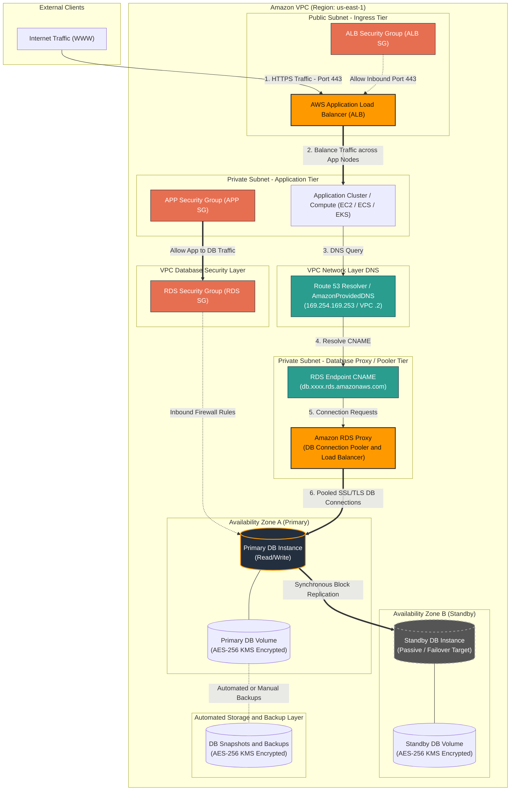
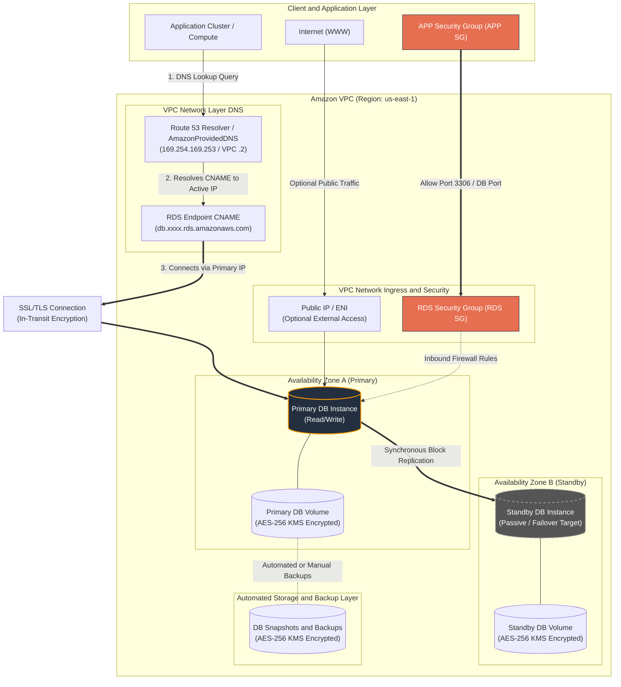
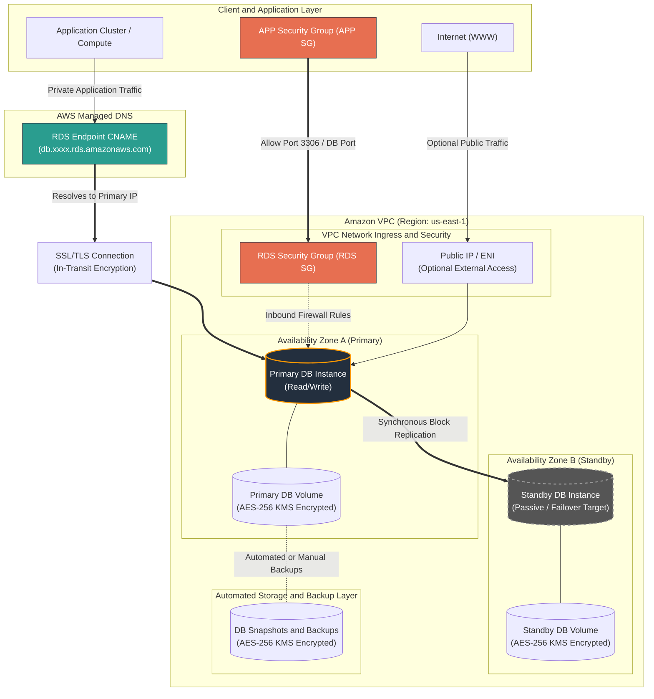
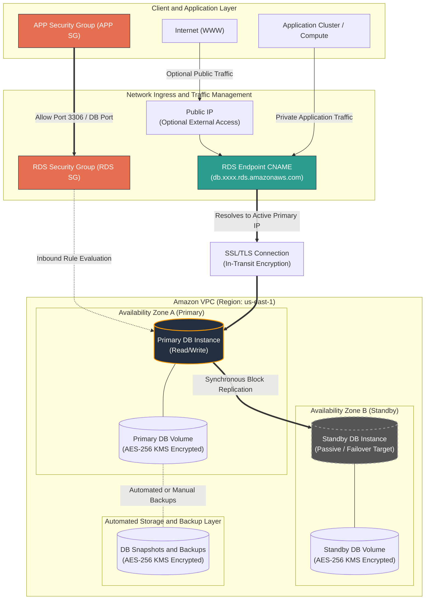
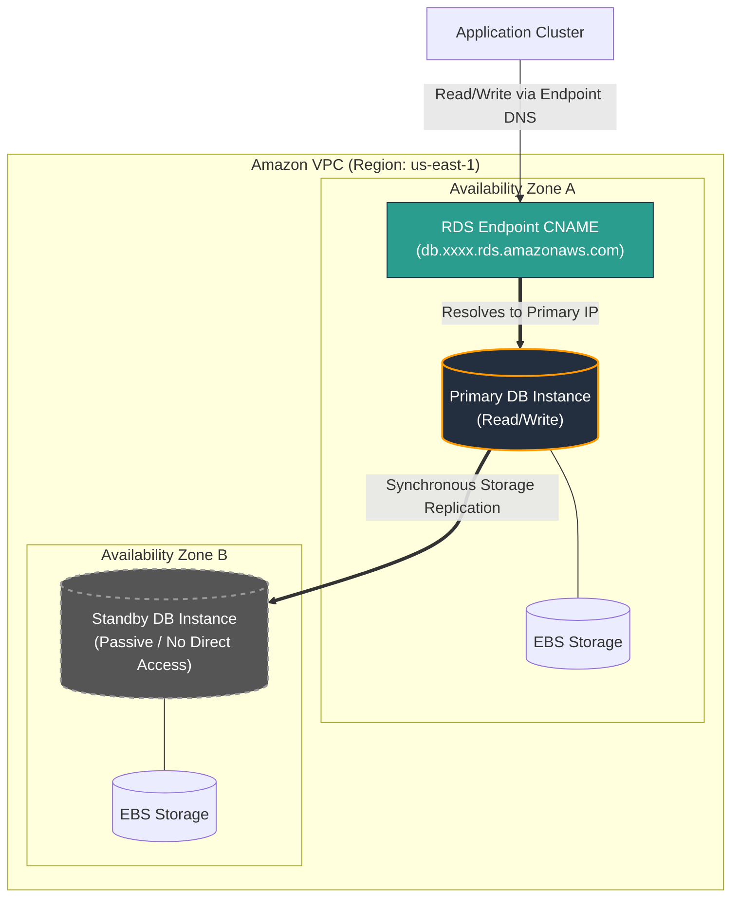
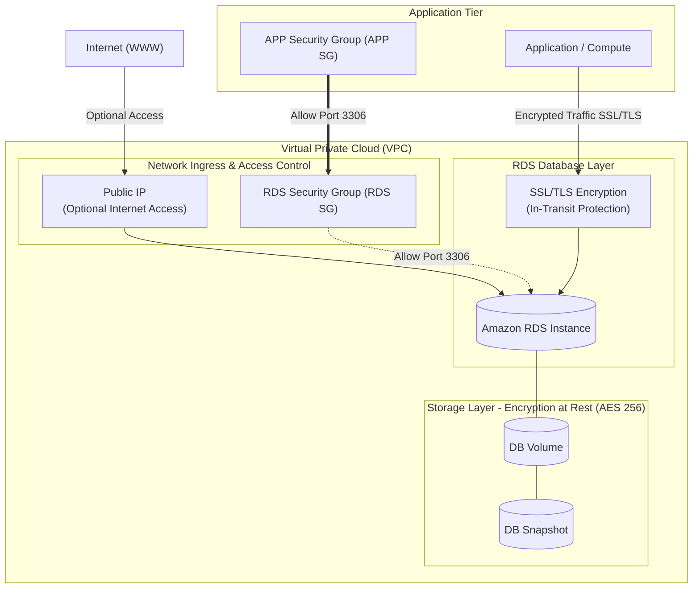

---

---

---

### Key Syntax Adjustments Made:
* Removed spaces between subgraph keys and label brackets (`subgraph ID["Title"]`).
* Replaced literal `&` characters with `and` inside subgraph titles to prevent parser token confusion.
* Standardized edge label delimiters (`|label|`) across all connection paths.
---
---

Combine the followig two mermaid diagram to demonstrate data flow and big pictures of AWS RDS
make sure they are factually correct based on most updated AWS documentaions

