# Diagrams Used in Software Engineering to Understand Data Flow

Software engineers use several kinds of diagrams to understand how data moves through a system. Some focus specifically on **data flow**, while others show data movement as part of broader system behavior, architecture, or interactions.

Below is a practical list, with a small Mermaid example for each.

---

## 1. Data Flow Diagram (DFD)

A **Data Flow Diagram** focuses directly on how data moves between:

- External entities
- Processes
- Data stores
- Other processes

DFDs are especially useful during requirements analysis and system design.

### Example

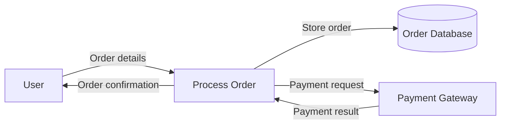

**Best for:** Understanding data movement at a conceptual or logical level.

---

## 2. Context Diagram

A **Context Diagram** is a high-level DFD that treats the entire application as a single process. It shows the system's boundary and the external systems or actors that exchange data with it.

### Example

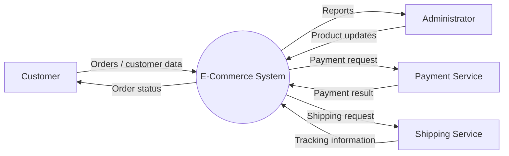

**Best for:** Quickly understanding system scope and external data exchanges.

---

## 3. Levelled DFD

A large DFD can be decomposed into multiple levels. A **Level 0 DFD** breaks the system into major processes, while Level 1, Level 2, etc. progressively decompose those processes.

### Example: Level 0

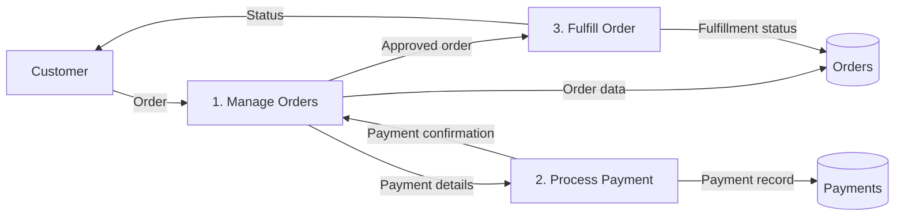

**Best for:** Moving from a high-level view into progressively more detailed data flows.

---

## 4. UML Activity Diagram

A **UML Activity Diagram** models a workflow or business process. Although it is not exclusively a data-flow diagram, it can clearly show how data objects are produced, transformed, and consumed during a workflow.

### Example

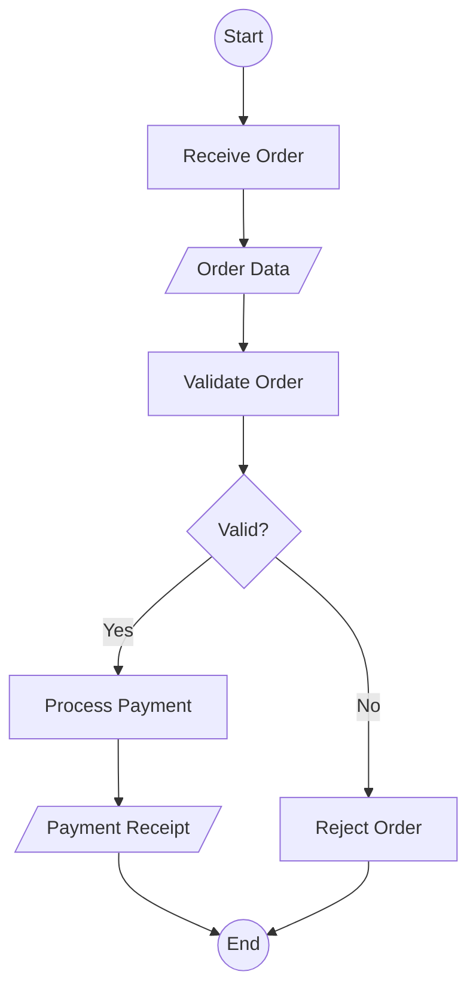

**Best for:** Understanding data as it moves through a business or application workflow.

---

## 5. UML Sequence Diagram

A **Sequence Diagram** shows interactions between components over time. It is useful for understanding **who sends what data to whom, and in what order**.

### Example

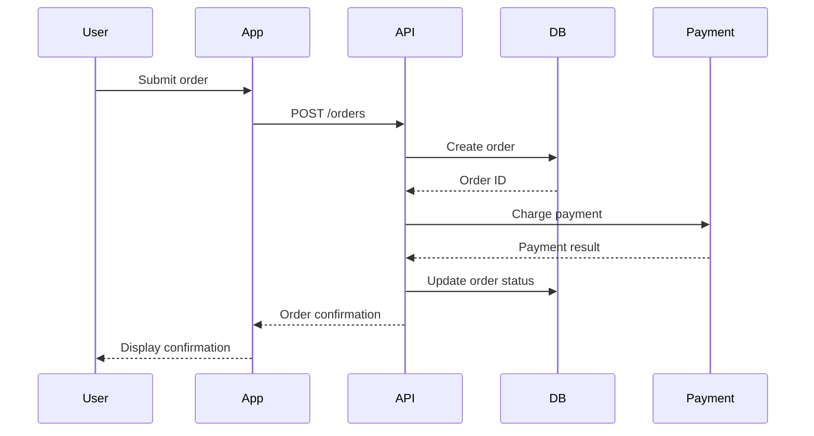

**Best for:** Understanding data exchanges and request/response flows between components over time.

---

## 6. UML Communication Diagram

A **Communication Diagram** (formerly called a Collaboration Diagram) emphasizes the relationships between objects/components and the messages exchanged between them.

It is similar to a sequence diagram, but the emphasis is on **connections and communication structure** rather than a vertical timeline.

### Example

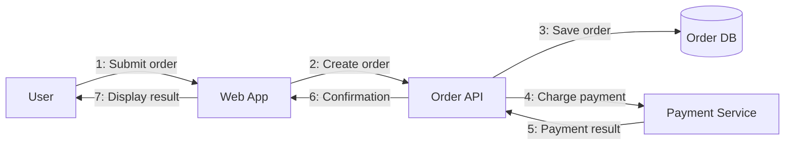

**Best for:** Understanding which components communicate and what messages/data they exchange.

---

## 7. UML State Machine Diagram

A **State Machine Diagram** models how an entity changes state in response to events. Data itself may not be the primary focus, but it is useful when the **state of data changes over its lifecycle**.

### Example

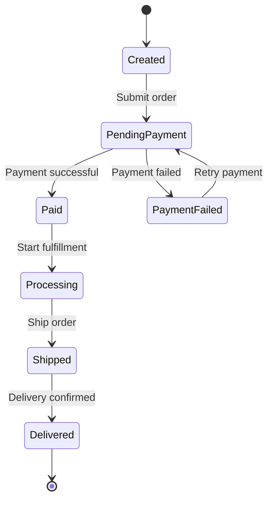

**Best for:** Understanding how an entity's data/state changes as it passes through a system.

---

## 8. Entity-Relationship Diagram (ERD)

An **Entity-Relationship Diagram** focuses on the structure and relationships of data rather than the runtime movement of data.

It is important for understanding where data is stored and how different data entities relate.

### Example

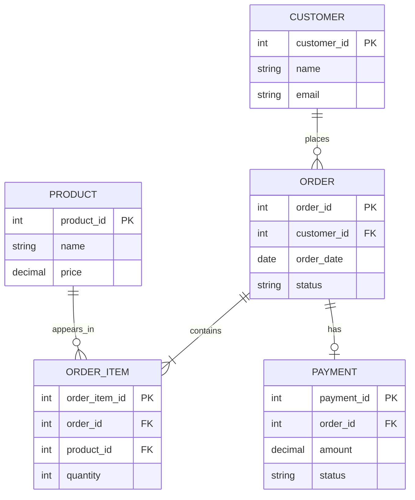

**Best for:** Understanding data storage, relationships, ownership, and database structure.

---

## 9. System / Architecture Data-Flow Diagram

Architecture diagrams can show how data moves between major services, applications, databases, queues, and external systems.

These are particularly useful in distributed systems and microservice architectures.

### Example

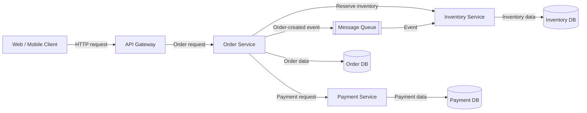

**Best for:** Understanding data movement across services and infrastructure.

---

## 10. Sequence Flow for Event-Driven Systems

For event-driven architectures, an **event-flow diagram** can show how data is published as events and consumed asynchronously by different services.

### Example

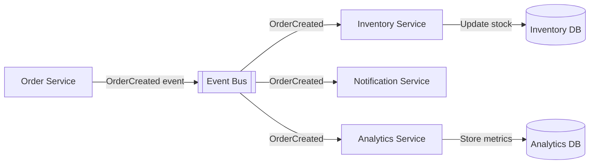

**Best for:** Understanding asynchronous data distribution through events, queues, and message brokers.

---

## 11. ETL / Data Pipeline Diagram

A **data pipeline diagram** shows how data is extracted, transformed, transported, and loaded into another system.

It is particularly common in data engineering, analytics, and machine-learning systems.

### Example

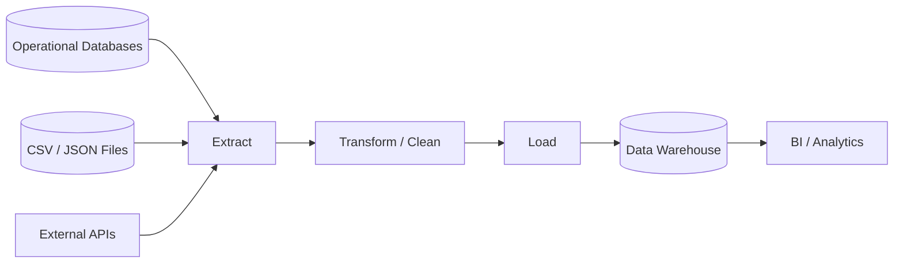

**Best for:** Understanding movement and transformation of data through a data-processing pipeline.

---

## 12. C4 Container Diagram

A **C4 Container Diagram** shows the major applications/services inside a system and how they communicate. It is not specifically a data-flow diagram, but arrows can be annotated with the data or protocols being exchanged.

### Example

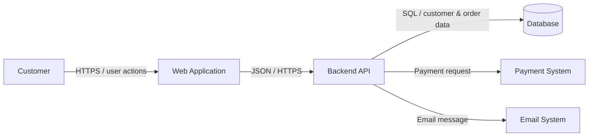

**Best for:** Understanding data movement between major application components.

---

# Comparison

| Diagram | Main Focus | Shows Data Flow? | Typical Use |
|---|---|---:|---|
| **Context Diagram** | System boundary | Yes | System scope |
| **DFD** | Data movement | **Yes — primary purpose** | Requirements & system analysis |
| **Levelled DFD** | Hierarchical data movement | **Yes — primary purpose** | Decomposing complex systems |
| **Activity Diagram** | Workflow/process | Yes | Business/application processes |
| **Sequence Diagram** | Time-ordered interactions | **Yes** | API/component interactions |
| **Communication Diagram** | Component relationships/messages | **Yes** | Object/component communication |
| **State Machine Diagram** | State transitions | Indirectly | Entity lifecycle |
| **ERD** | Data structure/relationships | No, primarily | Database design |
| **Architecture Data-Flow Diagram** | System/service communication | **Yes** | Distributed systems |
| **Event-Flow Diagram** | Event propagation | **Yes** | Event-driven systems |
| **ETL/Data Pipeline** | Data processing pipeline | **Yes — primary purpose** | Analytics/data engineering |
| **C4 Container Diagram** | Software architecture | Yes | Architecture communication |

---

# Which Diagram Should You Use?

A useful rule of thumb is:

```text
What are you trying to understand?
              │
      ┌───────┴────────┐
      │                │
  "Where does       "How does
   data go?"         the system work?"
      │                │
      ▼                ▼
    DFD            Activity Diagram
      │
      ├── System boundary? ──► Context Diagram
      │
      ├── Need more detail? ─► Levelled DFD
      │
      ├── Between services? ─► Architecture Data Flow
      │
      ├── Via events? ───────► Event-Flow Diagram
      │
      └── Through ETL? ──────► Data Pipeline
```

For **database structure**, use an **ERD**.

For **time-ordered communication**, use a **Sequence Diagram**.

For **entity lifecycle/state changes**, use a **State Machine Diagram**.

For **overall software architecture**, use a **C4 diagram**.

## The most important distinction

If the question is specifically:

> **"I want to understand how data flows through my software system."**

Start with a **Context Diagram → DFD → Levelled DFD**.

Then use **Sequence Diagrams** when you need to understand the runtime interaction between components, and **Architecture/Event/Data Pipeline diagrams** when the system becomes distributed or data-intensive.

In other words:

```text
                 System understanding
                         │
             ┌───────────┴───────────┐
             │                       │
       Data perspective        Behavior perspective
             │                       │
             ▼                       ▼
           Context                 Activity
             │
             ▼
            DFD
             │
       ┌─────┼──────────┐
       ▼     ▼          ▼
   Levelled  Event     Pipeline
     DFD     Flow
       │
       ▼
 Architecture
 Data Flow
```
