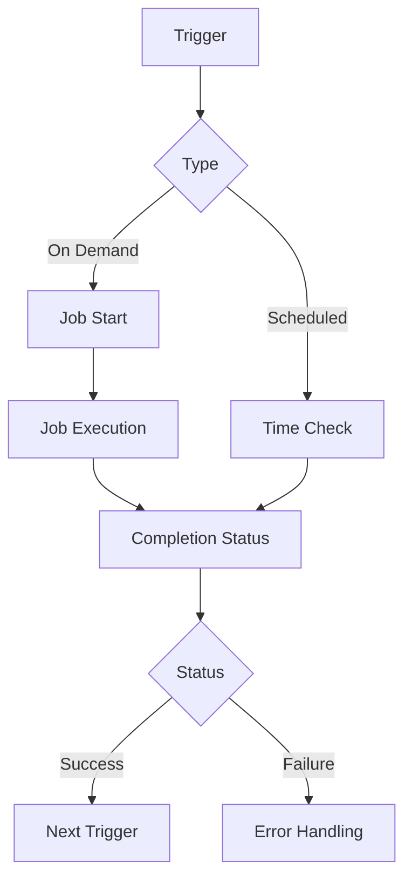

<pre><code class="language-yaml">

    name: example
    version: 1.0
    dependencies:
    - python: ">=3.8"
    - flask: "^2.0"

</code></pre>

<pre> ```yaml name: example version: 1.0 dependencies: - python: ">=3.8" - flask: "^2.0" ``` </pre>

<div style="text-align: center;">
  <pre><code class="language-yaml">
name: example
version: 1.0
  </code></pre>
</div>
