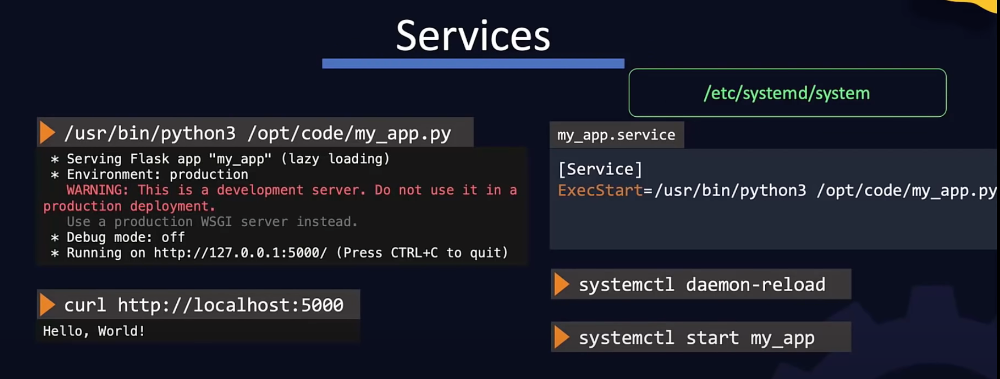
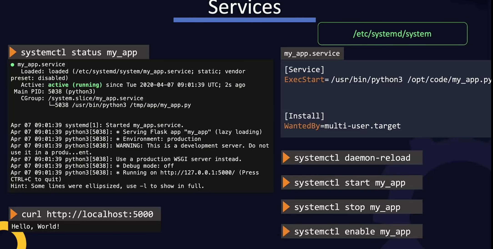
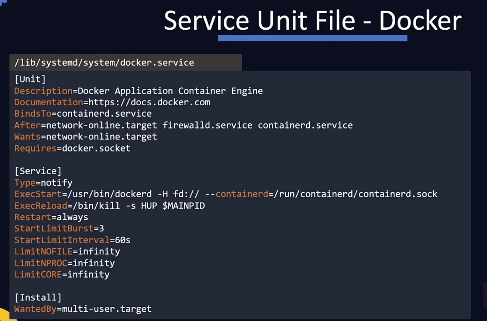

<h1 style="color:red" align="center" >LINUX SHELL:</h1>

-   `$ grep -E '^\[(Developer|ProdSupport)]' ~/.aws/credentials` -> Display Developer and Support profile

-   [Corey Schafer: Linux/Mac Tutorials](https://www.youtube.com/playlist?list=PL-osiE80TeTvGhHkpvfmKWOiIPF8UVy6c)
-   [Introduction to Linux – Full Course for Beginners](https://www.youtube.com/watch?v=sWbUDq4S6Y8)
-   [Learn CentOS](https://www.youtube.com/playlist?list=PLT98CRl2KxKHjHLIHrmmi5FmBGIZ8cNJE)
-   [Linux TV: Linux Crash Course](https://www.youtube.com/playlist?list=PLT98CRl2KxKHKd_tH3ssq0HPrThx2hESW)
-   [Linux](https://www.digitalocean.com/community/tutorials?q=%5BLinux%20Basics%5D)
-   [LinuxHowTo](https://www.linuxhowto.net/)
-   [The 50 Most Popular Linux & Terminal Commands - Full Course for Beginners](https://www.youtube.com/watch?v=ZtqBQ68cfJc&t=119s)
-   [18 Commands That Will Change The Way You Use Linux Forever](https://www.youtube.com/watch?v=AVXYq8aL47Q)

---

-   <details><summary style="font-size:25px;color:Orange">Terms, Concepts & Configs</summary>

    -   **Shell**: A shell is a command-line interpreter that acts as a user interface to interact with the operating system. It interprets user commands and executes them. Shells can be graphical or text-based. Text-based shells are commonly referred to as `Command-line` Shells. Examples of command-line shells include Bash (Bourne Again SHell), Zsh (Z Shell), and PowerShell (for Windows). Shells provide features such as command execution, script interpretation, variable assignment, and control structures. Users interact with the shell by typing commands, and the shell interprets and executes those commands.
    -   **Terminal**: A terminal is a program that provides a text-based interface to interact with the shell. It acts as a window into the shell environment. Terminals can be graphical or text-based. Graphical terminals are often terminal emulators embedded in a graphical user interface (GUI). Text-based terminals may be physical terminals or terminal emulators in a text-based environment. The terminal program communicates with the shell, allowing users to input commands and receive the output. In a graphical environment, you may have multiple terminal windows open, each representing a separate session with the shell.
    -   **Bash**: Bash, short for Bourne Again SHell, is a specific type of shell or command language interpreter. It is a popular shell that is commonly used on Unix-like operating systems, including Linux and macOS. Bash is a powerful and feature-rich shell that provides command-line access to the system.
    -   **Prompt**: The prompt is the text or symbol displayed by the shell to indicate that it is ready to accept commands. The prompt typically includes information such as the current working directory, the username, the hostname, and other details. Users type commands at the prompt to interact with the system.

    -   **Command-Line Argument & Options**:

        -   A command-line argument or parameter is an item of information provided to a program when it is started. A program can have many command-line arguments that identify sources or destinations of information, or that alter the operation of the program.
        -   A command-line option or simply option (also known as a flag or switch) refer to the additional arguments or flags that can be passed to a command or script when it is executed. Options follow the command name on the command line, separated by spaces. A space before the first option is required
        -   There are two types of options in Bash:
        -   `Single Dash (-) Convention`: In the single dash convention, short options are represented by a single dash followed by a single letter. Multiple short options can be combined into a single string. If an option requires an argument, it is specified immediately after the option letter.

            -   `$ ls -a -s -r` -> `-a`, `-s`, and `-r` are short options without arguments.
            -   `$ ls -asr` -> `-asr` is a combination of multiple short options.
            -   `$ grep -i pattern file.txt` -> `-i` is a short option that requires an argument (pattern).

        -   `Double Dash (--) Convention`: In the double dash convention, long options are represented by a double dash followed by a descriptive name. Long options are typically more human-readable and often have an equivalent short option. If an option requires an argument, it is specified with an equal sign (=) or a space.

            -   `$ command --option1 --option2=value --output file.txt`
                -   `--option1` and `--option2` are long options without arguments.
                -   `--option2=value` is a long option with an argument (value).
                -   `--output file.txt` is a long option with an argument (file.txt).

        -   Options can be used in combination with other command-line arguments. For example, in the command `ls -l --all`, both the short option `-l` and the long option `--all` are used together to display a long listing format including all files.
        -   Single-letter options can be combined, e.g., `ls -l -a` can be written as `ls -la`.
        -   Options can be followed by their values, e.g., `grep -i "pattern" file.txt`, where `-i` is an option that makes the search case-insensitive and `pattern` is the value.

    -   **Built-in Commands**: Built-in commands are commands that are an integral part of the Bash shell itself. They are implemented directly within the shell's executable and do not require separate binary files on the system. When you execute a built-in command, it runs directly within the current shell process, which makes them generally faster and more efficient compared to external utilities. Examples of built-in commands include `cd`, `echo`, `pwd`, `export`, `alias`, `history`, `read`, and many others. You can use the type command to check whether a command is a built-in: type command_name.

    -   **Utilities (`External Commands`)**: Utilities, also known as external commands, are separate programs installed on the system that can be executed from within the Bash shell. These utilities are usually located in directories specified in the PATH environment variable, allowing Bash to find and run them. Examples of utilities include common Unix tools like `ls`, `grep`, `sed`, `awk`, `sort`, and others. Unlike built-in commands, utilities are executed in separate processes from the Bash shell. You can use the which command to determine the path of a utility: `which utility_name`.

    -   **Source Vs Execute**:

        -   Execute (`./script.sh`): The execute command is used to run a shell script in a new process, which means it runs the script in a new shell instance separate from the current shell. This can be useful when you want to run a script without affecting the current environment.
        -   Source (`source script.sh`): The source command, on the other hand, is used to run a script in the current shell process. This means that the environment variables and functions defined in the script are available in the current shell after the script is run.

    -   **man <command_name>** & **Command Description Syntax**:

        1. angle brackets for required parameters:
            - EX: `cp <source1> <dest>`
        2. square brackets for optional parameters:
            - EX: `mkdir [-p] <dirname>`
        3. ellipses for repeated items:
            - EX: `cp <source1> [source2 …] <dest>`
        4. vertical bars for choice of items:
            - EX: `netstat {-t| -u}`

    ##### How to set default shell to bash.

    -   `$ cat /etc/shells.` → List out available shells.
    -   `$ chsh -s /bin/bash` → Set the shell to `/bin/bash` for the current user on MacOS only.
    -   `$ usermod -s /bin/bash <username>` → Set the shell to `/bin/bash` for the given user.
    -   `$ exec $SHELL -l` → Reload your shell.
    -   `$ sudo hostnamectl set-hostname AWSEC2 && /bin/bash` -> Set Host name into 'AWSEC2'

    ##### Some important files & directories in Linux distributions.

    -   `$ cat /etc/redhat-release`
        -   The `/etc/redhat-release` file is specific to Red Hat-based Linux distributions, such as Red Hat Enterprise Linux (RHEL), CentOS, and Fedora. It is used to provide information about the specific version and variant of the Red Hat-based distribution.
        -   The content of the `/etc/redhat-release` file typically includes the release name or version number along with additional details that help identify the distribution.
    -   `$ cat /etc/os-release`
        -   The `/etc/os-release` file is a standard file present in many Linux distributions that provides information about the operating system release and version.
    -   `$ cat /etc/passwd`
        -   The /etc/passwd file is a standard system file found in Unix-like operating systems.The `/etc/passwd` file is used by the system during the login process to authenticate users and determine their default settings.
    -   `$ cat /etc/sudoers.d`

        -   If you need to make changes to the sudo configuration, it's generally recommended to add your modifications in separate files within the /etc/sudoers.d/ directory rather than directly modifying the main sudoers file. This approach allows for better management and easier maintenance of the sudo configuration.
        -   `$ sudo visudo -f /etc/sudoers.d/custom_sudo_file_name`

        ```txt
        # /etc/sudoers.d/custom_sudo_file_name
        username ALL=(ALL) NOPASSWD: /path/to/command
        ```

    -   `$ cat /etc/group` -> list all the groups.

    -   `$ cat /etc/sudoers`

        -   It is a system file and requires root or administrative privileges to edit.
        -   The sudoers file uses a specific syntax and should be edited using the `visudo` command, which provides a basic syntax check before saving the changes. The file format is strict, and `any errors can render sudo unusable`.

        -   `Mohammed ALL=(ALL) NOPASSWD:ALL`

            -   `Mohammed`: This is the username for which the sudo privileges are granted.
            -   `ALL=(ALL)`: This specifies the scope of the sudo privileges. In this case, it allows the user to run commands as any user (ALL) and from any host (ALL).
            -   `NOPASSWD:ALL`: This directive allows the user to run any command with sudo privileges without being prompted for a password. It bypasses the usual password authentication requirement for executing sudo commands.

        -   `Mohammed   ALL=(ALL:ALL) ALL`

            -   `ALL=(ALL:ALL)`: This specifies the scope of the sudo privileges. In this case, it allows the user to run commands as any user (ALL) and from any host (ALL).

            -   `User Specification`: A user specification line defines the users or groups to whom a set of permissions is granted. The syntax is as follows:

                -   `user_or_group`: Specifies the user or group name.
                -   `hosts`: Defines the hosts or machines on which the permissions apply. It can be ALL for all hosts or a specific hostname.
                -   `runas_user`: Specifies the user as whom the commands should be executed. It can be ALL for any user or a specific username.
                -   `commands`: Indicates the commands or command patterns that are allowed. It can be a specific command, a directory, or a wildcard pattern.

            -   `Permissions`: The permissions granted to users or groups can vary. Some common ones include:

                -   `ALL`: Grants all permissions, allowing the user or group to execute any command as any user.
                -   `NOPASSWD`: Allows users to execute commands without entering a password.
                -   `ALL=(ALL:ALL)`: Grants full root-level permissions to execute any command.

            -   `Commenting`: Lines starting with a `#` character are considered comments and are ignored.

        -   The `/etc/sudoers` file is a system configuration file found in Unix-like operating systems, including Linux. It controls the access and privileges granted to users or groups for executing commands with administrative or root-level permissions using the sudo command.
        -   The `/etc/sudoers` file is typically edited using the visudo command, which provides a safe way to modify the file while avoiding syntax errors that could potentially lock out users from using sudo.
        -   The `/etc/sudoers` file consists of rules in the form of lines, with each line specifying a user or group and the corresponding permissions granted. Here are some important concepts and syntax used in the `/etc/sudoers` file:
        -   The `/etc/sudoers` file allows system administrators to define fine-grained access control and delegation of privileges to non-root users. It provides a secure way to grant limited administrative capabilities to trusted users, reducing the need for them to log in as the root user.

    -   `$ cat /etc/hosts`

        -   The `/etc/hosts` file is a plain text file found in Unix-like operating systems, including Linux. It acts as a local DNS (Domain Name System) resolver and allows the system to map hostnames to IP addresses without relying on external DNS servers.
        -   The `/etc/hosts` file contains a list of entries in the form of IP address and hostname pairs.

    -   `$ cat /etc/ssh/sshd_config` → SSH Clint Configuration File
    -   `$ cat /etc/services`

    ##### Bash Utilities

    -   `$ man command_name`
    -   `$ help enable`
    -   `$ enable -a`
    -   `$ tree`
        -   `$ tree -d` → List directories only.
        -   `$ tree -l` → Follow symbolic links like directories.
        -   `$ tree -f` → Print the full path prefix for each file.
        -   `$ tree -P *.py` → List only those files that match the pattern given.
        -   `$ tree -P git | grep git` →
        -   `$ tree -L level dir` → Descend only `level` directories deep.
            -   `$ tree -L 2 $NTHUB` → Descend only level directories deep.
        -   `$ tree -f $NTHUB`
        -   `$ tree -x $NTHUB` → Stay on current filesystem only.

    -   `compgen`: It is a built-in command used for generating completions, which means it helps in completing commands, keywords, and other items while using the command-line interface. It is often used in shell scripts or by advanced users who want to interactively explore available commands and options. The compgen command has several options to generate completions for different types of items: - `$ compgen -k`: Lists all keywords that are recognized by the shell. Keywords are reserved words that have special meaning in the shell language. - `$ compgen -b`: Lists all the built-in shell commands. These are commands that are part of the shell itself and don't require external programs. - `$ compgen -v`: Lists all the names of variables currently defined in the shell. - `$ compgen -a`: Lists all the aliases defined in the current shell session. - `$ compgen -c`: Lists all the commands and utilities (built-in and external) available in the current shell session. - `$ compgen -A function`: Lists all the names of user-defined functions available in the shell. - `$ compgen -A function -abck`: Combines multiple options to list all the available completions for commands, built-ins, and keywords.

    </details>

---

-   <details><summary style="font-size:25px;color:Orange">Basic Bash Commands</summary>

    ##### FILE/DIRECTORY COMMANDS

    -   `ls -l -a -r`
    -   `$ mkdir <dirname>` → Makes a new directory
    -   `$ rmdir <dirname>` → Remove an empty directory
    -   `$ rmdir -rf <dirname>` → Remove a non-empty directory
    -   `$ mv <dir1> <dir2>` → Rename a directory from <dir1> to <dir2>
    -   `$ cd <dirname>` → Changes directory
    -   `$ cp -r <dir1> <dir2>` → Copy <dir1> into <dir2> including sub-directories
        -   `$ cp dir1/* dir2/`
        -   `$ cp dir1 dir2/`
    -   `$ pwd` → Tells you where you currently are
    -   `$ cd` → Changes to home directory.
    -   `$ cd ..` → Changes to the parent directory.
    -   `$ cd ~` → Changes to home directory.
    -   `$ cd /` → Changes to root directory.
    -   `$ cd -` → Changes to previous directory.

    ##### BASH BASICS

    -   `$ env` → Displays all environment variables
    -   `$ echo $SHELL` → Displays the shell you're using
    -   `$ echo $BASH_VERSION` → Displays bash version
    -   `$ unset VARIABLE_NAME` → Unset the given variabel - 'VARIABLE_NAME'
    -   `$ bash` → If you want to use bash (type exit to go back to your previously opened shell)
    -   `$ whereis bash` → Locates the binary, source and manual-page for a command
    -   `$ which bash` → Finds out which program is executed as 'bash' (default: /bin/bash, can change across environments)
    -   `$ whoami` → Returns your username
    -   `$ passwd` → Lets you change your password
    -   `$ clear` → Clears content on window (hide displayed lines)

    ##### find

    -   `$ find -type f -name *.gdoc`
    -   `$ find . -name <name> <type>`
    -   `$ find . -type d -name .venv`

    -   `$ find . -type l` → Find all the links recursively from given directory
    -   `$ find $(pwd) -maxdepth 1 -type f -not -path '_/\._' | sort`

    -   `$ find . -maxdepth 1 -type f -not -path '_/\._' | sed 's/^\.\///g' | sort`

        -   `.` : current folder
        -   remove `-maxdepth 1` to search recursively
        -   `-type f `: find files, not directories (`d`)
        -   `-not -path '*/\.*'` : do not return `.hidden_files`
        -   `sed 's/^\.\///g'` : remove the prepended `./` from the result list

    -   `$ find . -type f -name *node_modules -ls -delete`

        -   Delete all FILE by the pattern '\*node_modules' recursively.

    -   `$ find . -type d -name ${1:-*.venv} -exec rm -rf {} +`

        -   Delete all FOLDER by the pattern '.venv' recursively.


    ##### rsync

    ```bash
    rsync -avz \                            # run in archival and vervose mode
        --delete \                          # delete any files in the destination folder that do not exist in the source folder.
        --exclude '.venv' \
        --rsh="ssh -i ~/.ssh/id_rsa user@remote_server:/src_path target_path"
            # make sure `id_rsa` file generated and coppied `id_rsa.pub` into remote server
    ```

    -   `$ rsync -avz --rsh="ssh -i ~/.ssh/mos01_to_mos02 $HOME/gd/ a.momin@mos02.local:~/gd/`
    -   `$ rsync -avz --rsh="ssh -i ~/.ssh/mos01_to_mos02 $HOME/gd/ a.momin@mos02.local:/Volumes/MOMIN_DRIVE/gd/`
    -   `$ rsync -avz --rsh="ssh -i ~/.ssh/mos01_to_mos02 $HOME/gd/Software_Development/ a.momin@mos02.local:/Volumes/MOMIN_DRIVE/gd/Software_Development/`
    -   `$ rsync -av --exclude '.venv' --exclude '.ipynb_checkpoints' --exclude '.egg-info' --exclude '__pycache__' $HOME/gd/Software_Development/Algorithms_and_Data_Structures a.momin@mos02.local:/Volumes/MOMIN_DRIVE/gd/`


    ##### curl

    -   [curl](https://www.hostinger.com/tutorials/curl-command-with-examples-linux/)
    -   [Using Curl and Telnet Command To Make HTTP Requests](https://www.youtube.com/watch?v=cn3u7-dP3S0)
    -   [Telnet vs SSH Explained](https://www.youtube.com/watch?v=tZop-zjYkrU)
    -   [Ubuntu: How to build curl with the latest openssl? (6 Solutions!!)](https://www.youtube.com/watch?v=DEBuN-80cuU&t=37s)

    -   `$ curl -vvv localhost:8000` → Simple get request.
    -   `$ curl -vvv http://www.google.com` → Simple get request.
    -   `$ curl –data “text=Hello” https://myDomain.com/firstPage.jsp` → Simple post request
    -   `$ curl -x  sampleproxy.com:8090 -U username:password -O http://testdomain.com/testfile.tar.gz`
    -   `$ curl --request POST --url http://localhost:8000/ --header 'content-type: image/jpeg' --data-binary @'/path/to/image.jpeg'`
    -   `$ curl -u username:password -O https://example.com/path/to/file.zip`
    -   `$ curl https://path/py_script.py > $NTHUB/dotfiles/blocking.py`
    -   `$ telnet www.google.com 80`


    ##### jq

    -   To process JSON data efficiently, Linux provides a command-line tool called jq. This powerful tool enables users to extract, manipulate, and transform JSON data with ease. With jq, users can quickly perform a wide range of tasks on JSON data, including filtering, sorting, and selecting specific fields.


    ##### Archive

    -   **wget:**

        -   `$ wget -O ~/Data/my-file.csv http://file-to-download.csv` → download `file-to-download.csv` and save it as `my-file.csv` instead of `file-to-download.csv` into `~/Data`. (`-O`, Output)
        -   `$ wget -P ~/Data http://file-to-download.csv` → download `file-to-download.csv` into `~/Data` directory ( '`-P` to prefix directory path)
        -   `$ wget --directory-prefix=~/Data --output-document=my-file.csv http://file-to-download.csv` →

    -   [tar](https://linuxhint.com/linux-tar-command/)

        -   `$ tar xvf ~/Data/file-to-untar.tar -C ~/Download` → Untar `file-to-untar.tar` and save it into `~/Download` directory.
        -   `$ tar --list -f tar_file_name.tar.gz` →

    -   [zip/unzip](https://www.hostinger.com/tutorials/how-to-unzip-files-linux/)

        -   `$ unzip ~/Data/filename.zip -d ~/Data` → To unzip a ZIP file to a different directory than the current one, use the -d switch
        -   `$ unzip -l *.whl` →
        -   `$ gzip <filename>` → Compresses files using gzip algorithm
        -   `$ gunzip <filename>` → Uncompresses files compressed by gzip
        -   `$ gzcat <filename>` → Lets you look at gzipped file without actually having to gunzip it


    ##### Symbolic Links

    -   symbolic links (also known as “soft links” or “symlinks”): Refer to a symbolic path indicating the abstract location of another file.
    -   hard links : Refer to the specific location of physical data.

    -   `$ ln -s path/source_file_name.extn` → Create a symlink for the source file into current directory.
    -   `$ ln -s path/source_folder_name` → Create a symlink for the source folder into current directory.
    -   `$ ln -sf absolute_path/source_file absolute_path/target_file` → Create a symlink for the source file into target file.


    ##### sed (Stream Editor)

    -   `$ visudo` → Open `/etc/sudoers` in vim
    -   `$ sed -i '$ a Shah ALL=(ALL) NOPASSWD: ALL' /etc/sudoers` → gives the user `Shah` the ability to use sudo without a password prompt.


    ##### diff

    -   [The diff Command](https://www.youtube.com/watch?v=qLRQspQxvFk)
    -   `$ diff -u file1 file2` → The `-u` option produces a unified diff output, which includes additional context lines around the differences to provide better readability.
    -   `$ diff -w file1 file2` → The `-w` option tells diff to ignore whitespace differences, such as spaces or tabs.
    -   `$ diff -qr dir1 dir2` → The `-q` option displays only whether the files differ or not, while the `-r` option performs a recursive comparison of the directories.
    -   `$ diff `


    ##### htop

    -   [Linux Crash Course - htop](https://www.youtube.com/watch?v=tU9cO9FwDx0)


    </details>

---

-   <details><summary style="font-size:25px;color:Orange">SSH: Usage, Options, Configuration</summary>

    -   [Documents](https://www.ssh.com/academy/ssh/command#ssh-client-configuration-file) || [SSH: Usage, Options, Configuration](https://www.ssh.com/academy/ssh/command#ssh-client-configuration-file) || [SSH Agent Explained](https://smallstep.com/blog/ssh-agent-explained/)

    -   SSH (Secure Shell or Secure Socket Shell), SSH Agent, and SSH Client are all components of the SSH protocol, but they have different roles and functions.
    -   **SSH**: SSH is a network protocol that gives users, particularly system administrators, a secure way to access a computer over an unsecured network.
    -   **SSH Clint**: An SSH client is a software program that allows you to connect to a remote server using the Secure Shell (SSH) protocol. An SSH client can interact with an SSH agent to perform passwordless authentication to remote servers, which can be more convenient and secure than using a password.
    -   **SSH Agent**: SSH Agent is a utility that allows a user to store and use private keys for SSH authentication, without having to re-enter the passphrase for each use. It runs as a background process on the user's local system, holding the private key in memory and responding to authentication requests from remote systems.

        -   `How it Works`:

            -   You add a private key to the SSH Agent:
                ```sh
                ssh-add ~/.ssh/id_rsa
                ```
            -   The SSH Agent securely stores the key in memory.
            -   When you initiate an SSH connection, the agent provides the key for authentication automatically.

        -   `config`: The `~/.ssh/config` file on unix is a user-specific SSH configuration file. It allows you to define shortcuts and settings for SSH connections, saving time and reducing repetitive command-line options.

    -   **OpenSSH**: OpenSSH is a free and open-source implementation of the SSH protocol, including both the client and server programs. It is one of the most widely used SSH implementations in the world and is included with many operating systems.

    -   **authorized_keys**:
        -   The `authorized_keys` file resides on the SSH server and contains a list of public keys that are authorized to access a particular user's account.
        -   When an SSH client attempts to authenticate with the server using public key authentication, the server checks if the client's public key is present in the `authorized_keys` file for the user account being accessed. If the client's public key is found in the `authorized_keys` file and the corresponding private key is used for authentication by the client, the authentication is successful, and the client gains access to the server. Otherwise, the authentication fails.
    -   **known_hosts**:

        -   The `known_hosts` file stores host keys for all hosts that an SSH client has previously connected to.
        -   When an SSH client connects to a server for the first time, it saves the server's public key in `it's` `~/.ssh/known_hosts` file.
        -   For subsequent connections, the client checks if the server's public key matches the entry in its `known_hosts`.

    -   **sshd_config**: The file `/etc/ssh/sshd_config` is a configuration file used by the OpenSSH server (sshd) on Linux systems.

        -   `$ cat /etc/ssh/sshd_config` → List out SSH Clint Configurations.

    -   **ssh-keygen:**

        -   `$ ssh-keygen -t rsa -f ~/.ssh/<KEY_FILENAME> -C [USERNAME]` → Generate a rsa key with file-name `KEY_FILENAME` and username `USERNAME`.
        -   `$ ssh-keygen -t rsa -f ~/.ssh/ghub_amomin -C A.Momin.NYC@gmail.com` → Generate a rsa key with file-name `KEY_FILENAME` and username `USERNAME`.
        -   `$ ssh-keygen -t rsa -f ~/.ssh/ghub_bbcredcap3 -C bbcredcap3@gmail.com` → Generate a rsa key with file-name `KEY_FILENAME` and username `USERNAME`.
        -   `$ ssh-keygen -t rsa -f ~/.ssh/<KEY_FILENAME> -P passphrase` → Example 1: `$ ssh-keygen -f ~/.ssh/file_name -t rsa -P ""`
        -   `$ ssh-keygen -y -f aws-ht.pem` -> It outputs the corresponding public key on the terminal.

    -   **ssh-add:**

        -   `$ ssh-add ~/.ssh/ghub_amomin` → In order not to have prompted passphrase at login, cache the passphrase into 'ssh-agent' if you generate a key with passphrase.
        -   `alias sshadd='eval $(ssh-agent) && ssh-add'` → Create alias to cache passphrase since `ssh-add` is temporary for a shell session.
        -   `$ ssh-add -K ~/.ssh/id_rsa` → Add your SSH private key to the `ssh-agent` and store your passphrase in the keychain. The -K option is Apple's standard version of ssh-add, which stores the passphrase in your keychain for you when you add an ssh key to the ssh-agent. If you chose not to add a passphrase to your key, run the command without the -K option.
        -   `$ ssh-add --apple-use-keychain ~/.ssh/ghub_amomin02`
        -   `$ cat ~/.ssh/file_name.pub >> ~/.ssh/authorized_keys`
        -   `$ cat ~/.ssh/id_rsa.pub >> ~/.ssh/authorized_keys`
        -   `$ pbpaste | sort | uniq | pbcopy`
        -   `$ pbcopy < ~/.ssh/id_rsa.pub` → Copies the contents of the id_rsa.pub file to your clipboard in MacOS


        **ssh:**

        -   `$ ssh user@host` → Connects to host as user
        -   `$ ssh -i ~/.ssh/aws-ht.pem ubuntu@54.156.211.234` → Connects to host as user
        -   `$ ssh -i ~/.ssh/mos01_to_mos02.pub a.momin@mos02.local`
        -   `$ ssh A.Momin@mos02.lan`
        -   `$ ssh A.Momin@mos02.local`
        -   `$ ssh farzana@mos02.local`
        -   `$ ssh ubun 'cat >> ~/.ssh/authorized_keys' < ~/.ssh/id_rsa.pub`
        -   `$ ssh -o StrictHostKeyChecking=no -i ~/.ssh/aws-ht.pem ubuntu@54.156.211.234 'cat >> ~/.ssh/authorized_keys' < ~/.ssh/id_rsa.pub` -> Appends the contents of your local `~/.ssh/id_rsa.pub` public key to the `~/.ssh/authorized_keys` file on the remote machine.

            -   `< ~/.ssh/id_rsa.pub` -> Redirects the contents of your local public key file (`id_rsa.pub`) as input to the remote `cat` command.
            -   `-o StrictHostKeyChecking=no` -> Disables strict host key checking. This option ensures that SSH does not prompt for confirmation if the host's key is not already in your known_hosts file. Useful for automation, but use with caution for security reasons.

        -   `$ ssh -i ~/.ssh/id_rsa user@hostname 'bash -s' < local_machine/path/to/script.sh`
            -   `'bash -x -s'`
                -   Runs a bash shell on the remote machine.
                -   The `-s` option tells bash to read commands from standard input (in this case, the content of your local script).
                -   `-x` enables verbose logging for easier debugging.
        -   `$ ssh user@remote_host 'bash -s' < script.sh`
        -   `$ `

    -   **scp:**

        -   `$ scp -i /path/to/private_key_file source_file user@remote_host:/path/to/destination` →
        -   `$ scp -r /local/directory/ username@to_host:/remote/directory/` → Copy directory from local host to a remote hos SCP example
        -   `$ scp file.txt username@to_host:/remote/directory/` → Copy file from local host to a remote host
        -   `$ scp file.txt rhel:/home/ec2_user_name` → 'rhel' is node name configured in `~/.ssh/config` file.
        -   `$ scp -r rhel:/home/ec2-user/file.txt /local_machine/directory/` → scp the entire directory from remote machine to local machine

    -   **ssh-copy-id:**

        -   `$ ssh-copy-id -i ~/.ssh/puplic_ssh_key.pub user@host` → Adds your ssh key to host for user to enable a keyed or passwordless login
            -   `$ ssh-copy-id ~/.ssh/puplic_ssh_key.pub shah@10.0.0.4`
            -   `$ ssh-copy-id -i ~/.ssh/mos01_mos02.pub a.momin@mos02.local`

    -   **ssh-keyscan:**

        -   `$ ssh-keyscan -H rhel >> /var/lib/jenkins/.ssh/known_hosts`

    -   **sshpass:**

        -   `$ sshpass -p <password> scp [options] [source] [destination]`
        -   `$ sshpass -p am5202844 scp data/demofile.txt a.momin@mos02.local:/Users/a.momin/Data/`

    </details>

---

-   <details><summary style="font-size:25px;color:Orange">File Permission</summary>

    -   [chmod:](https://en.wikipedia.org/wiki/Chmod)

        -   File permission system: `r=4,w=2,x=1` first, second, and third place of 3-digits representation for **Owner**, **Group**, and **Public** respectively

        -   `sudo chmod 664 <file_or_dir_name>`

            -   gives read and write previlage to User and Group and only read previlage to public.

        -   `sudo chmod g+w <file_or_dir_name>`

            -   add (`+`) write (`w`) privilege to group (`g`)

        -   `sudo chmod +x <file_name>`

            -   makes the file_name executible.

        -   `$ chmod 1755 findReslts.sh`
            -   sets sticky bit, sets read, write, and execute permissions for owner, and sets read and execute permissions for group and others (this suggests that the script be retained in memory)
        -   `$ chmod 4755 setCtrls.sh`
            -   sets UID, sets read, write, and execute permissions for user, and sets read and execute permissions for Group and Others
        -   `$ chmod 2755 setCtrls.sh`
            -   sets GID, sets read, write, and execute permissions for user, and sets read and execute permissions for Group and Others
        -   🔥 `sudo chmod -R u+rwX,g-rwx,o-rx <file_or_dir_name>`
            -   Recursively adds (`+`) read (`r`), write (`w`), and special execution (`X`) permissions for user (`u`), and removes (`-`) read (`r`), write (`w`), and execution (`x`) permissions for Group (`g`), and removes (`-`) read (`r`) and execution (`x`) permissions for Others

    -   **Set/Sticky Bit**: The set bit, also known as the "sticky bit" or "SUID" (Set User ID) bit, is a special permission that can be set on executable files or directories in Unix-like systems. It changes the behavior of the file or directory when it is executed or accessed by users.

        -   **For executable files**:

            -   When the set bit is set on an executable file, it becomes a **setuid** file. This means that when any user runs the executable, the process will run with the effective user ID (UID) of the file's owner, rather than the UID of the user executing it. In other words, the process gains the privileges of the file's owner while it is running.

        -   **For directories**:

            -   When the set bit is set on a directory, it becomes a "sticky directory." In this context, the sticky bit has a different meaning than when applied to files. For sticky directories, it restricts the ability to delete or rename files within the directory to only the owner of the file, the owner of the directory, and the superuser.

        -   **a set bit can take one of the following numeric values**:

            -   Setuid (SUID) bit on an executable file: The value is 4 (in octal notation) or 100 (in binary). When the SUID bit is set on an executable file, it becomes a "setuid" file, and any user executing the file will have the process run with the effective user ID (UID) of the file's owner.

            -   Setgid (SGID) bit on an executable file or directory: The value is 2 (in octal notation) or 010 (in binary). When the SGID bit is set on an executable file, it becomes a "setgid" file. Similarly, when set on a directory, it becomes a "setgid" directory. The exact behavior of setgid on directories might vary depending on the operating system and filesystem.
                -   When the setgid bit is set on an executable file, any user executing the file will have the process run with the effective group ID (GID) of the file's group, rather than their own primary group. This means that the process gains the privileges of the group associated with the file while it is running.
                -   When the setgid bit is set on a directory, any new files or subdirectories created within that directory will inherit the group ownership of the parent directory, rather than the group ownership of the user creating the file. This is particularly useful in collaborative environments where multiple users need to work on the same set of files and ensure they all belong to the same group.
            -   Sticky bit on a directory: The value is 1 (in octal notation) or 001 (in binary). When the sticky bit is set on a directory, it becomes a "sticky directory." The sticky bit on directories restricts the ability to delete or rename files within the directory to only the owner of the file, the owner of the directory, and the superuser.

    -   [chown](https://linuxize.com/post/linux-chown-command/)

        -   `$ chown [OPTIONS] USER[:GROUP] FILE(s)`
        -   `$ sudo chown :group file`
        -   `$ sudo chown :docker file1.txt`
            -   Change the group owner of file1.txt to docker.
        -   `$ chown -R jenkins:jenkins /var/lib/jenkins/.ssh`
            -   give the ownership of `/var/lib/jenkins/.ssh` to `jenkins` user and `jenkins` group
        -   `$ chown -R www-data: /var/dir`
            -   Change the ownership of all files and subdirectories under the /var/dir directory to a new owner and group named www-data
        -   `$ chown www-data: symlink1`
            -   Change the ownership of the file or directory the symlink points to
        -   `$ chown -h www-data symlink1`
            -   Change the group ownership of the symlink itself, use the -h option.

    -   [chgrp](https://linuxize.com/post/chgrp-command-in-linux/)

        -   `$ chgrp [OPTIONS] GROUP FILE..`
            -   EX: `$ chgrp OPTION group_name /path/to/file_or_directory`
            -   The group_name attribute represents the new group name that the file or directory will acquire. Additionally, you can specify the GID (group ID) instead of the group name. In that case, you need to append the GID with a plus sign (+).
        -   `$ chgrp -R www-data /var/www`
        -   `$ chgrp www-data symlink1`
            -   If you try to change the group of the symbolic link symlink1 that points to /opt/file1, chgrp will change the ownership of the file or directory the symlink points to:
        -   `$ chgrp -h www-data symlink1`
            -   To change the group ownership of the symlink itself, use the `-h` option
        -   `$ chgrp -hR www-data /var/www`
            -   Change the group ownership recursively including symbolic links, pass the `-h` option

    </details>

---

-   <details><summary style="font-size:25px;color:Orange">Managing Users & Groups</summary>

    -   `$ cut -d: -f1 /etc/passwd` → get the list of all users
        -   The `-d` option specifies the delimiter (in this case, a colon)
        -   The `-f` option specifies the field to extract (in this case, the first field which is the username).
    -   `$ `

    -   **useradd**

    -   `$ su user_name` → Switch/set/substitute user into the given user_name.
    -   `$ su Farzana --login` → Log into a user Farzana's profile.
    -   `$ sudo su -` → How to become sudo user in RHEL/Ubuntu.
    -   `$ useradd [OPTIONS] USERNAME`
    -   `$ sudo useradd username`
    -   `$ sudo passwd username` → To be able to log in as the newly created user, you need to set the user password.

    ```bash
    sudo useradd \
        -m \                        # to create the user home directory as /home/username
        -d /path/username \         # If you want to create the user’s home directory in other location
        -u 1500 \                   # to create a user with a specific UID. (verify: `id -u username`)
        -g group_name \             # set the login group to (Verify: `id -gn username`)
        -G sudo,admins \            # You to specify a list of supplementary groups which the user will be a member of
        -s /usr/bin/bash \          # allows you to specify the new user’s login shell. (verify: `grep username /etc/passwd`)
        -c "Test User Account" \    # option allows you to add a short description for the new user. Typically the user’s full name or the contact information are added as a comment.
        username
    ```

    -   `$ useradd -D` # To view the current default options for `useradd` (`/etc/default/useradd`)
    -   `$ `
    -   `$ `

    -   **usermod**
    -   `$ usermod -aG sudo user_name` → add user_name to the sudo user; login as root user to do that
    -   `$ sudo usermod -aG admins,sudo Shah` # -a (append); -G(group); sudo (a group)
    -   `$ sudo usermod -d /home/myhome --move-home SHAH` → move the home directory of 'Shah' user into the ne location.
    -   `$ sudo usermod -l new_user_name not_current_user_name` → Change Username from 'not_current_user_name' to 'new_user_name'
    -   `$ sudo usermod -L user_name` → Lock a user
    -   `$ sudo usermod -U user_name` → Unlock a user
    -   `$ sudo usermod  Shah -e 2024-01-10` → Expire the password for the gieven user on the given date.
    -   `$ sudo usermod  Shah` →

    -   `$ sudo groupadd admins` →
    -   `$ groups user_name` →
    -   `$ chage -l username` → Show account aging information for the given user
    -   `$ ` →

    -   **Group Management:**

    -   `$ cat /etc/group` → To view all groups present on the system
    -   `$ getent group` -> list all the groups.
    -   `$ cat /etc/group` -> list all the groups.
    -   `$ groups` -> list all the groups.
    -   `$ groups user_name`
    -   `$ sudo groupadd group_name`
    -   `$ sudo groupdel group_name`
    -   `$ sudo gpasswd -a user_name group_name`

    </details>

---

-   <details><summary style="font-size:25px;color:Orange">Systemd & Service Management</summary>

    -   [How To Use Systemctl to Manage Systemd Services and Units](https://www.digitalocean.com/community/tutorials/how-to-use-systemctl-to-manage-systemd-services-and-units)


    -   <details><summary style="font-size:25px;color:#C71585">Terminology</summary>

        #### **System Services:**

        In Linux, a system service is a program or process that runs continuously in the background and provides some kind of functionality or service to the operating system or other applications. System services are typically started automatically when the system boots up and continue to run until the system is shut down.

        -   System services are essential to the functioning of Linux because they perform many of the critical tasks required by the operating system, such as managing system resources, handling input/output operations, providing network services, and performing system maintenance and security tasks.

        -   Examples of system services in Linux include:

            -   `Systemd`: A system and service manager for Linux that provides a range of services including device management, network management, logging, and process management.
            -   `Apache`: A web server that provides HTTP services for serving web pages and applications.
            -   `OpenSSH`: A secure shell (SSH) server that provides remote access to the Linux command line.
            -   `CUPS`: The Common Unix Printing System, which provides printer services for Linux.
            -   `MySQL`: A database management system that provides database services for applications running on Linux.
            -   `NTP`: The Network Time Protocol, which provides time synchronization services for Linux.
            -   `Samba`: A file and print server that provides file sharing and printer services for Linux.

        -   System services are typically managed using specialized tools such as `systemctl` or `service`, which allow you to start, stop, enable, or disable services as needed. Understanding how system services work and how to manage them is an important aspect of Linux administration and operation.

        #### **Systemd:**

        `systemd` is a software suite that provides an array of system components for Linux operating systems. It is a system and service manager in Linux that provides a range of functionalities for managing system processes, services, and resources. It provides replacements for various daemons and utilities, including device management, login management, network connection management, and event logging. The main components of systemd are following.

        -   `systemd units`: Units are the configuration files that define system services, devices, sockets, mount points, and other components managed by systemd. The units are written in a declarative format and are stored in specific directories, such as `/etc/systemd/system` or `/usr/lib/systemd/system`. Some commonly used unit types include:

            -   `Service units`: Define and manage long-running system services.
            -   `Target units`: Define groups of units that need to be activated together, such as graphical.target for starting the GUI.
            -   `Socket units`: Manage inter-process communication through sockets.
            -   `Mount units`: Manage filesystem mount points.
            -   `Timer units`: Define timers and schedule tasks to be executed at specific times.
            -   `systemctl`: systemctl is the command-line interface to control and manage systemd services and units. It allows you to start, stop, restart, enable, disable, and query the status of services. For example, you can use systemctl start apache2 to start the Apache web server service.

        -   `journald`: journald is the systemd component responsible for collecting, storing, and retrieving system logs. It provides a centralized logging system and supports advanced features such as journal persistence, log rotation, and log filtering.

        -   `systemd-resolved`: systemd-resolved is the DNS resolver and caching daemon provided by systemd. It handles DNS resolution for applications and manages DNS caching, allowing for efficient and flexible DNS lookups.

        -   `systemd-networkd`: systemd-networkd is the component responsible for network management in systemd. It handles network configuration, including network interfaces, IP addressing, routing, and network name resolution.

        -   `systemd-timedated`: systemd-timedated provides time and date management functionality in systemd. It allows setting the system clock, managing time synchronization with network time servers, and handling time zones.

        -   **Configuration of systemd**: `systemd` records initialization instructions for each daemon in a configuration file (referred to as a "unit file") that uses a declarative language, replacing the traditionally used per-daemon startup shell scripts. The syntax of the language is inspired by .ini files. Unit-file types include: - .service - .socket - .device (automatically initiated by systemd) - .mount - .automount - .swap - .target - .path - .timer (which can be used as a cron-like job scheduler) - .snapshot - .slice (used to group and manage processes and resources) - .scope (used to group worker processes, isn't intended to be configured via unit files[69])

        ##### **Socket:**

        In Linux, a unit socket refers to a systemd unit that provide interprocess communication (IPC) between processes on the same machine. It allows processes to exchange data through network sockets or Unix domain sockets. Here's an explanation of unit sockets in Linux:

        -   `Socket Unit`: A socket unit is defined by a systemd unit configuration file with a .socket extension. It specifies the properties and behavior of the socket endpoint.

        -   `Socket Activation`: One of the key features of socket units is socket activation. With socket activation, a service or process is started on-demand when a connection is made to the socket, rather than being continuously running. This feature improves resource utilization and reduces startup times for services.

        -   `Socket Types`: There are two main types of sockets used in systemd:

            -   `Network Sockets`: Network sockets allow communication over a network, using protocols such as TCP (Transmission Control Protocol) or UDP (User Datagram Protocol). Network sockets are identified by an IP address and port number combination.
            -   `Unix Domain Sockets`: Unix domain sockets facilitate communication between processes on the same host using the file system as the communication endpoint. They are identified by a file path.

        -   `Socket Unit Configuration`: The socket unit configuration file specifies properties such as the socket type, listening address, port, and other options. Some commonly used socket unit directives include:

            -   `ListenStream, ListenDatagram`: Specify the listening address and port for TCP or UDP sockets.
            -   `ListenPath`: Specify the file path for Unix domain sockets.
            -   `Accept`: Define the behavior for accepting incoming connections.
            -   `Service`: Specify the associated service unit that should be started when a connection is made to the socket.

        -   `Socket Activation Workflow`: The workflow for socket activation typically involves the following steps:

            -   The systemd daemon listens on the specified socket endpoint.
            -   When a connection is made to the socket, systemd receives the connection and starts the associated service unit.
            -   The service unit is activated with the established socket connection passed to it as a file descriptor.

        -   `Example Use Cases`: Socket units can be used in various scenarios, such as:

            -   Starting a service only when a client connects to a specific network port.
            -   Managing a pool of worker processes that handle incoming network connections.
            -   Delaying the start of services until their dependent sockets become available.

            By leveraging socket units in systemd, you can efficiently manage inter-process communication and control the activation of services based on socket connections. This provides flexibility, scalability, and optimized resource utilization in a Linux system.

        </details>

    -   **systemctl/service**:

        -   [How to Use Systemctl Utility in Linux](https://linuxhint.com/systemctl-utility-linux/)

        -   `$ sudo hostnamectl set-hostname t2Medium && /bin/bash`
        -   `$ sudo systemctl list-units`
        -   `$ sudo systemctl list-units --type=service`
        -   `$ sudo systemctl list-units –state=inactive`
        -   `$ sudo systemctl cat docker` → show the contents of the Docker unit
        -   `$ sudo systemctl edit docker` → The command will launch the nano text editor, allowing you to edit the unit file specified.
        -   `$ `
        -   `$ `
        -   `$ sudo systemctl status sshd`

        -   `$ sudo systemctl start nginx`
        -   `$ sudo systemctl stop nginx`
        -   `$ sudo systemctl reload nginx` → Reloading a service works by stopping the worker processes, apply configuration changes and restart the worker processes. That does not shut down the actual service itself.
        -   `$ sudo systemctl restart nginx` → restarting will shut down the service and the worker processes and restart them.
        -   `$ sudo systemctl enable nginx`
        -   `$ sudo systemctl enable nginx --now`
        -   `$ sudo systemctl disable sshd`
        -   `$ `

        -   `$ service sshd status`
        -   `$ service sshd start`

    -   **journalctl:**

        -   [Using journalctl](https://www.loggly.com/ultimate-guide/using-journalctl/)

        -   `$ `
        -   `$ journalctl --since "1 hour ago"`
        -   `$ journalctl --since "2015-06-26 23:15:00" --until "2015-06-26 23:20:00"`
        -   `$ journalctl -u nginx.service`
        -   `$ journalctl -u mysql.service -f` → “follows” the mysql service log.
        -   `$ journalctl -u apache2.service -r -o json-pretty` → The `-o` parameter enables us to format the output of journalctl query.
        -   `$ `
        -   `$ `

    #### **Configure a software as a service**:

    -   
    -   
    -   

    </details>

---

-   <details><summary style="font-size:25px;color:Orange">SHORTCUTS and HISTORY</summary>


    -   🔥 `$ CTRL+A` → Move to beginning of line
    -   🔥 `$ CTRL+E` → Moves to end of line
    -   🔥 `$ ALT+B` → Moves backward one word
    -   🔥 `$ ALT+D` → Deletes next word
    -   🔥 `$ ALT+F` → Moves forward one word
    -   🔥 `$ CTRL+u` → Kills backward from point to the beginning of line

    -   🔥 `$ history` → Shows command line history
    -   🔥 `$ !!` → Repeats the last command
    -   🔥 `$ !<n>` → Refers to command line 'n'
    -   🔥 `$ !<string>` → Refers to command starting with 'string'
    -   `$ CTRL+B` → Moves backward one character
    -   `$ CTRL+C` → Halts the current command
    -   `$ CTRL+D` → Deletes one character backward or logs out of current session, similar to exit
    -   `$ CTRL+F` → Moves forward one character
    -   `$ CTRL+G` → Aborts the current editing command and ring the terminal bell
    -   `$ CTRL+H` → Deletes one character under cursor (same as DELETE)
    -   `$ CTRL+J` → Same as RETURN
    -   `$ CTRL+K` → Deletes (kill) forward to end of line
    -   `$ CTRL+L` → Clears screen and redisplay the line
    -   `$ CTRL+M` → Same as RETURN
    -   `$ CTRL+N` → Next line in command history
    -   `$ CTRL+O` → Same as RETURN, then displays next line in history file
    -   `$ CTRL+P` → Previous line in command history
    -   `$ CTRL+R` → Searches backward
    -   `$ CTRL+S` → Searches forward
    -   `$ CTRL+T` → Transposes two characters
    -   `$ CTRL+V` → Makes the next character typed verbatim
    -   `$ CTRL+W` → Kills the word behind the cursor
    -   `$ CTRL+X` → Lists the possible filename completions of the current word
    -   `$ CTRL+Y` → Retrieves (yank) last item killed
    -   `$ CTRL+Z` → Stops the current command, resume with fg in the foreground or bg in the background
    -   `$ ALT+H` → Deletes one character backward
    -   `$ BACKSPACE` → Deletes one character backward
    -   `$ DELETE` → Deletes one character under cursor
    -   `$ exit` → Logs out of current shell session

    </details>

---

-   <details><summary style="font-size:25px;color:Orange">SYSTEM INFO & NETWORK COMMANDS</summary>

    -   [34 Basic Linux Commands Every User Should Know](https://www.hostinger.com/tutorials/linux-commands)
    -   `$ quota -v` → shows what your disk quota is
    -   `$ date` → shows the current date and time
    -   `$ cal` → shows the month's calendar
    -   `$ uptime` → shows current uptime
    -   `$ w` → displays who are online and what they are doing
    -   `$ finger <user>` → displays information about user
    -   `$ uname -a` → shows kernel information
    -   `$ man <command>` → shows the manual for specified command
    -   `$ df` → shows disk usage → Use df command to get a report on the system’s disk space usage, shown in percentage and KBs. If you want to see the report in megabytes, type `df -m`
    -   `$ du <filename>` → shows the disk usage of the files and directories in filename (du -s give only a total)
    -   `$ cat /proc/meminfo` → to Check Memory Use in Linux
    -   `$ last <yourUsername>` → lists your last logins
    -   `$ ps -u yourusername` → lists your processes
    -   `$ kill <PID>` → kills the processes with the ID you gave
    -   `$ killall <processname>` → kill all processes with the name
    -   `$ top` → displays your currently active processes
    -   `$ htop` → to Find Memory Load of Each Process
    -   `$ lsof` → lists open files
    -   `$ bg` → lists stopped or background jobs ; resume a stopped job in the background
    -   `$ fg` → brings the most recent job in the foreground
    -   `$ fg <job>` → brings job to the foreground
    -   `$ ping <host>` → pings host and outputs results
    -   `$ whois <domain>` → gets whois information for domain
    -   `$ dig <domain>` → gets DNS information for domain
    -   `$ dig -x <host>` → reverses lookup host
    -   `$ id` → get information of the user (user id)
        → Output Example: uid=501(a.momin) gid=20(staff) groups=20(staff),12(everyone),61(localaccounts),79(\_appserverusr),80(admin),81(\_appserveradm),98(\_lpadmin),701(com.apple.sharepoint.group.1),702(com.apple.sharepoint.group.2),33(\_appstore),100(\_lpoperator),204(\_developer),250(\_analyticsusers),395(com.apple.access_ftp),398(com.apple.access_screensharing),399(com.apple.access_ssh-disabled),400(com.apple.access_remote_ae)


    </details>

---

-   <details><summary style="font-size:25px;color:Orange">FILE COMMANDS</summary>

    | Bash Commands                    | What it Does                                                                                                                                |
    | -------------------------------- | ------------------------------------------------------------------------------------------------------------------------------------------- |
    | `$ cat <filename>`               | prints file raw content (will not be interpreted)                                                                                           |
    | `$ more <filename>`              | shows the first part of a file (move with space and type q to quit)                                                                         |
    | `$ head <filename>`              | outputs the first lines of file (default: 10 lines)                                                                                         |
    | `$ tail <filename>`              | outputs the last lines of file (useful with -f option) (default: 10 lines)                                                                  |
    | `$ find . -name <name> <type>`   | searches for a file or a directory in the current directory and all its sub-directories by its name                                         |
    | `$ find . -type d -name .venv`   | Search in current directory for a directory whose name is `.venv`                                                                           |
    | `$ diff <filename1> <filename2>` | compares files, and shows where they differ                                                                                                 |
    | `$ wc <filename>`                | tells you how many lines, words and characters there are in a file. Use -lwc (lines, word, character) to ouput only 1 of those informations |
    | `$ sort <filename>`              | sorts the contents of a text file line by line in alphabetical order, use -n for numeric sort and -r for reversing order.                   |
    | `$ sort -t -k <filename>`        | sorts the contents on specific sort key field starting from 1, using the field separator t.                                                 |
    | `$ lpr <filename>`               | prints the file                                                                                                                             |
    | `$ lpq`                          | checks out the printer queue                                                                                                                |
    | `$ lprm <jobnumber>`             | removes something from the printer queue                                                                                                    |
    | `$ genscript`                    | converts plain text files into postscript for printing and gives you some options for formatting                                            |
    | `$ dvips <filename>`             | prints .dvi files (i.e. files produced by LaTeX)                                                                                            |
    | `$ grep <pattern> <filenames>`   | looks for the string in the files                                                                                                           |
    | `$ grep -r <pattern> <dir>`      | search recursively for pattern in directory                                                                                                 |
    | `$ head -n file_name \| tail +n` | Print nth line from file.                                                                                                                   |
    | `$ head -y lines.txt \| tail +x` | want to display all the lines from x to y. This includes the xth and yth lines.                                                             |


    </details>

---

-   <details><summary style="font-size:25px;color:Orange">COMMAND-LINE PROCESSING CYCLE</summary>


    -   The default order for command lookup is functions, followed by built-ins, with scripts and executables last.
    -   There are three built-ins that you can use to override this order: `command`, `builtin` and `enable`.

    -   command # removes alias and function lookup. Only built-ins and commands found in the search path are executed
    -   builtin # looks up only built-in commands, ignoring functions and commands found in PATH
    -   enable # enables and disables shell built-ins

    -   eval # takes arguments and run them through the command-line processing steps all over again

    </details>

---

-   <details><summary style="font-size:25px;color:Orange">INPUT/OUTPUT REDIRECTORS</summary>

    | Expression   | What it Does                                                            |
    | ------------ | ----------------------------------------------------------------------- |
    | `cmd1\|cmd2` | pipe; takes standard output of cmd1 as standard input to cmd2           |
    | `< file`     | takes standard input from file                                          |
    | `> file`     | directs standard output to file                                         |
    | `>> file`    | directs standard output to file; append to file if it already exists    |
    | `>\| file`   | forces standard output to file even if noclobber is set                 |
    | `n>\| file`  | forces output to file from file descriptor n even if noclobber is set   |
    | `<> file`    | uses file as both standard input and standard output                    |
    | `n <> file`  | uses file as both input and output for file descriptor n                |
    | `n > file`   | directs file descriptor n to file                                       |
    | `n < file`   | takes file descriptor n from file                                       |
    | `n >> file`  | directs file description n to file; append to file if it already exists |
    | `n>&`        | duplicates standard output to file descriptor n                         |
    | `n<&`        | duplicates standard input from file descriptor n                        |
    | `n>&`m       | file descriptor n is made to be a copy of the output file descriptor    |
    | `n<&`m       | file descriptor n is made to be a copy of the input file descriptor     |
    | `&>file`     | directs standard output and standard error to file                      |
    | `<&-`        | closes the standard input                                               |
    | `>&-`        | closes the standard output                                              |
    | `n>&-`       | closes the ouput from file descriptor n                                 |
    | `n<&-`       | closes the input from file descripor n                                  |


    </details>

---

-   <details><summary style="font-size:25px;color:Orange">PROCESS HANDLING</summary>

    -   To suspend a job, type `CTRL+Z` while it is running. You can also suspend a job with `CTRL+Y`.
    -   This is slightly different from `CTRL+Z` in that the process is only stopped when it attempts to read input from terminal.
    -   Of course, to interrupt a job, type `CTRL+C`.

    | myCommand &          | runs job in the background and prompts back the shell                                                 |
    | :------------------- | :---------------------------------------------------------------------------------------------------- |
    | jobs                 | lists all jobs (use with -l to see associated PID)                                                    |
    | fg                   | brings a background job into the foreground                                                           |
    | fg %+                | brings most recently invoked background job                                                           |
    | fg %-                | brings second most recently invoked background job                                                    |
    | fg %N                | brings job number N                                                                                   |
    | fg %string           | brings job whose command begins with string                                                           |
    | fg %?string          | brings job whose command contains string                                                              |
    | kill -l              | returns a list of all signals on the system, by name and number                                       |
    | kill PID             | terminates process with specified PID                                                                 |
    | kill -s SIGKILL 4500 | sends a signal to force or terminate the process                                                      |
    | kill -15 913         | Ending PID 913 process with signal 15 (TERM)                                                          |
    | kill %1              | Where %1 is the number of job as read from 'jobs' command.                                            |
    | ps                   | prints a line of information about the current running login shell and any processes running under it |
    | ps -a                | selects all processes with a tty except session leaders                                               |
    | trap cmd sig1 sig2   | executes a command when a signal is received by the script                                            |
    | trap "" sig1 sig2    | ignores that signals                                                                                  |
    | trap - sig1 sig2     | resets the action taken when the signal is received to the default                                    |
    | disown <PID \| JID>  | removes the process from the list of jobs                                                             |
    | wait                 | waits until all background jobs have finished                                                         |


    </details>

---

-   <details><summary style="font-size:25px;color:Orange">TIPS & TRICKS</summary>

    ```bash
    # set an alias
    cd; nano .bash_profile
    > alias gentlenode='ssh admin@gentlenode.com -p 3404'  # add your alias in .bash_profile

    # to quickly go to a specific directory
    cd; nano .bashrc
    > shopt -s cdable_vars
    > export websites="/Users/mac/Documents/websites"

    source .bashrc
    cd $websites
    ```


    </details>

---

-   <details><summary style="font-size:25px;color:Orange">DEBUGGING SHELL PROGRAMS</summary>

    ```bash
    bash -n scriptname  # don't run commands; check for syntax errors only
    set -o noexec       # alternative (set option in script)

    bash -v scriptname  # echo commands before running them
    set -o verbose      # alternative (set option in script)

    bash -x scriptname  # echo commands after command-line processing
    set -o xtrace       # alternative (set option in script)

    trap 'echo $varname' EXIT  # useful when you want to print out the values of variables at the point that your script exits

    function errtrap {
        es=$?
        echo "ERROR line $1: Command exited with status $es."
    }

    trap 'errtrap $LINENO' ERR  # is run whenever a command in the surrounding script or function exits with non-zero status

    function dbgtrap {
        echo "badvar is $badvar"
    }

    trap dbgtrap DEBUG  # causes the trap code to be executed before every statement in a function or script
    # ...section of code in which the problem occurs...
    trap - DEBUG  # turn off the DEBUG trap

    function returntrap {
        echo "A return occurred"
    }

    trap returntrap RETURN  # is executed each time a shell function or a script executed with the . or source commands finishes executing
    ```

    </details>